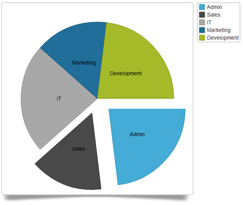

<!--
|metadata|
{
    "fileName": "igpiechart",
    "controlName": "igDataChart",
    "tags": ["Charting"]
}
|metadata|
-->

# igPieChart

##In This Group of Topics

### Introduction

The `igPieChart`™ control provides functionality for displaying various kinds of charts in web applications based on the HTML5 Canvas element.

### Topics

The topics in this section provide detailed information regarding the `igPieChart` control.

- [igPieChart Overview](igPieChart-Overview.html): This topic provides conceptual information about the `igPieChart` control including its main features, minimum requirements, and user functionality.

- [Adding an igPieChart](igPieChart-Adding.html):This topic demonstrates how to add the `igPieChart` control and bind it to data.

- [Data Binding (igPieChart)](igPieChart-DataBinding.html): This topic explains how to bind various data sources to `igPieChart` control.

- [Styling igPieChart with Themes](igPieChart-Styling-Themes.html):This topic explains how to use styles and apply themes with `igPieChart`.

- [Accessibility Compliance (igPieChart)](igPieChart-Accessibility.html): This topic explains the accessibility features of the `igPieChart` and provides advice how to achieve accessibility compliance for pages containing charts.

- [jQuery and ASP.NET MVC Helper API Reference Links (igPieChart)](igPieChart-API-Links.html): This topic provides links to the API documentation for jQuery and ASP.NET MVC helper class for `igPieChart`.

##Related Content

### Topics

The following topics provide additional information related to this topic.

- [%%ProductName%% Overview](NetAdvantage-for-jQuery-Overview.html): This topic provides general information about the %%ProductName%%™ library.

- [igDataChart Overview](igDataChart-Overview.html): This topic provides conceptual information about the `igDataChart` control including its main features, minimum requirements for using charts and user functionality.

 

 

