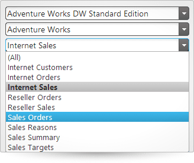
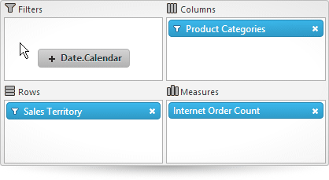

<!--
|metadata|
{
    "fileName": "igpivotdataselector-overview",
    "controlName": "igPivotDataSelector",
    "tags": []
}
|metadata|
-->

# igPivotDataSelector Overview

##Topic Overview

### Purpose

This topic provides conceptual information about the `igPivotDataSelector`™ control including its main features, minimum requirements, and user functionality.

### Required background

The following table lists the topics and concepts required as a prerequisite to understanding this topic.

**Topics**

- [Multidimensional (OLAP) Data Source Components](Multidimensional-Data-Source-Components.html): This group of topics explains the multidimensional (OLAP) data source components of the %%ProductName%%™ suite.

**External Resources**

-   [XML for Analysis (XMLA)](http://msdn.microsoft.com/en-us/library/ms187178%28v=SQL.90%29.aspx)
-   [SQL Server Analysis Services](http://msdn.microsoft.com/en-us/library/ms175609%28v=sql.90%29.aspx)
-   [Working with Online Analytical Processing (OLAP)](http://msdn.microsoft.com/en-US/library/ms175367%28v=SQL.90%29.aspx)

### In this topic

This topic contains the following sections:

-   [Introduction](#introduction)
-   [Main Features](#main-features)
-   [User Interactions and Usability](#user-interaction)
-   [Requirements](#requirements)
-   [Related Content](#related-topics)
    -   [Topics](#topics)
    -   [Samples](#samples)

##Introduction

### igPivotDataSelector summary

`igPivotDataSelector` is an interactive UI control (jQuery UI widget) that enables users to select data slices, typically, when data is being visualized in an `igPivotGrid`™. It is a supplementary control working together with the [data source components](Multidimensional-Data-Source-Components.html). The `igPivotDataSelector` control comprises:

-   Drop-downs for selecting database (1), cube (2) and measure group (3) (when using [igOlapXmlaDataSource](igOlapXmlaDataSource.html)™ only)
-   A metadata tree displaying all dimensions, measures, hierarchies and levels (4)
-   Drop areas for selecting of hierarchies and measures (5)
-   A deferred update checkbox (6)
-   An update button (7)

Here is the typical manner in which the user operates the `igPivotDataSelector` control: when the user selects a database and cube from a drop-downs, the metadata tree with all available dimensions loads along with the respective hierarchies and measures. If [igOlapXmlaDataSource](igOlapXmlaDataSource.html) is used, the tree loads upon user selection; if [igOlapFlatDataSource](igOlapFlatDataSource.html)™ is used or a database and cube have been set in advance, the tree will load when the `igPivotDataSelector` is initialized. This way, the `igPivotDataSelector` provides an interactive UI component to select a database to connect to (if you are using database data), cube to extract data from, and a measure group to use.

The `igPivotDataSelector` is placed directly on the page using a div element, just like most data visualization controls.

##Main Features

### Main features summary chart

The following table summarizes the main features of the `igPivotDataSelector` control.

Feature| Description 
---|---
Data Selection|Given a data source, the `igPivotDataSelector` provides drop-downs to select a database to connect to (if you are using database data), cube to extract data from, and a set of measure groups.
Metadata Tree|All the available dimensions with their respective hierarchies along with a list with all the available measures are loaded in a tree once the user chooses a database, cube, and measure group. When the user selects a Measure group, the measures are filtered accordingly. If none is selected, all measures will be available in the metadata tree.
Slice Interaction| Unless custom restrictions are applied, all available hierarchies from the tree can be drag-and-dropped to one of the following areas: Rows, Columns, Filters. All available measures from the tree can be drag-and-dropped to the Measures area.
Deferred Update|The `igPivotDataSelector` supports two data source update modes based on when the data source gets updated after the user makes a change in the control:<ul><li>Immediate – when the user makes a change in the control, that change gets executed immediately in the underlying back-end to update the data source. The user has to wait until the control is refreshed to the new state before they are can interact with the control again.</li><li>Deferred – the system is not updated until the user explicitly carries out a refresh operation (via an update button). This enables users to perform multiple changes without having to wait for the control to refresh after each change.</li></ul>Deferred update improves the performance of the control by not taxing system resources, especially when very large amounts of data are involved.In `igPivotDataSelector`, the user can control the refresh mode through the Defer Update checkbox and, if the box is checked, manually refresh the data source at their discretion by pressing the update button. 
Support for interaction with other %%ProductName%% controls|`igPivotDataSelector` uses the same data source instance as other %%ProductName%% controls, such as `igPivotGrid`. This enables you to build complete OLAP data visualization applications. (You can use the `igPivotView` control which has similar purpose.)

##User Interactions and Usability

### User interactions summary chart

The following table summarizes the user interaction capabilities of the `igPivotDataSelector` control.

The user can…| Using…| Details| Configurable?
---|---|---|---
Change database, cube, and measure group (`igOlapXmlaDataSource` only)|The data selector combo boxes.|You can set up initial the database, cube and measure group programmatically using the catalog, cube, and `measureGroup` properties of the `igOlapXmlaDataSource` framework.|<ul><li>[Adding igOlapXmlaDataSource](igOlapXmlaDataSource-Adding.html)</li></ul>
Browse data source dimensions and measures|The metadata tree control.|The user can see all available, dimensions, measures, hierarchies and levels.|
Select hierarchies for the rows, columns, and filters|Perform drag-and-drop from the tree to the rows, columns and filters areas.|Unless custom  restrictions are set in place, the user can drag all the hierarchies available in the metadata tree to one of the rows, columns, or filters areas.|<ul><li>[Configuring the Tabular View of the Result Set by Arranging the Columns, Rows, Filters, and Measures of the Pivot Grid (igOlapFlatDataSource, igOlapXmlaDataSource, igPivotDataSelector, igPivotGrid, igPivotView)](Configuring-the-Tabular-View.html)</li></ul>
Select measures|Perform drag-and-drop from the tree to the measures area.|Unless custom restrictions are set in place, the user can drag all the measures available in the metadata tree to the measures area.|<ul><li>[Configuring the Tabular View of the Result Set by Arranging the Columns, Rows, Filters, and Measures of the Pivot Grid (igOlapFlatDataSource, igOlapXmlaDataSource, igPivotDataSelector, igPivotGrid, igPivotView)](Configuring-the-Tabular-View.html)</li></ul>
Filter the members in a hierarchy|Using the filter menu for each hierarchy that is added to the rows, columns, or filters.|After an item is added to an area, it can be removed by the user.For hierarchies, a filter menu is available where members of the hierarchy can be expanded/collapsed or selected/unselected, thus adding/removing the member to/from the result.|<ul><li>[Configuring the Tabular View of the Result Set by Arranging the Columns, Rows, Filters, and Measures of the Pivot Grid (igOlapFlatDataSource, igOlapXmlaDataSource, igPivotDataSelector, igPivotGrid, igPivotView)](Configuring-the-Tabular-View.html)</li></ul>
Enable/Disable Deferred Update|Checking/unchecking the Deferred Update checkbox|-|
Update the grid on demand if Deferred Update is enabled|By clicking the Update Layout button ().|-|

##Requirements

### Requirements summary

Because the `igPivotDataSelector` control is a jQuery UI widget, it depends on jQuery and jQuery UI libraries. The Modernzr library is also used internally for detecting browser and device capabilities. The control uses several %%ProductName%% shared resources for its functionality. References to these resources are needed nevertheless, in spite of pure jQuery or ASP.NET MVC helpers being used. The `Infragistics.Web.Mvc` assembly is required when the control is used in the context of ASP.NET MVC.

For a detailed list of the required resources for using the `igPivotDataSelector` control, refer to the [Adding igPivotDataSelector to an HTML Page](igPivotDataSelector-Adding-to-HTML-Page.html) topic.

##Related Content

### Topics

The following topics provide additional information related to this topic.

- [Adding igPivotDataSelector to an HTML Page](igPivotDataSelector-Adding-to-HTML-Page.html): This topic demonstrates how to add the `igPivotDataSelector` to an HTML page.

- [jQuery and ASP.NET MVC Helper API Links (igPivotDataSelector)](igPivotDataSelector-API-Links.html): This topic lists links to the API documentation about the `igPivotDataSelector` and its ASP.NET MVC Helper.

### Samples

The following samples provide additional information related to this topic.

- [Binding to Xmla Data Source](%%SamplesUrl%%/pivot-grid/binding-to-xmla-data-source): This sample demonstrates how to bind the `igPivotGrid` to an `igOlapXmlaDataSource` and uses an `igPivotDataSelector` for data selection.

- [Using the ASP.NET MVC Helper with Xmla Data Source](%%SamplesUrl%%/pivot-data-selector/using-the-asp-net-mvc-helper-with-xmla-data-source):  This sample demonstrates how to use the ASP.NET MVC Helper for the `igOlapXmlaDataSource` and how to use this data source in `igPivotDataSelector` and `igPivotGrid`.

- [Remote Xmla Provider](%%SamplesUrl%%/pivot-grid/remote-xmla-provider): This sample demonstrates one of the benefits of using the remote provider feature of the `igOlapXmlaDataSource` - less network traffic. All requests are proxied through the server application to avoid cross domain problems. In addition, the data is translated to JSON reducing the size of the response.

 

 

