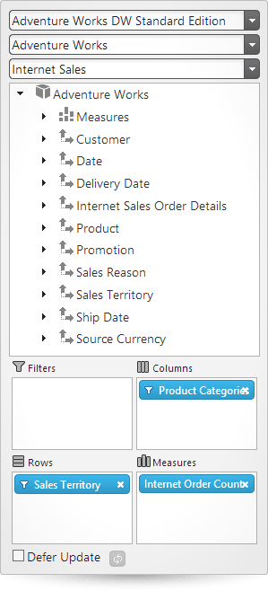

<!--
|metadata|
{
    "fileName": "igpivotdataselector-adding-using-the-mvc-helper",
    "controlName": "igPivotDataSelector",
    "tags": ["Application Blocks","Getting Started","Grids","How Do I","MVC"]
}
|metadata|
-->

# Adding igPivotDataSelector to an ASP.NET MVC Application

##Topic Overview

### Purpose

This topic explains, in both conceptual and step-by-step form, how to add the `igPivotDataSelector`™ control to an ASP.NET MVC application using the ASP.NET MVC helper.

### Required background

The following topics are prerequisites to understanding this topic:

- [**igPivotDataSelector Overview**](igPivotDataSelector-Overview.html): This topic provides conceptual information about the `igPivotDataSelector` control including its main features, minimum requirements, and user functionality.

- [**Adding igPivotDataSelector to an HTML Page**](igPivotDataSelector-Adding-to-HTML-Page.html): This topic explains, in both conceptual and step-by-step form, how to add the `igPivotDataSelector` control to an HTML page. This topic provides the complete listing of the required JavaScript resource files.

### In this topic

This topic contains the following sections:

-   [Adding igPivotDataSelector to an ASP.NET MVC Application – Conceptual Overview](#conceptual-overview)
    -   [Adding igPivotDataSelector to an ASP.NET MVC application summary](#summary)
    -   [Requirements](#requirement-summary)
    -   [Steps](#requirement-steps)
-   [Adding igPivotDataSelector to an ASP.NET MVC Application – Example](#example)
    -   [Introduction](#example-introduction)
    -   [Preview](#example-preview)
    -   [Prerequisites](#example-prerequisites)
    -   [Steps](#example-steps)
-   [Related Content](#related-content)
    -   [Topics](#topics)
    -   [Samples](#samples)


##<a id="conceptual-overview"></a>Adding igPivotDataSelector to an ASP.NET MVC Application – Conceptual Overview

### <a id="summary"></a>Adding igPivotDataSelector to an ASP.NET MVC application summary

The `igPivotDataSelector` is a client-side component accompanied by an ASP.NET MVC helper that allows the component to be used in the CS/VB code of an MVC View. It allows also consuming data from the View’s Model (using `igOlapFlatDataSource`). When using the ASP.NET MVC helper for the `igPivotDataSelector`, there are two ways to bind it to data:

-   By configuring a data source.

This is done by setting the required [DataSourceOptions](Infragistics.Web.Mvc~Infragistics.Web.Mvc.OlapDataSourceWrapper~DataSourceOptions.html) (used to create a data source object). This approach is explained in this topic.

-   By referencing a pre-configured data source.

This is done by providing the ID of a pre-configured data source instance ([DataSourceID](Infragistics.Web.Mvc~Infragistics.Web.Mvc.PivotDataSelectorWrapper~DataSourceID.html)) (as explained in [Adding igOlapXmlaDataSource to an ASP.NET MVC Application](igOlapXmlaDataSource-Adding-to-an-ASPNETMVC-Application.html) and [Adding igOlapFlatDataSource to an ASP.NET MVC Application](igOlapFlatDataSource-Adding-Using-MVC-Helper.html)).

Defining the `igPivotDataSelector` in the View is achieved by setting the required properties using methods that always return the same object that called them. This allows chaining syntax to be used for setting all required properties. For complex objects such as `DataSourceOptions`, lambda expression builders are used in order to achieve this kind of syntax.

### <a id="requirement-summary"></a>Requirements

Following are the general requirements for adding `igPivotDataSelector` to an ASP.NET MVC application:

-   A reference to the Infragistics® namespace
-   The required JavaScript files added to your application (For the complete listing, refer to [Adding igPivotDataSelector to an HTML Page](igPivotDataSelector-Adding-to-HTML-Page.html).)
-   References to the required JavaScript files added to your application (For the complete listing, refer to [Adding igPivotDataSelector to an HTML Page](igPivotDataSelector-Adding-to-HTML-Page.html).)

### <a id="requirement-steps"></a>Steps

Following are the general conceptual steps for adding `igPivotDataSelector` to an ASP.NET MVC application.

1. Adding a reference to the Infragistics namespace

2. Adding a reference to the required JavaScript resources

3. Adding the `igPivotDataSelector` and configuring the data source


##<a id="example"></a>Adding igPivotDataSelector to an ASP.NET MVC Application – Example

### <a id="example-introduction"></a>Introduction

The procedure below demonstrates how to add the `igPivotDataSelector` control to an ASP.NET MVC application. Code examples for both approaches for adding igPivotDataSelector – by setting the [DataSourceOptions](Infragistics.Web.Mvc~Infragistics.Web.Mvc.PivotDataSelectorWrapper~DataSourceOptions.html) and by setting the [DataSourceID](Infragistics.Web.Mvc~Infragistics.Web.Mvc.PivotDataSelectorWrapper~DataSourceID.html), are available. The required resources in this example are referred to automatically with the Infragistics Loader.

### <a id="example-preview"></a>Preview

The following screenshot is a preview of the final result.



### <a id="example-prerequisites"></a>Prerequisites

To complete the procedure, you need the following:

-   An ASP.NET MVC application
-   Reference to the `Infragistics.Web.Mvc.dll` assembly added to the application project
-   The Adventure Works sample database deployed on an SQL server (http://sampledata.infragistics.com is used in this example)

### <a id="example-steps"></a>Steps

The following steps demonstrate how to add an `igPivotDataSelector` to an ASP.NET MVC application.

1. Add a reference to the Infragistics namespace.

	Add the `Infragistics.Web.Mvc` namespace to your View code.

	**In ASPX:**

	```csharp
	<%=Import Namespace=”Infragistics.Web.Mvc” %>
	```

2. Add a reference to the required JavaScript resources.

	1. Add script reference to the `igLoader`.

		Add the following script reference to the head section of the View.

		**In ASPX:**
		
		```csharp
		<script src="[path to js folder]/infragistics.loader.js"></script>
		```

2. Add the `igLoader` definition.

	The following code loads the required resources using the Infragistics Loader.

	**In ASPX:**

	```csharp
	<%=Html.Infragistics()
	        .Loader()
	        .ScriptPath("[path to js folder]")
	        .CssPath("[path to css folder]")
	        .Render()
	%>
	```

3. Add the `igPivotDataSelector` and configure the data source.

	The following code adds an `igPivotDataSelector` bound to an `igOlapXmlaDataSource`:

	**In ASPX:**

	```csharp
	<%= Html.Infragistics().PivotDataSelector()
	.DataSourceOptions(
	    dataSourceOptions => dataSourceOptions
	        .Columns("[Product].[Product Categories]")
	        .Rows("[Sales Territory].[Sales Territory]")
	        .Measures("[Measures].[Internet Order Count]")
	        .XmlaOptions(
	        xmlaOptions => xmlaOptions
	            .ServerUrl("http://sampledata.infragistics.com/olap/msmdpump.dll")
	            .Catalog("Adventure Works DW Standard Edition")
	            .Cube("Adventure Works")
	            .MeasureGroup("Internet Sales"))).Render()
	%>
	```

	If you prefer to use an already preconfigured data source you need to set the [DataSourceID](Infragistics.Web.Mvc~Infragistics.Web.Mvc.PivotDataSelectorWrapper~DataSourceID.html) property . The code example below assumes that an igOlapXmlaDataSource or igOlapFlatDataSource with ID of “olapDataSource” is present in the view. (For details, refer to [Adding igOlapXmlaDataSource to an ASP.NET MVC Application](igOlapXmlaDataSource-Adding-to-an-ASPNETMVC-Application.html) or [Adding igOlapFlatDataSource to an ASP.NET MVC Application](igOlapFlatDataSource-Adding-Using-MVC-Helper.html).)

	**In ASPX:**

	```csharp
	<%= Html.Infragistics().PivotDataSelector()
	.DataSourceID(“olapDataSource”)
	.Render()
	%>
	```

##<a id="related-content"></a>Related Content

### <a id="topics"></a>Topics

The following topics provide additional information related to this topic.

- [Adding igOlapFlatDataSource to an ASP.NET MVC Application](igOlapFlatDataSource-Adding-Using-MVC-Helper.html): This topic explains, in both conceptual and step-by-step form, how to add the `igOlapFlatDataSource`™ control to an ASP.NET MVC application using ASP.NET MVC helper.

- [Adding igOlapXmlaDataSource to an ASP.NET MVC Application](igOlapXmlaDataSource-Adding-to-an-ASPNETMVC-Application.html):  This topic explains, in both conceptual and step-by-step form, how to add the `igOlapXmlaDataSource`™ control to an ASP.NET MVC application using ASP.NET MVC helper.

- [igPivotGrid Overview](igPivotGrid-Overview.html): This topic provides conceptual information about the `igPivotGrid`™ control including its main features, minimum requirements, and user functionality.

- [igPivotView Overview](igPivotView-Overview.html): This topic provides conceptual information about the `igPivotView`™ control including its main features, minimum requirements, and user functionality.

### <a id="samples"></a>Samples

The following samples provide additional information related to this topic.

- [Using the ASP.NET MVC Helper with Flat Data Source](%%SamplesUrl%%/pivot-data-selector/using-the-asp-net-mvc-helper-with-flat-data-source): This sample demonstrates how to use the ASP.NET MVC Helper for the `igOlapFlatDataSource` and how to use this data source in `igPivotDataSelector` and `igPivotGrid`.

- [Using the ASP.NET MVC Helper with Xmla Data Source](%%SamplesUrl%%/pivot-data-selector/using-the-asp-net-mvc-helper-with-xmla-data-source): This sample demonstrates how to use the ASP.NET MVC Helper for the `igOlapXmlaDataSource` and how to use this data source in `igPivotDataSelector` and `igPivotGrid`.


 

 


