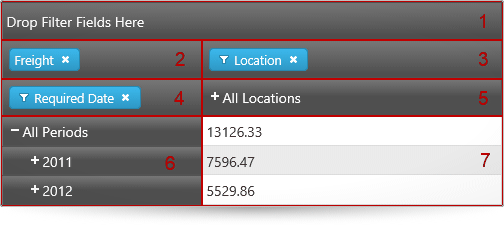
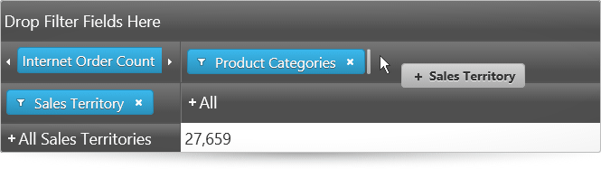
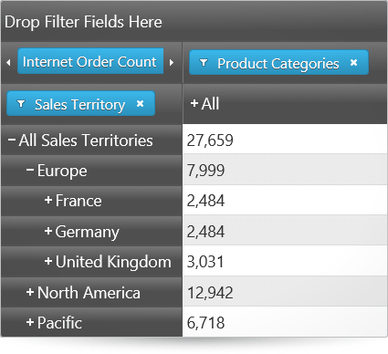
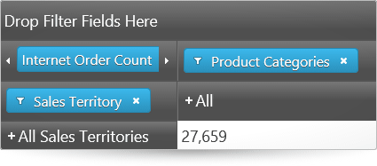
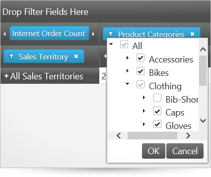
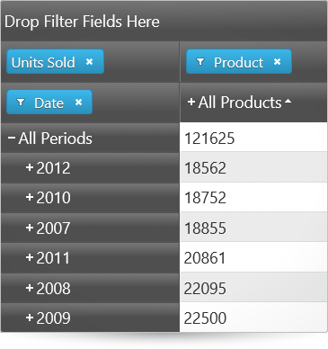
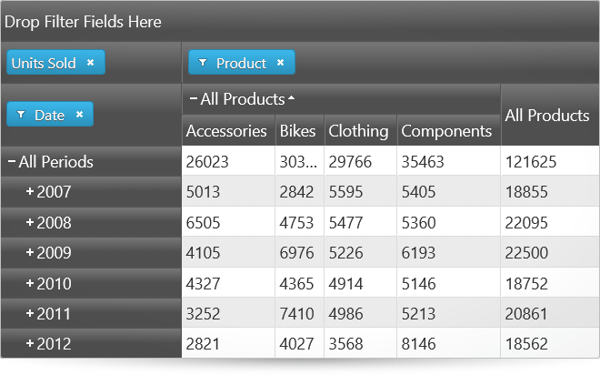
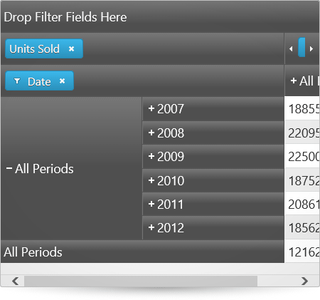
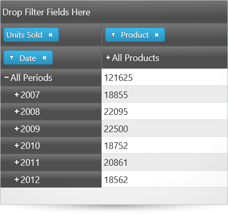
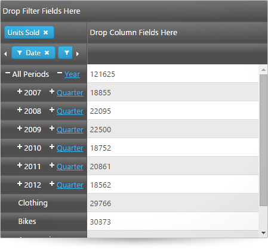

<!--
|metadata|
{
    "fileName": "igpivotgrid-overview",
    "controlName": "igPivotGrid",
    "tags": ["Application Scenarios","Drilldown","Getting Started","Grids"]
}
|metadata|
-->

# igPivotGrid Overview

##Topic Overview

### Purpose

This topic provides conceptual information about the `igPivotGrid`™ control including its main features, minimum requirements, and user functionality.

### Required background

The following table lists the topics and concepts required as a prerequisite to understanding this topic.

**Topics**

- [Multidimensional (OLAP) Data Source Components](Multidimensional-Data-Source-Components.html): This group of topics explains the multidimensional (OLAP) data source components of the Ignite UI™ suite.

**External Resources**

-   [Pivot Table](http://en.wikipedia.org/wiki/Pivot_table)
-   [Online analytical processing](http://en.wikipedia.org/wiki/OLAP)

### In this topic

This topic contains the following sections:

-   [Introduction](#introduction)
-   [Main Features](#main-features)
-   [User Interactions and Usability](#user-interaction)
-   [Requirements](#requirements)
-   [Related Content](#related-content)
    -   [Topics](#topics)
    -   [Samples](#samples)

##Introduction

### igPivotGrid summary

The `igPivotGrid` control is a data presentation control for displaying data in a [pivot table](http://en.wikipedia.org/wiki/Pivot_table). It enables users to perform complex analysis on the supplied data. The `igPivotGrid` uses the Online Analytical Processing (OLAP) approach to present the results of multi-dimensional queries in an easy to comprehend manner. The `igPivotGrid` control uses an instance of either `igOlapFlatDataSource`™ or `igOlapXmlaDataSource`™ component as data source.

The `igPivotGrid` control comprises the following elements:

-   **Drop areas** for filters (1), measures (2), columns (3), and rows (4) through which the user selects hierarchies and measures
-   **Column headers area** (5) that displays the members of the hierarchy/-ies that form the columns of the pivot table
-   **Row headers area** (6) that displays the members of the hierarchy/-ies that form the rows of the pivot table
-   **Cells area** (7) where the cell values are displayed

By dragging-and-dropping hierarchies from one drop-area to the other drop-areas, users can change the currently used hierarchies and measures, thus changing the tabular view of the result set displayed in the header areas and the cells. The row and column header areas display the members of the respective hierarchies and allow for expanding and collapsing of members (that have child member nodes). In each cell, the meaning of the value displayed is an intersection of the meanings of the respective column and row members (e.g. in the picture above, the meaning of the value 7596.47 is created by the intersection of “all locations” (= name of the column member) and “2011” (= name of the row member), i.e. the meaning is “what the freight for all products for the 2011 in all locations amounts to”).

Manipulating those elements allows users to go through the displayed results and instantly change the perspective to get a better angle on the data. That ultimately results in more effective data usage.

The `igPivotGrid` control can slice, dice, drill down or up, and pivot data taken from an OLAP cube or from a flat data collection. With its arsenal of features, `igPivotGrid` allows you to build sophisticated data-driven applications.

The `igPivotGrid` is designed to work closely with another control from the Ignite UI suite – the [igPivotDataSelector](igPivotDataSelector.html)™. The `igPivotDataSelector` control all hierarchies and measures available in the data source available to users for displaying in the `igPivotGrid`. (If the `igPivotGrid` is used on its own, the users are limited in their interactions with the data only to the data slice that is currently displayed in the pivot grid.) If you prefer to use one widget instead of two you want to benefit from the built-in functionality to resize/collapse the `igPivotDataSelector`, use the [igPivotView](igPivotView.html)™ instead of the `igPivotGrid-igPivotDataSelector` combination.

##  Main Features

The following summarizes the main features of the `igPivotGrid` control.

### Data arrangement

Any of the hierarchies of the data source can be used as columns, rows, or filters in the `igPivotGrid`. Data source measures are used to for displaying the corresponding numeric values. Users can move the present hierarchies between rows and columns by drag-and-drop. They can also specify the exact place of a hierarchy or measure in its area.

The following picture demonstrates the Sales Territory hierarchy being moved from the rows drop-area to the last position in the columns drop-area.

>**Note:** The data arrangement capabilities of the `igPivotGrid` are limited to the hierarchies that are already available in the tabular view. If you need to enable users to use all hierarchies/members including those that are currently not displayed in the grid, you need to use the `igPivotGrid` together with the `igPivotDataSelector` control.

### Expanding/collapsing of hierarchy members

The `igPivotGrid` exposes a standard UI interface for presenting hierarchical data, It has +/- buttons for expanding collapsing the members all present hierarchies thus enabling users to display the desired tabular view arrangement.

The following pictures compare the expanded and collapsed states of the members of the hierarchy used for the rows.

#### Expanded state

#### Collapsed state

### Filtering

Users can choose which of the members to be displayed in the result, filtering out the ones that are not relevant to their analysis. Filtering criteria are selected by checking the members to display in a filter drop-down menu.

### Sorting

The `igPivotGrid` supports two types of sorting:

-   Value-based – sorting the rows based on the values in one or more columns
-   Captions-based– sorting of the rows or columns belonging to a specific level based on the members’ captions

Value-based sorting can be used simultaneously with captions-based sorting when the latter is applied to a level of a column hierarchy. When, however, captions-based sorting is applied to the level members of a row hierarchy, applying value-based sorting will cancel the captions-based sorting. By the same token, when value-based sorting is applied to a column, applying caption-based sorting, cancels any previously applied value-based sorting.

Below, the picture on the left demonstrates value-based sorting, which is the All Products column with ascending sort order applied.

The picture on the right demonstrates captions-based sorting which, in this case, is the child members of the All Products member arranged alphabetically from left to right (ascending sort order).

#### Value-based sorting for a column

#### Captions-based sorting

### Multiple layouts

The `igPivotGrid` has different layouts based on how the row and column headers are arranged for display with regards to the amount of space they occupy. The supported layouts are:

-   **Standard** – when a member in the rows is expanded, its child members are displayed on its right; for an expanded column member, its child members are displayed below their parent member
-   **Compact** – when a member in the rows is expanded, its child members are displayed above or below their respective parent member and are only just indented to the right (and not on the right of it); for an expanded column member, its child members are displayed on the right or on the left of their parent member (and not below it)
-   **Tree** (only applicable to rows) – when a member in the rows is expanded, its child members are displayed above or below their respective parent member and are only just indented to the right (and not on the right of it); Additionally all hierarchies in the rows are displayed in a tree-like structure. When multiple hierarchies are added, the members of each hierarchy are listed above or below each of the members of the previous hierarchy.

By default, the compact layout is enabled for the rows and disabled for the columns.

The following pictures compare the Standard, Compact and Tree layouts of the `igPivotGrid`.

#### Standard layout

#### Compact layout

#### Tree layout

### Supported data sources

The `igPivotGrid` control uses as a data source an instance of either the `igOlapFlatDataSource` or `igOlapXmlaDataSource` component. These two data source components are supported also by the `igPivotDataSelector`, a control with which the `igPivotGrid` is normally used together.

### Integration with other controls

The `igPivotGrid` control integrates with the `igPivotDataSelector` control. This integration allows you to provide users with the ability to add/remove hierarchies and measures to/from the pivot grid.

### igGrid features

The `igPivotGrid` control's content is rendered via a `igGrid` control, whose options can be set via the [gridOptions](%%jQueryApiUrl%%/ui.igPivotGrid#options:gridOptions).
The following features of the igGrid can be enabled via the gridOptions.[features](%%jQueryApiUrl%%/ui.igPivotGrid#options:gridOptions.features) option:
- Resizing 
- Tooltips

The below sample demonstrates how to enable all the igGrid features supported by the igPivotGrid.

   [All Grid Features](%%SamplesEmbedUrl%%/pivot-grid/all-grid-features)

## User Interactions and Usability

### User interactions summary chart

The following table summarizes the user interaction capabilities of the `igPivotDataSelector` control.

The user can… |Using… |Details |Configurable?
---|---|---|---
Change the currently selected hierarchies for the rows, columns, and  filters| Drag-and-drop from one of the drop-areas.| The user can move a hierarchy between the columns, filters, and rows areas.If an `igPivotDataSelector` bound to the same data source is available on the page, in addition to that all hierarchies and measures can be drag-and-dropped between the `igPivotGrid` and the `igPivotDataSelector` with the respective effect on the table view.|<ul><li>[Adding igPivotDataSelector to an HTML Page](igPivotDataSelector-Adding-to-HTML-Page.html)</li><li>[Configuring the Tabular View of the Result Set by Arranging the Columns, Rows, Filters, and Measures of the Pivot Grid (igOlapFlatDataSource, igOlapXmlaDataSource, igPivotDataSelector, igPivotGrid, igPivotView)](Configuring-the-Tabular-View.html)</li></ul>
Drill down/up the members of a hierarchy|The +/- buttons on the header cells.|The user can expand and collapse members of the hierarchy in order to go to the desired level of detail.|
Filter the members in a hierarchy|The filter menu for each hierarchy that is added to the rows, columns, or filters.|For hierarchies, a filter menu is available (through a filter icon ()) in which members of the hierarchy can be selected/unselected, thus adding/removing the member to/from the result.|<ul><li>[Configuring the Tabular View of the Result Set by Arranging the Columns, Rows, Filters, and Measures of the Pivot Grid (igOlapFlatDataSource, igOlapXmlaDataSource, igPivotDataSelector, igPivotGrid, igPivotView)](Configuring-the-Tabular-View.html)</li></ul>
Apply sorting|The sort buttons, users can sort the values for one or more columns and/or sort the member-headers for a particular level.|In addition to user sorting, initial sorting directions for specific levels can be set through the [igPivotGrid properties](%%jQueryApiUrl%%/ui.igPivotGrid#options).|<ul><li> [Sorting (sample)](%%SamplesUrl%%/pivot-grid/sorting)</li></ul>

##Requirements

### Requirements summary

Because the `igPivotGrid` control is a jQuery UI widget, it depends on jQuery and jQuery UI libraries. The Modernzr library is also used internally for detecting browser and device capabilities. The control uses several Ignite UI shared resources for its functionality. References to these resources are needed nevertheless, in spite of pure jQuery or ASP.NET MVC helpers being used. The `Infragistics.Web.Mvc` assembly is required when the control is used in the context of ASP.NET MVC.

For a detailed list of the required resources for using the `igPivotGrid` control, refer to the [Adding igPivotView to an HTML Page](igPivotView-Adding-to-HTML-Page.html).

##Related Content

### Topics

The following topics provide additional information related to this topic.

- [Adding igPivotGrid to an HTML Page](igPivotGrid-Adding-to-an-HTML-Page.html): This topic demonstrates how to add the `igPivotGrid` to an HTML page.

- [Adding igPivotGrid to an ASP.NET MVC Application](igPivotGrid-Adding-Using-the-MVC-Helper.html): This topic explains, in both conceptual and step-by-step form, how to add the `igPivotGrid` control to an ASP.NET MVC application using the ASP.NET MVC helper.

### Samples

The following samples provide additional information related to this topic.

- [Binding to Flat Data Source](%%SamplesUrl%%/pivot-grid/binding-to-flat-data-source): This sample demonstrates how to bind the `igPivotGrid` to an `igOlapFlatDataSource` and uses an `igPivotDataSelector` for data selection.

- [Using the ASP.NET MVC Helper with Xmla Data Source](%%SamplesUrl%%/pivot-grid/using-the-asp-net-mvc-helper-with-xmla-data-source): This sample demonstrates how to use the ASP.NET MVC Helper for the `igPivotGrid` with `igOlapXmlaDataSource`.

- [Sorting](%%SamplesUrl%%/pivot-grid/sorting): This sample demonstrates how to enable sorting in the `igPivotGrid` and how to apply sorting for specific levels upon initialization.

- [Layout Modes](%%SamplesUrl%%/pivot-grid/layout-modes): This sample compares the layout of the `igPivotGrid` when compact column and row headers are enabled or disabled.

 

 

