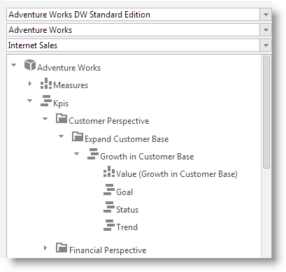
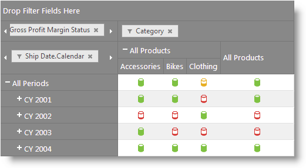
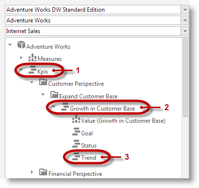
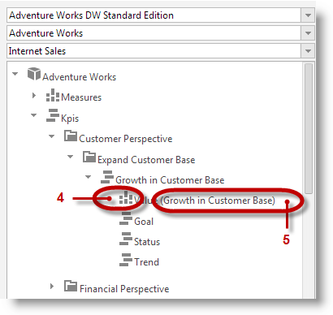

<!--
|metadata|
{
    "fileName": "igpivotgrid-kpi-support",
    "controlName": "igOlapXmlaDataSource, igPivotDataSelector, igPivotGrid",
    "tags": ["Application Scenarios","Grids","How Do I"]
}
|metadata|
-->

# Key Performance Indicators Support (igPivotGrid, igPivotDataSelector,
igOlapXmlaDataSource)

##Topic Overview

#### Purpose

This topic explains conceptually how the Key Performance Indicators (KPIs) data from a multi-dimensional (OLAP) data set is visualized in Ignite UI™. The Ignite UI controls that visualize KPIs are the `igPivotDataSelector`™ and the `igPivotGrid`™.

### Required background

The following table lists an article required as a prerequisite to understanding this topic.

-   [Key Performance Indicators](http://en.wikipedia.org/wiki/Key_performance_indicators)

**External Resources**

- [Key Performance Indicators (KPIs) in Multidimensional Models](http://technet.microsoft.com/en-us/library/ms174875.aspx): An MSDN article providing an overview of KPIs in multi-dimensional models.

### In this topic

This topic contains the following sections:

-   [KPI Visualization Support](#kpi-visualization-support)
    -   [KPIs visualization summary](#kpi-visualization)
    -   [KPIs technical implementation summary](#kpi-technical-implementation)
    -   [KPIs key terms](#kpi-key-terms)
-   [Related Content](#related-content)
    -   [Samples](#samples)

## KPI Visualization Support

### KPIs visualization summary

Key Performance Indicator (KPI) is a term used to denote a certain type of performance management. The indicators vary depending on the specific needs (fields of application) and provide information over metrics important for the organization, such as progress towards goals, over-time trends, etc..

In OLAP services, the KPIs carry data calculated over a specific measure group. They are defined on the OLAP server which hosts the analysis services data. This data is displayed in the `igPivotDataSelector` and can be visualized graphically through the use of the `igPivotGrid` control.

The `igPivotDataSelector` control displays a separate folder, containing the KPI members calculated on the server.

The igPivotGrid displays a graphical representation of a KPI or its actual value.

An individual indicator can be visualized in the igPivotGrid by drag-and-dropping it from the metadata tree to the Measures area of the pivot grid or by programmatically adding it to its Measures collection.

### KPIs technical implementation summary

The capability to render graphical – and non-graphical (as a value) – representations of KPIs in `igPivotDataSelector`/`igPivotGrid` is provided by the underlying `igOlapXmlaDataSource`™ component. (A KPI item can render either a graphical representation or display the value at the same time, but not both.)

The graphical representation is an icon-like picture representing symbolically the KPI the item or the state of its metadata items. The graphical representation groups are defined on the server.

Upon feeding that data to the components, the indicators are displayed in `igPivotDataSelector` by default in a folder named KPIs. The KPI subfolders’ hierarchy visible in the data selector’s tree is built upon the metadata information provided by the server.

Each KPI item contains the following metadata items:

-   Value
-   Goal
-   Status
-   Trend
-   Weight

The way KPI meta items are going to be displayed in the `igPivotGrid` depends on the graphic type defined on the server.

### KPIs key terms

KPIs are displayed in `igPivotGrid`’s data selector in a root item folder named Kpis (1 in the picture below) and the individual KPI items (2) are listed under that basic directory. The different KPI member items (3) are placed under their respective parent KPI items.

A measure icon (4 in the picture below) is used to indicate a KPI member for Value or Goal (if the member is being evaluated solely by a measure). The name of the measure (5) is displayed in brackets after the label indicating the type of the item.

## Related Content

### Samples

The following samples provide additional information related to this topic.

- [Binding to Xmla Data Source](%%SamplesUrl%%/pivot-grid/binding-to-xmla-data-source): This sample demonstrates how to bind the `igPivotGrid` to an `igOlapXmlaDataSource` and uses an `igPivotDataSelector` for selection. As of the 2014.1 release the `igPivotGrid` supports visualizing Key Performance Indicators (KPIs) from an OLAP cube.

 

 

