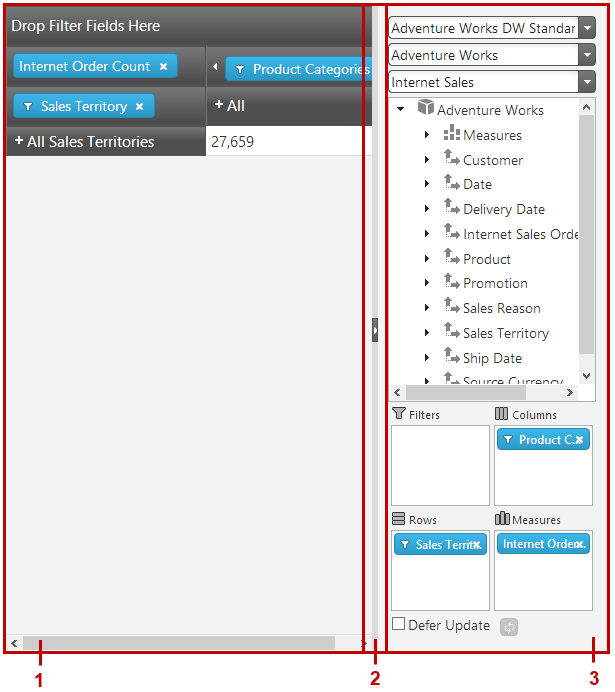
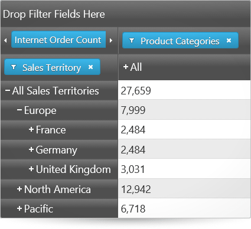
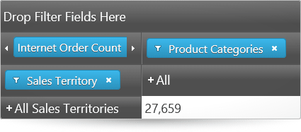
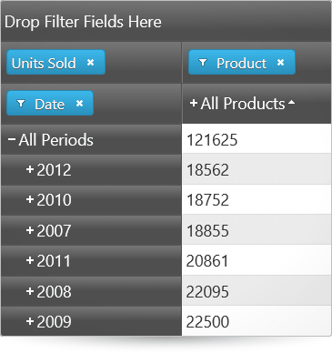
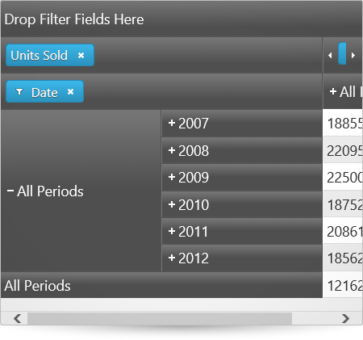
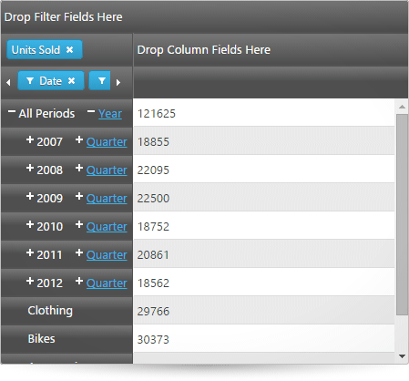

<!--
|metadata|
{
    "fileName": "igpivotview-overview",
    "controlName": "igPivotView",
    "tags": ["Application Scenarios","Getting Started","Grids"]
}
|metadata|
-->

# igPivotView Overview

##Topic Overview

### Purpose

This topic provides conceptual information about the `igPivotView`™ control including its main features, minimum requirements, and user functionality.

### Required background

The following table lists the topics and concepts required as a prerequisite to understanding this topic.

**Topics**

- [Multidimensional (OLAP) Data Source Components](Multidimensional-Data-Source-Components.html): This group of topics explains the multidimensional (OLAP) data source components of the Ignite UI™ suite.

- [igPivotGrid Overview](igPivotGrid-Overview.html): This topic provides conceptual information about the `igPivotGrid`™ control including its main features, minimum requirements, and user functionality.

- [igPivotDataSelector Overview](igPivotDataSelector-Overview.html): This topic provides conceptual information about the `igPivotDataSelector`™ control including its main features, minimum requirements, and user functionality.

- [igSplitter Overview](igSplitter-Overview.html): This topic provides conceptual information about the `igSplitter`™ control including its features and user functionality.

**External Resources**

-   [Pivot Table](http://en.wikipedia.org/wiki/Pivot_table)
-   [Online analytical processing](http://en.wikipedia.org/wiki/Olap)

### In this topic

This topic contains the following sections:

-   [**Introduction**](#introduction)
-   [**Main Features**](#main-features)
    -   [Main features summary](#main-features-summary)
    -   [igPivotGrid features](#igPivotGrid-features)
    -   [igPivotDataSelector features](#igPivotDataSelector-features)
    -   [igSplitter features](#igSplitter-features)
    -   [igPivotView - specific features](#igPivotView-features)
-   [**User Interactions and Usability**](#user-interaction)
-   [**Requirements**](#requirements)
-   [**Related Content**](#related-content)
    -   [Topics](#topics)
    -   [Samples](#samples)

##Introduction

### igPivotView summary

`igPivotView` is a two-panel control that combines a pivot grid and a data selector separated with a splitter. It is a construction of three individual components – [igPivotGrid](igPivotGrid.html), [igPivotDataSelector](igPivotDataSelector.html), and [igSplitter](igSplitter.html) – assembled together to provide in one place all needed tools for manipulating multidimensional (OLAP data) in a pivot grid.

The `igPivotView` control comprises (the numbers refer to the illustration below):

-   An igPivotGrid (1)
-   An igSplitter (2)
-   An igPivotDataSelector (3)

The `igPivotView` control uses as a data source an instance of either the [igOlapFlatDataSource](igOlapFlatDataSource.html)™ or [igOlapXmlaDataSource](igOlapXmlaDataSource.html)™ component. The `igPivotGrid` and igPivotDataSelector operate over the same OLAP data source instance and user interaction in one of the components is automatically propagated to the other.

By dragging and dropping hierarchies and measures from the metadata tree to one of the drop areas (filters, columns, rows, measures) or between drop-areas, users can change the currently used hierarchies and measures, thus changing the tabular view of the result set displayed in the header areas and the cells. The row and column header areas display the members of the respective hierarchies and allow for expanding and collapsing of members (that have child member nodes). In each cell, the meaning of the value displayed is an intersection of the meanings of the respective column and row members (e.g. in the picture above, the meaning of the value 2127 is created by the intersection of “all products” (= name of the column member) and “2007” (= names of the row and the row members), i.e. the meaning is “what all products for 2007 amount to”).

Manipulating those elements allows users to go through the displayed results and instantly change the perspective to get a better angle on the data. That ultimately results in more effective data usage.

The `igSplitter` allows users to resize and collapse the `igPivotDataSelector` panel in order to allow for more space for displaying the `igPivotGrid`.

In order to configure an `igPivotView` you must, at a minimum, you need to supply it with a data source instance or set the required properties (dataSourceOptions, so that the data source is created internally). For details, refer to [**Adding igPivotView to an HTML Page**](igPivotView-Adding-to-HTML-Page.html).

All configuration properties (even those for the individual components comprising the igPivotView) are set through the `igPivotView` itself.

##Main Features

### Main features summary

The features of the `igPivotView` control are a sum of the features of the controls that comprise it: `igPivotGrid` and `igPivotDataSelector` plus a few features that are specific to `igPivotView` only. So `igPivotView`’s main features can be grouped into the following categories (Follow the links for details.):

-   [igPivotGrid features](#igPivotGrid-features)
-   [igPivotDataSelector features](#igPivotDataSelector-features)
-   [igSplitter features](#igSplitter-features)
-   [igPivotView - specific features](#igPivotView-features)

### igPivotGrid features

The following summarizes the main features of the `igPivotGrid` control.

#### Data arrangement

Any of the hierarchies of the data source can be used as columns, rows, or filters in the `igPivotGrid`. Data source measures are used to for displaying the corresponding numeric values. Users can move the present hierarchies between rows and columns by drag-and-drop. They can also specify the exact place of a hierarchy or measure in its area.

The following picture demonstrates the Sales Territory hierarchy being moved from the rows drop-area to the last position in the columns drop-area.

>**Note:** The data arrangement capabilities of the `igPivotGrid` are limited to the hierarchies that are already available in the tabular view. If you need to enable users to use all hierarchies/members including those that are currently not displayed in the grid, you need to use the `igPivotGrid` together with the `igPivotDataSelector` control.

 

#### Expanding/collapsing of hierarchy members

The `igPivotGrid` exposes a standard UI interface for presenting hierarchical data, It has +/- buttons for expanding collapsing the members all present hierarchies thus enabling users to display the desired tabular view arrangement.

The following pictures compare the expanded and collapsed states of the members of the hierarchy used for the rows.

#### Expanded state

####Collapsed state

#### Filtering

Users can choose which of the members to be displayed in the result, filtering out the ones that are not relevant to their analysis. Filtering criteria are selected by checking the members to display in a filter drop-down menu.

#### Sorting

The `igPivotGrid` supports two types of sorting:

-   **Value-based** – sorting the rows based on the values in one or more columns
-   **Captions-based**– sorting of the rows or columns belonging to a specific level based on the members’ captions

Value-based sorting can be used simultaneously with captions-based sorting when the latter is applied to a level of a column hierarchy. When, however, captions-based sorting is applied to the level members of a row hierarchy, applying value-based sorting will cancel the captions-based sorting. By the same token, when value-based sorting is applied to a column, applying caption-based sorting, cancels any previously applied value-based sorting.

Below, the picture on the left demonstrates value-based sorting, which is the *All Products* column with ascending sort order applied.

The picture on the right demonstrates captions-based sorting which, in this case, is the child members of the *All Products* member arranged alphabetically from left to right (ascending sort order).

#### Value-based sorting for a column 

 

#### Captions-based sorting

#### Multiple layouts

The `igPivotGrid` has different layouts based on how the row and column headers are arranged for display with regards to the amount of space they occupy. The supported layouts are:

-   Standard – when a member in the rows is expanded, its child members are displayed on its right; for an expanded column member, its child members are displayed below their parent member
-   Compact – when a member in the rows is expanded, its child members are displayed above or below their respective parent member and are only just indented to the right (and not on the right of it); for an expanded column member, its child members are displayed on the right or on the left of their parent member (and not below it)
-   Tree (only applicable to rows) – when a member in the rows is expanded, its child members are displayed above or below their respective parent member and are only just indented to the right (and not on the right of it); Additionally all hierarchies in the rows are displayed in a tree-like structure. When multiple hierarhies are added, the members of each hierarchy are listed above or below each of the members of the previous hierarchy.

By default, the compact layout is enabled for the rows and disabled for the columns.

The following pictures compare the Standard, Compact and Tree layouts of the `igPivotGrid`.

#### Standard layout

#### Compact layout

#### Tree layout

#### Supported data sources

The `igPivotGrid` control uses as a data source an instance of either the `igOlapFlatDataSource` or `igOlapXmlaDataSource` component. These two data source components are supported also by the `igPivotDataSelector`, a controls with which the `igPivotGrid` is normally used together.

### igPivotDataSelector features

The following table summarizes the main features of the `igPivotDataSelector` control.

#### Data Selection

Given a data source, the `igPivotDataSelector` provides drop-downs to select a database to connect to (if you are using database data), cube to extract data from, and a set of measure groups.

#### Metadata Tree

All the available dimensions with their respective hierarchies along with a list with all the available measures are loaded in a tree once the user chooses a database, cube, and measure group.

When the user selects a Measure group, the measures are filtered accordingly. If none is selected, all measures will be available in the metadata tree.

#### Slice Interaction

Unless custom restrictions are applied, all available hierarchies from the tree can be drag-and-dropped to one of the following areas: Rows, Columns, Filters. All available measures from the tree can be drag-and-dropped to the Measures area.

#### Deferred Update

The `igPivotDataSelector` supports two data source update modes based on when the data source gets updated after the user makes a change in the control:

-   Immediate – when the user makes a change in the control, that change gets executed immediately in the underlying back-end to update the data source. The user has to wait until the control is refreshed to the new state before they are can interact with the control again.
-   Deferred – the system is not updated until the user explicitly carries out a refresh operation (via an update button). This enables users to perform multiple changes without having to wait for the control to refresh after each change.

Deferred update improves the performance of the control by not taxing system resources, especially when very large amounts of data are involved.

In `igPivotDataSelector`, the user can control the refresh mode through the Defer Update checkbox and, if the box is checked, manually refresh the data source at their discretion by pressing the update button.

### igSplitter features

The following table summarizes the main features of the `igPivotDataSelector` control.

#### Panels’ states (expanded/ collapsed)

Panels have Expanded and Collapsed states which are inversely related: when one panel is expanded, the other panel is collapsed and the other way around. The expanded panel occupies the entire container and the collapsed panel is out of sight. Only one panel can be collapsed or expanded at a time.

The pictures below compare the expanded and collapsed states of the left panel.

#### Expanded left panel 

#### Collapsed right panel

Panels can be collapsed or expanded either by the user or programmatically through API methods. If expanding/collapsing is not enabled, the expand/collapse buttons are not displayed in the splitter bar. By default, the panels are not expandable/collapsible.

When a panel is expanded, the splitter bar is placed to its side in the direction of the other (now collapsed) panel. When the splitter bar is any other position then both panels are visible, but this condition of the panels is not associated with a panel state.

#### Two-panel layout

The `igSplitter` control divides the layout into two separate panels.

#### Resizable panels

The panels are resizible relative to each other by moving the splitter bar within the splitter control. When the splitter bar is shifted in the direction of one of the panels, this sizes the panel down accordingly and the other panel sizes up accordingly. By default, the panels are resizable.

#### Drag support for panel resizing

By default, the `igSplitter` control supports mouse dragging for resizing panels. Users can resize the areas by dragging the splitter bar. Releasing the mouse button after the drag movement resizes the panels according to the new position of the splitter bar.

### igPivotView-specific features

The following table summarizes the features that are specific to the `igPivotView` control.

#### Configurable relative (left-right) position of the panels

By default, the relative position of the panels to each other is the pivot grid on the left and the selector on the right. You can swap the pivot grid and the selector using the [dataSelectorPanel](%%jQueryApiUrl%%/ui.igPivotView#options:dataSelectorPanel) properties of the `igPivotView`.

#### Right

 

#### Left

#### Panel resizing

You can specify whether the panels should be resizable and/or collapsible using the `dataSelectorPanel` and `pivotGridPanel` options. These options control whether users will be allowed to resize and/or expand/collapse the panels of the `igPivotGrid` and the `igPivotDataSelector` using the `igSplitter`’s bar handle or the keyboard.

Automatic synchronization between `igPivotDataSelector` and `igPivotGrid`.

Since both `igPivotGrid` and `igPivotDataSelector` are bound to the same OLAP data source control instance (either `igOlapFlatDataSource` or `igOlapXmlaDataSource`) and their state is automatically synchronized upon any user interaction that makes a change to the data source.

##User Interactions and Usability

### User interactions summary chart

The following table summarizes the user interaction capabilities of the `igPivotView` control.

The user can… | Using… | Details | Configurable?
--- | --- | --- | ---
Change database, cube, and measure group (`igOlapXmlaDataSource` only) | The data selector combo boxes. | You can set up initial the database, cube and measure group programmatically using the `catalog`, `cube`, and `measureGroup` properties of the `igOlapXmlaDataSource`. | <ul><li>[Adding igOlapXmlaDataSource](igOlapXmlaDataSource-Adding.html)</li></ul>
Browse data source dimensions and measures | The metadata tree part of the `igPivotDataSelectор`. | The user can see all available, dimensions, measures, hierarchies and levels. | 
Select hierarchies for the rows, columns, and filters | Perform drag-and-drop from the tree to the rows, columns and filters areas. | Users can drag-drop hierarchies between the drop areas of the `igPivotDataSelector` and the `igPivotGrid`. Additionally, all hierarchies and can be drag-and-dropped from the metadata tree to the columns, rows and filters drop areas. | <ul><li>[Configuring the Tabular View of the Result Set by Arranging the Columns, Rows, Filters, and Measures of the Pivot Grid (igOlapFlatDataSource, igOlapXmlaDataSource, igPivotDataSelector, igPivotGrid, igPivotView)](Configuring-the-Tabular-View.html)</li></ul>
Select measures | Perform drag-and-drop from the tree to the measures area. | Unless custom restrictions are set in place, the user can drag all the measures available in the metadata tree to the measures area. | <ul><li>[Configuring the Tabular View of the Result Set by Arranging the Columns, Rows, Filters, and Measures of the Pivot Grid (igOlapFlatDataSource, igOlapXmlaDataSource, igPivotDataSelector, igPivotGrid, igPivotView)](Configuring-the-Tabular-View.html)</li></ul>
Enable/Disable Deferred Update | Checking/unchecking the Deferred Update checkbox | - | 
Update the grid on demand if Deferred Update is enabled | By clicking the Update Layout button (). | - | 
Drill down/up the members of a hierarchy | The +/- buttons on the header cells. | The user can expand and collapse members of the hierarchy in order to go to the desired level of detail. | 
Filter the members in a hierarchy | The filter menu for each hierarchy that is added to the rows, columns, or filters. | For hierarchies, a filter menu is available (through a filter icon ()) in which members of the hierarchy can be selected/unselected, thus adding/removing the member to/from the result. | <ul><li>[Configuring the Tabular View of the Result Set by Arranging the Columns, Rows, Filters, and Measures of the Pivot Grid (igOlapFlatDataSource, igOlapXmlaDataSource, igPivotDataSelector, igPivotGrid, igPivotView)](Configuring-the-Tabular-View.html)</li></ul>
Apply sorting | The sort buttons, users can sort the values for one or more columns and/or sort the member-headers for a particular level. | In addition to user sorting, initial sorting directions for specific levels can be set through the [igPivotGrid properties](%%jQueryApiUrl%%/ui.igPivotGrid#options). | <ul><li>[Sorting (sample)](%%SamplesUrl%%/pivot-grid/sorting)</li></ul>
Resize/Collapse the `igPivotDataSelector` | The `igSplitter`’s handle.  |  By dragging the splitter’s handle or by clicking its expand/collapse button () users can resize the panel of the `igPivotDataSelector`. | <ul><li>[dataSelectorPanel](%%jQueryApiUrl%%/ui.igPivotGrid#options:dataSelectorPanel)</li></ul>

##Requirements

### Requirements summary

Because the `igPivotView` control is a jQuery UI widget, it depends on jQuery and jQuery UI libraries. The Modernizr library is also used internally for detecting browser and device capabilities. The control uses several Ignite UI shared resources for its functionality. References to these resources are needed nevertheless, in spite of pure jQuery or ASP.NET MVC helpers being used. The `Infragistics.Web.Mvc` assembly is required when the control is used in the context of ASP.NET MVC.

For a detailed list of the required resources for using the `igPivotView` control, refer to the [Adding igPivotView](igPivotView-Adding.html) topics.

##Related Content

### Topics

The following topics provide additional information related to this topic.

- [Adding igPivotView](igPivotView-Adding.html): This is a group of topics demonstrating how to add the `igPivotView` control to an HTML page and ASP.NET MVC Application.

- [Accessibility Compliance (igPivotView)](igPivotView-Accessibility-Compliance.html): This topic explains the accessibility features of the igPivotView control and provides advice on how to achieve accessibility compliance for pages containing this control.

- [Known Issues and Limitations (igPivotView)](igPivotView-Known-Issues-and-Limitations.html): This topic provides information about the known issues and limitations of the `igPivotView` control.

- [jQuery and ASP.NET MVC Helper API Links (igPivotView)](igPivotView-API-Links.html): This topic lists links to the API documentation about the `igPivotView` control and its ASP.NET MVC Helper.

### Samples

The following samples provide additional information related to this topic.

- [Binding to Flat Data Source](%%SamplesUrl%%/pivot-view/binding-to-flat-data-source): This sample demonstrates how to bind the `igPivotView` to an `igOlapFlatDataSource`.

- [Binding to XMLA to Show KPIs](%%SamplesUrl%%/pivot-view/binding-to-xmla-data-source): This sample demonstrates how to bind the `igPivotView` to an `igOlapXmlaDataSource`.

- [Using the ASP.NET MVC Helper with Flat Data Source](%%SamplesUrl%%/pivot-view/using-the-asp-net-mvc-helper-with-flat-data-source): This sample demonstrates how to use the ASP.NET MVC Helper for the `igPivotView` with `igOlapFlatDataSource`.

- [Using the ASP.NET MVC Helper with Xmla Data Source](%%SamplesUrl%%/pivot-view/using-the-asp-net-mvc-helper-with-xmla-data-source): This sample demonstrates how to use the ASP.NET MVC Helper for the `igPivotView` with `igOlapXmlaDataSource`.

 

 

