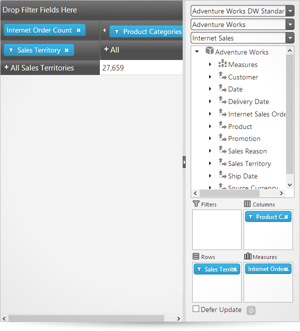

<!--
|metadata|
{
    "fileName": "igpivotview-adding-to-html-page",
    "controlName": "igPivotView",
    "tags": ["Application Blocks","Data Binding","Data Presentation","Drilldown","Getting Started","Grids","How Do I"]
}
|metadata|
-->

# Adding igPivotView to an HTML Page


##Topic Overview

### Purpose

This topic explains, in both conceptual and step-by-step form, how to add the `igPivotView`™ control to an HTML page.

### Required background

The following topics are prerequisites to understanding this topic:

- [Using JavaScript Resources in %%ProductName%%](Deployment-Guide-JavaScript-Resources.html): This topic provides general guidance on adding the required JavaScript resources for using the controls from the %%ProductName%%® library.

- [igPivotView Overview](igPivotView-Overview.html): This topic provides conceptual information about the `igPivotView` control including its main features, requirements, and user functionality.


### In this topic

This topic contains the following sections:

-   [Adding igPivotView – Conceptual Overview](#overview)
    -   [Adding igPivotView summary](#summary)
    -   [Requirements](#requirements-summary)
    -   [Steps](#steps-summary)
-   [Adding igPivotView – Procedure](#procedure)
    -   [Introduction](#procedure-introduction)
    -   [Preview](#procedure-preview)
    -   [Prerequisites](#procedure-prerequisites)
    -   [Overview](#procedure-overview)
    -   [Steps](#procedure-steps)
-   [**Related Content**](#related-content)
    -   [Topics](#topics)
    -   [Samples](#samples)


##<a id="overview"></a>Adding igPivotView – Conceptual Overview

### <a id="summary"></a>Adding igPivotView summary

The `igPivotView` operates using an instance of `igOlapFlatDataSource`™ or `igOlapXmlaDataSource`™. Therefore, when adding the `igPivotView` to an HTML page, you need to provide a pre-configured data source instance or specify the required options so that one could be created internally.

The data source is specified through either the [dataSource](%%jQueryApiUrl%%/ui.igPivotView#options:dataSource) parameter or the [dataSourceOptions](%%jQueryApiUrl%%/ui.igPivotView#options:dataSourceOptions) property of the `igPivotView`. The data source setting is the only mandatory option to set when initializing the `igPivotView`.

### <a id="requirements-summary"></a>Requirements

The following table summarizes the requirements for using the `igPivotView` control.

<table cellspacing="0" cellpadding="0" class="table table-bordered">
	<tbody>
		<tr>
			<th>
				Requirement / Required Resources
			</th>

			<th>
				Description
			</th>

			<th>
				What you need to do…
			</th>
		</tr>

		<tr>
			<td>
				jQuery and jQuery UI JavaScript resources
			</td>

			<td>
				%%ProductName%%™ is built on top of these frameworks:

				<ul>
					<li><a href="http://jquery.com/" target="_blank">jQuery</a></li>

					<li><a href="http://jqueryui.com/" target="_blank">jQuery UI</a></li>
				</ul>
			</td>

			<td>
				Add script references to both libraries in the `<head>` section of your page.
			</td>
		</tr>

		<tr>
			<td>
				Modernizr library (Optional)
			</td>

			<td>
				The Modernizr library is used by the igPivotView to detect browser and device capabilities. It is not mandatory and, if not included, the control will behave as if in a normal desktop environment with an HTML5 compatible browser.

				<ul>
					<li><a href="http://modernizr.com/" target="_blank">Modernizr</a></li>
				</ul>
			</td>

			<td>
				Add a script reference to the library in the `<head>` section of your page.
			</td>
		</tr>

		<tr>
			<td>
				General igPivotView JavaScript Resources
			</td>

			<td>
				The igPivotView functionality of the %%ProductName%% library is distributed across several files. You can load the required resources in one of the following ways:

				<ul>
					<li>**Including a custom JavaScript file**: This is the recommended approach to reference %%ProductName%% JavaScript files. You can [create a custom download](%%SamplesUrl%%/download) of selected %%ProductName%% controls and components.</li>
                    
					<li>**Using Infragistics Loader**: The *Infragistics Loader* can be used to resolve all the Infragistics resources (styles and scripts)</li>

					<li>Load the required resources manually. You need to use the dependencies listed in the table below.</li>
				</ul>

				The following table lists the %%ProductName%% library dependences related to the igPivotView control. These resources need to be referred to explicitly if you chose to load resources manually (i.e. not to use igLoader).

				<table cellspacing="0" cellpadding="0" class="table table-bordered">
					<tbody>
						<tr>
							<th>
								JavaScript Resource
							</th>

							<th>
								Description
							</th>
						</tr>

						<tr>
							<td>
								`infragistics.util.js`<br/>
								`infragistics.util.jquery.js`<br/>
								`infragistics.util.jquerydeferred.js`
							</td>

							<td>
								%%ProductName%% utilities
							</td>
						</tr>

						<tr>
							<td>
								(Conditional - if using `igOlapFlatDataSource`) `infragistics.datasource.js`
							</td>

							<td>
								The `igDataSource`™ component
							</td>
						</tr>

						<tr>
							<td>
								`infragistics.olapflatdatasource.js`

								or

								`infragistics.olapxmladatasource.js`
							</td>

							<td>
								Data source framework
							</td>
						</tr>

						<tr>
							<td>
								`infragistics.templating.js`
							</td>

							<td>
								Template engine (`igTemplate`™)
							</td>
						</tr>

						<tr>
							<td>
								`infragistics.ui.shared.js`
							</td>

							<td>
								%%ProductName%% shared code
							</td>
						</tr>

						<tr>
							<td>
								`infragistics.ui.scroll.js`
							</td>

							<td>
								A scroll helper which is internally used
							</td>
						</tr>

						<tr>
							<td>
								`infragistics.ui.combo.js`
							</td>

							<td>
								Combo box control (`igCombo`™)
							</td>
						</tr>

						<tr>
							<td height="22">
								`infragistics.ui.splitter.js`
							</td>

							<td height="22">
								The `igSplitter`™ control
							</td>
						</tr>

						<tr>
							<td height="22">
								`infragistics.ui.tree.js`
							</td>

							<td height="22">
								The `igTree`™ control
							</td>
						</tr>

						<tr>
							<td height="22">
								`infragistics.ui.grid.framework.js`
							</td>

							<td height="22">
								The `igGrid`™ control
							</td>
						</tr>

						<tr>
							<td height="22">
								`infragistics.ui.grid.multicolumnheaders.js`
							</td>

							<td height="22">
								The multi-column&nbsp;headers feature for the&nbsp;`igGrid` control
							</td>
						</tr>

						<tr>
							<td height="22">
								`infragistics.ui.pivot.shared.js`
							</td>

							<td height="22">
								%%ProductName%% shared code for pivot components
							</td>
						</tr>

						<tr>
							<td>
								`infragistics.ui.pivotgrid.js`
							</td>

							<td>
								The `igPivotGrid` control
							</td>
						</tr>

						<tr>
							<td>
								`infragistics.ui.pivotdataselector.js`
							</td>

							<td>
								The `igPivotDataSelector`™ control
							</td>
						</tr>

						<tr>
							<td>
								`infragistics.ui.pivotview.js`
							</td>

							<td>
								The `igPivotView`™ control
							</td>
						</tr>
					</tbody>
				</table><br>
			</td>

			<td>
				Add one of the following:

				<ul>
					<li>A reference to custom JavaScript file</li>
                    
					<li>A reference to igLoader</li>

					<li>A reference to all the required JavaScript files (listed in the table on the left).</li>
				</ul>
			</td>
		</tr>

		<tr>
			<td>
				IG Theme

				(Optional)
			</td>

			<td>
				This theme contains the visual styles for the %%ProductName%% library. The theme file is:

				<ul>
					<li>`<IG CSS root>/themes/Infragistics/infragistics.theme.css`</li>
				</ul>
			</td>

			<td></td>
		</tr>

		<tr>
			<td>
				igPivotView CSS resources files
			</td>

			<td>
				The styles from the following CSS file are used for rendering various elements of the control:

				<ul>
					<li>`<IG CSS root>/structure/modules/infragistics.ui.shared.css`</li>

					<li>`<IG CSS root>/structure/modules/infragistics.ui.combo.css`</li>

					<li>`<IG CSS root>/structure/modules/infragistics.ui.splitter.css`</li>

					<li>`<IG CSS root>/structure/modules/infragistics.ui.tree.css`</li>

					<li>`<IG CSS root>/structure/modules/infragistics.ui.grid.css`</li>

					<li>`<IG CSS root>/structure/modules/infragistics.ui.pivot.css`</li>
				</ul>
			</td>

			<td>
				Add style reference to the file in your page.
			</td>
		</tr>
	</tbody>
</table>


### <a id="steps-summary"></a>Steps

Following are the general conceptual steps for adding the `igPivotView` to an HTML page.

​1. Adding references to required resources

​2. Adding HTML markup required by the `igPivotView`

​3. Adding a data source

​4. Initializing the `igPivotView`


##<a id="procedure"></a>Adding igPivotView – Procedure

### <a id="procedure-introduction"></a>Introduction

The procedure below demonstrates, with code examples, how to add the `igPivotView` component to an HTML application visualizing the Adventure Works sample database. The procedure uses the Infragistics Loader (`igLoader`) to reference the required resources, which is the recommended option.

### <a id="procedure-preview"></a>Preview

The following screenshot is a preview of the final result.



### <a id="procedure-prerequisites"></a>Prerequisites

To complete the procedure, you need the following:

-   The Adventure Works sample database.
-   An instance of `$.ig.OlapXmlaDataSource` object or `$.ig.OlapFlatDataSource` object

### <a id="procedure-overview"></a>Overview

​1. Adding references to required resources

​2. Adding HTML markup required by the `igPivotView`

​3. Adding a data source

​4. Initializing the `igPivotView`

### <a id="procedure-steps"></a>Steps

The following steps demonstrate how to add a jQuery `igPivotView`.

1. Add references to required resources.

	1. Organize the required files.

		A. **Add the jQuery, jQueryUI, and Modernizr JavaScript resources to a folder named Scripts in the directory where your web page resides.**

		B. **Add the %%ProductName%% CSS files to a folder named Content/ig (For details, see the [Styling and Theming in %%ProductName%%](Deployment-Guide-Styling-and-Theming.html) topic).**

		C. **Add the %%ProductName%% JavaScript files to a folder named Scripts/ig in your web site or application (For details, see the [Using JavaScript Resources in %%ProductName%%](Deployment-Guide-JavaScript-Resources.html) topics).**

	2. Add the references to the required JavaScript libraries. Add references to the **jQuery, jQuery UI and Modernizr libraries to the `<head>` section of your page:**
	
		**In HTML:**
		
		```html
		<script  type="text/javascript" src="Scripts/jquery.js"></script>
		<script  type="text/javascript" src="Scripts/jquery-ui.js"></script>
		<script  type="text/javascript" src="Scripts/modernizr.js"></script>
		```
	
	3. Add a reference to `igLoader`.**Include the `igLoader` script in the page:**
	
		**In HTML:**
		
		```html
		<script  type="text/javascript" src="Scripts/ig/infragistics.loader.js"></script>
		```
	
	4. Load the required resources.
	
		Instantiate igLoader:
		
		**In HTML:**
		
		```html
		<script type="text/javascript">
		    $.ig.loader({
		        scriptPath: "Scripts/ig/",
		        cssPath: "Content/ig/",
		        resources: “igPivotView,igOlapXmlaDataSource"
		    });
		<script>
		```

2. Add HTML markup required by the `igPivotView`.

	**Create a `div` tag with an `id` of “`dataSelector`” in your HTML page.**
	
	**In HTML:**
	
	```html
	<div id="pivotView"></div>
	```

3. Add a data source.

	In the igLoader’s ready event handler, add the data source declaration:
	
	**In JavaScript:**
	
	```js
	var dataSource = new $.ig.OlapXmlaDataSource({
        serverUrl: "http://sampledata.infragistics.com/olap/msmdpump.dll",
        catalog: "Adventure Works DW Standard Edition",
        cube: "Adventure Works",
        measureGroup: "Internet Sales",
        rows: "[Sales Territory].[Sales Territory]",
        columns: "[Product].[Product Categories]",
        measures: "[Measures].[Internet Order Count],[Measures].[Internet Gross Profit Margin]"
    });
	```
	
	For this data source to work correctly under IE, **before adding the data source declaration,** you need to set the jQuery cross-origin requests support to true:
	
	**In JavaScript:**
	
	```js
	$.support.cors = true;
	```

4. Initialize the `igPivotView`

	In order for the igPivotView to be loaded, the following code must be added after the data source declaration.
	
	**In JavaScript:**
	
	```js
	$("#pivotView").igPivotView({
	dataSource: dataSource 
	});
	```
	
	Following is the alternative (direct) way to specify a data source using the [dataSourceOptions](%%jQueryApiUrl%%/ui.igPivotView#options:dataSourceOptions) property of the igPivotView. (See [Adding igPivotView summary](#summary).)
	
	**In JavaScript:**
	
	```js
	$("#dataSelector").igPivotView({
	      dataSourceOptions: {
	       xmlaOptions: {
	          serverUrl: " http://sampledata.infragistics.com/olap/msmdpump.dll ",
	          catalog: "Adventure Works DW Standard Edition ",
	          cube: "Adventure Works",
	          measureGroup: "Internet Sales",
	       }
	       rows: "[Sales Territory].[Sales Territory]",
	       columns: "[Product].[Product Categories]",
	       measures: "[Measures].[Internet Order Count],[Measures].[Internet Gross Profit Margin]"      
		}
	});
	```
	

##<a id="related-content"></a>Related Content

### <a id="topics"></a>Topics

The following topics provide additional information related to this topic.

- [Adding igPivotView to an ASP.NET MVC Application](igPivotView-Adding-Using-the-MVC-Helper.html): This topic explains, in both conceptual and step-by-step form, how to add the `igPivotView` control to an ASP.NET MVC Application using the ASP.NET MVC helper.

### <a id="samples"></a>Samples

The following samples provide additional information related to this topic.

- [Binding to Flat Data Source](%%SamplesUrl%%/pivot-view/binding-to-flat-data-source): This sample demonstrates how to bind the `igPivotView` to an `igOlapFlatDataSource`.

- [Binding to XMLA to Show KPIs](%%SamplesUrl%%/pivot-view/binding-to-xmla-data-source): This sample demonstrates how to bind the `igPivotView` to an `igOlapXmlaDataSource`.


 

 


