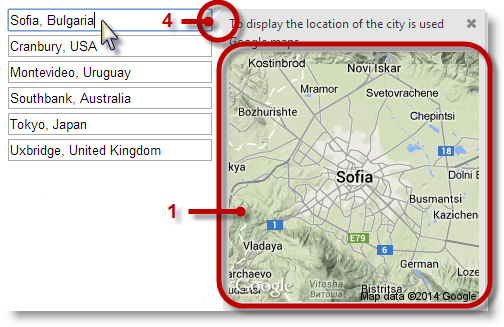
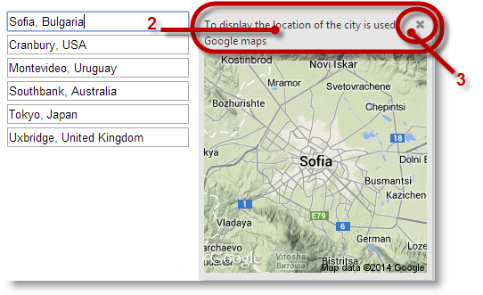
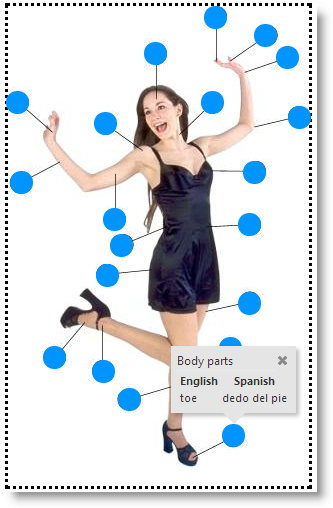
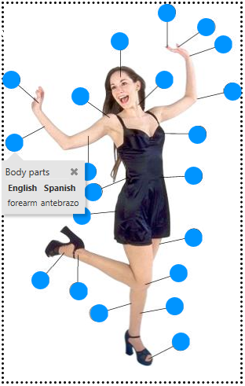
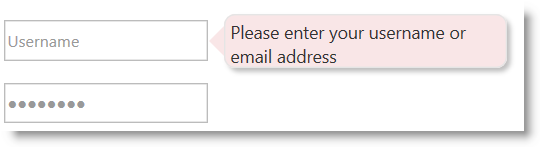
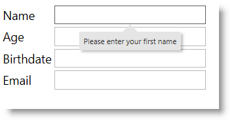

<!--
|metadata|
{
    "fileName": "igpopover-overview",
    "controlName": "igPopover",
    "tags": ["Getting Started"]
}
|metadata|
-->

# igPopover Overview

## Topic Overview
### Purpose

This topic provides an overview of the `igPopover`™ control and its main features and functionality.

### In this topic

This topic contains the following sections:

-   [Introduction](#introduction)
-   [Visual Elements of the igPopover Control and Related Properties](#visual-elements)
    -   [Visual elements summary](#visual-elements-summary)
    -   [Visual elements and related properties](#related-properties)
-   [Main Features](#main-features)
    -   [Main features summary chart](#main-features-chart)
    -   [Configurable positioning](#config-positioning)
    -   [Custom content](#custom-content)
    -   [Configurable activation](#config-activation)
    -   [Single/multiple targets](#single-multiple-targets)
    -   [Configurable look-and-feel](#config-appearance)
-   [igPopover Configuration Overview](#config-overview)
    -   [igPopover configuration summary](#config-summary)
    -   [igPopover configuration summary chart](#config-summary-chart)
-   [igPopover Default Configuration](#default-config)
-   [Related Content](#related-content)
    -   [Topics](#topics)
    -   [Samples](#samples)

## Introduction
### igPopover summary

The `igPopover` control is a pop-up window functioning as a browser tooltip: it displays over a DOM element that provides context information about it.

The `igPopover` control is designed to be used as an enhanced replacement of browser tooltips and cannot work as a standalone window. Its content and display are dependent on the target element on which it is initialized.

The `igPopover` can has a wide range of uses, like providing context menus, tables, images, dynamic content, etc.(See the picture below).

`igPopover` is implemented similar to the browser tooltip: it adds small overlays of content to any element for housing secondary information. Unlike the tooltip however the popover gives you the flexibility to configure its content, activation, position.

The `igPopover` control’s positioning and activation (the event on which it displays) are configurable. `igPopover` can display on mouse-over, click, or when the target element gets the focus.

The look-and-feel of the popover is configurable through CSS styles.

The `igPopover` control is implemented as an overlay container of any DOM element (called “target element”). This container displays the “title” attribute of the DOM element by default, but it can be configured display content in the form of a hard-coded string, HTML content, or JavaScript function returning HTML content.

The following screenshot demonstrates a popover displayed over an image element (the Infragistics® logo) as the user points with it with the mouse. The popover here works as a context menu from which user can select an option. The used can also close the popover with the close button.

`igPopover` control is implemented close to the browser tooltip – it adds small overlays of content to any element for housing secondary information. Unlike the tooltip however the popover gives you the flexibility to configure its content, activation, position.

`igPopover` is supported on touch-enabled devices.

## Visual Elements of the igPopover Control and Related Properties
### Visual elements summary

The following screenshot depicts the visual elements of the `igPopover` control. The configurable elements are listed after the image.

1 – Body

2 – Header

3 – Close button

4 – Pointer

### Visual elements and related properties

The following table maps the visual elements of the `igPopover` control and the properties that configure them.

Visual Element|Property
---|---
Body|[contentTemplate](%%jQueryApiUrl%%/ui.igpopover#options:contentTemplate)
Header|[headerTemplate.title](%%jQueryApiUrl%%/ui.igpopover#options:headerTemplate.title)
Close button|[headerTemplate.closeButton](%%jQueryApiUrl%%/ui.igpopover#options:headerTemplate.closeButton)

## Main Features
### Main features summary chart

The following table summarizes the main features of the `igPopover` control. Additional details are available after the summary table.

Feature|Description
---|---
[**Configurable positioning**](#config-positioning)|The direction and the position in which the popover shows relative to the target element is configurable.
[**Custom content**](#custom-content)|The popover can be set to display custom HTML content. Optionally, you can configure a header for the popover.
[**Configurable activation**](#config-activation)|You can control the event on which the popover to be shown.
[**Single/multiple targets**](#single-multiple-targets)|You can configure the popover display over multiple targets. Using the option [selectors](%%jQueryApiUrl%%/ui.igpopover#options:selectors), can specify which elements should display popovers.
Touch support|The control is fully functional in touch environment. The only limitation is that you cannot configure the activation event: on touch devices the popover always shows on tap no matter what event has been set as activating.
[**Configurable look-and-feel**](#config-appearance)|The styling of the `igPopover` control relies entirely on CSS classes. To change the look-and-feel of the popover, you need to override the classes on which the popover elements depend.

### Configurable positioning

The popover can be displayed on different side of the target element.

The side of the target on which the popover is displayed is called “direction” and is configured by setting the  [direction](%%jQueryApiUrl%%/ui.igpopover#options:direction) option.

If the popover is smaller than the target element, it always displays in the middle of the visible area of the target DOM element.

If the popover is larger than the target you can further configure its position along of the target DOM element. This is done with the [position](%%jQueryApiUrl%%/ui.igpopover#options:position) option.

In addition to that you can further restrict the positioning by providing a container (DIV element for example) whose boundaries serve to restrict the area within which the popover can be shown. The restricting area where the popover should be shown is configurable through the [containment](%%jQueryApiUrl%%/ui.igpopover#options:containment) for the popover.

The following picture demonstrates a popover configured to display the name of the body parts in English and Spanish when you mouse-over the target circles. The popover is configured to display beneath the target element. However, because the popover has been restricted to display only inside the DIV container (indicated by dotted borders) and because for that particular element at the bottom there is not enough space for the popover to show beneath it, the containment rule kicks in and it displays above the target element.

### Related Topics:

-   [Configuring igPopover](Configuring-igPopover.html)

### Custom content

By default, the `igPopover` control’s body displays the title of the target element, but you can set it to a hard-coded string, HTML content, or JavaScript function returning HTML content.

You can also configure the header of the widget `igPopover`. It can be only a text string is and is applicable mainly when you want a common header over multiple targets for the same popover (The body content will be different, but the header title stays the same).

In addition to that, you can have a close button in the header. The position of the button along the header is configurable.

### Related Topics:

-   [Configuring igPopover](Configuring-igPopover.html)

### Configurable activation

You can control the event on which the popover to be shown. This is managed with the [showOn](%%jQueryApiUrl%%/ui.igpopover#options:showOn) option. The user actions on which `igPopover` can be activated are:

-   on mouse-over (default)
-   click
-   focus (the target element receives focus as a result of a user action)

### Related Topics:

-   [Configuring igPopover](Configuring-igPopover.html)
-   [igPopover Property Reference](igPopover-Property-Reference.html)

### Single/multiple targets

You can configure the popover display over multiple targets. Using the [selectors](%%jQueryApiUrl%%/ui.igpopover#options:selectors) option you can specify on which elements the popovers should appear.

In the illustration below, there are multiple anchor targets represented by image elements (the blue circles). The popover changes its content according the current target to display the name of the particular body part associated with the particular circle.

### Related Topics:

-   [Configuring igPopover ](Configuring-igPopover.html)

### Configurable look-and-feel

The styling of the `igPopover` control relies entirely on CSS classes. To change the look-and-feel of the popover, you need to override the classes on which the popover elements depend. The illustration below demonstrates a sample styling of the `igPopover` control (rounded corners of the main popover container and changed background color.)

### Related Topics:

-   [Configuring igPopover](Configuring-igPopover.html)

## igPopover Configuration Overview
### igPopover configuration summary

The `igPopover` control is functional with its defaults settings, but if you want to customize its default behavior and appearance, there is a set of properties with which you can configure the header and the body of the control. You can also manage the activation of the popover (the triggering event), the dimensions, the positioning and the display of the pointer arrow.

### igPopover configuration summary chart

The following table explains briefly the configurable aspects of the `igPopover` control and maps them to the properties that configure them. The aspects about which further details are available in this help as code examples, are highlighted in green in the table.

<table class="table table-bordered">
	<thead>
		<tr>
            <th width="70" colspan="2">
Configurable aspect
			</th>

            <th>
Details
			</th>

            <th>
Properties
			</th>
        </tr>
	</thead>
	<tbody>
        

        <tr>
            <td width="70">
Content
			</td>

            <td>
Header
			</td>

            <td>
The header is configurable.

                The title of the header may be HTML string or empty. In the latter case, the header is not displayed.

                The header can optionally render a Close button.
			</td>

            <td>
                <ul>
                    <li>
[headerTemplate.title](%%jQueryApiUrl%%/ui.igpopover#options:headerTemplate.title)
					</li>

                    <li>
[headerTemplate.closeButton](%%jQueryApiUrl%%/ui.igpopover#options:headerTemplate.closeButton)
					</li>
                </ul>
            </td>
        </tr>

        <tr>
            <td width="70">

			</td>

            <td>
Body
			</td>

            <td>
                The body of the igPopover content can be customized.

                It can be :

                <ul>
                    <li>
HTML content
					</li>

                    <li>
jQuery code rendering HTML content
					</li>

                    <li>
A function which will be invoked each time when the popover is shown
					</li>
                </ul>
            </td>

            <td>
                <ul>
                    <li>
[contentTemplate](%%jQueryApiUrl%%/ui.igpopover#options:contentTemplate)
					</li>
                </ul>
            </td>
        </tr>

        <tr>
            <td width="70" colspan="2">
Target
			</td>

            <td>
By default, `igPopover` is initialized over a single element. Multiple targets can be configured by setting them in the[selectors](%%jQueryApiUrl%%/ui.igpopover#options:selectors) 
                    option.
			</td>

            <td>
                <ul>
                    <li>
[selectors](%%jQueryApiUrl%%/ui.igpopover#options:selectors)
					</li>
                </ul>
            </td>
        </tr>

        <tr>
            <td width="70" colspan="2">
Activation
			</td>

            <td>
The event on which the popover is shown is configurable.
			</td>

            <td>
                <ul>
                    <li>
[showOn](%%jQueryApiUrl%%/ui.igpopover#options:showOn)
					</li>
                </ul>
            </td>
        </tr>

        <tr>
            <td width="70">
Positioning
			</td>

            <td>
Direction
			</td>

            <td>
The position of the popover relative to the target element. The direction is the side of the target where the popover container will be shown.
			</td>

            <td>
                <ul>
                    <li>
[direction](%%jQueryApiUrl%%/ui.igpopover#options:direction)
					</li>
                </ul>
            </td>
        </tr>

        <tr>
            <td width="70">

			</td>

            <td>
Position
			</td>

            <td>
The position of the popover relative to the target element in case the popover is larger than the target. If the popover is smaller, it will always be shown in the middle of the visible area.
			</td>

            <td>
                <ul>
                    <li>
[position](%%jQueryApiUrl%%/ui.igpopover#options:position)
					</li>
                </ul>
            </td>
        </tr>

        <tr>
            <td width="70">

			</td>

            <td>
Containment
			</td>

            <td>
Containment works by specifying an object (like DIV container, for example) whose boundaries will serve to restrict the area within which the popover can be shown.
			</td>

            <td>
                <ul>
                    <li>
[containment](%%jQueryApiUrl%%/ui.igpopover#options:containment)
					</li>
                </ul>
            </td>
        </tr>

        <tr>
            <td width="70" colspan="2">
Size and dimensions
			</td>

            <td>
The container of the popover can have a defined width and height; if it hasn’t maximum width and height can be set.
			</td>

            <td>
                <ul>
                    <li>
[width](%%jQueryApiUrl%%/ui.igpopover#options:width)
					</li>

                    <li>
[height](%%jQueryApiUrl%%/ui.igpopover#options:height)
					</li>

                    <li>
[maxWidth](%%jQueryApiUrl%%/ui.igpopover#options:maxWidth)
					</li>

                    <li>
[maxHeight](%%jQueryApiUrl%%/ui.igpopover#options:maxHeight)
					</li>
                </ul>
            </td>
        </tr>

        <tr>
            <td width="70" colspan="2">
Pointer
			</td>

            <td colspan="2">
                The size and the color of the popover pointer arrow are configurable. The pointer has no options, it is managed through CSS classes:

                <ul>
                    <li>
ui-icon
					</li>
                </ul>

                Configures the size of the button icon

                <ul>
                    <li>
ui-icon-closethick
					</li>
                </ul>

                Configures the image of the button icon

                <ul>
                    <li>
ui-igpopover-close-button
					</li>
                </ul>

                Configures the position of the close button in the header template

                For details, see the [Styling igPopover](Styling-igPopover.html) topic.
            </td>
        </tr>
    </tbody>
</table>

## igPopover Default Configuration
### igPopover default configuration summary

By default, `igPopover` displays only the body content which is set to the title attribute of the target element. The header of the control is not shown.

By default, `igPopover` activates on mouse hover over the target element.

>**Note:** On touch-enabled devices, activation cannot be configured.

The [direction](%%jQueryApiUrl%%/ui.igpopover#options:direction) and [position](%%jQueryApiUrl%%/ui.igpopover#options:position) in which the popover shows relative to the target element are also configurable.

By default the popover is positioned at the bottom part of the target element in the middle of this part. If no place is available at the bottom, the order of the display directions is bottom > right > top > left.

For a listing of `igPopover`‘s default property settings, refer to the [igPopover Property Reference](igPopover-Property-Reference.html) topic.

### Related Topics:

-   [Configuring igPopover ](Configuring-igPopover.html)

## Related Content
### Topics

The following topics provide additional information related to this topic.

- [Adding igPopover](Adding-igPopover.html): This topic explains, with code examples, how to add the `igPopover` control to an HTML page in either JavaScript or ASP.NET MVC.

- [Configuring igPopover](Configuring-igPopover.html): This topic explains how to configure the features and behavior of the `igPopover` control.

- [Handling Events (igPopover)](igPopover-Handling-Events.html): This topic explains the events of the `igPopover` control and provides some code examples of their use.

- [Styling igPopover](Styling-igPopover.html): This topic explains, with code examples, how to configure the look-and-feel of the `igPopover` control using CSS. This includes setting the background color of the content, the visibility and color of the pointer, the color of the header, and the appearance of the Close button.

- [Accessibility Compliance (igPopover)](igPopover-Accessibility-Compliance.html): This topic explains the accessibility features of the `igPopover` control and provides information on how to achieve accessibility compliance for pages containing this control.

- [Known Issues and Limitations (igPopover)](igPopover-Known-Issues-And-Limitations.html): This topic provides information about the known issues and limitations of the `igPopover` control and the available workarounds for them.

- [jQuery and ASP.NET MVC Helper API Links (igPopover)](igPopover-ASP-NET-MVC-Helper-API.html): This topic provides links to the API reference documentation for the jQuery and its ASP.NET MVC helper class for the `igPopover` control.

- [Property Reference (igPopover)](igPopover-Property-Reference.html): This topic explains the properties of the `igPopover` control and lists their default values.

### Samples

The following samples provide additional information related to this topic.

- [Basic Usage](%%SamplesUrl%%/popover/overview): This sample demonstrates the basic initialization scenarios (on a single target element and on multiple target elements) of `igPopover` in JavaScript.

- [ASP.NET MVC Usage](%%SamplesUrl%%/popover/aspnet-mvc-helper): This sample demonstrates the `igPopover` control in an ASP.NET MVC scenario. The control is initialized in the View using chaining syntax.

 

 

