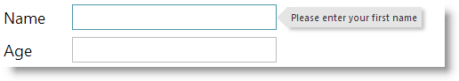

<!--
|metadata|
{
    "fileName": "adding-igpopover",
    "controlName": "igPopover",
    "tags": ["How Do I"]
}
|metadata|
-->

# Adding igPopover

## Topic Overview
### Purpose

This topic explains, with code examples, how to add the `igPopover`™ control to an HTML page in either JavaScript or ASP.NET MVC.

### Required background

The following topics are prerequisites to understanding this topic:

- [igPopover Overview](igPopover-Overview.html): This topic provides an overview of the `igPopover` control and its main features and functionality.

### In this topic

This topic contains the following sections:

-   [Adding igPopover – Conceptual Overview](#overview)
    -   [Adding igPopover summary](#summary)
    -   [Requirements](#overview-requirements)
    -   [Steps](#overview-steps)
-   [Adding igPopover in JavaScript – Procedure](#procedure-js)
    -   [Introduction](#js-introduction)
    -   [Preview](#js-preview)
    -   [Prerequisites](#js-prerequisites)
    -   [Overview](#js-overview)
    -   [Steps](#js-steps)
-   [Adding igPopover in ASP.NET MVC – Procedure](#mvc-procedure)
    -   [Introduction](#mvc-introduction)
    -   [Preview](#mvc-preview)
    -   [Prerequisites](#mvc-prerequisites)
    -   [Overview](#mvc-overview)
    -   [Steps](#mvc-steps)
-   [Related Content](#related-content)
    -   [Topics](#topics)
    -   [Samples](#samples)


## <a id="overview"></a>Adding igPopover – Conceptual Overview
### <a id="summary"></a>Adding igPopover summary

The `igPopover` control can be initialized on any DOM element (called “target element”). The `igPopover` renders it content in nested DIV elements. By default, the content is the title of the target element, but it can also be a hard-coded string, HTML content, or a JavaScript function returning HTML string.

### <a id="overview-requirements"></a>Requirements

The following table summarizes the requirements for adding the `igPopover` control.

<table class="table table-bordered">
	<thead>
		<tr>
            <th>
Requirement / Required Resource
			</th>

            <th width="417">
Description
			</th>

            <th>
What you need to do…
			</th>
        </tr>
	</thead>
	<tbody>
        

        <tr>
            <td>
jQuery and jQuery UI JavaScript resources
			</td>

            <td width="417">
                Ignite UI™ is built on top of these frameworks:

                <ul>
                    <li>
[**jQuery**](http://jquery.com/)
					</li>

                    <li>
[**jQuery UI**](https://jqueryui.com/)
					</li>
                </ul>
            </td>

            <td>
Add script references to both libraries in the &lt;head&gt; section of your page.
			</td>
        </tr>

        <tr>
            <td height="300">
igPopover JavaScript resources
			</td>

            <td height="300" width="417">
                The igPopover functionality of the Ignite UI library is distributed across several files. You can load the required resources in one of the following ways:

                <ul>
                    <li>
(Recommended) [Use the Infragistics® Loader](Using-Infragistics-Loader.html) (igLoader™). You only need to include a script reference to igLoader on your page.
					</li>

                    <li>
Load the required resources manually. You need to use the dependencies listed in the table below.
					</li>
                </ul>

                The following table lists the Ignite UI library dependences related to the igPopover control. These resources need to be referred to explicitly if you chose to load resources manually (i.e. not to use igLoader).

                <table class="table">
	<thead>
		<tr>
                            <th>
JS Resource
			</th>

                            <th>
Description
			</th>
                        </tr>
	</thead>
	<tbody>
                        

                        <tr>
                            <td>
infragistics.ui.popover.js
			</td>

                            <td>
The igPopover control
			</td>
                        </tr>
                    </tbody>
</table>
                <br>
            </td>

            <td height="300">
                Add one of the following:

                <ul>
                    <li>
A reference to igLoader
					</li>

                    <li>
A reference to all the required JavaScript files (listed in the table on the left).
					</li>
                </ul>
            </td>
        </tr>

        <tr>
            <td>
IG theme

                (Optional)
			</td>

            <td width="417">
This theme contains the visual styles for the Ignite UI library. The theme file is:

                {IG CSS root}/themes/Infragistics/infragistics.theme.css
			</td>

            <td>

			</td>
        </tr>

        <tr>
            <td>
igPopover structure
			</td>

            <td width="417">
The styles from the following CSS file are used for rendering various elements of the control:

                {IG  CSS  root}/structure/modules/infragistics.ui.popover.css
			</td>

            <td>
Add style reference to the file in your page.
			</td>
        </tr>
    </tbody>
</table>


>**Note:** It is recommended to use the `igLoader` component to load JavaScript and CSS resources. For information on how to do this, refer to the [**Adding Required Resources Automatically with the Infragistics Loader**](Using-Infragistics-Loader.html) topic. In addition to that, in the online [**Ignite UI Samples Browser**](%%SamplesUrl%%), you can find some specific examples on how to use the `igLoader` with the `igPopover` component.

### <a id="overview-steps"></a>Steps

Following are the general conceptual steps for adding `igPopover` to an HTML page.

1. Adding the target HTML element

2. Adding the `igPopover` control

## <a id="procedure-js"></a>Adding igPopover in JavaScript – Procedure
### <a id="js-introduction"></a>Introduction

This procedure guides you through the steps of adding `igPopover` with basic functionality to an HTML page using a pure HTML/JavaScript implementation. It uses the Infragistics Loader component to load all Ignite UI resources needed by the `igPopover` control.

The procedure adds a basic `igPopover` control with default configuration to an input HTML element. The popover contains the title of the input and shows when the user hovers over the element with the mouse.

### <a id="js-preview"></a>Preview

The following screenshot is a preview of the final result: the popover displaying as a result of a user action in the UI.



### <a id="js-prerequisites"></a>Prerequisites

The required resources added and properly referenced. (For a conceptual overview of those resources, see [Requirements](#overview-requirements).) These include:

-   The required files added to their appropriate locations:

   -   The required jQuery and jQueryUI JavaScript resources added to a folder named Scripts in the directory where your web page resides.
    -   The Ignite UI CSS files added to a folder named Content/ig (For details, see the [**Styling and Theming Ignite UI**](Deployment-Guide-Styling-and-Theming.html) topic).

    -   The Ignite UI JavaScript files added to a folder of your web site or application named Scripts/ig (For details, see the [Using JavaScript Resources in Ignite UI](Deployment-Guide-JavaScript-Resources.html) topic).
-   The required JavaScript resources referenced in the <head> section of the page.

**In HTML:**

```html
<script  type="text/javascript" src="Scripts/jquery.js"></script>
<script  type="text/javascript" src="Scripts/jquery-ui.js"></script>
```

-   The `igLoader` component referenced on the page.

**In HTML:**

```html
<script  type="text/javascript" src="Scripts/ig/infragistics.loader.js"></script>
```

-   The `igLoader` component instantiated:

**In HTML:**

```html
<script type="text/javascript">
    $.ig.loader({
        scriptPath: "Scripts/ig/",
        cssPath: "Content/ig/",
        resources: “igPopover"
    });
<script>
```

### <a id="js-overview"></a>Overview

Following is a conceptual overview of the process:

1. Adding the target HTML element

2. Adding the `igPopover` control

### <a id="js-steps"></a>Steps

The following steps demonstrate how to add a basic `igPopover` control in HTML page.

1. Add the target HTML element.

	Add an HTML element to be a target of igPopover.
	
	For this example procedure, add an input HTML element.
	
	**In HTML:**
	
	```html
	<input id=”firstName” type=”text” title=”Please enter your first name” value=””>
	```

2. Add the `igPopover` control.

	Instantiate the `igPopover` control.
	
	Add the initialization code to a script element in the HTML page. The initialization code creates `igPopover` instance targeting the target element created in step 1.
	
	The following code creates an instance of the `igPopover` control without specifying its options. It targets the input element “firstName” created in step 1.
	
	**In JavaScript:**
	
	```js
	$.ig.loader(function () {
	    //  Create a basic igPopover control
	    $("#firstName").igPopover();
	});
	```

## <a id="mvc-procedure"></a>Adding igPopover in ASP.NET MVC – Procedure
### <a id="mvc-introduction"></a>Introduction

This procedure guides you through the steps of adding  `igPopover` with basic functionality to an ASP.NET MVC View. The procedure uses the ASP.NET MVC syntax together with the required Loader configuration.

The procedure adds a basic `igPopover` control with default configuration
to an input HTML element. The popover contains the title of the input
and shows when the user hovers over the element with the mouse.

### <a id="mvc-preview"></a>Preview

The following screenshot is a preview of the final result: the popover
displaying as a result of a user action in the UI.


### <a id="mvc-prerequisites"></a>Prerequisites

To complete the procedure, you need the following:

**The required resources added and properly referenced. (For a conceptual overview of those resources, see Prerequisites.) These include:**

-   The required files added to their appropriate locations:

   -   The required jQuery and jQueryUI JavaScript resources added to a folder named Scripts in the directory where your web page resides.
    -   The Ignite UI CSS files added to a folder named Content/ig (For details, see the Styling and Theming Ignite UI topic).

    -   The Ignite UI JavaScript files added to a folder of your web site or application named Scripts/ig (For details, see the [Using JavaScript Resources in Ignite UI](Deployment-Guide-JavaScript-Resources.html) topics).
-   The required JavaScript resources referenced in the <head> section of the page.

**In HTML:**

```html
<script  type="text/javascript" src="Scripts/jquery.js"></script>
<script  type="text/javascript" src="Scripts/jquery-ui.js"></script>
```

-   The `igLoader` component referenced on the page.

**In HTML:**

```html
<script  type="text/javascript" src="Scripts/ig/infragistics.loader.js"></script>
```

-   The `igLoader` component instantiated in ASP.NET view:

**In HTML:**

```html
@(Html.Infragistics()
     .Loader()          .ScriptPath("http://localhost/ig_ui/js/")
     .CssPath("http://localhost/ig_ui/css/")
     .Render()
)
```

### <a id="mvc-overview"></a>Overview

Following is a conceptual overview of the process:

1. Adding the target HTML element

2. Adding the `igPopover` control

### <a id="mvc-steps"></a>Steps

The following steps demonstrate how to add a basic `igPopover` control to an ASP.NET MVC application.

1. Add the target HTML element.

	Add an HTML element to be a target of the igPopover.
	
	For this example procedure, add an HTML input element.
	
	**In HTML:**
	
	```html
	<input id=”firstName” type=”text” title=”Please enter your first name” value=””>
	```

2. Add the `igPopover` control.

	Add the Loader MVC helper configuration for `igPopover` to your ASP.NET MVC View.
	
	The following code creates an instance of the `igPopover` control without specifying its options. It targets the input element “firstName” created in step 1.
	
	**In ASPX:**
	
	```csharp
	@(Html.Infragistics().Popover()
	        .ID(“firstName”)        
	        .Render()
	   )
	```


## <a id="related-content"></a>Related Content
### <a id="topics"></a>Topics

The following topics provide additional information related to this topic.

- [Handling Events (igPopover)](igPopover-Handling-Events.html): This topic explains the events of the `igPopover` control and provides code examples of attaching event handlers.

- [Configuring igPopover](Configuring-igPopover.html): This topic explains how to configure the content, activation, and positioning of the `igPopover` control.

- [Styling igPopover](Styling-igPopover.html): This topic explains, with code examples, how to configure the look-and-feel of the `igPopover` control using CSS. This includes setting the background color of the content, the visibility and color of the pointer, the color of the header and the appearance of the Close button.

- [Accessibility Compliance (igPopover)](igPopover-Accessibility-Compliance.html): This topic explains the accessibility features of the igPopover control and provides information on how to achieve accessibility compliance for pages containing this control.

- [Known Issues and Limitations (igPopover)](igPopover-Known-Issues-And-Limitations.html):This topic provides information about the known issues and limitations of the `igPopover` control and the available workarounds for them.

- [jQuery and ASP.NET MVC Helper API Links (igPopover)](igPopover-ASP-NET-MVC-Helper-API.html): This topic provides links to the API reference documentation for the jQuery and its ASP.NET MVC helper class for the `igPopover` control.


### <a id="samples"></a>Samples

The following samples provide additional information related to this topic.

- [Basic Usage](%%SamplesUrl%%/popover/basic-popover): This sample demonstrates the basic initialization scenarios (on a single target element and on multiple target elements) of `igPopover` in JavaScript.

- [ASP.NET MVC Basic Usage](%%SamplesUrl%%/popover/aspnet-mvc-helper): This sample demonstrates the `igPopover` control in an ASP.NET MVC scenario. The control is initialized in the View using chaining syntax.


 

 


