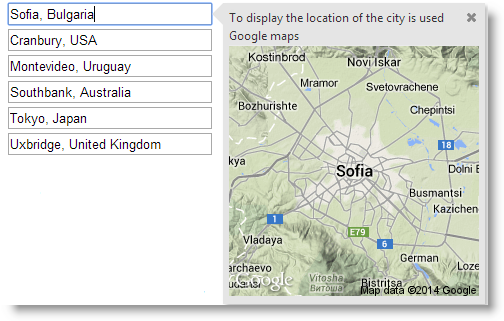
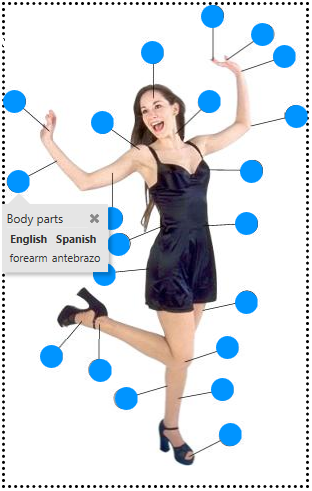

<!--
|metadata|
{
    "fileName": "configuring-igpopover",
    "controlName": "igPopover",
    "tags": ["API","How Do I"]
}
|metadata|
-->

# Configuring igPopover

## Topic Overview
### Purpose

This topic explains how to configure the content, activation, and positioning of the `igPopover`™ control.

### Required background

The following topics are prerequisites to understanding this topic:

- [igPopover Overview](igPopover-Overview.html): This topic provides an overview of the `igPopover` control and its main features and functionality.

- [Adding igPopover](Adding-igPopover.html): This topic explains, with code examples, how to add the `igPopover` control to an HTML page in either JavaScript or ASP.NET MVC.


### In this topic

This topic contains the following sections:

-   [**igPopover Configuration Overview**](#overview)
    -   [igPopover configuration summary](#summary)
    -   [igPopover configuration summary chart](#summary-chart)
-   [**Configuring the Header**](#config-header)
    -   [Overview](#header-overview)
    -   [Property settings](#header-settings)
    -   [Example](#header-example)
-   [**Configuring the Body**](#config-body)
    -   [Overview](#body-overview)
    -   [Property settings](#body-settings)
    -   [Example](#body-example)
-   [**Configuring Activation**](#config-activation)
    -   [Overview](#activation-overview)
    -   [Property settings](#activation-settings)
    -   [Example](#activation-example)
-   [**Configuring Positioning**](#config-positioning)
    -   [Overview](#positioning-overview)
    -   [Property settings](#positioning-settings)
    -   [Example](#position-example)
-   [**Configuring Containment**](#config-containment)
    -   [Overview](#containment-overview)
    -   [Property settings](#containment-settings)
    -   [Example](#containment-examples)
-   [**Related Content**](#related-content)
    -   [Topics](#topics)
    -   [Samples](#samples)


## <a id="overview"></a>igPopover Configuration Overview
### <a id="summary"></a>igPopover configuration summary

The `igPopover` control is functional with its defaults settings, but if you want to customize its default behavior and appearance, there is a set of with which can configure the header and the body of the control with a set of properties. You can also manage the activation of the popover (the triggering event), the dimensions, the positioning and the display of the pointer arrow.

### <a id="summary-chart"></a>igPopover configuration  summary chart

The following table explains briefly the configurable aspects of the `igPopover` control and maps them to the properties that configure them. The aspects about which further details are available in this help as code examples, are highlighted in green in the table.

<table class="table table-bordered">
	<thead>
		<tr>
            <th colspan="2">
Configurable aspect
			</th>

            <th>
Details
			</th>

            <th>
Properties
			</th>
        </tr>
	</thead>
	<tbody>
        

        <tr>
            <td>
Content
			</td>

            <td>
Header
			</td>

            <td>
The header is configurable.

                The title of the header may be HTML string or empty. In the latter case, the header is not displayed.

                The header can optionally render a Close button.
			</td>

            <td>
                <ul>
                    <li>
[headerTemplate.title](%%jQueryApiUrl%%/ui.igpopover#options:headerTemplate.title)
					</li>

                    <li>
[headerTemplate.closeButton](%%jQueryApiUrl%%/ui.igpopover#options:headerTemplate.closeButton)
					</li>
                </ul>
            </td>
        </tr>

        <tr>
            <td>

			</td>

            <td>
Body
			</td>

            <td>
                The body of the igPopover content can be customized.

                It can be :

                <ul>
                    <li>
HTML content
					</li>

                    <li>
jQuery code rendering HTML content
					</li>

                    <li>
A function which will be invoked each time when the popover is shown
					</li>
                </ul>
            </td>

            <td>
                <ul>
                    <li>
[contentTemplate](%%jQueryApiUrl%%/ui.igpopover#options:contentTemplate)
					</li>
                </ul>
            </td>
        </tr>

        <tr>
            <td colspan="2">
Target
			</td>

            <td>
By default, igPopover is initialized over a single element. Multiple targets can be configured by setting them in the [selectors](%%jQueryApiUrl%%/ui.igpopover#options:selectors) option.
			</td>

            <td>
                <ul>
                    <li>
[selectors](%%jQueryApiUrl%%/ui.igpopover#options:selectors)
					</li>
                </ul>
            </td>
        </tr>

        <tr>
            <td colspan="2">
Activation
			</td>

            <td>
The event on which the popover is shown is configurable.
			</td>

            <td>
                <ul>
                    <li>
[showOn](%%jQueryApiUrl%%/ui.igpopover#options:showOn)
					</li>
                </ul>
            </td>
        </tr>

        <tr>
            <td>
Positioning
			</td>

            <td>
Direction
			</td>

            <td>
The position of the popover relative to the target element.

                The direction is the side of the target where the popover container will be shown.
			</td>

            <td>
                <ul>
                    <li>
[direction](%%jQueryApiUrl%%/ui.igpopover#options:direction)
					</li>
                </ul>
            </td>
        </tr>

        <tr>
            <td>

			</td>

            <td>
Position
			</td>

            <td>
The position of the popover relative to the target element in case the popover is larger than the target. If the popover is smaller, it will always be shown in the middle of the visible area.
			</td>

            <td>
                <ul>
                    <li>
[position](%%jQueryApiUrl%%/ui.igpopover#options:position)
					</li>
                </ul>
            </td>
        </tr>

        <tr>
            <td>

			</td>

            <td>
Containment
			</td>

            <td>
Containment works by specifying an object (like DIV container, for example) whose boundaries will serve to restrict the area within which the popover can be shown.
			</td>

            <td>
                <ul>
                    <li>
[containment](%%jQueryApiUrl%%/ui.igpopover#options:containment)
					</li>
                </ul>
            </td>
        </tr>

        <tr>
            <td colspan="2">
Size and dimensions
			</td>

            <td>
The container of the popover can have a defined width and height. If it hasn’t, maximum width and height can be set.
			</td>

            <td>
                <ul>
                    <li>
[width](%%jQueryApiUrl%%/ui.igpopover#options:width)
					</li>

                    <li>
[height](%%jQueryApiUrl%%/ui.igpopover#options:height)
					</li>

                    <li>
[maxWidth](%%jQueryApiUrl%%/ui.igpopover#options:maxWidth)
					</li>

                    <li>
[maxHeight](%%jQueryApiUrl%%/ui.igpopover#options:maxHeight)
					</li>
                </ul>
            </td>
        </tr>

        <tr>
            <td colspan="2">
Pointer
			</td>

            <td colspan="2">
                The size and the color of the popover pointer arrow are configurable. The pointer has no options, it is managed through CSS classes:

                <ul>
                    <li>
ui-icon
					</li>
                </ul>

                Configures the size of the button icon

                <ul>
                    <li>
ui-icon-closethick
					</li>
                </ul>

                Configures the image of the button icon

                <ul>
                    <li>
ui-igpopover-close-button
					</li>
                </ul>

                Configures the position of the close button in the header template.

                For details,see the [Styling igPopover](Styling-igPopover.html) topic.
            </td>
        </tr>
    </tbody>
</table>

## <a id="config-header"></a>Configuring the Header
### <a id="header-overview"></a>Overview

By default, the header of `igPopover` is not shown. The header displays a string designed to serve as a title and, optionally, a Close button. The header is managed by setting the [headerTemplate.title](%%jQueryApiUrl%%/ui.igpopover#options:headerTemplate.title) property which accepts HTML content. Further customization of the look-and-feel of the header and the close button can be achieved through CSS classes (See [Styling igPopover](Styling-igPopover.html).)

### <a id="header-settings"></a>Property settings

The following table maps the desired configuration to the property settings that manage it.

In order to:|Use this property:|And set it to:
---|---|---
Display a title of the popover|[headerTemplate.title](%%jQueryApiUrl%%/ui.igpopover#options:headerTemplate.title)|The desired value as string of HTML
Display the Close button|[headerTemplate.closeButton](%%jQueryApiUrl%%/ui.igpopover#options:headerTemplate.closeButton)|true
Hide the Close button|[headerTemplate.closeButton](%%jQueryApiUrl%%/ui.igpopover#options:headerTemplate.closeButton)|false

### <a id="header-example"></a>Example

The screenshot below demonstrates how the `igPopover` would look as a result of the following settings:

Property|Value
---|---
[headerTemplate.closeButton](%%jQueryApiUrl%%/ui.igpopover#options:headerTemplate.closeButton)|true
[headerTemplate.title](%%jQueryApiUrl%%/ui.igpopover#options:headerTemplate.title)|“We’re social”


Following is the code that implements this example.

**In JavaScript:**

```js
$( '#popoverTooltip' ).igPopover( {
    headerTemplate:{
        closeButton: true,
        title: 'We’re social'
    },
    closeOnBlur: false
} );
```


## <a id="config-body"></a>Configuring the Body
### <a id="body-overview"></a>Overview

By default, the `igPopover` control displays as its body content the title attribute of the target element. To display customized content, use the `contentTemplate` option. The setting of this can be :

-   an HTML string
-   jQuery code rendering HTML content
-   A function which will be invoked each time when the popover is shown

This allows for a wide range of usage scenarios, like providing context menus, tables, images, dynamic content, etc.

### <a id="body-settings"></a>Property settings

The following table maps the desired configuration to the property
settings that manage it.

In order to configure:| Use this property:| And set it to:
---|---|---
Content of the body of the popover|[contentTemplate](%%jQueryApiUrl%%/ui.igpopover#options:contentTemplate)|Either of the following:<ul><li>an HTML string</li><li>jQuery code rendering HTML content</li><li>A function which will be invoked each time when the popover is shown</li></ul>

### <a id="body-example"></a>Example

The screenshot below demonstrates how the `igPopover` looks as a result of setting its content to a function that uses template and the value attribute of the target DOM element in order to substitute the template data and return the final content as an HTML string.

Property|Value
---|---
[contentTemplate](%%jQueryApiUrl%%/ui.igpopover#options:contentTemplate)|**In JavaScript:** <br> `function contentFunction(){...}`
     


Following is the code that implements this example.

**In JavaScript:**

```js
$( '#popoverTooltip' ).igPopover( {
    ..
    maxHeight: null,
    maxWidth: 260,
    contentTemplate: function contentFunction()
	{
	    var imgTemplate = "";
	    var data = [{ value: $( this )[0].value }];
	    return $.ig.tmpl( imgTemplate, data );
	}      
} );
```


## <a id="config-activation"></a>Configuring Activation
### <a id="activation-overview"></a>Overview

The user action on which the popover is shown is configurable. This is managed by feeding the respective event as the value of the [showOn](%%jQueryApiUrl%%/ui.igpopover#options:showOn) property. The default value is “mouseenter” which means that the popover will appear when the user points the target element with the mouse.

>**Note:** In touch environment you cannot control the activating event: the control always shows on the tap user action, no matter what event has been set as activating (i.e. the setting of the [showOn](%%jQueryApiUrl%%/ui.igpopover#options:showOn) option is ignored).

### <a id="activation-settings"></a>Property settings

The following table maps the desired configuration to the property
settings that manage it.

In order to show the popover when the user:| Use this property:| And set it to:
---|---|---
Points the target element with the mouse|[showOn](%%jQueryApiUrl%%/ui.igpopover#options:showOn)|“mouseenter”
Clicks the target element|[showOn](%%jQueryApiUrl%%/ui.igpopover#options:showOn)|“click”
Shifts the focusing to the target element|[showOn](%%jQueryApiUrl%%/ui.igpopover#options:showOn)|“focus”


### <a id="activation-example"></a>Example

The screenshot below demonstrates how the `igPopover` behaves as a result of the following settings:

Property|Value
---|---
[showOn](%%jQueryApiUrl%%/ui.igpopover#options:showOn)|“focus”


Following is the code that implements this example.

**In JavaScript:**

```js
$( '#popoverTooltip' ).igPopover( {                       
	selectors: "[title]",
	showOn: "focus"      
} );
```


## <a id="config-positioning"></a>Configuring Positioning
### <a id="positioning-overview"></a>Overview

The positioning of the popover is managed with the [direction](%%jQueryApiUrl%%/ui.igpopover#options:direction) property. It allows you to display the popover on the left, right, top or bottom sections of the target element.

By default and when the popover is smaller than the target element, it displays in the middle that visible area.

When the popover is larger than the target element, then the popover can be positioned at the beginning, in the middle or at the end along the target element's side set as [direction](%%jQueryApiUrl%%/ui.igpopover#options:direction) 

-   If the [direction](%%jQueryApiUrl%%/ui.igpopover#options:direction) property is set to “left” or “right”, then the popover will be positioned outside the target element by its left or right side, respectively. You can further control where on that side to position the popover – at its top, middle, or bottom. (The pointer of the popover will always point at the middle of the target element, but the popover itself renders upwards, downwards, or in both sides relative to the pointer.)
-   If the [direction](%%jQueryApiUrl%%/ui.igpopover#options:direction) property is set to “top” or “bottom”, then the popover will be positioned outside the target element by its top or bottom side, respectively. You can further control where on that side to position the popover – at its left, middle, or right. (The pointer of the popover will always point at the middle of the target element, but the popover itself renders reftwards, rightwards, or in both sides relative to the pointer.)

This finer positioning of the popover along the side of the target element is managed with the [position](%%jQueryApiUrl%%/ui.igpopover#options:position) property.

### <a id="positioning-settings"></a>Property settings

The following table maps the desired configuration to the property
settings that manage it.

In order to position the popover:| Use this property:| And set it to:
---|---|---
Automatically on the most appropriate part of the visible area of the  target element (the order of preference is bottom-> right-> top-> left)| [direction](%%jQueryApiUrl%%/ui.igpopover#options:direction)|“auto”
On the left part of the visible area the target element|[direction](%%jQueryApiUrl%%/ui.igpopover#options:direction)|“left”
On the right part of the visible area the target element|[direction](%%jQueryApiUrl%%/ui.igpopover#options:direction)|“right”
On the upper part of the visible area the target element|[direction](%%jQueryApiUrl%%/ui.igpopover#options:direction)|“top”
On the bottom part of the visible area the target element|[direction](%%jQueryApiUrl%%/ui.igpopover#options:direction)|“bottom”
Automatically (“balanced” setting is chosen in most cases). It is applied always when the popover size is smaller than the target.|[position](%%jQueryApiUrl%%/ui.igpopover#options:position)|"auto"
At the middle of the target element side set as direction|[position](%%jQueryApiUrl%%/ui.igpopover#options:position)|“balanced”
At the beginning of the target element side set as direction.(The beginning of the side is considered its left-hand section at “top”/“bottom”  directions and its upper section at “left”/“right” directions.)|[position](%%jQueryApiUrl%%/ui.igpopover#options:position)|“start”
At the end of the target element side set as direction.(The end of the side is considered its right-hand section at “top”/“bottom” directions and its lower section at “left”/“right” directions.)|[position](%%jQueryApiUrl%%/ui.igpopover#options:position)|“end”

### <a id="position-example"></a>Example

The screenshot below demonstrates an `igPopover` larger than the target element. The popover is set to display at the right sideof the target input field and is shown in the beginning (in the case, in the top) of the DOM element as a result of the following settings:

Property|Value
---|---
[direction](%%jQueryApiUrl%%/ui.igpopover#options:direction)|“right”
[position](%%jQueryApiUrl%%/ui.igpopover#options:position)|“start”


Following is the code that implements this example.

**In JavaScript:**

```js
$( '#popoverTooltip' ).igPopover( {
    direction: "right",
    position: "start",
    headerTemplate:{
        closeButton: true,
        title: 'Location of the city using Google maps'
    },
    closeOnBlur: false,
    showOn: "focus"
} );
```

## <a id="config-containment"></a>Configuring Containment
### <a id="containment-overview"></a>Overview

“Containment” means restricting the positioning of popover within a specified area. Containment works by specifying an object (like DIV container for example) whose boundaries will serve to restrict the area within which the popover can be shown.

### <a id="containment-settings"></a>Property settings

The following table maps the desired configuration to the property
settings that manage it.

In order to:| Use this property: |And set it to:
---|---|---
Restrict the area where the popover should be shown|[containment](%%jQueryApiUrl%%/ui.igpopover#options:containment)|The jQuery object of the element that is restricting the area where the popover will be shown.

### <a id="containment-examples"></a>Example

The screenshot below demonstrates a popover configured to display content related to the anchor elements (the blue circles). However, because the popover has been restricted to display only inside the containment `<div>` element (indicated by dotted borders), it displays beneath the target element. This happens as a result of the following settings:

Property|Value
---|---
[containment](%%jQueryApiUrl%%/ui.igpopover#options:containment)|`$( '#popoverContainment' )`




Following is the code that implements this example.

**In JavaScript:**

```js
$( '#bodyParts' ).igPopover( {               
    direction: "auto",
    position: "auto",
    closeOnBlur: false,
    animationDuration: 150,
    maxHeight: 300,
    selectors: "a",
    containment: $("#bodyParts"),
    headerTemplate: {
        closeButton: true,
        title: "Body parts"
    },
    showOn: "mouseenter"
} );
```


## <a id="related-content"></a>Related Content
### <a id="topics"></a>Topics

The following topics provide additional information related to this topic.

- [Handling Events (igPopover)](igPopover-Handling-Events.html): This topic explains the events of the `igPopover` control and provides some code examples of their use.

- [Styling igPopover](Styling-igPopover.html): This topic explains, with code examples, how to configure the look-and-feel of the `igPopover` control using CSS. This includes setting the background color of the content, the visibility and color of the pointer, the color of the header and the appearance of the Close button.

### <a id="samples"></a>Samples

The following samples provide additional information related to this topic.

- [Basic Usage](%%SamplesUrl%%/popover/overview): This sample demonstrates the basic initialization scenarios (on a single target element and on multiple target elements) of `igPopover` in JavaScript.

- [ASP.NET MVC Usage](%%SamplesUrl%%/popover/aspnet-mvc-helper): This sample demonstrates the `igPopover` control in an ASP.NET MVC scenario. The control is initialized in the View using chaining syntax.


 

 


