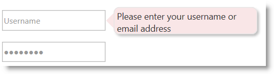

<!--
|metadata|
{
    "fileName": "styling-igpopover",
    "controlName": "igPopover",
    "tags": ["Styling","Theming"]
}
|metadata|
-->

# Styling igPopover


## Topic Overview
### Purpose

This topic explains, with code examples, how to configure the look-and-feel of the `igPopover`™ control using CSS. This includes setting the background color of the content, the visibility and color of the pointer, the color of the header, and the appearance of the Close button.

### Required background

The following topics are prerequisites to understanding this topic:

- [igPopover Overview](igPopover-Overview.html): This topic provides an overview of the `igPopover` control and its main features and functionality.

- [Adding igPopover](Adding-igPopover.html): This topic demonstrates, with code examples, how to add the `igPopover` control to an HTML page in either JavaScript or ASP.NET MVC.


### In this topic

This topic contains the following sections:

-   [**Introduction**](#introduction)
    -   [igPopover styling summary](#summary)
    -   [igPopover styling summary chart](#summary-chart)
-   [**Code Examples Summary**](#example-summary)
    -   [Code Example: Changing the Color and Corners of the Main Popover Container](#main-popover-container)
    -   [Code Example: Removing the Popover Pointer](#popover-pointer)
-   [**Related Content**](#related-content)
    -   [Topics](#topics)
    -   [Samples](#samples)


## <a id="introduction"></a>Introduction
### <a id="summary"></a>igPopover styling summary

The styling of the `igPopover` control relies entirely on CSS classes. To change the look-and-feel of the popover, you need to override the classes on which the popover elements depend. The illustration below demonstrates a sample styling of the `igPopover` control (rounded corners of the main popover container and to changed background color.)



### <a id="summary-chart"></a>igPopover styling summary chart

The following table lists the styling aspects of the `igPopover` control and the CSS classes that configure them. Further details are available after the table.

<table class="table">
	<thead><tr>
            <th>
Styling aspect
			</th>

            <th>
Details
			</th>

            <th>
CSS classes
			</th>
        </tr>
	</thead>
	<tbody>
        

        <tr>
            <td>
Body text area
			</td>

            <td>
The body text area is equal to the main popover container.
			</td>

            <td>
                <ul>
                    <li>ui-widget
                    </li>

                    <li>ui-igpopover
                    </li>
                </ul>
            </td>
        </tr>

        <tr>
            <td>
Header
			</td>

            <td>
The classes applied to the header container have effect only if the header has been defined in the options (i.e. the [headerTemplate.title](%%jQueryApiUrl%%/ui.igpopover#options:headerTemplate.title) property
                    has been set).
			</td>

            <td>
                <ul>
                    <li>ui-igpopover-title
                    </li>
                </ul>
            </td>
        </tr>

        <tr>
            <td>
Pointer
			</td>

            <td>
The size and the color of the popover pointer arrow are configurable.
			</td>

            <td>
                <ul>
                    <li>ui-igpopover-arrow
                        The main class applied to all types of pointers</li>

                    <li>ui-igpopover-arrow-
                        The determinant (like
                        
                        ui-igpopover-arrow-top,
                        
                        ui-igpopover-arrow-left, etc.)</li>
                </ul>
            </td>
        </tr>

        <tr>
            <td>
Close button
			</td>

            <td>
The size of the close button icon, the image of the close button icon, and the position of the button in the header are configurable.

                There is a separate class to configure each of these styling aspects.
			</td>

            <td>
                <ul>
                    <li>ui-icon
                    </li>
                </ul>

                <p>Configures the size of the button icon</p>

                <ul>
                    <li>ui-icon-closethick
                    </li>
                </ul>

                <p>Configures the image of the button icon</p>

                <ul>
                    <li>ui-igpopover-close-button
                    </li>
                </ul>

                <p>Configures the position of the close button in the header template</p>
            </td>
        </tr>
    </tbody>
</table>


## <a id="example-summary"></a>Code Examples Summary
### Code examples summary chart

The following table lists the code examples included in this topic.

Example|Description
---|---
[Changing the Color and Corners of the Main Popover Container](Styling-igPopover.html#main-popover-container)|The example applies rounded corners to the main `igPopover` container and changes the background color of the popover.
[Removing the Popover Pointer](Styling-igPopover.html#popover-pointer)|The example removes the `igPopover`’s pointer arrow and to achieve a tooltip-like appearance of the popover.


## <a id="main-popover-container"></a>Code Example: Changing the Color and Corners of the Main Popover Container
### Description

The example applies rounded corners to the main `igPopover` container and changes the background color of the popover body content area (the main container). To this end, you need to change the background color of the arrows (left, right, top, bottom) and the title.


### Code

Following is the code that implements this example.

**In HTML:**

```html
<style type="text/css">
.ui-igpopover > .ui-widget-content {
    background-color: #f9e6e7;
    -moz-border-radius: 8px;
    -webkit-border-radius: 8px;
    border-radius: 8px;
 }
.ui-igpopover-arrow-left {
    border-right-color: #f9e6e7;
}
.ui-igpopover-arrow-top {     
    border-bottom-color: #f9e6e7;
}
.ui-igpopover-arrow-bottom {     
    border-top-color: #f9e6e7;
}
.ui-igpopover-arrow-right {     
    border-left-color: #f9e6e7;
}
.ui-igpopover-title {  
    background-color: #f9e6e7;
 }
</style>
```


## <a id="popover-pointer"></a>Code Example: Removing the Popover Pointer
### Description

The example shows how to remove the popover arrow. This might be useful when you want to achieve a tooltip-like look of the popover.

To this end you need to set border width of the pointer arrow to zero.

### Code

Following is the code that implements this example.

**In HTML:**

```html
<style type="text/css">
.ui-igpopover-arrow {
            border-width: 0px;
        }
</style>
```


## <a id="related-content"></a>Related Content
### <a id="topics"></a>Topics

The following topics provide additional information related to this topic.

- [Configuring igPopover](Configuring-igPopover.html): This topic explains how to configure the content, activation, and positioning of the `igPopover` control.

### <a id="samples"></a>Samples

The following samples provide additional information related to this topic.

- [Basic Usage](%%SamplesUrl%%/popover/overview): This sample demonstrates the `igPopover` control in an ASP.NET MVC scenario. The control is initialized in the View using chaining syntax.

- [ASP.NET MVC Usage](%%SamplesUrl%%/popover/aspnet-mvc-helper): This sample demonstrates the basic initialization scenarios (on a single target element and on multiple target elements) of `igPopover` in JavaScript.


 

 


