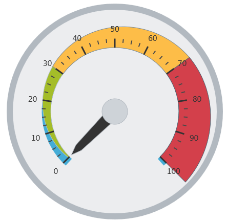

<!--
|metadata|
{
    "fileName": "igradialgauge-igradialgauge-overview",
    "controlName": "igRadialGauge",
    "tags": ["Getting Started"]
}
|metadata|
-->

# igRadialGauge Overview

## Topic Overview
### Purpose

This section gives you an overview of the `igRadialGauge`™ control and its main features.

## About igRadialGauge
### Overview

The `igRadialGauge`™ control is a data visualization tool capable of displaying a gauge containing a number of visual elements, such as a scale with tick marks and labels, a needle, and a number of ranges. Create a scale by supplying `minimumValue` and `maximumValue` values and a needle can point to a value by setting the value property. The gauge also supports ranges, which provide visual cues for the scale, for more information see the [Configuring Ranges (igRadialGauge)](igRadialGauge-Configuring-Ranges.html) topic.

The gauge comes with a backing shape drawn behind the scale that acts as a background for the gauge. The backing can be circular, which turns the shape into a full circle, or it can be fitted, which makes it sweep the scale – only providing backing behind the scale portion of the gauge, for more information see the [Configuring the Background (igRadialGauge)](igRadialGauge-Configuring-the-Backing.html) topic.

The gauge needle is available in one of several predefined shapes. The needle can have a pivot shape, which is placed in the center of the gauge. The pivot shape also takes one of the predefined shapes. Pivot shapes that include an overlay or an underlay can have a separate pivot brush applied to the shape. For more information see the [Configuring the Needle (igRadialGauge)](igRadialGauge-Configuring-Needles.html) topic.

This gauge supports only one scale, one needle, one set of tick marks and one set of labels. Practically all the changes made to the `igRadialGauge` control are animation enhancements. These animations are highly customizable by setting the `transitionDuration` property. You can achieve numerous needle shapes by fine tuning its shape parameters.

### Preview

The following screenshot is a preview of the `igRadialGauge` control with three ranges added to it.

## Related Content
### Topics

The following topics provide additional information related to this topic:

- [Adding igRadialGauge](igRadialGauge-Getting-Started-with-igRadialGauge.html): This topic explains using a code example how to add the `igRadialGauge`™ control to a page.

- [Configuring the Background (igRadialGauge)](igRadialGauge-Configuring-the-Backing.html): This topic provides a conceptual overview of the `igRadialGauge`™ control’s backing feature. It describes the properties of the backing area and provides an example of its implementation.

- [Configuring Labels (igRadialGauge)](igRadialGauge-Configuring-Labels.html): This topic provides a conceptual overview of labels with the `igRadialGauge`™ control. It describes the properties of the labels and also provides an example of how to configure the labels.

- [Configuring Needles (igRadialGauge)](igRadialGauge-Configuring-Needles.html): This topic provides a conceptual overview of needles with the `igRadialGauge`™ control. It describes the properties of the needles and also provides an example of how to configure them.

- [Configuring Ranges (igRadialGauge)](igRadialGauge-Configuring-Ranges.html): This topic provides a conceptual overview of the `igRadialGauge`™ control’s ranges. It describes the properties of the ranges and provides an example of how to add ranges to the radial gauge.

- [Configuring the Scales (igRadialGauge)](igRadialGauge-Configuring-the-Scales.html): This topic provides a conceptual overview of the `igRadialGauge`™ control’s scale. It describes the properties of the scale and also provides an example of how to implement it.

- [Configuring the Tick Marks (igRadialGauge)](igRadialGauge-Configuring-Tick-Marks.html): This topic provides a conceptual overview of tick marks with the `igRadialGauge`™ control. It describes the tick marks’ properties and provides an example of how to implement them.

### Samples

The following samples provide additional information related to this topic.

- [API Usage](%%SamplesUrl%%/radial-gauge/api-usage): The buttons and api-viewer showcase some of `igRadialGauge`'s needle methods. You can change the value of the needle at runtime and obtain the current value of the needle by clicking the corresponding buttons.

- [Gauge Animation](%%SamplesUrl%%/radial-gauge/motion-framework): This sample demonstrates how you can easily animate the Radial Gauge by setting the `transitionDuration` property.

- [Gauge Needle](%%SamplesUrl%%/radial-gauge/gauge-needle): Displayed as a pointer, the Needle indicates a single value on a scale. The options pane below allows you to interact with the Radial Gauge control’s Needle.

- [Label Settings](igradialgauge-configuring-labels.html#lable-example):  This sample demonstrates how to configure the Radial Gauge control’s Label settings. Use the slider to see how the `labelInterval` and `labelExtent` properties affect the Label.

- [Needle Dragging](%%SamplesUrl%%/radial-gauge/drag-needle): This sample demonstrates how you can drag the Radial Gauge control’s needle by using the Mouse events.

- [Range](%%SamplesUrl%%/radial-gauge/range): A range is a visual element that highlights a specified range of values on a scale. Use the options pane below to set the Radial Gauge control’s Range properties.

- [Scale Settings](%%SamplesUrl%%/radial-gauge/scale-settings): A scale defines a range of values in the Radial Gauge. Use the options pane below to set the Radial Gauge control’s Scale properties.

- [Tick Marks](%%SamplesUrl%%/radial-gauge/tickmarks): Tick marks can be displayed at every user specified interval on a gauge. Use the options pane below to set the Radial Gauge control’s Tick Mark properties.