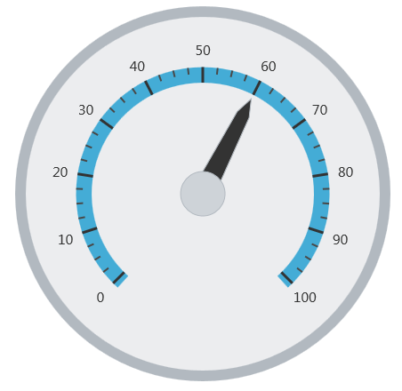
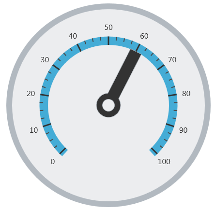

<!--
|metadata|
{
    "fileName": "igradialgauge-configuring-needles",
    "controlName": "igRadialGauge",
    "tags": ["Charting","How Do I","Tips and Tricks"]
}
|metadata|
-->

# Configuring Needles (igRadialGauge)

## Topic Overview
### Purpose

This topic provides a conceptual overview of needles with the `igRadialGauge`™ control. It describes the properties of the needles and also provides an example of how to configure them.

### Required background

The following topics are prerequisites to understanding this topic:

- [igRadialGauge](igRadialGauge.html): This section gives you an overview of the `igRadialGauge`™ control and its main features.

- [Adding igRadialGauge](igRadialGauge-Getting-Started-with-igRadialGauge.html): This topic explains using a code example how to add the `igRadialGauge`™ control to a page.


### In this topic

This topic contains the following sections:

-   [Needles Overview](#overview)
-   [Preview](#preview)
-   [Needle Properties](#needle-properties)
-   [Configuring the Needle](#config-needle)
-   [Related Content](#related-content)


##<a id="overview"></a>Needles Overview 

### Needles overview

A gauge needle is a visual element used to signify a gauge set value and consists of needle cap overlays or underlays; the gauge needle’s pivot point. The supported needle shapes and caps are set using the `needleShape` and `needlePivotShape` properties. For a visual representation of the different needle shape and the pivot shape refer to the needle sample

### <a id="preview"></a>Preview

The following image is a preview of the `igRadialGauge` control with the needle’s value property set to 60:




## <a id="needle-properties"></a>Needle Properties
### Needle properties summary

The following table summarizes the properties the `igRadialGauge` control related to the needle:

<table class="table table-bordered">
	<thead>
		<tr>
            <th>
Property Name
			</th>

            <th>
Property Type
			</th>

            <th>
Description
			</th>
        </tr>
	</thead>
	<tbody>
        

        <tr>
            <td>
`value`
			</td>

            <td>
`double`
			</td>

            <td>
Determines the value on the gauge to which the needle points.
			</td>
        </tr>

        <tr>
            <td>
`needleStartExtent`
			</td>

            <td>
`double`
			</td>

            <td>
Determines the beginning position of the needle, measured from the center of the gauge. The value of this property should be between -1 and 1.
			</td>
        </tr>

        <tr>
            <td>
`needleEndExtent`
			</td>

            <td>
`double`
			</td>

            <td>
Determines the ending position of the needle , measured from the center of the gauge. The value of this property should be between -1 and 1.
			</td>
        </tr>

        <tr>
            <td>
`needleStartWidthRatio`
			</td>

            <td>
`double`
			</td>

            <td>
Determines the width of the needle at its point. The value of this property should be between 0 and 1.
			</td>
        </tr>

        <tr>
            <td>
`needleEndWidthRatio`
			</td>

            <td>
`double`
			</td>

            <td>
                Determines the width of the needle at its base. The value&nbsp;of this property should be between 0 and 1.

                This has no effect unless the `needleShape` property is set to any of the following values:

                <ul>
                    <li>
rectangle
					</li>

                    <li>
trapezoid
					</li>

                    <li>
rectangleWithBulb
					</li>

                    <li>
trapezoidWithBulb
					</li>
                </ul>
            </td>
        </tr>

        <tr>
            <td>
`needleShape`
			</td>

            <td>
`radialGaugeNeedleShape`
			</td>

            <td>
                Determines which of the predefined needle shapes to use:

                <ul>
                    <li>
rectangle
					</li>

                    <li>
triangle
					</li>

                    <li>
trapezoid
					</li>

                    <li>
rectangleWithBulb
					</li>

                    <li>
triangleWithBulb
					</li>

                    <li>
needleWithBulb
					</li>

                    <li>
trapezoidWithBulb
					</li>
                </ul>
            </td>
        </tr>

        <tr>
            <td>
`needlePivotShape`
			</td>

            <td>
`radialGaugePivotShape`
			</td>

            <td>
                Determines the pivot shape to use for the needle.

                It can be set to:

                <ul>
                    <li>
circle
					</li>

                    <li>
circleWithHole
					</li>

                    <li>
circleOverlay
					</li>

                    <li>
circleOverlayWithHole
					</li>

                    <li>
circleUnderlay
					</li>

                    <li>
circleUnderlayWithHole
					</li>
                </ul>
            </td>
        </tr>

        <tr>
            <td>
`needleBrush`
			</td>

            <td>
`brush`
			</td>

            <td>
Determines the brush of the gauge needle.
			</td>
        </tr>

        <tr>
            <td>
`needleOutline`
			</td>

            <td>
`brush`
			</td>

            <td>
Determines the brush to use forthe outline needle.
			</td>
        </tr>

        <tr>
            <td>
`needlePivotBrush`
			</td>

            <td>
`brush`
			</td>

            <td>
Determines the fill brush for the needle pivot shape. This pivot brush only applies to the pivot shapes that draw an overlay or an underlay. Otherwise, this setting has no effect on the pivot shape.
			</td>
        </tr>

        <tr>
            <td>
`needlePivotOutline`
			</td>

            <td>
`brush`
			</td>

            <td>
Determines the brush of the outlines of the needle pivot shape. This pivot brush only applies to the pivot shapes that draw an overlay or an underlay. Otherwise, this setting has no effect on the pivot shape.
			</td>
        </tr>
    </tbody>
</table>


##<a id="config-needle"></a>Configuring the Needle 

### Example

The following screenshot demonstrates how the `igRadialGauge` control with the properties of the needle looks as a result of the following setting:

Property| Value
---|---
`value`|60
`needleEndExtent`|0.5
`needleShape`|rectangle
`pivotShape`|circleWithHole




The following is the code that implements this example:

 **In JavaScript:**

```js
$("#gauge").igRadialGauge({
	width: "400px",
	height: "400px",
	value: 60,
	endExtent: 0.5,
	needleShape: "rectangle",
	needlePivotShape: "circleWithHole"                                  
});                                                                  
```

## <a id="related-content"></a>Related Content
### Topics

The following topics provide additional information related to this topic:

- [Adding igRadialGauge](igRadialGauge-Getting-Started-with-igRadialGauge.html): This topic explains using a code example how to add the `igRadialGauge`™ control to a %%PlatformName%% application.

- [Configuring the Background (igRadialGauge)](igRadialGauge-Configuring-the-Backing.html): This topic provides a conceptual overview of the `igRadialGauge`™ control’s backing feature. It describes the properties of the backing area and provides an example of its implementation.

- [Configuring Labels (igRadialGauge)](igRadialGauge-Configuring-Labels.html): This topic provides a conceptual overview of labels with the `igRadialGauge`™ control. It describes the properties of the labels and also provides an example of how to configure the labels.

- [Configuring Ranges (igRadialGauge)](igRadialGauge-Configuring-Ranges.html): This topic provides a conceptual overview of the `igRadialGauge`™ control’s ranges. It describes the properties of the ranges and provides an example of how to add ranges to the radial gauge.

- [Configuring the Scales (igRadialGauge)](igRadialGauge-Configuring-the-Scales.html): This topic provides a conceptual overview of the `igRadialGauge`™ control’s scale. It describes the properties of the scale and also provides an example of how to implement it.

- [Configuring the Tick Marks (igRadialGauge)](igRadialGauge-Configuring-Tick-Marks.html): This topic provides a conceptual overview of tick marks with the `igRadialGauge`™ control. It describes the tick marks’ properties and provides an example of how to implement them.


### Samples

The following samples provide additional information related to this topic:

- [API Usage](%%SamplesUrl%%/radial-gauge/api-usage): The buttons and api-viewer showcase some of `igRadialGauge`'s needle methods. You can change the value of the needle at runtime and obtain the current value of the needle by clicking the corresponding buttons.

- [Gauge Animation](%%SamplesUrl%%/radial-gauge/motion-framework): This sample demonstrates how you can easily animate the Radial Gauge by setting the `transitionDuration` property.

- [Gauge Needle](%%SamplesUrl%%/radial-gauge/gauge-needle): Displayed as a pointer, the Needle indicates a single value on a scale. The options pane below allows you to interact with the Radial Gauge control’s Needle.

- [Label Settings](igradialgauge-configuring-labels.html#lable-example):  This sample demonstrates how to configure the Radial Gauge control’s Label settings. Use the slider to see how the `labelInterval` and `labelExtent` properties affect the Label.

- [Needle Dragging](%%SamplesUrl%%/radial-gauge/drag-needle): This sample demonstrates how you can drag the Radial Gauge control’s needle by using the isNeedleDraggingEnabled property.

- [Range](%%SamplesUrl%%/radial-gauge/range): A range is a visual element that highlights a specified range of values on a scale. Use the options pane below to set the Radial Gauge control’s Range properties.

- [Scale Settings](%%SamplesUrl%%/radial-gauge/scale-settings): A scale defines a range of values in the Radial Gauge. Use the options pane below to set the Radial Gauge control’s Scale properties.

- [Tick Marks](%%SamplesUrl%%/radial-gauge/tickmarks): Tick marks can be displayed at every user specified interval on a gauge. Use the options pane below to set the Radial Gauge control’s Tick Mark properties.