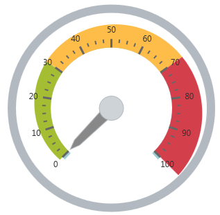
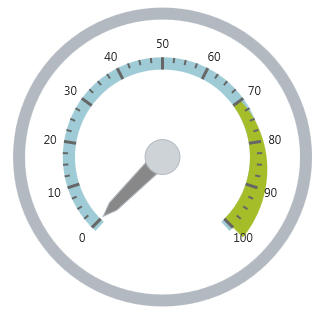

<!--
|metadata|
{
    "fileName": "igradialgauge-configuring-ranges",
    "controlName": "igRadialGauge",
    "tags": ["Charting","How Do I","Tips and Tricks"]
}
|metadata|
-->

# Configuring Ranges (igRadialGauge)


## Topic Overview
### Purpose

This topic provides a conceptual overview of the `igRadialGauge`™ control’s ranges. It describes the properties of the ranges and provides an example of how to add ranges to the radial gauge.

### Required background

The following topics are prerequisites to understanding this topic:

- [igRadialGauge](igRadialGauge.html): This section gives you an overview of the `igRadialGauge`™ control and its main features.

- [Adding igRadialGauge](igRadialGauge-Getting-Started-with-igRadialGauge.html): This topic explains using a code example how to add the `igRadialGauge`™ control to a page.

### In this topic

This topic contains the following sections:

-   [Ranges Overview](#overview)
-   [Preview](#preview)
-   [Range Properties](#range-properties)
-   [Configuring the Range](#config-range)
-   [Related Content](#RelatedContent)


##<a id="overview"></a>Ranges Overview 

### Ranges overview

A range highlights a set of continuous values bound by a specified minimum and maximum value on a gauge scale. You can add multiple ranges to a scale, specifying different brushes, along with starting and ending values. To add a range to the `igRadialGauge` control, create a `radialGaugeRange` object and add it to the Ranges collection.

### <a id="preview"></a>Preview

The following image is a preview of the `igRadialGauge` control with the three ranges added to it (0-30; 30-70 and 70-100):




## <a id="range-properties"></a>Range Properties
### Range properties summary

The following table summarizes the properties of the `radialGaugeRange`:

Property Name| Property Type| Description
---|---|---
`brush`|brush|The color assigned to the range
`startValue`|double|The starting value at which to begin the range
`endValue`|double|The ending value at which to end the range
`innerStartExtent`|double|The distance from the center of the gauge (typically from 0 to 1) at which to start rendering the inner sweep of the range. Use values further from 0 than 1 to make the range extend beyond the normal radius of the gauge.
`innerEndExtent`|double|The distance from the center of the gauge (typically from 0 to 1) at which to end rendering the inner sweep of the range. Use values further from 0 than 1 to make the range extend further than the normal radius of the gauge.
`outerStartExtent`|double|The distance from the center of the gauge (from 0 to 1) at which to start rendering the outer sweep of the range. Use values further from 0 than 1 to make this extend further than the normal radius of the gauge.
`outerEndExtent`|double|The distance from the center of the gauge (from 0 to 1) at which to end rendering the outer sweep of the range. Use values further from 0 than 1 to make this extend further than the normal radius of the gauge.


##<a id="config-range"></a>Configuring the Range 

### Example

The following screenshot demonstrates how the `igRadialGauge` control renders using this `igRadialGaugeRange` configuration:

Property| Value
---|---
`brush`|Blue
`startValue`|70
`endValue`|100
`outerStartExtent`|0.55
`outerEndExtent`|0.65




The following is the code that implements this example:

 **In JavaScript:**  

```js 
$("#gauge").igRadialGauge({
	width: "400px",
	height: "400px",
	ranges: [{
		name: "range1",
		brush: "rgba(164, 189, 41, 1)",
		startValue: 70,
		endValue: 100,
		outerStartExtent:  0.55,
		outerEndExtent: 0.65
	}]                                      
});                                                                  
```


## <a id="RelatedContent"></a>Related Content
### Topics

The following topics provide additional information related to this topic:

- [Adding igRadialGauge](igRadialGauge-Getting-Started-with-igRadialGauge.html): This topic explains using a code example how to add the `igRadialGauge`™ control to a %%PlatformName%% application.

- [Configuring the Background (igRadialGauge)](igRadialGauge-Configuring-the-Backing.html): This topic provides a conceptual overview of the `igRadialGauge`™ control’s backing feature. It describes the properties of the backing area and provides an example of its implementation.

- [Configuring Labels (igRadialGauge)](igRadialGauge-Configuring-Labels.html): This topic provides a conceptual overview of labels with the `igRadialGauge`™ control. It describes the properties of the labels and also provides an example of how to configure the labels.

- [Configuring Needles (igRadialGauge)](igRadialGauge-Configuring-Needles.html): This topic provides a conceptual overview of needles with the `igRadialGauge`™ control. It describes the properties of the needles and also provides an example of how to configure them.

- [Configuring the Scales (igRadialGauge)](igRadialGauge-Configuring-the-Scales.html): This topic provides a conceptual overview of the `igRadialGauge`™ control’s scale. It describes the properties of the scale and also provides an example of how to implement it.

- [Configuring the Tick Marks (igRadialGauge)](igRadialGauge-Configuring-Tick-Marks.html): This topic provides a conceptual overview of tick marks with the `igRadialGauge`™ control. It describes the tick marks’ properties and provides an example of how to implement them.


### Samples

The following samples provide additional information related to this topic:

- [API Usage](%%SamplesUrl%%/radial-gauge/api-usage): The buttons and api-viewer showcase some of `igRadialGauge`'s needle methods. You can change the value of the needle at runtime and obtain the current value of the needle by clicking the corresponding buttons.

- [Gauge Animation](%%SamplesUrl%%/radial-gauge/motion-framework): This sample demonstrates how you can easily animate the Radial Gauge by setting the `transitionDuration` property.

- [Gauge Needle](%%SamplesUrl%%/radial-gauge/gauge-needle): Displayed as a pointer, the Needle indicates a single value on a scale. The options pane below allows you to interact with the Radial Gauge control’s Needle.

- [Label Settings](igradialgauge-configuring-labels.html#lable-example):  This sample demonstrates how to configure the Radial Gauge control’s Label settings. Use the slider to see how the `labelInterval` and `labelExtent` properties affect the Label.

- [Needle Dragging](%%SamplesUrl%%/radial-gauge/drag-needle): This sample demonstrates how you can drag the Radial Gauge control’s needle by using the Mouse events.

- [Range](%%SamplesUrl%%/radial-gauge/range): A range is a visual element that highlights a specified range of values on a scale. Use the options pane below to set the Radial Gauge control’s Range properties.

- [Scale Settings](%%SamplesUrl%%/radial-gauge/scale-settings): A scale defines a range of values in the Radial Gauge. Use the options pane below to set the Radial Gauge control’s Scale properties.

- [Tick Marks](%%SamplesUrl%%/radial-gauge/tickmarks): Tick marks can be displayed at every user specified interval on a gauge. Use the options pane below to set the Radial Gauge control’s Tick Mark properties.