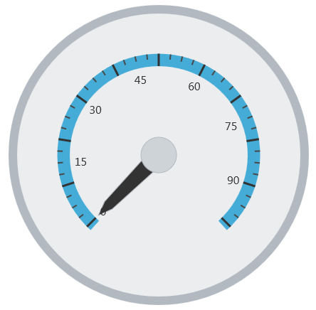

<!--
|metadata|
{
    "fileName": "igradialgauge-configuring-labels",
    "controlName": "igRadialGauge",
    "tags": ["Charting","Formatting","How Do I"]
}
|metadata|
-->

# Configuring Labels (igRadialGauge)


## Topic Overview
### Purpose

This topic provides a conceptual overview of labels with the `igRadialGauge`™ control. It describes the properties of the labels and also provides an example of how to configure the labels.

### Required background

The following topics are prerequisites to understanding this topic:

- [igRadialGauge](igRadialGauge.html): This section gives you an overview of the `igRadialGauge`™ control and its main features.

- [Adding igRadialGauge](igRadialGauge-Getting-Started-with-igRadialGauge.html): This topic explains using a code example how to add the `igRadialGauge`™ control to a page.


### In this topic

This topic contains the following sections:

-   [Labels Overview](#overview)
-   [Preview](#preview)
-   [Label Properties and Events](#lable-properties)
-   [Configuring the Label](#config-lable)
-	[Example](#lable-example)
-   [Related Content](#related-content)


##<a id="overview"></a>Labels Overview 

### Labels overview

The gauge labels are visual elements displaying numeric values at a specified interval on the scale.

### <a id="preview"></a>Preview

The following image is a preview of the `igRadialGauge` control displaying labels:


## <a id="lable-properties"></a>Label Properties and Events
### Label properties and events summary

The following table summarizes the `igRadialGauge` control’s label properties:

Property Name| Property Type| Description
---|---|---
labelExtent|double|Determines the label position as a value between 0 and 1 from the center of the gauge with 0 placing the labels at the center of the gauge and 1 placing the labels on the radius of the gauge.
labelInterval|double|Determines the interval to use for rendering labels; by default this is the same interval as the tick marks on the scale.


The following table summarizes the `igRadialGauge` control’s label related events.

Event Name| Description
---|---
alignLabel|This event is raised when aligning a gauge label along the scale
formatLabel|This event is raised when formatting a gauge label


##<a id="config-lable"></a>Configuring the Label 

### Example

The following screenshot illustrates how the `igRadialGauge` control renders with the label’s properties configured like this:

Property| Value
---|---
labelInterval| 15
labelExtent |0.44




The following is the code for implementing this example:

 **In JavaScript:**   
                                                                                                                                  
```js 
$("#gauge").igRadialGauge({
	width: "400px",
	height: "400px",
	labelExtent: 0.44,
	labelInterval: 15 
});                                                                  
```
## <a id="lable-example"></a>Example

The following example demonstrates how to configure the Radial Gauge control's Label settings. Use the slider to see how the labelExtent and labelInterval properties affect the Label.

<div class="embed-sample">
   [%%SamplesEmbedUrl%%/radial-gauge/label-settings](%%SamplesEmbedUrl%%/radial-gauge/label-settings)
</div>

## <a id="related-content"></a>Related Content
### Topics

The following topics provide additional information related to this topic:

- [Adding igRadialGauge](igRadialGauge-Getting-Started-with-igRadialGauge.html): This topic explains using a code example how to add the `igRadialGauge`™ control to a %%PlatformName%% application.

- [Configuring the Background (igRadialGauge)](igRadialGauge-Configuring-the-Backing.html): This topic provides a conceptual overview of the `igRadialGauge`™ control’s backing feature. It describes the properties of the backing area and provides an example of its implementation.

- [Configuring Needles (igRadialGauge)](igRadialGauge-Configuring-Needles.html): This topic provides a conceptual overview of needles with the `igRadialGauge`™ control. It describes the properties of the needles and also provides an example of how to configure them.

- [Configuring Ranges (igRadialGauge)](igRadialGauge-Configuring-Ranges.html): This topic provides a conceptual overview of the `igRadialGauge`™ control’s ranges. It describes the properties of the ranges and provides an example of how to add ranges to the radial gauge.

- [Configuring the Scales (igRadialGauge)](igRadialGauge-Configuring-the-Scales.html): This topic provides a conceptual overview of the `igRadialGauge`™ control’s scale. It describes the properties of the scale and also provides an example of how to implement it.

- [Configuring the Tick Marks (igRadialGauge)](igRadialGauge-Configuring-Tick-Marks.html): This topic provides a conceptual overview of tick marks with the `igRadialGauge`™ control. It describes the tick marks’ properties and provides an example of how to implement them.


### Samples

The following samples provide additional information related to this topic:

- [API Usage](%%SamplesUrl%%/radial-gauge/api-usage): The buttons and api-viewer showcase some of `igRadialGauge`'s needle methods. You can change the value of the needle at runtime and obtain the current value of the needle by clicking the corresponding buttons.

- [Gauge Animation](%%SamplesUrl%%/radial-gauge/motion-framework): This sample demonstrates how you can easily animate the Radial Gauge by setting the `transitionDuration` property.

- [Gauge Needle](%%SamplesUrl%%/radial-gauge/gauge-needle): Displayed as a pointer, the Needle indicates a single value on a scale. The options pane below allows you to interact with the Radial Gauge control’s Needle.

- [Needle Dragging](%%SamplesUrl%%/radial-gauge/drag-needle): This sample demonstrates how you can drag the Radial Gauge control’s needle by using the Mouse events.

- [Range](%%SamplesUrl%%/radial-gauge/range): A range is a visual element that highlights a specified range of values on a scale. Use the options pane below to set the Radial Gauge control’s Range properties.

- [Scale Settings](%%SamplesUrl%%/radial-gauge/scale-settings): A scale defines a range of values in the Radial Gauge. Use the options pane below to set the Radial Gauge control’s Scale properties.

- [Tick Marks](%%SamplesUrl%%/radial-gauge/tickmarks): Tick marks can be displayed at every user specified interval on a gauge. Use the options pane below to set the Radial Gauge control’s Tick Mark properties.