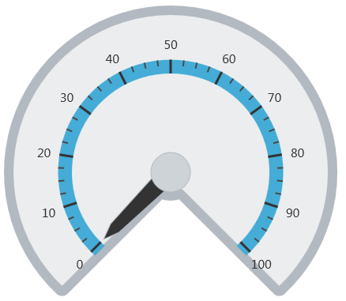
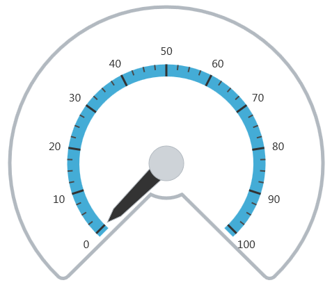

<!--
|metadata|
{
    "fileName": "igradialgauge-configuring-the-backing",
    "controlName": "igRadialGauge",
    "tags": ["Charting","Styling"]
}
|metadata|
-->

# Configuring the Background (igRadialGauge)

## (igRadialGauge)Topic Overview
### Purpose

This topic provides a conceptual overview of the `igRadialGauge`™ control’s Background feature. It describes the properties of the background area and provides an example of its implementation.

### Required background

The following topics are prerequisites to understanding this topic:

- [igRadialGauge](igRadialGauge.html): This section gives you an overview of the `igRadialGauge`™ control and its main features.

- [Adding igRadialGauge](igRadialGauge-Getting-Started-with-igRadialGauge.html): This topic explains using a code example how to add the `igRadialGauge`™ control to a page.


### In this topic

This topic contains the following sections:

-   [Overview](#overview)
-   [Preview](#preview)
-   [Background Feature Properties](#properties)
-   [Configuring the Background](#config-background)
-   [Related Content](#related-content)


##<a id="overview"></a>Background Feature Overview 

### Background feature overview

Displayed as a circle, the background section of the `igRadialGauge` control is where all the different elements such as needles and tick marks are added to the gauge.

This area can be customized to be either circular or fitted by setting the `backingShape` property. A circular shape creates a 360 degree circle gauge while a fitted shape creates a filled arc segment encompassing the scale.

### <a id="preview"></a>Preview

The following image is a preview of the `igRadialGauge` control rendered with the background configured as Fitted:




## <a id="properties"></a>Background Feature Properties
### Background feature properties summary

The following table summarizes the properties of the `igRadialGauge` control related the background:

Property Name| Property Type| Description
---|---|---
`backingBrush`|brush|Use this property to specify the gauge’s background brush fill.
`backingCornerRadius`|double|Determines the corner rounding radius to use with the fitted scale background. If the gauge uses a fitted background shape, use this property to provide rounded corners for the background.
`backingInnerExtent`|double|Determines the inner extent of the gauge’s background. This applies only when using fitted background shapes.
`backingOuterExtent`|double|Determines the outer extent of the gauge’s background. This applies only when using fitted background shapes.
`backingOutline`|brush|Determines the brush used for the outline of the background.
`backingOversweep`|double|Determines the oversweep or undersweep degrees to apply to the fitted background. Use this property to add extra space and extend the background shape past the start and end of the scale.
`backingShape`|`radialGaugeBackingShape`|Use this property to set the shape of the gauge’s background to a predefined shape. The background shape can either be circular or fitted. A fitted shape creates a filled arc segment that encompasses the scale.
`backingStokeThickness`|double|Determines the stroke thickness for the background outline.


##<a id="config-background"></a>Configuring the Background 

### Example

The following screenshot shows how the `igRadialGauge` control renders using this background properties configuration:

Property| Value
---|---
`backingBrush`|white
`backingShape`|fitted
`backingCornerRadius`|10
`backingOuterExtent`|0.9
`backingInnerExtent`|0.2
`backingOversweep`|4
`backingStrokeThickness`|5




The following is the code that implements this example:

 **In JavaScript:**

```js
$("#gauge").igRadialGauge({ 
	width: "400px",
	height: "400px",
	minimumValue: 0,
	maximumValue: 0,
	value: 1,
	backingShape: "fitted",
	backingBrush: "white",
	backingCornerRadius: 10,
	backingOuterExtent: 0.9,
	backingInnerExtent: 0.2,
	backingOversweep: 4,
	backingSrokeThickness:5
});                                                                  
```


## <a id="related-content"></a>Related Content
### Topics

The following topics provide additional information related to this topic:

- [Adding igRadialGauge](igRadialGauge-Getting-Started-with-igRadialGauge.html): This topic explains using a code example how to add the `igRadialGauge`™ control to a %%PlatformName%% application.

- [Configuring Labels (igRadialGauge)](igRadialGauge-Configuring-Labels.html): This topic provides a conceptual overview of labels with the `igRadialGauge`™ control. It describes the properties of the labels and also provides an example of how to configure the labels.

- [Configuring Needles (igRadialGauge)](igRadialGauge-Configuring-Needles.html): This topic provides a conceptual overview of needles with the `igRadialGauge`™ control. It describes the properties of the needles and also provides an example of how to configure them.

- [Configuring Ranges (igRadialGauge)](igRadialGauge-Configuring-Ranges.html): This topic provides a conceptual overview of the `igRadialGauge`™ control’s ranges. It describes the properties of the ranges and provides an example of how to add ranges to the radial gauge.

- [Configuring the Scales (igRadialGauge)](igRadialGauge-Configuring-the-Scales.html): This topic provides a conceptual overview of the `igRadialGauge`™ control’s scale. It describes the properties of the scale and also provides an example of how to implement it.

- [Configuring the Tick Marks (igRadialGauge)](igRadialGauge-Configuring-Tick-Marks.html): This topic provides a conceptual overview of tick marks with the `igRadialGauge`™ control. It describes the tick marks’ properties and provides an example of how to implement them.


### Samples

The following samples provide additional information related to this topic:

- [API Usage](%%SamplesUrl%%/radial-gauge/api-usage): The buttons and api-viewer showcase some of `igRadialGauge`'s needle methods. You can change the value of the needle at runtime and obtain the current value of the needle by clicking the corresponding buttons.

- [Gauge Animation](%%SamplesUrl%%/radial-gauge/motion-framework): This sample demonstrates how you can easily animate the Radial Gauge by setting the `transitionDuration` property.

- [Gauge Needle](%%SamplesUrl%%/radial-gauge/gauge-needle): Displayed as a pointer, the Needle indicates a single value on a scale. The options pane below allows you to interact with the Radial Gauge control’s Needle.

- [Label Settings](igradialgauge-configuring-labels.html#lable-example):  This sample demonstrates how to configure the Radial Gauge control’s Label settings. Use the slider to see how the `labelInterval` and `labelExtent` properties affect the Label.

- [Needle Dragging](%%SamplesUrl%%/radial-gauge/drag-needle): This sample demonstrates how you can drag the Radial Gauge control’s needle by using the Mouse events.

- [Range](%%SamplesUrl%%/radial-gauge/range): A range is a visual element that highlights a specified range of values on a scale. Use the options pane below to set the Radial Gauge control’s Range properties.

- [Scale Settings](%%SamplesUrl%%/radial-gauge/scale-settings): A scale defines a range of values in the Radial Gauge. Use the options pane below to set the Radial Gauge control’s Scale properties.

- [Tick Marks](%%SamplesUrl%%/radial-gauge/tickmarks): Tick marks can be displayed at every user specified interval on a gauge. Use the options pane below to set the Radial Gauge control’s Tick Mark properties.