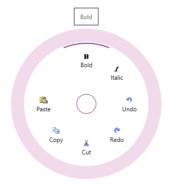

<!--
|metadata|
{
    "fileName": "igradialmenu-features",
    "controlName": "igRadialMenu",
    "tags": ["Getting Started"]
}
|metadata|
-->

# igRadialMenu Features

## Topic Overview
### Purpose

This topic explains the features supported by the [`igRadialMenu`](%%jQueryApiUrl%%/ui.igRadialMenu#options)™ control from developer perspective.

### In this topic

This topic contains the following sections:

-   [Introduction](#introduction)
-   [Main Features](#main-features)
-   [Related Content](#related-content)

## Introduction
### igRadialMenu summary

The `igRadialMenu`™ control is essentially a context menu presenting its items in a circular arrangement around a center button. The circular arrangement of the items speeds up items selection, because each item is equally positioned in relation to the center. The `igRadialMenu` supports different item types for choosing numerical values, color values or performs actions. Sub-Items are also supported.

By default the only visible part of the `igRadialMenu` is the center button. When the user clicks on the center button, the `igRadialMenu` opens and shows the root level menu items. Clicking on the center button when the root level items are shown closes the `igRadialMenu`. To navigate Sub-Items the user should click the arrows in the outer ring and the corresponding sub-items group will be displayed. Clicking on the center button when a sub-items group is shown will display the items on the previous level.

The screenshot below shows an opened `igRadialMenu` with 7 items while the mouse hovers above the “Bold” item:

## Main Features
### New/Main features summary chart

The following table summarizes the main features of the `igRadialMenu` control. Additional details are available following the summary table.

Feature|Description
---|---
[Button items](#button-items)|Plain menu items used to invoke actions.
[Color items](#color-items)|Color items allow the user to select colors.
[Numeric items](#numeric-items)|Numeric items allow the user to select numeric values.
[Sub-items](#sub-items)|Menu items can be nested in more than one level.
[Tooltips](#tooltips)|Each item supports tooltips, which are shown when hovering over an item.
[Menu items arrangement](#menu-items)|Customize the menu items’ arrangement.

### Button items

Button items can be clicked to perform an action. In addition, button items can be configured to operate as checkbox items (in which case they will have a checked/unchecked state represented by an arc in the outer most part of the items area) or radio button items (in which case their checked state is mutually exclusive with respect to the other items in the radio button group).

#### Related Topics:

-   [Configuring Button Items](igRadialMenu-Configuring-Button-Items.html)

### Color items

There are two types of color items:

-   Color item – Similar to button items but contains text, an image and a rectangle displaying the selected color
-   Color well – Displays the selected color in the whole item’s area

#### Related Topics:

-   [Configuring Color Items](igRadialMenu-Configuring-Color-Items.html)

### Numeric items

There are two types of numeric items:

-   Numeric item – similar to button items it contains text, images and a dedicated numeric area showing the current value
-   Numeric Gauge – presents the user with a scale showing the allowed numerical values and needles showing the current value and the pending value

#### Related Topics:

-   [Configuring Numeric Items](igRadialMenu-Configuring-Numeric-Items.html)

### Sub-Items

Because the `igRadialMenu` shows its items in a circular way, their number is generally limited (typically 8 slices/wedges) are shown. To provide more options to be available for user selection you can organize items into groups.

#### Related Topics:

-   [Items/Sub-Items Configuration Overview](igRadialMenu-Items-Sub-Items-Configuration-Overview.html)

### Tooltips

All `igRadialMenu`’s items support tooltips shown when hovering above the items.

#### Related Topics:

-   [Configuring Tooltips](igRadialMenu-Configuring-Tooltips.html)

### Menu items arrangement

By default, the order in which all `igRadialMenu` items are displayed is specified in the code; however, you can explicitly order them differently.

#### Related Topics:

-   [Items/Sub-Items Configuration Overview](igRadialMenu-Items-Sub-Items-Configuration-Overview.html)

## Related Content
### Topics

The following topics provide additional information related to this topic.

- [igRadialMenu Visual Elements](igRadialMenu-Visual-Elements.html): This topic provides an overview of the visual elements of the control.

- [User Interaction and Usability](igRadialMenu-User-Interaction.html): This topic explains what actions can be performed by the user.

 

 

