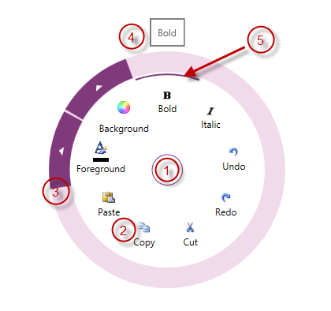

<!--
|metadata|
{
    "fileName": "igradialmenu-visual-elements",
    "controlName": "igRadialMenu",
    "tags": ["Getting Started"]
}
|metadata|
-->

# igRadialMenu Visual Elements

## Topic Overview
### Purpose

This topic provides an overview of the visual elements of the [`igRadialMenu`](%%jQueryApiUrl%%/ui.igRadialMenu#options)™ control.

### Required background

The following topic is a prerequisite to understanding this topic:

- [igRadialMenu Features](igRadialMenu-Features.html): This topic explains the features supported by the control from developer perspective.

### In this topic

This topic contains the following sections:

-   [Visual Elements of igRadialMenu Control and Related Properties](#visual-elements)
-   [Related Content](#related-content)

## Visual Elements of igRadialMenu Control and Related Properties
### Visual elements summary

The following screenshot depicts the visual elements of the `igRadialMenu` control. Configurable elements are listed after the image.

**Configurable Visual Elements:**

1.  Center Button – either opens and closes the `igRadialMenu`, or allows access to menu items on the previous level.
2.  Items Area – displays the current level menu items in this area.
3.  Outer Ring – the outer most part of the `igRadialMenu`, may contain arrows for accessing sub-items
4.  Tooltip – indicates the currently selected menu item.
5.  Selection Arc – highlights the currently hovered menu item and its checked state.

### Visual elements and related properties

The following table maps the visual elements of the `igRadialMenu` control and the properties that configure them.

<table class="table">
	<thead>
		<tr>
            <th>
Visual element
			</th>

            <th>
Main configurable aspects
			</th>
        </tr>
	</thead>
	<tbody>
        

        <tr>
            <td>
Center button
			</td>

            <td>
                <ul>
                    <li>
`CenterButtonBackTemplate`
					</li>

                    <li>
`CenterButtonContent`
					</li>

                    <li>
`CenterButtonFill`
					</li>

                    <li>
`CenterButtonStroke`
					</li>
                </ul>
            </td>
        </tr>

        <tr>
            <td>
Items area
			</td>

            <td>
                <ul>
                    <li>
`Items`
					</li>

                    <li>
`ItemsSource`
					</li>

                    <li>
`MinWedgeCount`
					</li>

                    <li>
`RotationInDegrees`
					</li>

                    <li>
`WedgeIndex`
					</li>

                    <li>
`WedgeSpan`
					</li>
                </ul>
            </td>
        </tr>

        <tr>
            <td>
Outer ring
			</td>

            <td>
                <ul>
                    <li>
`OuterRingFill`
					</li>

                    <li>
`OuterRingStroke`
					</li>

                    <li>
`OuterRingThickness`
					</li>

                    <li>
`OuterRingStrokeThickness`
					</li>
                </ul>
            </td>
        </tr>

        <tr>
            <td>
Tooltips
			</td>

            <td>
                <ul>
                    <li>
`IsToolTipEnabled`
					</li>

                    <li>
`ToolTip`
					</li>

                    <li>
`ToolTipTemplate`
					</li>
                </ul>
            </td>
        </tr>

        <tr>
            <td>
Selection arc
			</td>

            <td>
                <ul>
                    <li>
`IsChecked`
					</li>
                </ul>
            </td>
        </tr>
    </tbody>
</table>

## Related Content
### Topics

The following topic provides additional information related to this topic.

- [User Interaction and Usability](igRadialMenu-User-Interaction.html): This topic explains what actions can be performed by the user.

 

 

