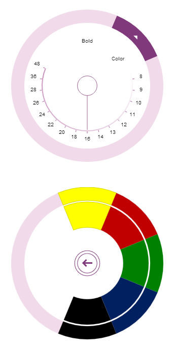

<!--
|metadata|
{
    "fileName": "igradialmenu-adding-html-page",
    "controlName": "igRadialMenu",
    "tags": ["Getting Started","How Do I"]
}
|metadata|
-->

# Adding igRadialMenu to an HTML Page

## Topic Overview
### Purpose

This topic demonstrates, with code examples, how to add the [`igRadialMenu`](%%jQueryApiUrl%%/ui.igRadialMenu#options)™ control to an HTML page.

### Required background

The following topics are prerequisites to understanding this topic:

- [igRadialMenu Features](igRadialMenu-Features.html): This topic explains the features supported by the control from developer perspective.

- [igRadialMenu Visual Elements](igRadialMenu-Visual-Elements.html): This topic provides an overview of the visual elements of the control.


### In this topic

This topic contains the following sections:

-   [Adding igRadialMenu to an HTML Page – Conceptual Overview](#overview)
-   [Adding igRadialMenu to an HTML Page – Procedure](#procedure)
-   [Related Content](#related-topics)


## <a id="overview"></a>Adding igRadialMenu to an HTML Page – Conceptual Overview
### Adding igRadialMenu summary

To add `igRadialMenu` control to a web page requires an HTML element, a `<div>` to serve as the base for the instantiation. The basic configuration of the `igRadialMenu` requires providing its dimensions and also defining some menu items.

### Requirements

The following table summarizes the requirements for using the `igRadialMenu` control.

<table class="table table-bordered">
	<thead>
		<tr>
            <th>
Required Resources
			</th>

            <th>
Description
			</th>

            <th>
What you need to do…
			</th>
        </tr>
	</thead>
	<tbody>
        

        <tr>
            <td>
jQuery and jQuery UI JavaScript resources
			</td>

            <td>
                %%ProductName%%™ is built on top of the following frameworks:

                <ul>
                    <li>
[jQuery](http://jquery.com/)
					</li>

                    <li>
[jQuery UI](http://jqueryui.com/)
					</li>
                </ul>
            </td>

            <td>
Add script references to both libraries in the  section of your page.
			</td>
        </tr>

        <tr>
            <td>
General `igRadialMenu` JavaScript Resources
			</td>

            <td>
                The `igRadialMenu` control depends on functionality distributed across several files in the %%ProductName%% Library. You can load the required resources in one of the following ways:

                <ul>
                    <li>
Use the Infragistics® Loader (`igLoader`™). You only need to include a script reference to `igLoader` on your page.
					</li>

                    <li>
Load the required resources manually. You need to use the dependencies listed in the table below.
					</li>

                    <li>
Load the two combined files, containing the logic for all data visualization controls from the %%ProductName%% package -` infragistics.core.js`, `infragistics.dv.js` and `infragistics.encoding.js` (optional).
					</li>
                </ul>

                The following table lists the %%ProductName%% library dependences related to the `igRadialMenu` control. These resources need to be referred to explicitly if you chose not to use igLoader or
                    the combined files.

                <table class="table">
	<thead>
		<tr>
                            <th>
JS Resources
			</th>

                            <th>
Description
			</th>
                        </tr>
	</thead>
	<tbody>
                        

                        <tr>
                            <td>
`infragistics.util.js`
			</td>

                            <td>
%%ProductName%% utilities
			</td>
                        </tr>

                        <tr>
                            <td>
`infragistics.dv.simple.core.js`
			</td>

                            <td>
A shared library for data visualization components
			</td>
                        </tr>

                        <tr>
                            <td>
`infragistics.radialmenu_core.js`
			</td>

                            <td>
The `igRadialMenu` control
			</td>
                        </tr>

                        <tr>
                            <td>
`infragistics.ui.radialmenu.js`
			</td>

                            <td>
The `igRadialMenu` widget
			</td>
                        </tr>
                    </tbody>
</table>
                <br>
            </td>

            <td>
                Add one of the following:

                <ul>
                    <li>
A reference to `igLoader`
					</li>

                    <li>
A reference to all the required JavaScript files (listed in the table on the left).
					</li>

                    <li>
A reference to the combined files and optionally to the file containing the encodings.
					</li>
                </ul>
            </td>
        </tr>
    </tbody>
</table>


### Steps

Following are the general conceptual steps for adding `igRadialMenu` to an HTML page.

1. Create a target element for storing the `igRadialMenu` control.

2. Instantiate the `igRadialMenu` control.

3. Configure the basic rendering options.

4. Add a button item (optional)

5. Add a color item (optional)

6. Add a numeric gauge item (optional)


## <a id="procedure"></a>Adding igRadialMenu to an HTML Page – Procedure
### Introduction

This procedure adds an instance of the `igRadialMenu` to an HTML page, configure its dimensions and add some menu items.

### Preview

The following screenshot is a preview of the result with all optional steps completed.



### Prerequisites

To complete the procedure, you need the required JavaScript and CSS files referenced on the HTML page.

Following is the full code for this procedure.

**In HTML:**

```html
<!DOCTYPE html>
<html>
<head>
    <!-- %%ProductName%% Required Combined CSS Files -->
    <link href="../../igniteui/css/themes/infragistics/infragistics.theme.css" rel="stylesheet" />
    <link href="../../igniteui/css/structure/infragistics.css" rel="stylesheet"/>
    <script type="text/javascript" src="../../js/jquery.min.js"></script>
    <script type="text/javascript" src="../../js/jquery-ui.js"></script>
    <!-- Infragistics Shared JavaScript Files -->
    <script src="../../igniteui/js/modules/infragistics.util.js" type="text/javascript"></script>
    <script src="../../igniteui/js/modules/infragistics.dv.simple.core.js" type="text/javascript"></script>
    <!-- Radial Menu Required JavaScript Files -->
    <script src="../../igniteui/js/modules/infragistics.radialmenu_core.js" type="text/javascript"></script>
    <script src="../../igniteui/js/modules/infragistics.ui.radialmenu.js" type="text/javascript"></script>
</head>
<body>
</body>
</html>
```

### Steps

The following steps demonstrate how to add `igRadialMenu` to an HTML page.

1. Create a target element for storing the `igRadialMenu` control

	Create a `<div>` element within the HTML body on which to instantiate the `igRadialMenu` control.
	
	**In HTML:**
	
	```html
	<body>
	    <!-- Target element for the igRadialMenu -->
	    <div id="radialMenu"></div>
	</body>
	```

2. Instantiate the `igRadialMenu` control

	Use the target element defined in step 1 to select and instantiate the `igRadialMenu` control.
	
	**In HTML:**
	
	```html
	<script type="text/jscript">
	$(function () {                        
	    $("#radialMenu").igRadialMenu({
	    });
	});
	</script>
	```

3. Configure basic rendering options

	Configure the width and height options when instantiating the `igRadialMenu`.
	
	**In JavaScript:**
	
	```js
	$("#radialMenu").igRadialMenu({
	    width: "300px",
	    height: "300px"
	});
	```

4. Add a button item (optional)

	Define a button item in the `igRadialMenu`.
	
	**In JavaScript:**
	
	```js
	$("#radialMenu").igRadialMenu({
	    items:
	        [
	            {
	                name: "button1",
	                header: "Bold",
	                click: function () {
	                    // add code for handling the click event
	                }
	            }
	        ]                       
	});
	```

5. Add a color item (optional)

	Define a color item with color well Sub-Items in the `igRadialMenu`.
	
	**In JavaScript:**
	
	```js
	$("#radialMenu").igRadialMenu({
	    items:
	        [
	            {
	                type: "coloritem",
	                header: "Color",
	                items:
	                    [
	                        {
	                            type: "colorWell",
	                            color: "#FFFF00"
	                        },
	                        {
	                            type: "colorWell",
	                            color: "#C00000"
	                        },
	                        {
	                            type: "colorWell",
	                            color: "#008000"
	                        },
	                        {
	                            type: "colorWell",
	                            color: "#002060"
	                        },
	                        {
	                            type: "colorWell",
	                            color: "#000000"
	                        }
	                    ]
	            }
	        ]                       
	});
	```

6. Add a numeric gauge item (optional)

	Define a numeric gauge item in the `igRadialMenu`.
	
	**In JavaScript:**
	
	```js
	$("#radialMenu").igRadialMenu({
	    items:
	        [
	            {
	                type: "numericgauge",
	                wedgeSpan: "5",
	                ticks: "8,9,10,11,12,13,14,16,18,20,22,24,26,28,36,48",
	                value: "16"
	            }
	        ]                       
	});
	```


### Full code

Following is the full code for this procedure.

**In HTML:**

```html
<!DOCTYPE html>
<html>
<head>
    <!-- %%ProductName%% Required Combined CSS Files -->
    <link href="../../igniteui/css/themes/infragistics/infragistics.theme.css" rel="stylesheet" />
    <link href="../../igniteui/css/structure/infragistics.css" rel="stylesheet"/>
    <script type="text/javascript" src="../../js/jquery.min.js"></script>
    <script type="text/javascript" src="../../js/jquery-ui.js"></script>
    <!-- Infragistics Shared JavaScript Files -->
    <script src="../../igniteui/js/modules/infragistics.util.js" type="text/javascript"></script>
    <script src="../../igniteui/js/modules/infragistics.dv.simple.core.js" type="text/javascript"></script>
    <!-- Radial Menu Required JavaScript Files -->
    <script src="../../igniteui/js/modules/infragistics.radialmenu_core.js" type="text/javascript"></script>
    <script src="../../igniteui/js/modules/infragistics.ui.radialmenu.js" type="text/javascript"></script>
<script type="text/jscript">
$(function () {                        
    $("#radialMenu").igRadialMenu({
        width: "300px",
        height: "300px",
        items:
        [
            {
                name: "button1",
                header: "Bold",
                click: function () {
                    // add code for handling the click event
                }
            },
            {
                type: "coloritem",
                header: "Color",
                items:
                [
                    {
                        type: "colorwell",
                        color: "#FFFF00"
                    },
                    {
                        type: "colorwell",
                        color: "#C00000"
                    },
                    {
                        type: "colorwell",
                        color: "#008000"
                    },
                    {
                        type: "colorwell",
                        color: "#002060"
                    },
                    {
                        type: "colorwell",
                        color: "#000000"
                    }
                ]
            },
            {
                type: "numericgauge",
                wedgeSpan: "5",
                ticks: "8,9,10,11,12,13,14,16,18,20,22,24,26,28,36,48",
                value: "16"
            }
        ]
    });
});
</script>
</head>
<body>
    <!-- Target element for the igRadialMenu -->
    <div id="radialMenu"></div>
</body>
</html>
```


## <a id="related-topics"></a>Related Content
### Topics

The following topics provide additional information related to this topic.

- [Adding igRadialMenu to an ASP.NET MVC Application](igRadialMenu-Adding-MVC-App.html): This topic demonstrates, with code examples, how to add the `igRadialMenu` to an ASP.NET MVC application using the ASP.NET MVC helper.

- [igRadialMenu Configuration Overview](igRadialMenu-Configuration-Overview.html): This topic explains how to configure the `igRadialMenu` control.


 

 


