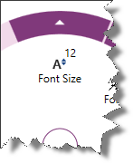
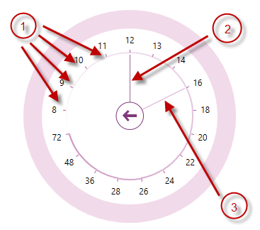

<!--
|metadata|
{
    "fileName": "igradialmenu-configuring-numeric-items",
    "controlName": "igRadialMenu",
    "tags": ["How Do I","Layouts"]
}
|metadata|
-->

# Configuring Numeric Items (igRadialMenu)

## Topic Overview
### Purpose

This topic explains the [`igRadialMenu`](%%jQueryApiUrl%%/ui.igRadialMenu#options)™ numeric items.

### Required background

The following topics are prerequisites to understanding this topic:

- [igRadialMenu Features](igRadialMenu-Features.html): This topic explains the features supported by the control from developer perspective.

- [igRadialMenu Visual Elements](igRadialMenu-Visual-Elements.html): This topic provides an overview of the visual elements of the control.

- [Items/Sub-Items Configuration Overview](igRadialMenu-Items-Sub-Items-Configuration-Overview.html): This topic explains in general the menu items and their common configuration properties.

- [Configuring Button Items](igRadialMenu-Configuring-Button-Items.html): This topic explains the `igRadialMenu`’s button items.

### In this topic

This topic contains the following sections:

-   [Numeric Items Configuration Summary](#configuration)
-   [Numeric Item](#numeric-item)
-   [Numeric Gauge](#numeric-gauge)
-   [Related Content](#related-content)

## Numeric Items Configuration Summary
### Numeric items configuration summary chart

The `igRadialMenu` supports numeric items which allow the user to observe and set numerical values. Further details are available after the table.

Numeric items | Description| Represented by type
---|---|---
[Numeric Item](#numeric-item)|<ul><li>Displays a header text</li><li>Displays an icon</li><li>Displays the associated numeric value</li></ul>|numericitem
[Numeric Gauge](#numeric-gauge)|<ul><li>Displays a scale with the allowed values as ticks</li><li>Displays the current value</li><li>Displays the pending value</li></ul>|numericgauge

## Numeric Item
### Overview

In addition to the header text and icon provided by the button items, the numeric item has an associated numeric value Within/Over the icon.

The following screenshot shows a numeric item with associated value (12) over the icon:

### Property settings

The following table maps main configuration to the property settings that manage it.

In order to: |Use this options/event: | And:
---|---|---
Set/obtain item’s associated numeric value|`value`|Set or read its value
Get notified when the associated numeric value changes|`valueChanged`|Attach event handler to it

## Numeric Gauge
### Overview

The numeric gauge item is showing a numeric gauge with values (ticks) for the user to choose from. There are also needles indicating the current value and the pending value – the value the mouse is hovering.

The following screenshot shows a numeric gauge:

1.  Ticks
2.  Current value needle
3.  Pending value needle

### Property settings

The following table maps main configuration to the property settings
that manage it.

In order to: | Use this options/event: | And:
---|---|---
Set/obtain pending value| `pendingValue`|Set it to a value of type double
Get notified when the associated pending numeric value changes|`pendingValueChanged`|Attach event handler to it
Set/obtain ticks|`ticks`|Set it to a collection with ticks values
Set/obtain current value|`value`|Set it to a value of type double
Get notified when the associated numeric value changes|`valueChanged`|Attach event handler to it

## Related Content
### Topics

The following topics provide additional information related to this topic.

- [Configuring Color Items](igRadialMenu-Configuring-Color-Items.html): This topic explains the `igRadialMenu`’s color items.

### Samples

The following samples provide additional information related to this topic.

- [Numeric Items](%%SamplesUrl%%/radial-menu/numeric-items): This sample demonstrates how to define number items and gauge items.

 

 

