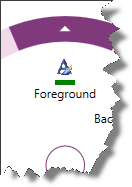
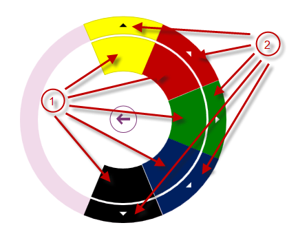
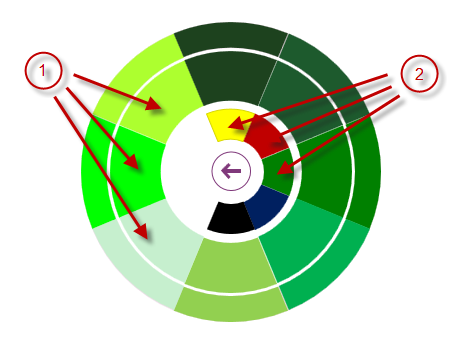

<!--
|metadata|
{
    "fileName": "igradialmenu-configuring-color-items",
    "controlName": "igRadialMenu",
    "tags": ["How Do I","Layouts"]
}
|metadata|
-->

# Configuring Color Items (igRadialMenu)

## Topic Overview
### Purpose

This topic explains the [`igRadialMenu`](%%jQueryApiUrl%%/ui.igRadialMenu#options)™ color items.

### Required background

The following topics are prerequisites to understanding this topic:

- [igRadialMenu Features](igRadialMenu-Features.html): This topic explains the features supported by the control from developer perspective.

- [igRadialMenu Visual Elements](igRadialMenu-Visual-Elements.html): This topic provides an overview of the visual elements of the control.

- [Items/Sub-Items Configuration Overview](igRadialMenu-Items-Sub-Items-Configuration-Overview.html): This topic explains in general the menu items and their common configuration properties.

- [Configuring Button Items](igRadialMenu-Configuring-Button-Items.html): This topic explains the `igRadialMenu`’s button items.

### In this topic

This topic contains the following sections:

-   [Color Items Configuration Summary](#configuration)
-   [Color Item](#color-items)
-   [Color Well](#color-well)
-   [Related Content](#related-content)

## Color Items Configuration Summary
### Color items configuration summary chart

The `igRadialMenu` supports color items which allow the user to observe and set color values. Further details are available after the table.

<table class="table">
	<thead>
		<tr>
            <th>
Color items
			</th>

            <th>
Description
			</th>

            <th>
Represented by type
			</th>
        </tr>
	</thead>
	<tbody>
        

        <tr>
            <td>
[Color Item](#color-items)
			</td>

            <td>
                <ul>
                    <li>
Displays a header text
					</li>

                    <li>
Displays an icon
					</li>

                    <li>
Displays the associated color
					</li>
                </ul>
            </td>

            <td>
`coloritem`
			</td>
        </tr>

        <tr>
            <td>
[Color Well](#color-well)
			</td>

            <td>
                <ul>
                    <li>
Displays the associated color in both the item area and outer ring
					</li>
                </ul>
            </td>

            <td>
`colorwell`
			</td>
        </tr>
    </tbody>
</table>

## Color Item
### Overview

In addition to the header text and icon provided by the button items, the color item has an associated color rectangle.

The following screenshot shows a rectangle associated with the color green:

### Property settings

The following table maps main configuration to the property settings that manage it.

In order to: |Use this option/event:| And:
---|---|---
Set/obtain item’s associated color value|`color`|Sets or reads its value
Get notified when the associated color value changes|`colorChanged`|Attaches event handler to it

## Color Well
### Overview

The `igRadialMenu`’s color well displays the associated color in both the item area and the outer ring. When the user navigates to the sub-items of a color well, the parent color well and its siblings are displayed between the center button and the items area.

>**Note:** Clicking on a color well updates the direct parent color well or color item setting such that their color option is set to the color of the color well that was clicked.

The following screenshot shows color wells with sub-items rendered in different colors:

1.  Color wells in different colors (on the current level)
2.  Arrows indicating that there are sub-items, below these color wells

 
The following screenshot shows navigating to the sub-items of the parent green color well. The parent green color well and its siblings are shown between the center button and the items area:

1.  Color wells on the current level
2.  Parent color wells

### Property settings

The following table maps main configurations to the property settings that manage it.

In order to:| Use this option/event:| And:
---|---|---
Set/obtain item’s associated color value|`color`|Sets or reads its value
Get notified when the associated color value changes|`colorChanged`|Attaches event handler to it

## Related Content
### Topics

The following topics provide additional information related to this topic.

- [Configuring Numeric Items](igRadialMenu-Configuring-Numeric-Items.html): This topic explains the `igRadialMenu`’s numeric items.

### Samples

The following sample provides additional information related to this topic.

- [Color Items](%%SamplesUrl%%/radial-menu/color-items): This sample demonstrates how to define and use color items and color wells to allow color drilldown selection.

 

 

