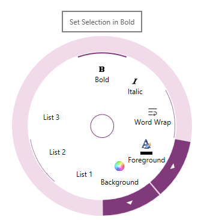

<!--
|metadata|
{
    "fileName": "igradialmenu-configuring-tooltips",
    "controlName": "igRadialMenu",
    "tags": ["How Do I"]
}
|metadata|
-->

# Configuring Tooltips (igRadialMenu)

## Topic Overview
### Purpose

This topic explains how to configure the [`igRadialMenu`](%%jQueryApiUrl%%/ui.igRadialMenu#options)™ items’ tooltips.

### Required background

The following topics are prerequisites to understanding this topic:

- [igRadialMenu Features](igRadialMenu-Features.html):This topic explains the features supported by the control from developer perspective.

- [igRadialMenu Visual Elements](igRadialMenu-Visual-Elements.html): This topic provides an overview of the visual elements of the control.

### In this topic

This topic contains the following sections:

-   [Introduction](#introduction)
-   [Tooltips Configuration Summary](#configuration)
-   [Related Content](#related-content)

## Introduction
### Tooltips summary

`igRadialMenu` tooltip is a small visual element shown outside of the menu when a user hovers over a menu item. The tooltip usually contains helpful user information that you can specify using the toolTip option. If tooltip’s message is not specified it is resolved based on the menu item type as shown in the table below:

Menu item type | Default tooltip content
---|---
Button item|The content of the header property (assuming it is not an element).
Numeric item|Color item
Gauge item|The pending value
Color well|The calculated color name

The following is a screenshot showing the `igRadialMenu` tooltip:

## Tooltips Configuration Summary
### Tooltips configuration summary chart

The following table briefly explains the main configurable aspects of the `igRadialMenu`’s tooltips.

Configurable aspect| Details |Options
---|---|---
Tooltip|Enable/Disable the item tooltip|`isToolTipEnabled`
Item Tooltip’s content|Set/Obtain the item tooltip content|`toolTip`

## Related Content
### Topics

The following topics provide additional information related to this topic.

- [igRadialMenu Configuration Overview](igRadialMenu-Configuration-Overview.html): This topic explains how to configure the `igRadialMenu` control.

- [Configuring the Center Button](igRadialMenu-Configuring-Center-Button.html): This topic explains how to configure the Center Button.

 

 

