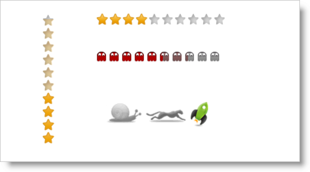

<!--
|metadata|
{
    "fileName": "igrating-overview",
    "controlName": "igRating",
    "tags": ["Getting Started"]
}
|metadata|
-->

# igRating Overview


## About jQuery Rating Control
The jQuery Rating control, or igRating, allows you to select and rate items from a given range of values. Although it seems like a simple control, igRating is very flexible. It has a rich API that allows you to change its appearance and behavior, so you can respond to client actions and change control dynamically. This topic lists all the features and illustrates how to create a simple igRating control.

The jQuery Rating control is part of the Ignite UI packet, which contains client-side-only controls. This gives the developer the flexibility to choose from several implementation options when developing using the jQuery Rating. The rating control exposes a rich jQuery API that can be configured without the use of any specific server back end. Also, developers using the Microsoft® ASP.NET MVC framework can leverage the rating’s server-side wrapper to configure the control with their .NET™ language of choice.

The jQuery Rating allows itself to be styled, providing a different look and feel to the control. Styling the jQuery Rating provides a consistent appearance across supported browsers. The jQuery Rating can utilize your existing style sheets and can be styled using the jQuery UI’s ThemeRoller.



## Features
-   jQuery Rating can be either vertical or horizontal
-   Direction of selection can be right-to-left and vice versa, or top-to-bottom and vice versa
-   Selectable custom count of items
-   Able to change the precision level during selecting and on hovering
-   Shows decimal places
-   Has overall theme support
-   Can set individual style for the different items
-   Has keyboard support
-   Validation
-   JavaScript Client API

## Adding jQuery Rating to a Web Page
The following steps demonstrate how to create a basic implementation of the jQuery Rating on a webpage using either jQuery client code or ASP.NET MVC server code.

To read about which implementation to choose, see [Ignite UI Overview](NetAdvantage-for-jQuery-Overview.html). The following screenshot shows the default Rating view.


[Basic Usage](%%SamplesUrl%%/rating/basic-usage)

1.  To get started, include the required and localized resources for your project or website. Details on which resources to include can be found in the [Using JavaScript Resources in Ignite UI](Deployment-Guide-JavaScript-Resources.html) help topic.
2.  On your HTML page or ASP.NET MVC View, reference the required JavaScript files, CSS files, and ASP.NET MVC assemblies.

    ###Client Code

    **In HTML:**

    ```html
    <link type="text/css" href="/css/themes/infragistics/infragistics.theme.css" rel="stylesheet" />
    <link type="text/css" href="/css/structure/infragistics.css" rel="stylesheet" />
    <script type="text/javascript" src="/Scripts/jquery-1.4.4.min.js"></script>
    <script type="text/javascript" src="/Scripts/jquery-ui.min.js"></script>
    <script type="text/javascript" src="/Scripts/Samples/infragistics.core.js"></script><script type="text/javascript" src="/Scripts/Samples/infragistics.lob.js"></script>
    ```

    ###Server Code

    **In ASPX:**

    ```csharp
    <%@ Import Namespace="Infragistics.Web.Mvc" %>

    <link type="text/css" href="<%= Url.Content("~/css/themes/infragistics/infragistics.theme.css") %>" rel="stylesheet" />
    <link type="text/css" href="<%= Url.Content("~/css/structure/infragistics.css") %>" rel="stylesheet" />

    <script type="text/javascript" src="<%= Url.Content("~/Scripts/jquery-1.4.4.min.js") %>"></script>
    <script type="text/javascript" src="<%= Url.Content("~/Scripts/jquery-ui.min.js") %>"></script>
    <script type="text/javascript" src="<%= Url.Content("~/Scripts/Samples/infragistics.core.js") %>"></script><script type="text/javascript" src="<%= Url.Content("~/Scripts/Samples/infragistics.lob.js") %>"></script>
    ```

    **In Razor:**

    ```csharp
    @using Infragistics.Web.Mvc;

    <link type="text/css" href="@Url.Content("~/css/theme/infragistics/infragistics.theme.css")" rel="stylesheet" />
    <link type="text/css" href="@Url.Content("~/css/structure/infragistics.css")" rel="stylesheet" />

    <script type="text/javascript" src="@Url.Content("~/Scripts/jquery-1.4.4.min.js")"></script>
    <script type="text/javascript" src="@Url.Content("~/Scripts/jquery-ui.min.js")"></script>
    <script type="text/javascript" src="@Url.Content("~/Scripts/Samples/infragistics.core.js")"></script><script type="text/javascript" src="@Url.Content("~/Scripts/Samples/infragistics.lob.js")"></script>
    ```

3.  For jQuery implementations, define a div as the target element in HTML. This step is optional for ASP.NET MVC implementations.

    ###Client Code

    **In HTML:**

    ```html
    <div id="igRating1"></div>
    ```

4.  Once the above setup is complete, begin to set options including ID, vote height, precision, and value presentation. Note that in ASP.NET MVC Views, the Render method must be called after all other options are set.

    ###Client Code

    **In jQuery:**

    ```js
    <script type="text/javascript">
        $("#igRating1").igRating({
            voteCount: 10,
            valueAsPercent: false,
            value: 4,
            precision: "exact"
        });
    </script>
    ```

    ###Server Code

    **In ASPX:**

    ```csharp
    <%= Html.Infragistics().Rating()
        .ID("igRating1")
        .VoteCount(10)
        .ValueAsPercent(false)
        .Value(4)
        .Precision(RatingPrecision.Exact)
        .Render() %>
    ```

    **In Razor:**

    ```csharp
    @(  Html.Infragistics().Rating()
        .ID("igRating1")
        .VoteCount(10)
        .ValueAsPercent(false)
        .Value(4)
        .Precision(RatingPrecision.Exact)
        .Render() 
    )
    ```

5.  Run the web page and you will get the basic Rating control.

## Related Links
-   [Basic Usage](%%SamplesUrl%%/rating/basic-usage)
-   [Ignite UI Overview](NetAdvantage-for-jQuery-Overview.html)
-   [Using JavaScript Resources in Ignite UI](Deployment-Guide-JavaScript-Resources.html)

 

 


