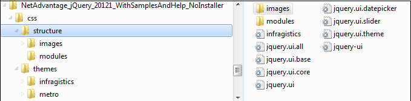
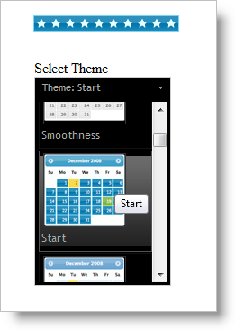
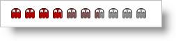
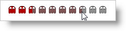

<!--
|metadata|
{
    "fileName": "igrating-styling-and-theming",
    "controlName": "igRating",
    "tags": ["Styling","Theming"]
}
|metadata|
-->

# Styling and Theming (igRating)

The `igRating` control, %%ProductName%%™ rating control, supports custom styling and theming which allows you to have full control over the look and feel of the rating experience. If no custom styles are applied to the control, then the default styling is applied to the control.

The examples in this topic include implementations in both jQuery/HTML implementations as well as in Microsoft™ ASP.NET™ MVC.

### Required CSS and Themes

The %%ProductName%%™ rating, like other jQuery widgets, utilizes the jQuery UI CSS Framework for styling. Included in %%ProductName%% are custom jQuery UI themes called Infragistics and Metro. These themes provide a professional and attractive design to all Infragistics and standard jQuery UI widgets.

In addition to the Infragistics and Metro themes, there is a structure directory, which is required for the basic CSS layout of the Infragistics widgets.

### Adding Required Themes to a Website

The Infragistics and Metro themes are located in the installed directory within the css folder. To add the themes to your application, copy the whole css folder (including structure and themes directories) into your site’s location.

>**Note:** When using Infragistics Loader, the folder structure must be preserved. Thus the loader will work as expected. If some of the themes are not used they can be deleted, but the structure should remain the same.

**Figure 1: Included theme folders upon product install**



### Infragistics and Metro Themes

The Infragistics Theme is a custom theme which includes all of the styles typically found in a jQuery UI theme. This theme may be replaced by a different theme but for the jQuery widgets to display correctly a reference to file `{IG Resources root}/css/structure/infragistics.css` is required.

Metro theme is implementation of the clean, modern and fast Metro design language. It has the same requirements for `{IG Resources root}/css/structure/infragistics.css` like Infragistics theme.

When using a theme other than the Infragistics (or Metro) theme, the `igRating` has some additional styling points that may need customization to achieve a complete design (depending on the `igRating`’s enabled features and theme).

The `igRating` control requires having a link to the stylesheet of a standard jQuery UI theme. For the IG Theme, you must include reference to the theme’s stylesheet in the page:

### Listing 1: Manual CSS reference to Infragistics theme

**In HTML:**

```html
<link href="css/themes/infragistics/infragistics.theme.css" rel="stylesheet" type="text/css" />
<link href="css/structure/modules/infragistics.ui.rating.css" rel="stylesheet" type="text/css" />
```

### Listing 2: CSS reference to Infragistics theme in ASP.NET MVC

**In HTML:**

```html
<%@ Import Namespace="Infragistics.Web.Mvc" %>
<!DOCTYPE html>
<html>
<head runat="server">
<link href="<%= Url.Content("~/css/themes/infragistics/infragistics.theme.css") %>” rel="stylesheet"                                                                       type="text/css" />
<link href="<%= Url.Content("~/css/structure/modules/infragistics.ui.rating.css") %>” rel="stylesheet"                                                                       type="text/css" />
```

### Metro Theme

The Metro Theme is referenced after the jQuery Theme. The following stylesheets are required when using the `igRating` control:

### Listing 3 : Manual CSS reference to the Metro theme

**In HTML:**

```html
<link href="css/themes/metro/infragistics.theme.css " rel="stylesheet" type="text/css" />
<link href="css/structure/modules/infragistics.ui.rating.css" rel="stylesheet" type="text/css" />
```

### Listing 4 : CSS reference to the Metro theme in ASP.NET MVC

**In HTML:**

```html
<%@ Import Namespace="Infragistics.Web.Mvc" %>
<!DOCTYPE html>
<html>
<head runat="server">
<link href="<%= Url.Content("~/css/themes/metro/infragistics.theme.css ") %>” rel="stylesheet"                                                                       type="text/css" />
<link href="<%= Url.Content("~/css/structure/modules/infragistics.ui.rating.css") %>” rel="stylesheet"                                                                       type="text/css" />
```

## About Rating Style Architecture

When the control is rendered, the HTML contains one main DIV element. Inside the main element are three different DIV elements used for the following rating states:

-   Normal
-   Hover
-   Selected

Each of these DIV elements contains HTML span elements that represent a single vote item. Table 1 represents the classes applied to each one of the HTML elements. These items listed are the classes to create CSS styles when creating a custom appearance of the rating control.

## Table 1: List of CSS classes

Group of classes| List of CSS classes applied to the element| Area where CSS classes are applied
---|---|---
`normal`|ui-igrating ui-state-default ui-widget-content|Classes applied to the DIV container element
`hover`|ui-igrating-hover ui-state-hover|Classes applied to the container of hover votes
`active`|ui-igrating-active|Classes applied to the DIV container element when widget has focus
`selected`|ui-igrating-selected ui-state-highlight|Classes applied to the container of selected votes
`vote`|ui-igrating-vote ui-icon ui-icon-star|Classes applied to the SPAN element of a vote
`voteSelected`|ui-igrating-voteselected|Classes applied to the SPAN element of a vote in selected state
`voteDisabled`|ui-igrating-votedisabled ui-state-disabled|Classes applied to the SPAN element of a vote in disabled state
`voteHover`|ui-igrating-votehover|Class applied to the SPAN element of a vote in hover state
`voteDisabledSelected`|ui-igrating-votedisabledselected|Classes applied to the SPAN element of a vote in selected state when widget is disabled

## Using jQuery UI Theme Roller
The easiest way for you to apply different appearances to the jQuery Rating control is to use the jQuery UI tool, [Theme Switcher](http://docs.jquery.com/UI/Theming/ThemeSwitcher). The rating itself has CSS classes that are integrated with this tool. What you need to do is include the script for the tool and attach the Theme Roller tool to a HTML DIV element:

**Listing 1: Using Theme Switcher to change themes in HTML**

**In HTML:**

```html
<script type="text/javascript" src="/Scripts/themeswitchertool.js"></script>
<script type="text/javascript">
$(window).load(function () {
    $("#igRating1").igRating({ voteCount: 10, value: 0.4 });
    $('#ThemeRoller').themeswitcher();
});
</script>

<div id="igRating1"></div>
<div>
    <label>Select theme</label>
    <div id="ThemeRoller"></div>
</div>
```

**Listing 2: Using Theme Switcher to change themes in ASP.NET MVC**

**In ASPX:**

```csharp
<script type="text/javascript" 
        src="<%= Url.Content("~/Scripts/themeswitchertool.js") %>"></script>
<script type="text/javascript" language="javascript">
    $(window).load(function () {
        $('#ThemeRoller').themeswitcher();
    });
</script>

<%= Html.Infragistics().Rating()
    .ID("igRating1")
    .VoteCount(10)
    .ValueAsPercent(true)
    .Value(0.4)
    .Render() %>
<div>
    <label>Select Theme</label>
    <div id="ThemeRoller"></div>
</div>
```

Now all the themes available in the theme roller will be available for the jQuery Rating control.



## Using ‘theme’ Property
While Theme Switcher allows you to change only basic classes, when you use the `igRating` control’s property ‘theme’ you can also change the background images of the vote items. Using this approach you are able to modify the entire appearance because you are changing the underling CSS rules applied to the control (as defined in Table 1).

>**Note:** When creating the CSS styles for a theme, be careful to prefix the styles with the base class name to each style rule as shown in Listing 3.

The following examples demonstrate how to create a custom theme. Listing 3 shows the full definition of a custom theme for `igRating`.

**Listing 3: Define a theme in CSS**

**In CSS:**

```css
<style type="text/css">
    .theme1 .ui-igrating { }
    .theme1 .ui-igrating-active { }
    .theme1 .ui-igrating-hover { }
    .theme1 .ui-igrating-vote 
    { 
        width: 20px; 
        height: 20px; 
        background: transparent url(images/ig-rating-red.png) no-repeat; 
        background-position: -75px 0; 
    }
    .theme1 .ui-igrating-voteselected 
    { 
        background: transparent url(/images/ig-rating-red.png) no-repeat; 
        background-position: 0 0; 
    }
    .theme1 .ui-igrating-votehover 
    { 
        background: transparent url(/images/ig-rating-red.png) no-repeat; 
        background-position: -25px 0; 
        filter: alpha(opacity=40); 
        opacity: 0.4; 
    }
    .theme1 .ui-igrating-votedisabled 
    { 
        background: transparent url(images/ig-rating-red.png) no-repeat; 
        background-position: -100px 0; 
    }
    .theme1 .ui-igrating-votedisabledselected 
    { 
         background: transparent url(images/ig-rating-red.png) no-repeat; 
         background-position: -50px 0; 
    }
</style>
```

**Listing 4** demonstrates how to markup and instantiate the rating control in a jQuery/HTML scenario, while **Listing 5** shows you how to create the rating control using the ASP.NET MVC wrapper.

**Listing 4: Create the markup and associated script in HTML**

**In HTML:**

```html
<script type="text/javascript" language="javascript">
$(window).load(function () {
    $("#igRating1").igRating({
        voteCount: 10,
        value: 0.5,
        theme: 'theme1'
    });
});
</script>
<div id="igRating1"></div>
```

**Listing 5: Instantiating rating control in ASP.NET MVC**

**In ASPX:**

```csharp
<%= Html.Infragistics().Rating()
    .ID("igRating1")
    .VoteCount(10)
    .Value(0.5)
    .Theme("theme1")
    .Render()%>
```

>**Note:** This sample uses CSS sprites. All the images for the different states are combined into one image and only the background position is modified.



## Using ‘cssVotes’ Property
When you are using the theme property you are setting the same background image for all the items. If you want all the votes to have different styles you can use the `cssVotes` property. The value of `cssVotes` can be set as an object of objects or as a two dimensional array. When the first option is used, you are defining the `cssVotes` object in the following way:

Listing 6: Creating a custom vote style map using a JSON array

**In ASPX:**

```csharp
var customCss1 = 
{
   0: { 0: 'normal0', 1: 'selected0', 2: 'hovered0' },
   1: { 0: 'normal1', 1: 'selected1', 2: 'hovered1' },
   2: { 0: 'normal2', 1: 'selected2', 2: 'hovered2' }
};
```

As you can see, each of the objects has three properties which map to CSS classes for various states of the rating item:

-   0 is for the normal state
-   1 is for the selected state
-   2 is for the hovered state

    You can achieve the same effect when you use the following array:

**Listing 7: Creating a custom style map using a JavaScript array**

**In jQuery:**

```js
var customCss1 = 
[
   [ 'normal0', 'selected0', 'hovered0' ],
   [ 'normal1', 'selected1', 'hovered1' ],
   [ 'normal2', 'selected2', 'hovered2' ]
];
```

Note that when a JavaScript array is used the sequence of the states is very important – first the normal state, and then the selected and hovered states. You are given the chance to choose which method is more appropriate for your case. After you create the JSON or JavaScript array then must define the classes for every one of the items:

**Listing 8: Create individual vote styles in CSS**

**In CSS:**

```css
<style type="text/css">
  .normal0 { background: transparent url(normal0.png) no-repeat; }
  .normal1 { background: transparent url(normal1.png) no-repeat; }
  .normal2 { background: transparent url(normal2.png) no-repeat; }
  .selected0 { background: transparent url(selected0.png) no-repeat; }
  .selected1 { background: transparent url(selected1.png) no-repeat; }
  .selected2 { background: transparent url(selected2.png) no-repeat; }
  .hovered0 { background: transparent url(hovered0.png) no-repeat; }
  .hovered1 { background: transparent url(hovered1.png) no-repeat; }
  .hovered2 { background: transparent url(hovered2.png) no-repeat; }
</style>
```

Finally, pass the ‘cssVotes1’ object or array to the Rating property:

**Listing 9: Apply custom vote styles to the rating control in HTML**

**In HTML:**

```html
$("#igRating1).igRating({
    cssVotes: customCss1
});

<div id="igRating1"></div>
```

When the igRating ASP.NET MVC wrapper is used you can directly set the classes for every one of the items (which means you don’t need to define JSON array or JavaScript array). The wrapper is doing the job behind the scenes.

**Listing 10: Apply custom styles to the rating control in ASP.NET MVC**

**In ASPX:**

```csharp
<%= Html.Infragistics().Rating()
    .CssVotes(c => 
    {
        c.AddVoteCSS().ItemIndex(0).EmptyCss("normal0").
                        SelectedCss("selected0").HoverCss("hovered0");
                                                                                          
        c.AddVoteCSS().ItemIndex(1).EmptyCss("normal1").
                        SelectedCss("selected1").HoverCss("hovered1");
 
       c.AddVoteCSS().ItemIndex(2).EmptyCss("normal2").
                        SelectedCss("selected2").HoverCss("hovered2");
    })
    .Render()
%>
```

## Conclusion
This topic demonstrates how to style individual items as well as the entire `igRating` control. The flexibility of the control is revealed when you can create custom CSS rules at every level of the control. For example, a half-colored vote item effect is achieved by setting the opacity CSS rule in your custom styles. When opacity is used on the hovered state the control exposes transparent items when the user hovers over the rating control:



## External References
-   [jQuery UI](http://jqueryui.com/)
-   [jQuery UI - Getting Started](http://docs.jquery.com/UI/Getting_Started)
-   [jQuery Themeroller](http://jqueryui.com/themeroller/)
-   [Theming jQuery UI](http://docs.jquery.com/UI/Theming)
-   [jQuery UI CSS Framework](http://docs.jquery.com/UI/Theming/API)

## Related Links
-   [Custom Styles](%%SamplesUrl%%/rating/custom-styles) 
-   [Using JavaScript Resources in %%ProductName%%](Deployment-Guide-JavaScript-Resources.html)

 

 


