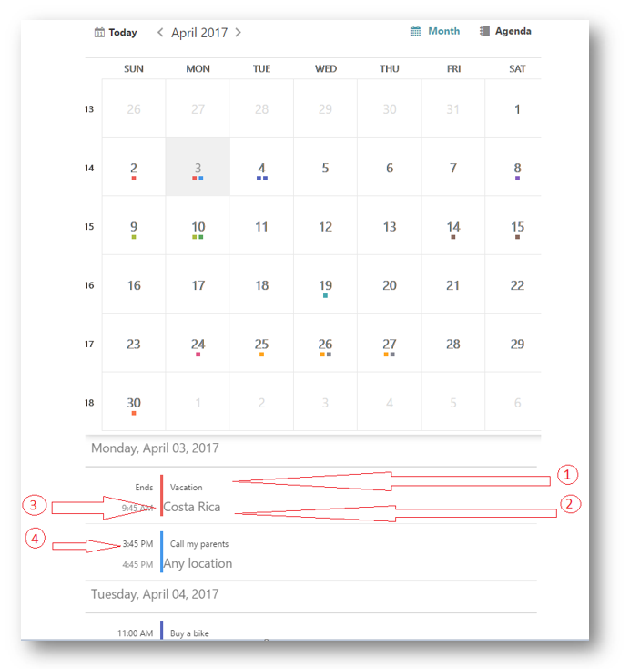
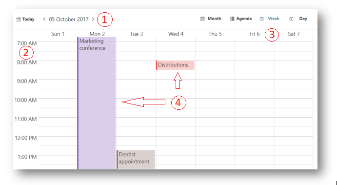
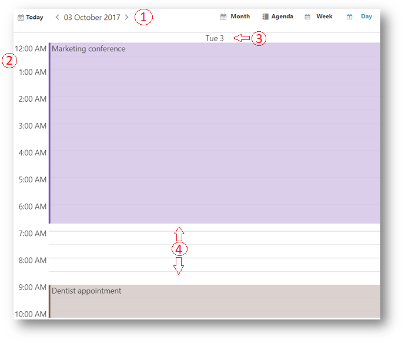

<!--
|metadata|
{
    "fileName": "igScheduler-overview",
    "controlName": "igScheduler",
    "tags": ["Editing","Getting Started"]
}
|metadata|
-->

# igScheduler Overview

## Topic Overview

### Purpose

This topic provides conceptual information for the `igScheduler`™ control including information regarding: features, configuration, requirements and theming.

### In this topic

This topic contains the following sections:

- [Minimum Requirements](#minimum-requirements)

- [Main Features](#main-features)
    - [Views](#views)
        - [Agenda View](#agenda-view)
        - [Month View](#month-view)
        - [Week View](#week-view)
        - [Day View](#day-view)
    - [Activities](#activities)
        - [Appointments](#appointments)

- [Binding to Data Sources](#binding-to-data-source)

- [Related topics](#related-topics)

### Required background

The table below lists the required background you need for fully understanding the information in this topic.

**Topics**

You need to first read the following topics:

-	[%%ProductName%% Overview](NetAdvantage-for-jQuery-Overview.html)

-	[Using JavaScript Resources in %%ProductName%%](Deployment-Guide-JavaScript-Resources.html)

-	[Styling and Theming in %%ProductName%%](Deployment-Guide-Styling-and-Theming.html)


**External Resources**

You need to first read the following article: [Working with jQuery Widgets](http://learn.jquery.com/jquery-ui/getting-started/)

## <a id="minimum-requirements"></a>Minimum Requirements

### Introduction

The `igScheduler` control is a jQuery UI Widget and therefore is dependent upon the jQuery core and jQuery UI JavaScript libraries. In addition, there are several %%ProductName%%™ JavaScript resources that the `igScheduler` control uses for shared functionality and data binding. These JavaScript references are required whether the `igScheduler` control is used in a pure JavaScript context.

### Requirements

The table below lists the requirements for the `igScheduler` control.

<table class="table">
	<thead>
		<tr>
			<th>Requirement</th>
			<th>Description</th>
		</tr>
	</thead>
	<tbody>
		<tr>
			<td>jQuery and jQuery UI JavaScript resources</td>
			<td>%%ProductName%% is built on top of these frameworks:
				<ul>
					<li>[jQuery](http://jquery.com) (The required jQuery version for igScheduler is 1.8.3)</li>
					<li>[jQuery UI](http://jqueryui.com/) (The required jQuery UI version for igScheduler is 1.9.2)</li>
				</ul>
			</td>
		</tr>
		<tr>
			<td>Shared %%ProductName%% JavaScript resources</td>
			<td>There are several shared JavaScript resources in %%ProductName%% that most widgets use:
				<ul>
					<li>infragistics.util.js</li>
					<li>infragistics.util.jquery.js</li>
				</ul>
			</td>
		</tr>
		<tr>
			<td>igDataSource JavaScript Resources</td>
			<td>The igScheduler uses the igDataSource for data operations:
				<ul>
					<li>infragistics.dataSource.js</li>
				</ul>
			</td>
		</tr>
		<tr>
			<td>igScheduler JavaScript resources</td>
			<td>The JavaScript file for the igScheduler widget:
				<ul>
					<li>infragistics.ui.scheduler.js</li>
				</ul>
			</td>
		</tr>
		<tr>
			<td>IG Theme</td>
			<td>This theme contains custom visual styles created especially for %%ProductName%%</td>
		</tr>
		<tr>
			<td>Base Theme</td>
			<td>The base theme contains styles that primarily define the form and function for each widget.</td>
		</tr>
	</tbody>
</table>

## <a id="main-features"></a>Main Features

### Features overview

The table below briefly explains the main features of the `igScheduler`.

<table class="table">
    <tbody>
        <tr>
            <th>Feature</th>
            <th>Description</th>
        </tr>
        <tr>
            <td>Views</td>
            <td>Тhe igScheduler can be configured to use agenda, month, week or day view, together and separately.</td>
        </tr>
        <tr>
            <td>Activities</td>
            <td>The activities are used to represent an event which start at a specific time and ends at a specific time</td>
        </tr>
    </tbody>
</table>

### <a id="views"></a>Views

The `igScheduler` control can be configured to present calendar information in different ways called "views". The view type can be configured using `views` and `viewMode` options.

```js
$("#scheduler").igScheduler({
    height: "100%",
    width: "100%",
    views: ["month", "agenda", "week", "day"],
    viewMode: "monthView"
});
```


#### <a id="agenda-view"></a>Agenda View
The agenda view of the `igScheduler` is visualizing the activities which occur during a specific time range. Activities are presented in the agenda view with their subject, location and times. If an activity has a resource associated with it and the resource has a color scheme set, this color will be used for drawing the vertical separator between the activity’s time and activity’s subject.

The following image shows the agenda view along with its visual elements:


1. Day Header

2. Activity subject

3. Activity location

4. Separator drawn using the associated resource’s color

5. Activity start time (available if the activity is starting during the particular day)

6. Activity end time (available if the activity is ending during the particular day)

#### <a id="month-view"></a>Month View
The month view of the `igScheduler` is visualizing the days of an entire month. Each day is represented by a cell which may contain up to three activities. The month view also has the concept of the "selected day" which is displayed using different styling (foreground color, background color, font size or font style).

The following screenshot shows the month view along with its visual elements:


1. Month header (containing current month and year)

2. Day of week header

3. Week number

4. Leading days (from previous month)

5. Trailing days (from next month)

6. Current day (displayed with different style)

7. Activity indicators. There indicators are rendered on days occupied with activities. Up to three activities indicators are rendered. The indicators are using the color set on the associated resource.

8. Current month days


The following screenshot shows the month view combined with agenda view with its visual elements:



1. Activity’s subject

2. Activity’s location

3. The resource’s color associated with this activity

4. The time associated with this activity

#### <a id="week-view"></a>Week View

The Week View of the `igScheduler` is visualizing all seven week days based on the currently selected day. This view contains time-slot segments with same length and different height based on the time range of the appointment.


The following screenshot shows the Week View along with its visual elements:

1. Navigation Header

2. Time slots

3. Day headers

4. Activities in the time slots



The following properties could be used in order to configure different week view aspects and behaviors:

-	`weekViewDisplayMode` - Display mode. The week view can be configured to show all 7 week days or only the days configured as working days.

-	`timeSlotInterval` - Time slot duration. Configure the time slots' duration. Currently 5, 6, 10, 15, 30 and 60 minutes are supported.

-	`workingHoursDisplayMode` - Working days and hours. You can configure this view to display only working hours or all 24 hours.

#### <a id="day-view"></a>Day View

Shows hour-based view of the selected day, the hours are listed vertically going from top to bottom. This view contains time-slot segments with same length and different height based on the time range of the appointment.

The following screenshot shows the Day View along with its visual elements:

1. Navigation Header

2. Time slots

3. Day headers

4. Activities in the time slots



The following properties could be used in order to configure different day view aspects and behaviors:

-	`dayViewDisplayMode` - Visible days. You can control how many days are visible at a time in the day view. Currently between 1 and 7 days are supported.

-	`timeSlotInterval` - Time slot duration. Configure the time slots' duration. Currently 5, 6, 10, 15, 30 and 60 minutes are supported.

-	`workingHoursDisplayMode` - Working days and hours. You can configure this view to display only working hours or all 24 hours.
#### Topics

-	[Adding igScheduler](igscheduler-adding-igscheduler.html)

#### Related Sample

-   [igScheduler Agenda View](%%SamplesUrl%%/scheduler/agenda-view)

### <a id="activities"></a>Activities

This section provide information about the activities concept of the igScheduler control.

The activities are used to represent an event which start at a specific time and ends at a specific time.


## <a id="appointments"></a>Appointments

Activities occur during a range of time with a duration of several hours, several days or even more.

The following table lists the Appointment's key properties and their purpose:

<table class="table">
	<thead>
		<tr>
			<th>Field</th>
			<th>Purpose</th>
		</tr>
	</thead>
	<tbody>
		<tr>
			<td>Subject</td>
			<td>Used as short description of the activity, it is the main information shown in the control’s views and therefore used to distinguish a specific activity amongst the other activities.
			</td>
		</tr>
        <tr>
			<td>Location</td>
			<td>Used to store the location where the activity takes place.
			</td>
		</tr>
        <tr>
			<td>From</td>
			<td>
            Contains the start date and time of the activity.
			</td>
		</tr>
        <tr>
			<td>To</td>
			<td>Contains the end date and time of the activity.
			</td>
		</tr>
        <tr>
			<td>Resource</td>
			<td>
            Used to obtain the resource associated with the current activity. Color scheme is used to highlight the activities associated with this resource.
			</td>
		</tr>
        <tr>
			<td>Description</td>
			<td>
            Provide more information about the appointment.
			</td>
		</tr>
	</tbody>
</table>


#### Related Sample
-   [igScheduler Agenda View](%%SamplesUrl%%/scheduler/appointment-indicators)


## <a id="binding-to-data-source"></a>Binding to Data Sources


### Binding to data sources overview

The `dataSource` and `resources` options of the `igScheduler` are required for the data binding. Each option need to be assigned an array that is holding the corresponding appointments or resources collection.
Please refer to the [Configure appointments](igscheduler-configure-appointments.html) and [Configure resources](igscheduler-configure-resources.html) topics for a more detailed overview.

## <a id="related-topics"></a>Related Topics


Following are some other topics you may find useful.

-   [%%ProductName%% Overview](NetAdvantage-for-jQuery-Overview.html)

-   [Using JavaScript Resources in %%ProductName%%](Deployment-Guide-JavaScript-Resources.html)

-   [Styling and Theming in %%ProductName%%](Deployment-Guide-Styling-and-Theming.html)

-   [igScheduler Overview](igScheduler-Overview.html)

-   [Configuring igScheduler](igscheduler-configuring.html)

-   [Configuring Appointments](igscheduler-configure-appointments.html)

-   [Configuring Resources](igscheduler-configure-resources.html)

-	[Adding igScheduler](igscheduler-adding-igscheduler.html)

-	[Configuring igScheduler](igscheduler-Configuring.html)

-	[Styling igScheduler](igscheduler-using-themes.html)

-	[Accessibility Compliance (igScheduler)](igscheduler-accessibility-compliance.html)

-	[Known Issues and Limitations (igScheduler)](igscheduler-known-limitations.html)


