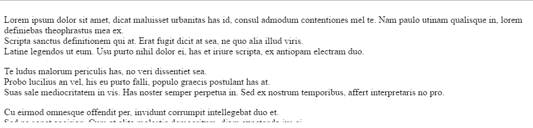
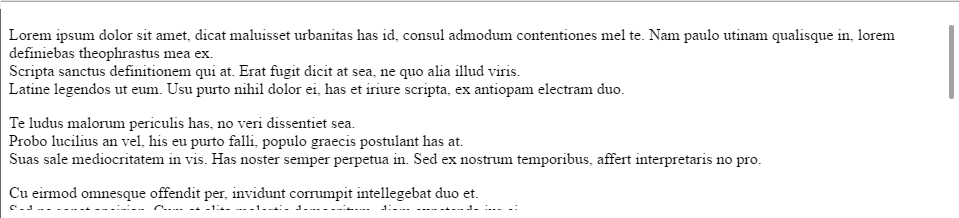
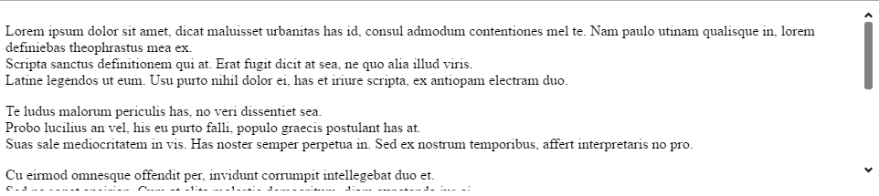
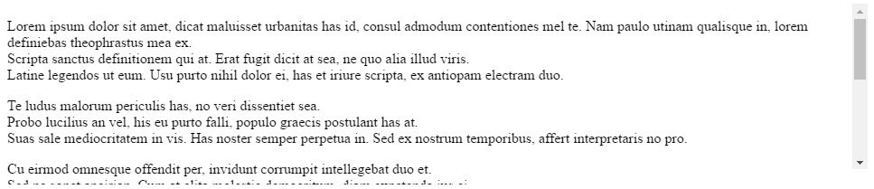
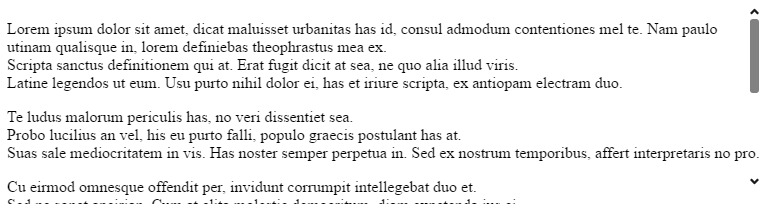
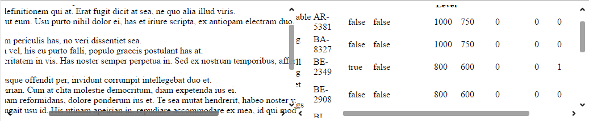

<!--
|metadata|
{
    "fileName": "igscroll-overview",
    "controlName": "igScroll",
    "tags": ["Getting Started","igScroll"]
}
|metadata|
-->

# igScroll Overview

### In this topic

This topic contains the following sections:

- [About igScroll](#about-igScroll)
- [Behavior and Visualization](#behavior-igScroll)
- [DOM structure](#structure-igScroll)
- [Adding igScroll to a Web Page](#adding-igScroll)
- [Scrolling multiple containers at once](#multi-scrolling)
- [Keyboard Interactions](#keyaboard-interactions)
- [Related Content](#related)


## <a id="about-igScroll"></a>  About igScroll
The igScroll is a stand-alone jQuery UI widget that allows enabling custom scrollbars with fluid scrolling functionality for desktop, hybrid and mobile environments.
It allows you to create a consistent scrolling experience across all scrolling containers on all devices. 
The igScroll allows specifying two different display types - native or custom, depending on whether you want the native scrollbars to be displayed or the custom ones. The option for setting this is the [`scrollbarType`](%%jQueryApiUrl%%/ui.igscroll#options:scrollbarType) option.

For the custom scrollbars there are 3 possible states for the scrollbars:

1. Hidden - the scrollbars are hidden when the user is not interacting in any way with the containers or the scrollbar.

	

2. Default (thin) scrollbars - the default (thin) scrollbars are displayed when the user is interacting with the scrollable content, for example when hovering the scrollable container or when using touch interactions. They have no horizontal or vertical arrows and are not interactable with mouse or touch.
   
	

3. Desktop (big) scrollbars - the desktop (big) scrollbars are displayed when the user hovers over the thin scrollbars. They're bigger than the default ones and have arrows buttons and can be interacted with via the mouse.
   
	   
	
	When the native scrollbars are enabled the default scrollbars for the specific browser and environment are displayed.
	
	
		
	The scrolling is still handled manually by the igScroll and can be configured via the igScroll's options.
   
	
## <a id="behavior-igScroll"></a> Behavior and Visualization

Different environments provide different visualizations and methods for scrolling. The igScroll supports all of the following types of environments:

1. Desktop – environment where can be scrolled by mouse moving a scrollbar, clicking on the arrows a scrollbar provides or by mouse scroll.

2. Mobile – environment on which can be performed only touch input (smartphones, tablets)

3. Hybrid – environment which supports both mouse input and touch input (desktop with touch monitor, Surface, laptop with touch monitor, etc.).

In this section we'll take a look at the environment specific visualizations and behaviors of the igScroll.

### igScroll on Mobile

For mobile devices the default (thin) scrollbars are used to visualize the scrollbars.
The way to scroll on mobile is via touch interactions. You can swipe in a direction to scroll the content in that direction and the scrollbar will be synced accordingly. 
There is inertia enabled by default, so the content will be scrolled initially fast and then the speed will gradually decrease and the scrolling will stop. This behavior can be further modified via the [`inertiaDuration`](%%jQueryApiUrl%%/ui.igscroll#options:inertiaDuration) option.

The scrollbars are displayed in the following scenarios:
- When the page loads initially 
	They'll be displayed for a short time to notify the users that the related areas are scrollable. After this, if the user does not further interact with them, they will hide.
- When the user touches or swipes on the scrollable content area
	They'll be displayed and will remain visible while the user interacts with the content. If the user stops interacting they will hide.
	
	

### igScroll on Desktop

For desktop both the thin and big scrollbars can be displayed. 
If you're interacting with the scrollable content (hovering, scrolling via the mouse wheel) the thin scrollbars will be displayed.

If you hover the actual scrollbar area the big scrollbars will be displayed and will allow you to further interact with them. 

The following elements of the big scrollbars are interactable:

- the arrow buttons 

	You can click them to scroll with a small increment or click and hold to scroll continuously in a direction.
- the track pad ( the areas between the thumb and arrow buttons).

	You can click on the track pad to scroll with a big increment in the related direction.
- the scroll's thumb element

	You can drag and drop the thumb in order to scroll the content. 

The big scrollbars will remain visible while you interact with them. Once you no longer interact, they will hide and only the thin scrollbars will be visible. While you're still hovering over the content the thin scrollbars will stay visible.
Once you're no longer interacting or hovering over the scrollable area all scrollbars will hide.

### igScroll on Hybrid

Since hybrid devices have both touch and mouse and keyboard support all interactions described for the above two sections (igScroll on Mobile and igScroll on Desktop) are valid for Hybrid devices as well.

## <a id="structure-igScroll"></a> DOM structure

The igScroll by default changes the DOM structure and applies some additional CSS classes in order to style the scrollbars.

Initially if the DOM has the following structure:

**In HTML:**

 ```html
<body>
	<div id='scrollContent' style='width:600px; height: 400px; overflow:hidden;'>
		<h1> Some Title </h1>
		<p> Paragraph </p>
		<table> ... </table>
		...
	</div>
</body>
 ```
 
 After initializing an igScroll on the div element ( $("#scrollContent").igScroll() ) the resulting DOM will look like this:
 
 ```html
<body>
	<div id="scrollContent" style="width:600px; height: 400px; overflow:hidden;" class="igscroll-scrollable">
      <div id="scrollContent_container" class="igscroll-container" style="width: 600px; height: 400px;">
          <div id="scrollContent_content" class="igscroll-content">
              <h1> Some Title </h1>
              <p> Paragraph </p>
              <table>...</table>
              ...
          </div>
      </div>
    </div>
</body>
 ```

 The DOM manipulation done by the igScroll can be disabled by setting the [`modifyDOM`](%%jQueryApiUrl%%/ui.igscroll#options:modifyDOM) property to false. 
 In that case you should build a similar DOM hierarchy in order for the igScroll to work as expected and initialize it on the content element, for example:

**In HTML:**

 ```html
<body>
<div>
   <div id='containerWrapper' style="width:600px; height:400px; overflow:hidden; position:relative;">
		<div id='scrContainer' style="width:600px; height:400px; overflow:hidden; position:absolute;">
			<div id='scrollContent' style="position:absolute;">
				  <h1> Some Title </h1>
				  <p> Paragraph </p>
				  <table>...</table>
				  ...
			</div>
		</div>
	</div>
</body>
 ```
 
 In this case the igScroll should be initialized on the "scrContainer" element, for example:
 
 **In JavaScript:**

```js
$(function () {
    $("#scrContainer").igScroll({
    modifyDOM: false
    });
});
```

## <a id="adding-igScroll"></a> Adding igScroll to a Web Page

The following steps demonstrate how to create a basic implementation of the igScroll widget on a web page using jQuery client code.

To get started, include the required and localized resources for your application. Details on which resources to include can be found in the [Using JavaScript Resources in Ignite UI](Deployment-Guide-JavaScript-Resources.html) help topic.

1.  On your HTML page, **reference the required JavaScript and CSS** files.

	**In HTML:**

	```html
	<script src="scripts/jquery.js" type="text/javascript"></script>
	<script src="scripts/jquery-ui.js" type="text/javascript"></script>
	<script src="scripts/infragistics.core.js" type="text/javascript"></script>
	<script src="scripts/infragistics.lob.js" type="text/javascript"></script>
	<link href="css/themes/infragistics/infragistics.theme.css" rel="stylesheet" type="text/css" />
	<link href="css/structure/infragistics.css" rel="stylesheet" type="text/css" />
	```

2. Next, create a simple scrollable area. For this example we'll create a simple div DOM element with some long text inside to allow scrolling.

	**In HTML:**

	```html
	<div id="scrollableContent" style="height:200px; width: 600px; overflow: hidden;">
		<div>
			<p>
			Lorem ipsum dolor sit amet, dicat maluisset urbanitas has id, consul admodum contentiones mel te. Nam paulo utinam qualisque         in, lorem definiebas theophrastus mea ex. <br/>
			Scripta sanctus definitionem qui at. Erat fugit dicit at sea, ne quo alia illud viris. <br/>
			Latine legendos ut eum. Usu purto nihil dolor ei, has et iriure scripta, ex antiopam electram duo. <br/>
			</p>
			Te ludus malorum periculis has, no veri dissentiet sea. <br/>
			Probo lucilius an vel, his eu purto falli, populo graecis postulant has at. <br/>
			Suas sale mediocritatem in vis. Has noster semper perpetua in. Sed ex nostrum temporibus, affert interpretaris no pro. <br/>
			<p>
			Cu eirmod omnesque offendit per, invidunt corrumpit intellegebat duo et. <br/>
			Sed ne sonet apeirian. Cum at clita molestie democritum, diam expetenda ius ei. <br/>
			In est sale tamquam reformidans, dolore ponderum ius et. Te sea mutat hendrerit, habeo noster vis ad. <br/>
			Quem feugiat feugait usu id. His utinam apeirian in, repudiare accommodare ex mea, id qui modo mazim eleifend. <br/>
			</p>
			Cum elitr ludus ut. Eu mel aliquando conceptam adolescens. <br/>
			Malis vitae labore vis ea, eam an error accumsan. <br/>
			Ceteros sapientem assentior mel at, graeco ancillae moderatius ea eum. <br/>
			Ei nam delenit admodum deterruisset. <br/>
			<p>
			Cum ad animal oblique, sensibus reprehendunt his te, quo ignota dictas no. <br/>
			Eu congue lucilius mei, has ei invenire platonem. Cu nonumy tamquam moderatius cum. <br/>
			At lucilius deterruisset vis, omnis minimum complectitur ea his. <br/>
			</p>
		</div>
	</div>
	```

3. Once the above setup is complete, you can initialize the igScroll widget on the scrollable area, with some options or with the default settings:
	
	**In JavaScript:**

	```js
	$(function () {
		$("#scrollableContent").igScroll({});
	});
	```

4. Run the web page. The igScroll is initialized and displays custom scrollbars.

     

## <a id="multi-scrolling"></a> Scrolling multiple containers at once

The igScroll allows linking multiple containers so that when one is scrolled the others will also be scrolled accordingly.
There are two options for specifying synced elements:
- [`syncedElemsV`](%%jQueryApiUrl%%/ui.igscroll#options:syncedElemsV) - Allows setting elements (could be html elements or jQuery elements) that will be linked to the main content container vertically. When the content is scrolled on the Yaxis, the linked elements will scroll up/down.
 
- [`syncedElemsH`](%%jQueryApiUrl%%/ui.igscroll#options:syncedElemsH) - 
 Allows setting elements (could be html elements or jQuery elements) that will be linked to the main content container horizontally. When the content is scrolled on the X axis, the linked elements will scroll left/right.

The following steps demonstrate how to create a basic implementation of the igScroll widget  which allows scrolling multiple containers at once.

Steps 

1. The same as the described in the [Adding igScroll to a Web Page](#adding-igScroll) section above. 

2. Add two scrollable containers.

	First one positioned on the left:

	**In HTML:**

	```html
	<div style="width: 50%; float:left; position: relative;">
		<div id='scrContainerLeft' style="height:200px; overflow: hidden;">	
			<div style="width:900px; height: 400px;">
				<p>
				Lorem ipsum dolor sit amet, dicat maluisset urbanitas has id, consul admodum contentiones mel te. Nam paulo utinam qualisque in, lorem definiebas theophrastus mea ex. <br/>
				Scripta sanctus definitionem qui at. Erat fugit dicit at sea, ne quo alia illud viris. <br/>
				Latine legendos ut eum. Usu purto nihil dolor ei, has et iriure scripta, ex antiopam electram duo. <br/>
				</p>
				Te ludus malorum periculis has, no veri dissentiet sea. <br/>
				Probo lucilius an vel, his eu purto falli, populo graecis postulant has at. <br/>
				Suas sale mediocritatem in vis. Has noster semper perpetua in. Sed ex nostrum temporibus, affert interpretaris no pro. <br/>
				<p>
				Cu eirmod omnesque offendit per, invidunt corrumpit intellegebat duo et. <br/>
				Sed ne sonet apeirian. Cum at clita molestie democritum, diam expetenda ius ei. <br/>
				In est sale tamquam reformidans, dolore ponderum ius et. Te sea mutat hendrerit, habeo noster vis ad. <br/>
				Quem feugiat feugait usu id. His utinam apeirian in, repudiare accommodare ex mea, id qui modo mazim eleifend. <br/>
				</p>
				Cum elitr ludus ut. Eu mel aliquando conceptam adolescens. <br/>
				Malis vitae labore vis ea, eam an error accumsan. <br/>
				Ceteros sapientem assentior mel at, graeco ancillae moderatius ea eum. <br/>
				Ei nam delenit admodum deterruisset. <br/>
				<p>
				Cum ad animal oblique, sensibus reprehendunt his te, quo ignota dictas no. <br/>
				Eu congue lucilius mei, has ei invenire platonem. Cu nonumy tamquam moderatius cum. <br/>
				At lucilius deterruisset vis, omnis minimum complectitur ea his. <br/>
				</p>
			</div>
		</div>
	</div>
	```
	And second positioned on the right:

	**In HTML:**

	```html
	<div style="width: 50%; float:right; position: relative;" >
		<div id="scrContainerRight" style="height:200px;overflow: hidden;">
		<table style="border: 1px solid #777777; width:900px;">
			<thead>
			<th>Product ID</th>
			<th>Name</th>
			<th>Product Number</th>
			<th>Make</th>
			<th>Finished Goods</th>
			<th>Color</th>
			<th>Safety Stock Level</th>
			<th>Reorder Point</th>
			<th>Standard Const</th>
			<th>List Price</th>
			<th>Days to Manufacture</th>
			<th>Modified Date</th>
			</thead>
			<tbody>
				<tr><td>1</td><td>Adjustable Race</td><td>AR-5381</td><td>false</td><td>false</td><td>&nbsp;</td><td>1000</td><td>750</td><td>0</td><td>0</td><td>0</td><td>3/11/2004</td></tr>
				<tr><td>2</td><td>Bearing Ball</td><td>BA-8327</td><td>false</td><td>false</td><td>&nbsp;</td><td>1000</td><td>750</td><td>0</td><td>0</td><td>0</td><td>3/11/2004</td></tr>
				<tr><td>3</td><td>BB Ball Bearing</td><td>BE-2349</td><td>true</td><td>false</td><td>&nbsp;</td><td>800</td><td>600</td><td>0</td><td>0</td><td>1</td><td>3/11/2004</td></tr>
				<tr><td>4</td><td>Headset Ball Bearings</td><td>BE-2908</td><td>false</td><td>false</td><td>&nbsp;</td><td>800</td><td>600</td><td>0</td><td>0</td><td>0</td><td>3/11/2004</td></tr>
				<tr><td>316</td><td>Blade</td><td>BL-2036</td><td>true</td><td>false</td><td>&nbsp;</td><td>800</td><td>600</td><td>0</td><td>0</td><td>1</td><td>3/11/2004</td></tr>
				<tr><td>317</td><td>LL Crankarm</td><td>CA-5965</td><td>false</td><td>false</td><td>Black</td><td>500</td><td>375</td><td>0</td><td>0</td><td>0</td><td>3/11/2004</td></tr>
				<tr><td>318</td><td>ML Crankarm</td><td>CA-6738</td><td>false</td><td>false</td><td>Black</td><td>500</td><td>375</td><td>0</td><td>0</td><td>0</td><td>3/11/2004</td></tr>
				<tr><td>319</td><td>HL Crankarm</td><td>CA-7457</td><td>false</td><td>false</td><td>Black</td><td>500</td><td>375</td><td>0</td><td>0</td><td>0</td><td>3/11/2004</td></tr>
				<tr><td>320</td><td>Chainring Bolts</td><td>CB-2903</td><td>false</td><td>false</td><td>Silver</td><td>1000</td><td>750</td><td>0</td><td>0</td><td>0</td><td>3/11/2004</td></tr>	
				<tr><td>321</td><td>Chainring Nut</td><td>CN-6137</td><td>false</td><td>false</td><td>Silver</td><td>1000</td><td>750</td><td>0</td><td>0</td><td>0</td><td>3/11/2004</td></tr>
				<tr><td>322</td><td>Chainring</td><td>CR-7833</td><td>false</td><td>false</td><td>Black</td><td>1000</td><td>750</td><td>0</td><td>0</td><td>0</td><td>3/11/2004</td></tr>
				<tr><td>323</td><td>Crown Race</td><td>CR-9981</td><td>false</td><td>false</td><td>&nbsp;</td><td>1000</td><td>750</td><td>0</td><td>0</td><td>0</td><td>3/11/2004</td></tr>				
			</tbody>
		</table>
		</div>
	</div>
	```

3. Next initialize the two igScrolls (for each scrollable container) and set the [`syncedElemsV`](%%jQueryApiUrl%%/ui.igscroll#options:syncedElemsV) and [`syncedElemsH`](%%jQueryApiUrl%%/ui.igscroll#options:syncedElemsH) properties for each of the scrolls as follows:
	
	**In JavaScript:**

	```js
	$(function(){
		$("#scrContainerRight").igScroll({
			syncedElemsV: [$("#scrContainerLeft")],
			syncedElemsH: [$("#scrContainerLeft")]
		});
		
		$("#scrContainerLeft").igScroll({
			syncedElemsV: [$("#scrContainerRight")],
			syncedElemsH: [$("#scrContainerRight")]
		});
	});
	```

	With this both containers will have synced scrolling. If one is scrolled the other will also be scrolled with the same amount and in the same direction.

4.  Observe the result in your browser.

	 
     
> **Note**: When implementing this with [`modifyDOM`](%%jQueryApiUrl%%/ui.igscroll#options:modifyDOM) set to false the target elements for the `syncedElemsV`/`syncedElemsH` options should be the container elements, not the container wrapper element. Refer to the example DOM structure with `modifyDOM`:false in the [DOM structure](#structure-igScroll) section of this topic.
	
## <a id="keyaboard-interactions"></a> Keyboard Interactions

> **Note**: In order for the keyboard interactions to work the igScroll's main target element should have the `tabIndex` attribute set in order to be focusable.

While focus is on the scrollbar element: 

- Arrow UP/DOWN: Scrolls up/down.

- Arrow LEFT/RIGHT: Scrolls left/right. 

- Hold Arrow UP/DOWN: Scrolls up/down continuously.

- Hold Arrow LEFT/RIGHT: Scrolls left/right continuously.

- SPACE: Scrolls up with a big increment.

- SHIFT+SPACE: Scrolls down with a big increment.

- PAGE UP/ PAGE DOWN: Scrolls up/down with a big increment. 

## <a id="related"></a> Related Content

### Topics
-   [Configuring igScroll](Configuring-igScroll.html)

### Samples
-   [Basic Usage](%%SamplesUrl%%/scroll/basic-usage)
-   [Configuration Options](%%SamplesUrl%%/scroll/configuration-options)
-   [Scrolling multiple containers at once](%%SamplesUrl%%/scroll/scrolling-multiple-containers)