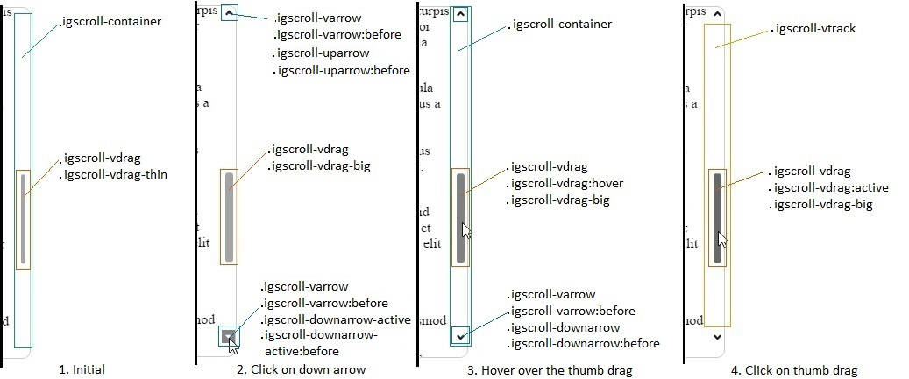
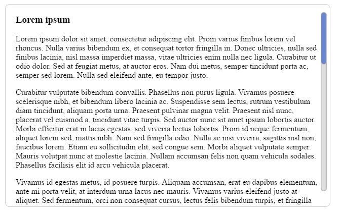
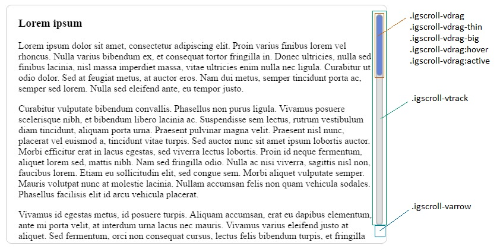

<!--
|metadata|
{
    "fileName": "igscroll-styling",
    "controlName": "igScroll",
    "tags": ["Styling","igScroll"]
}
|metadata|
-->

# Styling igScroll

## Purpose

This topic explains, with code examples, how to style the igScroll scrollbars to deliver different end-user experiences.

### In this topic

This topic contains the following sections:

- [Styling Summary](#summary)
    - [Styling the scrollbar container](#container)
    - [Styling the track area](#track)
    - [Styling the thumb drag](#thumbDrag)
    - [Styling the arrows](#arrows)
- [Styling example](#example)
- [Related Content](#related)

## <a id="summary"></a>Styling Summary
The Ignite UI™ Scroll (or `igScroll`), like other jQuery widgets, provide different CSS classes that apply to
specific UI elements. Each CSS class defines the look and the feel of a DOM element that the igScroll renders.

The list of the CSS classes that specifically apply to all elements regarding the vertical only custom scrollbars are:

* Most outer container wrapping all others: `igscroll-vcontainer`
* Track area: `igscroll-vtrack`
* General vertical arrow: `igscroll-varrow`
* Up arrow: `igscroll-uparrow`
* Up arrow when active: `igscroll-uparrow-active`
* Down arrow: `igscroll-downarrow`
* Down arrow when active: `igscroll-downarrow-active`
* General thumb drag style: `igscroll-vdrag`
* Thumb drag when is thin: `igscroll-vdrag-thin`
* Thumb drag when is big: `igscroll-vdrag-big`


In order to visualize more clearly which class for which element is being used, following picture displays the
default custom scrollbar and each class where is being applied in four different scenarios:



### <a id="container"></a> Styling the scrollbar container

In order to style the container, have its position changed and etc. only the `igscroll-container` class
needs to be changed. On the image above can be seen that the container wraps all elements of the scrollbar.
Setting the background color of that element for example will mean that all elements will have such background 
and will be position on top of it.

### <a id="track"></a>Styling the track area

To style the track area only the `igscroll-vtrack` class is needed to be set. The area that it covers is
where the thumb drag is moving. On the screenshot above can be seen that area as well. It is position between
the Up and Down arrows.

### <a id="thumbDrag"></a>Styling the thumb drag

1. Initial state

    As can seen on the screenshot by default initially only the thumb drag is shown and it is visible in its thin form. The only
    classes that are applied are the `igscroll-vdrag` and `igscroll-vdrag-thin`.

    The first class is responsible for the overall look of the thumb drag like background color, border styles and etc. The second class
    is responsible for how it will look when it should be displayed as thin thumb drag. In general in this class are used to
    set the width and the left offset relative to the element that it is child of.

2. Hovering over the scrollbar area

    In the second scenario shown, because the mouse is over the scrollbar area, the thin thumb drag has now become bigger.
    This is reflected in the classes that are being applied on it as well.
    
    The first class `igscroll-vdrag` is the same as in the previous state, since it defines the overall look of the thumb. The second class
    `igscroll-vdrag-big` is different class that this it has the same properties like the `igscroll-vdrag-thin` class.
    The difference in this case is that now the width is higher and the left offset is smaller in order to compensate
    for the difference in the size.

3. Hovering over the thumb drag

    When hovering the thumb drag the hover selector for the `igscroll-vdrag` class is used so it could set a different color of the scrollbar.
    That way it indicates that the thumb drag is being hovered on. Everything else stays the same as when
    the big thumb is show and it is not being hovered on. This can be seen on the third scenario shown.

4. Clicking on the thumb drag

    Clicking on the thumb drag will have the `igscroll-vdrag`, `igscroll-vdrag:active`, `igscroll-vdrag-big` 
    classes applied to it. The active selector for the `igscroll-vdrag` is responsible for changing the look
    of the thumb when it is being clicked on. Every other class still stays the same as when the big thumb is
    show and it is not being hovered on.

### <a id="arrow"></a>Styling the arrows

1. Initial state

    In the first example can be seen that the thin thumb drag is shown and the arrows are not visible. In this case
    if the arrows are needed to be visible at all times, the general class for the vertical arrows `igscroll-varrow` 
    need to be changed and the opacity to be set to 1, being important as well so it can override the igScroll's
    changes.

2. Hovering over the scrollbar area

    When we are not interacting with an arrow, but our mouse is inside the area of the scrollbar
    the `igscroll-varrow`, `igscroll-varrow:before`, `igscroll-downarrow` and `igscroll-downarrow:before` classes are used.
    
    The First class defines the background color, while the second class defines the background image that will be on top 
    of the background color. In this case the background color is not set and it is transparent and only the image
    is visible. The `igscroll-downarrow:before` class is responsible only for the rotation of the background image and others
    regarding the background image.

3. Hovering over an arrow

    When hovering over an arrow, almost the same classes are applied as when not hovering it but we are inside the scrollbar area.
    Only difference is that the `hover` selector is being triggered and can be used to add additional style to the arrow.
    For example if the background color needs to be changed on hover, the `igscroll-varrow:hover` needs to have the
    new background color that will be used.

4. Clicking on an arrow

    Since we are clicking the down arrow, the classes applied to that elements are `igscroll-varrow`,
    `igscroll-varrow:active`, `igscroll-varrow:before`, `igscroll-downarrow-active` and `igscroll-downarrow-active:before`.
    This scenario can be seen as the second one on the screenshot above. 

    The first class is used to define overall default properties applied to both Up and Down arrows.
    The second class is used to define the background color that an arrow would have when it is being clicked on.
    The third class is used to specify the background image and set its properties. The background image will be
    places on top of the background color. The before selector is used to properly position the background image,
    set its size, position and etc.

    The classes `igscroll-downarrow-active` and `igscroll-downarrow-active:before` are used to specify exactly how
    the down arrows should be styled. The first class is used for general properties regarding the down arrow.
    The second class is used to modify the before selector as well similar to the `igscroll-varrow:before` and
    in it the background image is changed. In the default custom scrollbars it is used as well to rotate
    the background image so the arrow points down.

**Note:** Similar classes are used for the horizontal scrollbar. Their naming can be seen in the [igScroll API](%%jQueryApiUrl%%/ui.igscroll#theming).

## <a id="example"></a>Styling example

In this example we will describe how to style the vertical scrollbar so it will look like on the image bellow. It
will not hide when we do not hover the content area and it will not change its size. It will also have the 
arrows hidden to provide more minimalistic look: 



1. Initializing the igScroll

    The igScroll is initialized on a `div` element that has a couple of paragraphs. We have styled that `div` to
    have a border that is displayed above. The scrollbar that we are gonna style will be always visible, that's why
    the alwaysVisible option of the igScroll should be set to true. The whole initialization would look like:

    ```javascript
    $("#loremText").igScroll({
        alwaysVisible: true,
        scrollbarType: "custom"
    });
    ```

    The actual body of that html sample looks like:

    ```html
    <div id="loremText" tabindex="1">
        <h3> Lorem ipsum </h3>
        <p>..</p>
        ...
        <p>..</p>
    </div>
    ```

    The div element has the following style applied to it:

    ```css
    #loremText {
        height:400px;
        width: 600px;
        overflow: hidden;
        border: 1px solid #ccc;
        border-radius: 9px;
        padding-right: 20px;
        padding-left: 20px;
    }
    ```

    We have added some padding as well to make sure that the scrollbars do not cover the text area on the right side. The width and the height
    of it specifies the general visible area for the text that will be displayed.

    Now that we have initialized the igScroll we can proceed with the styling of the actual scrollbars.
    The classes that we will be using and where are they applied is displayed in the next screenshot:

    

2. Styling the arrows for the vertical scrollbar

    In order to always hide the Up and Down arrow the `igscroll-varrow` class is used, which is set 
    to "visibility: hidden". This way both arrows will not be visible.

3. Styling the track area

    To style the track area only the `igscroll-vtrack` class is used. The css for it is:

    ```css
    .igscroll-vtrack {
        background-color: #dfdfdf;
        border-radius: 30px;
        width: 12px;
        box-shadow: inset 0px 0px 5px #888888;			
    }
    ```

    In that class we set the background color to be grey, round the edges using `border-radius` and add a box shadow.
    The width is seti to specifically 12px in order to be the same size like the thumb drag.


4. Styling the thumb drag

    Styling the vertical thumb drag requires editing a few of the classes that are applied to it. The first class
    that we will look into is the main class `igscroll-vdrag`. It is mainly used to style the scrollbar. In that class
    we specify the initial background color, set `border-radius` so that it matches the track area,
    add `box-shadow` and `border` to make it more distinguished.

    The css for that class would look like:

    ```css
    .igscroll-vdrag {
        border-radius: 6px;
        border: 1px solid #ccc;
        box-shadow: inset 0px 0px 5px #888888;
        background-color: #587adb;
    }
    ```

    Now that we have set the basic style we will need to specify the width so it matches the track area. We will
    need to set the left offset as well, so that the scrollbar is position properly. To do that we will need
    to set both `igscroll-vdrag-thin` and `igscroll-vdrag-big`. This way we make sure the scrollbar will
    stay the same size and will not change its width when we are no longer hovering the scrollbar area. 

    ```css
    .igscroll-vdrag-thin {
        width: 10px;
        left: 0px;
    }
    
    .igscroll-vdrag-big {
        width: 10px;
        left: 0px;
    }
    ```

    To add a final touch to our scrollbar and make it so that the thumb drag changes its color when we
     hover or when we click on it we will change the `hover` and `active` selectors for the main class
     `igscroll-vdrag`. Example for achieving that is by changing the background color to darker tones of
     the same color:

     ```css
    .igscroll-vdrag:hover {
        background-color: #4c69ba;
    }
    
    .igscroll-vdrag:active {
        background-color: #3f58a0;
    }
     ```

## <a id="related"></a> Related Content

### Topics
-   [igScroll Overview](igScroll_Overview.html)
-   [Configuring igScroll](Configuring-igScroll.html)

### Samples
-   [Styling static scrollbars](%%SamplesUrl%%/scroll/styling-static)
-   [Styling dynamic scrollbars](%%SamplesUrl%%/scroll/styling-dynamic)

