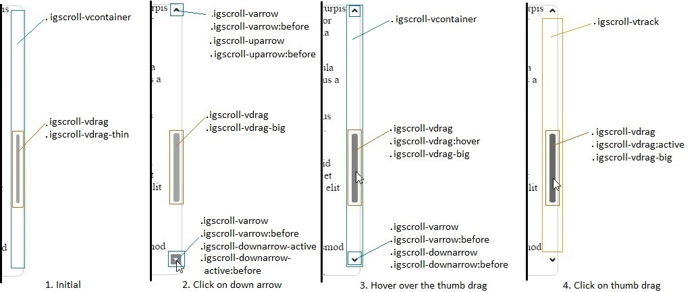

<!--
|metadata|
{
    "fileName": "igscroll-styling",
    "controlName": "igScroll",
    "tags": ["Styling","igScroll"]
}
|metadata|
-->

# Styling igScroll

## Purpose

This topic explains, with code examples, how to style the igScroll scrollbars to deliver different end-user experiences.

### In this topic

This topic contains the following sections:

- [Styling Summary](#summary)
    - [Styling the scrollbar container](#container)
    - [Styling the track area](#track)
    - [Styling the scroll thumb](#thumbDrag)
    - [Styling the arrows](#arrows)
- [Styling example](#example)
- [Related Content](#related)

## <a id="summary"></a>Styling Summary
The Ignite UI™ Scroll (or `igScroll`), like other jQuery widgets, provides a number of CSS classes that apply to
specific UI elements. Each CSS class defines the look and feel of a DOM element that the igScroll renders.

The list of CSS classes that apply to the vertical custom scrollbar are:

* Most outer container wrapping all others: `igscroll-vcontainer`
* Track area: `igscroll-vtrack`
* General vertical arrow: `igscroll-varrow`
* Up arrow: `igscroll-uparrow`
* Up arrow when active: `igscroll-uparrow-active`
* Down arrow: `igscroll-downarrow`
* Down arrow when active: `igscroll-downarrow-active`
* General scroll thumb style: `igscroll-vdrag`
* Scroll thumb in thin state: `igscroll-vdrag-thin`
* Scroll thumb in big state: `igscroll-vdrag-big`


To visualize which CSS class for which element is being used refer to the following picture.
It displays four different scenarios that the default custom scrollbar has and shows each class applied:



### <a id="container"></a> Styling the scrollbar container

In order to style the container, position it differently and etc. only the `igscroll-vcontainer` class
needs to be changed. On the image above can be seen that the container wraps all elements composing the vertical custom scrollbar.
Setting the background color of that element for example will mean that all elements will have the new background 
and will be positioned on top of it.

### <a id="track"></a>Styling the track area

To style the track area only the `igscroll-vtrack` class needs to be modified. The track area is container of the scroll thumb
and that is the area where the scroll thumb is moving along. This area can also be seen in the screenshots above. It is positioned between the Up and Down arrows.

### <a id="thumbDrag"></a>Styling the scroll thumb

1. Initial state

    The screenshot displays that initially by default only the scroll thumb is shown and it is visible in its thin state. 
    The classes applied are `igscroll-vdrag` and `igscroll-vdrag-thin`.

    The first class is responsible for the overall look of the scroll thumb like background color, border styles and etc. The second class
    is responsible for how it will look when the scroll thumb is its thin state. In general this class is used to
    set the width and the left offset of the thumb relative to the parent element.

2. Hovering over the scrollbar area

    In the second scenario, because the scrollbar area is hovered, the scroll thumb is in its big state.
    This is reflected in the classes that are being applied on it as well.
    
    The first class `igscroll-vdrag` is the same as in the previous state. The `igscroll-vdrag-thin` is now removed and 
    `igscroll-vdrag-big` is applied. The difference in this case is that now the width is bigger and the left offset is 
    smaller in order to compensate for the difference in the size.

3. Hovering over the scroll thumb

    When hovering the scroll thumb the `:hover` pseudo-selector is used on top of the `igscroll-vdrag` to change the color of the scrollbar.
    That way it indicates that the scroll thumb is being hovered. Everything else stays the same as without the `:hover` state. 
    This can be seen in the third scenario.

4. Clicking on the scroll thumb

    Clicking on the scroll thumb will apply the `:active` pseudo-selector to it. Every other class still stays the same 
    as when the scroll thumb is show and it is not being hovered. The active selector for the `igscroll-vdrag` is 
    responsible for changing the look of the thumb when it is being clicked. Every other class still stays 
    the same as when the big thumb is shown and it is not being hovered.

### <a id="arrows"></a>Styling the arrows

1. Initial state

    The first example displays that the thin scroll thumb is shown and the arrows are not visible. 
    If you want to set the arrows to be always visible, you simply need to change `igscroll-varrow` and set the opacity to 1.

2. Hovering over the scrollbar area

    When you are not interacting with an arrow, but the area of the scrollbar is being hovered with the mouse
    the `igscroll-varrow`, `igscroll-varrow:before`, `igscroll-downarrow` and `igscroll-downarrow:before` classes are used.
    
    The `igscroll-varrow` defines the background color, while the second class defines the background image that will be on top 
    of the background color. In this case the background color is not set and it is transparent and only the image
    is visible. The `:before` pseudo-selector is responsible only for the rotation of the background image and other transformations
    regarding the background image.

3. Hovering over an arrow

    When hovering over an arrow  all classes stay unchanged. Only the `:hover` pseudo-selector is being applied on top of the `igscroll-varrow` class. 
    This way the arrow can be styled additionally. For example if the background color needs to be 
    different when hovering, the `:hover` pseudo-selector needs to have the new background color that will be used.

4. Clicking on an arrow

    When clicking the down arrow, the classes applied to that elements are `igscroll-varrow`,
    `igscroll-varrow:active`, `igscroll-varrow:before`, `igscroll-downarrow-active` and `igscroll-downarrow-active:before`.
    This scenario can be seen as the second one on the screenshot above. 

    The first class is used to define overall default properties applied to both Up and Down arrows.
    The `:active` pseudo-selector is used to define the background color that an arrow would have when it is being clicked on.
    The `:before` pseudo-selector is used to specify the background image and set its properties. The background image will be
    places on top of the background color. The before selector is used to properly position the background image,
    set its size, position and etc.

    The classes `igscroll-downarrow-active` and its `:before` pseudo-selector are used to specify exactly how
    the down arrows should be styled which being active. The class is used for general properties regarding the down arrow.
    The `:before` pseudo-selector is used like the `igscroll-varrow:before` and
    in it the background image is changed. In the default custom scrollbars it is used as well to rotate
    the background image so the arrow points down.

> **Note**: Similar classes are used for the horizontal scrollbar. Their naming can be seen in the [igScroll API](%%jQueryApiUrl%%/ui.igscroll#theming).

## <a id="example"></a>Styling example

In this example we will describe how to style the vertical scrollbar so it will look like on the image bellow. It
will not hide when we do not hover the content area and it will not change its size. It will also have the 
arrows hidden to provide more minimalistic look: 


1. Initializing the igScroll

    The igScroll is initialized on a `div` element that has a couple of paragraphs. We have styled that `div` to
    have a border that is displayed above. The scrollbar that we are gonna style will be always visible, that's why
    the alwaysVisible option of the igScroll should be set to true. The whole initialization would look like:

    ```javascript
    $("#loremText").igScroll({
        alwaysVisible: true,
        scrollbarType: "custom"
    });
    ```

    The actual body of that html sample looks like:

    ```html
    <div id="loremText" tabindex="1">
        <h3> Lorem ipsum </h3>
        <p>..</p>
        ...
        <p>..</p>
    </div>
    ```

    The div element has the following style applied to it:

    ```css
    #loremText {
        height:400px;
        width: 600px;
        overflow: hidden;
        border: 1px solid #ccc;
        border-radius: 9px;
        padding-right: 20px;
        padding-left: 20px;
    }
    ```

    We have added some padding as well to make sure that the scrollbars do not cover the text area on the right side. The width and the height
    of it specifies the general visible area for the text that will be displayed.

    Now that we have initialized the igScroll we can proceed with the styling of the actual scrollbars.
    The classes that we will be using and where are they applied is displayed in the next screenshot:

    

2. Styling the arrows for the vertical scrollbar

    In order to always hide the Up and Down arrow the `igscroll-varrow` class is used, which is set 
    to "visibility: hidden". This way both arrows will not be visible.

3. Styling the track area

    To style the track area only the `igscroll-vtrack` class is used. The CSS for it is:

    ```css
    .igscroll-vtrack {
        background-color: #dfdfdf;
        border-radius: 30px;
        width: 12px;
        box-shadow: inset 0px 0px 5px #888888;			
    }
    ```

    In that class we set the background color to be grey, round the edges using `border-radius` and add a box shadow.
    The width is set to 12px in order to be the same size as the scroll thumb.

4. Styling the scroll thumb

    Styling the vertical scroll thumb requires editing a few of the classes that are applied to it. The first class
    that we will look into is the main class `igscroll-vdrag`. It is mainly used to style the scrollbar. In that class
    we specify the initial background color, set `border-radius` so that it matches the track area,
    add `box-shadow` and `border` to make it more distinguished.

    The CSS for that class would look like:

    ```css
    .igscroll-vdrag {
        border-radius: 6px;
        border: 1px solid #ccc;
        box-shadow: inset 0px 0px 5px #888888;
        background-color: #587adb;
    }
    ```

    Now that we have set the basic style we will need to specify the width so it matches the track area. We will
    need to set the left offset as well, so that the scrollbar is positioned properly. To do that we will need
    to set both `igscroll-vdrag-thin` and `igscroll-vdrag-big`. This way we make sure the scrollbar will
    stay the same size and will not change its width when we are no longer hovering the scrollbar area. 

    ```css
    .igscroll-vdrag-thin {
        width: 10px;
        left: 0px;
    }
    
    .igscroll-vdrag-big {
        width: 10px;
        left: 0px;
    }
    ```

    To add a final touch to our scrollbar and make it so that the scroll thumb changes its color when we
     hover or when we click on it we will change the `hover` and `active` selectors for the main class
     `igscroll-vdrag`. Example for achieving that is by changing the background color to darker tones of
     the same color:

     ```css
    .igscroll-vdrag:hover {
        background-color: #4c69ba;
    }
    
    .igscroll-vdrag:active {
        background-color: #3f58a0;
    }
     ```

## <a id="related"></a> Related Content

### Topics
-   [igScroll Overview](igScroll-Overview.html)
-   [Configuring igScroll](Configuring-igScroll.html)

### Samples
-   [Styling static scrollbars](%%SamplesUrl%%/scroll/styling-static)
-   [Styling dynamic scrollbars](%%SamplesUrl%%/scroll/styling-dynamic)

