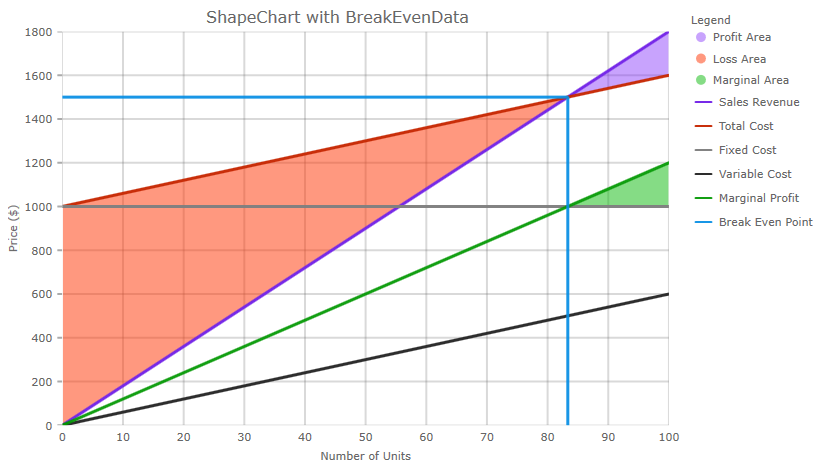

<!--
|metadata|
{
    "fileName": "igshapechart-landingpage",
    "controlName": "igShapeChart",
    "tags": ["API", "ShapeChart", "Axes"]
}
|metadata|
-->

# igShapeChartChart

### Introduction

The igShapeChart is a lightweight, highly performant chart. This chart can be easily configured to display scatter as well as providing support for two additional data visualizations (Polyline and Polygon). The chart can also plot data from shape files or any custom shape that you can define using an array of arrays of X/Y points.

The following screenshot demonstrates the shape chart displaying break even data.

### Topics
The topics in this section provide detailed information regarding the igShapeChart control.

- [Overview](shapechart-overview.html)

- [Getting Started](shapechart-getting-started-with-shapechart.html)

- [Binding to Shape File Data](shapechart-binding-to-shapefile-data.html)

- [Binding to Break Even Data](shapechart-binding-to-break-even-data.html)

- [Shape Chart API Overview](shapechart-api-overview.html)