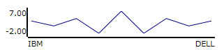
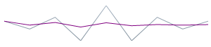
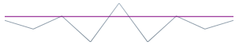
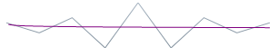

<!--
|metadata|
{
    "fileName": "igsparkline-overview",
    "controlName": "igSparkline",
    "tags": ["Charting","Data Presentation"]
}
|metadata|
-->

# igSparkline Overview

## Topic Overview
### Purpose

This topic provides an overview of the [igSparkline](%%jQueryApiUrl%%/ui.igSparkline.html)™ control, its benefits, and the supported chart types.

### Required background

The following topics are prerequisites to understanding this topic:

- [%%ProductName%%® Overview](NetAdvantage-for-jQuery-Overview.html): This topic describes the main features and benefits of the %%ProductName%% product.

### In this topic

This topic contains the following sections:

-   [igSparkline Types](#sparkline-types)
-   [igSparkline Features Summary](#features-summary)
-   [Markers](#markers)
-   [Trend Line](#trend-line)
-   [Normal Range](#normal-range)
-   [Interpolating Unknown Values](#interpolating-unknown-values)
-   [Axes](#axes)
-   [Tooltip](#tooltip)
-   [Related Content](#related-content)

## igSparkline Types
### Sparkline Types Overview

The following table summarizes the supported `igSparkline` chart types.

Type| Description
---|---
Line| Displays the Line chart type of Sparkline with numeric data, connecting the data points with line segments. You need to provide at least 2 data points in order to visualize the data in Sparkline.
Area| Displays the Area chart type of Sparkline with numeric data. This is similar to line type with additional step of closing the area after each line is drawn. You need to provide at least two data points in order to visualize the data in Sparkline.
Column| Displays the Column chart type of Sparkline with numeric data. Some may refer to this as vertical bars. This type can render a single data point, but requires specifying the minimum value range option (minimum) in Sparkline so the supplied single data point can be visible, otherwise the value will be treated as the minimum value and will not be visible.
WinLoss|This type is similar in its visual appearance to Column chart type, in which the value of each column is equal to either the positive maximum (for positive values) or the negative minimum (for negative value) of the data set. The idea is to indicate a win or a loss scenario. For the Win/Loss chart to display properly, the data set must have both positive and negative values.

#### Line

#### Area

#### Column

#### WinLoss

## igSparkline Features Summary
### Features summary chart

The following table summarizes the main features of the `igSparkline` control. Explaining the features in further detail in the text blocks following the table.

<table class="table">
	<thead>
		<tr>
            <th colspan="2">
**Feature**
			</th>

            <th>
**Description**
			</th>
        </tr>
	</thead>
	<tbody>
        

        <tr>
            <td>
[Markers](#markers)
			</td>

            <td>

			</td>

            <td>
Markers are symbols overlaid on the Sparkline indicating individual data points based on X/Y coordinates.
			</td>
        </tr>

        <tr>
            <td>
[Trend Line](#trend-line)
			</td>

            <td>

			</td>

            <td>
Trend lines are lines drawn from the starting point to the end point indicating the trending direction and movement of the series, so that the viewer can evaluate the tendencies in the data and mentally extrapolate past, future, or unknown
                    values.
			</td>
        </tr>

        <tr>
            <td>
[Normal Range](#normal-range)
			</td>

            <td>

			</td>

            <td>
The Normal range is a horizontal stripe representing some pre-defined meaningful range when visualizing the data.
			</td>
        </tr>

        <tr>
            <td>
[Interpolating Unknown Values](#interpolating-unknown-values)
			</td>

            <td>

			</td>

            <td>
`igSparkline` can detect unknown values (null or double.NaN) and render the space for the unknown values using a specified interpolation algorithm.
			</td>
        </tr>

        <tr>
            <td>
[Axes](#axes)
			</td>

            <td>

			</td>

            <td>
`igSparkline` allows displaying the X and Y axes (both or only one of them) with corresponding labels.
			</td>
        </tr>

        <tr>
            <td>
[Tooltip](#tooltip)
			</td>

            <td>

			</td>

            <td>
`igSparkline` can display a tooltip when the mouse is hovered over the Sparkline.
			</td>
        </tr>
    </tbody>
</table>

## Markers
### Markers overview

Markers are symbols overlaid on a single data point denoting the precise location of the individually plotted data points on the chart using their cartesian X/Y coordinates.

Specifies the Markers in `igSparkline` to identify the data points based on the data and/or the location of the data points.

### Marker types

The following table displays the supported Marker types.

<table class="table">
	<thead>
		<tr>
            <th colspan="2">
**Marker type**
			</th>

            <th>
**Description**
			</th>
        </tr>
	</thead>
	<tbody>
        

        <tr>
            <td>
All data points
			</td>

            <td>

			</td>

            <td>
Displays markers on all data points.
			</td>
        </tr>

        <tr>
            <td>
First and last data points
			</td>

            <td>

			</td>

            <td>
Displays 2 markers – on the first and on the last data point.
			</td>
        </tr>

        <tr>
            <td>
Top and bottom data points
			</td>

            <td>

			</td>

            <td>
Displays 2 markers– on the highest and on the lowest data point.
			</td>
        </tr>

        <tr>
            <td>
Negative data points
			</td>

            <td>

			</td>

            <td>
Displays markers on the negative data points. If there is more than one negative data point, all of them will be marked.
			</td>
        </tr>
    </tbody>
</table>

### Related Samples:

-   [Tooltips and Markers](%%SamplesUrl%%/sparkline/tooltips-and-markers)

## Trend Line
### Trend Line overview

Trend lines are lines drawn from the starting point to the end point indicating the trending direction and movement of the series so that the viewer can evaluate the tendencies in the data and mentally extrapolate past, future, or unknown values.

The Trend Line feature enables you to choose among several formulas for generating a trending directional line. Specify the formula to use in the `trendLineType` option. The Trend Line renders in front of the series data, so it is always visible.

### Supported trend line types

The following table displays the supported trend line types. Drawing each trend line type based on the calculation formula of its type.

<table class="table">
	<thead>
		<tr>
            <th colspan="2">
**Trend Line type**
			</th>

            <th colspan="2">
**Description**
			</th>

            <th>
`trendLineType`  **option setting**
			</th>
        </tr>
	</thead>
	<tbody>
        

        <tr>
            <td>
**Simple Average**
			</td>

            <td>

			</td>

            <td colspan="2">
Simple Average is a set of numbers, each of which is the average of a corresponding subset of data points. Also known as Simple Moving Average
			</td>

            <td>
`simpleAverage`
			</td>
        </tr>

        <tr>
            <td>
**Modified Average**
			</td>

            <td>

			</td>

            <td colspan="2">
Modified Average shows the moving average value over a set period. Used to emphasize the direction of the trend and smooth out the fluctuation.
			</td>

            <td>
`modifiedAverage`
			</td>
        </tr>

        <tr>
            <td>
**Exponential Average**
			</td>

            <td>

			</td>

            <td colspan="2">
Exponential Average, similar to simple average with an added weight factor. This type of average reacts faster to recent trend changes.
			</td>

            <td>
`exponentialAverage`
			</td>
        </tr>

        <tr>
            <td>
**Cumulative Average**
			</td>

            <td>

			</td>

            <td colspan="2">
Cumulative Average is an ordered data points with calculated average of all data up to the current point.
			</td>

            <td>
`cumulativeAverage`
			</td>
        </tr>

        <tr>
            <td>
**Weighted Average**
			</td>

            <td>

			</td>

            <td colspan="2">
Weighted Average is any average that has multiplying factor to give weight to data at different positions.
			</td>

            <td>
`weightedAverage`
			</td>
        </tr>

        <tr>
            <td>
**Cubic Fit**
			</td>

            <td colspan="2">

			</td>

            <td>
Uses polynomial mathematical functions to specify a cubic fit trend line on a series.
			</td>

            <td>
`cubicFit`
			</td>
        </tr>

        <tr>
            <td>
**Exponential Fit**
			</td>

            <td colspan="2">

			</td>

            <td>
Uses exponential mathematical functions to specify an exponential fit trend line on a series.
			</td>

            <td>
`exponentialFit`
			</td>
        </tr>

        <tr>
            <td>
**Line Fit**
			</td>

            <td colspan="2">

			</td>

            <td>
The best-fitting straight trend line.
			</td>

            <td>
`lineFit`
			</td>
        </tr>

        <tr>
            <td>
**Logarithmic Fit**
			</td>

            <td colspan="2">

			</td>

            <td>
The best-fitting curved line. Used when the rate of change in the data increases or decreases quickly and then levels out. This type of trend line is most useful with sufficient data.
			</td>

            <td>
`logarithmicFit`
			</td>
        </tr>

        <tr>
            <td>
**Power Low Fit**
			</td>

            <td colspan="2">

			</td>

            <td>
Power Low trend line is a curved line that uses power function to draw a line. It is best to avoid zero (0) point as it is not valid for power function. Sparkline will not produce any errors, it will plot the zero (0) point, but from the power
                    trend line prospective, the result will not be accurate. Power trend line uses data sets that compare measurements that increase at a specific rate.
			</td>

            <td>
`powerLowFit`
			</td>
        </tr>

        <tr>
            <td>
**Quadratic Fit**
			</td>

            <td colspan="2">

			</td>

            <td>
Uses the quadratic equation to derive a trend line showing the overall effect of the high and low data points with the accuracy of a linear curve.
			</td>

            <td>
`quadraticFit`
			</td>
        </tr>

        <tr>
            <td>
**Quartic Fit**
			</td>

            <td colspan="2">

			</td>

            <td>
Uses quartic polynomials to specify a series trend line.
			</td>

            <td>
`quarticFit`
			</td>
        </tr>

        <tr>
            <td>
**Quintic Fit**
			</td>

            <td colspan="2">

			</td>

            <td>
Uses quintic polynomials to specify a series trend line.
			</td>

            <td>
`quinticFit`
			</td>
        </tr>
    </tbody>
</table>

#### Related Samples:

-   [Normal Range and Trend Lines](%%SamplesUrl%%/sparkline/normal-range-and-trend-lines)

## Normal Range
### Normal Range overview

The Normal Range is a horizontal stripe drawn to represent some pre-defined meaningful range when visualizing the data.

The typical use of the Normal Range is to indicate what values are considered normal or good. For example, if the Sparkline represented the person’s heart rate over time, the normal range of 60-100 beats per minute would be the range to be highlighted as Normal, making the outlying data points easy to identify.

The `normalRangeMinimum` and `normalRangeMaximum` options determine the range width and position.

#### Related Samples:

-   [Normal Range and Trend Lines](%%SamplesUrl%%/sparkline/normal-range-and-trend-lines)

## Interpolating Unknown Values
### Interpolating Unknown Values overview

The `igSparkline` can detect unknown values and render the space for the unknown values using a specified interpolation algorithm.

If there are missing values in the data (typical “unknown” values found in data are null and NaN), `igSparkline` can render in the space with unknown values by linear interpolation. The following table demonstrates the difference in a Sparkline plotted from the same data set (containing missing values) with or without using Unknown Values Plotting.

Plotting of unknown values applied? | Preview
---|---
No|
Yes|

Manage this feature through the `unknownValuePlotting` option. The allowed values are `dontPlot` and `linearInterpolate`.

#### Supported Sparkline types

The following Sparkline types support Unknown Values Plotting:

-   Area
-   Line

The Column and Win/Loss types do not interpolate unknown values. These Sparkline types will always display a blank space where unknown values are present.

## Axes
### Axes overview

The Sparkline allows displaying 1 or both the X and Y axes with corresponding labels.

<table>
  <tbody>
    <tr>
      <td></td>
	 <td></td>
	 <td></td>
    </tr>
  </tbody>
</table>

Enabling the X and Y-axis (not shown by default) the Sparkline will decrease its size to make up space for the axis and the labels. If it resides in a grid cell, it may require adjusting the size of the cell.

### Axes customization

The following aspects of the `igSparkline` control axes are customizable:

-   Visibility

Allows you to manage the visibility of the X and Y-axis individually, using their respective `horizontalAxisVisibility` and `verticalAxisVisibility` options, making it possible to display either one or both axes.

-   Label
    -   Label text

You can add descriptive labels to the X-axis. The `labelMemberPath` option manages these options.

## Tooltip
### Tooltip overview

The `igSparkline` can display a tooltip when the mouse hovers over the Sparkline. By its very design, the tooltip displays the high, low, first, and last data points.

The toolTip option manages the Tooltips.

### Tooltip customization

The tooltips of the `igSparkline` can be customized in the following aspects:

-   Label text
-   Label font
-   Label color
-   Font size

#### Related Samples:

-   [Tooltips and Markers](%%SamplesUrl%%/sparkline/tooltips-and-markers)

## Related Content
### Topics

The following topic provides additional information related to this topic.

- [jQuery and ASP.NET MVC Helper Links (igSparkline)](igSparkline-jQuery-and-ASPNET-MVC-API.html): This topic provides links to the API documentation for jQuery and ASP.NET MVC helper class for the `igSparkline` control.

### Samples

The following samples provide additional information related to this topic.

- [Tooltips and Markers](%%SamplesUrl%%/sparkline/tooltips-and-markers): This sample shows an example of enabling tooltips and markers in the `igSparkline`.

- [Normal Range and Trend Lines](%%SamplesUrl%%/sparkline/normal-range-and-trend-lines): This sample shows the normal range and trend line functionality.