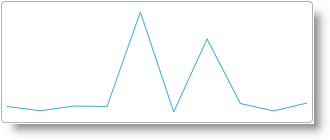

<!--
|metadata|
{
    "fileName": "igsparkline-adding-igsparkline-to-an-html-document",
    "controlName": "igSparkline",
    "tags": ["Charting","Data Binding","Data Presentation"]
}
|metadata|
-->

# Adding igSparkline to an HTML Document


## Topic Overview
### Purpose

This topic explains how to add the [`igSparkline`](%%jQueryApiUrl%%/ui.igSparkline.html)™ to an HTML page and bind to a JavaScript array.

### Required background

The following table lists the concepts, topics, and articles required as a prerequisite to understanding this topic.


-   jQuery Selectors

**Topics**

- [igSparkline Overview](igSparkline-Overview.html): This topic provides an overview of the `igSparkline` control, its benefits, and the supported chart types.

- [Adding igSparkline Overview](igSparkline-Adding-igSparkline-Overview.html): This topic provides an overview of the various ways of adding `igSparkline`™ to an application.

- [Adding Required Resources Manually](Adding-the-Required-Resources-for-NetAdvantage-for-jQuery.html): This topic explains the organization of JavaScript resources in %%ProductName%%®.

- [Using JavaScript Resources in %%ProductName%%](Deployment-Guide-JavaScript-Resources.html): This topic provides general guidance on adding required JavaScript resources to use controls from the %%ProductName%% library.


**External Resources**

-   [jQuery UI Widget Factory](http://jqueryui.com/widget/)

### In this topic

This topic contains the following sections:

-   [Adding igSparkline to an HTML Document – Conceptual Overview](#overview)
    -   [Adding igSparkline summary](#summary)
    -   [Requirements](#requirements)
    -   [Steps](#steps)
-   [Adding igSparkline to an HTML Page](#adding-to-html-page)
    -   [Introduction](#html-page-introduction)
    -   [Preview](#html-page-preview)
    -   [Prerequisites](#html-page-prerequisites)
    -   [Overview](#html-page-overview)
    -   [Steps](#html-page-steps)
-   [Related Content](#related-content)
    -   [Topics](#topics)
    -   [Samples](#samples)


## <a id="overview"></a>Adding igSparkline to an HTML Document – Conceptual Overview
### <a id="summary"></a>Adding igSparkline summary

The `igSparkline` is a data-bound control requiring a set of data objects to render. The control requires an HTML element, a DIV, to serve as the base for instantiation.

The data source is specific through the `dataSource` option. This example defines the data in-line with the HTML. The array is obtainable through an AJAX call, an external JavaScript file, or any other means of retrieving JavaScript array data.

The `igSparkline` is configured in a function for document ready which fires once the document has finished loading resources.

### <a id="requirements"></a>Requirements

The following table summarizes the requirements for using the `igSparkline` control.

<table class="table table-bordered">
	<thead>
		<tr>
            <th>
Requirement/Required Resources
			</th>

            <th>
Description
			</th>

            <th>
What you need to do…
			</th>
        </tr>
	</thead>
	<tbody>
        

        <tr>
            <td>
IG Theme
			</td>

            <td>
This theme contains the visual styles for the %%ProductName%% library. The theme file is:

                css/themes/Infragistics/infragistics.theme.css
			</td>

            <td>

			</td>
        </tr>

        <tr>
            <td>
`igSparkline` CSS resource files
			</td>

            <td>
                The styles from the following CSS file are used for rendering various elements of the control:

                <table class="table table-bordered">
	<thead>
		<tr>
                            <th>
CSS Resource
			</th>

                            <th>
Description
			</th>
                        </tr>
	</thead>
	<tbody>
                        

                        <tr>
                            <td>
`css/structure/modules/infragistics.ui.shared.css`
			</td>

                            <td>
Shared CSS styles for all %%ProductName%% controls.
			</td>
                        </tr>

                        <tr>
                            <td>
`css/structure/modules/infragistics.ui.html5.css`
			</td>

                            <td>
CSS related to browser support for HTML5
			</td>
                        </tr>

                        <tr>
                            <td>
`css/structure/modules/infragistics.ui.sparkline.css`
			</td>

                            <td>
CSS styles specific to the `igSparkline` widget
			</td>
                        </tr>
                    </tbody>
</table>
                <br>
            </td>

            <td>
Add `style` reference to the file in your page.
			</td>
        </tr>

        <tr>
            <td>
Modernizr library (Optional)
			</td>

            <td>
                The Modernizr library is used by the igSparkline to detect browser and device capabilities. It is not mandatory and, if not included, the control will behave as if in a normal desktop environment with an HTML5
                    compatible browser.

                <ul>
                    <li>
[Modernizr](http://modernizr.com/)
					</li>
                </ul>
            </td>

            <td>
Add a script reference to the library in the `<head>` section of your page.
			</td>
        </tr>

        <tr>
            <td>
jQuery and jQuery UI JavaScript resources
			</td>

            <td>
                %%ProductName%% is built on top of the following frameworks:

                <ul>
                    <li>
[jQuery](http://jquery.com/)
					</li>

                    <li>
[jQuery UI](http://jqueryui.com/)
					</li>
                </ul>
            </td>

            <td>
Add script references to both libraries in the `<head>` section of your page.
			</td>
        </tr>

        <tr>
            <td>
General `igSparkline` JavaScript Resources
			</td>

            <td>
                The igSparkline functionality of the %%ProductName%% library is distributed across several files. You can load the required resources in one of the following ways:

                <ul>
                    <li>
Use the `Infragistics.core.js` and `Infragistics.dv.js` combined files to quickly reference the required JavaScript dependencies
					</li>

                    <li>
Use the Infragistics® Loader (`igLoader`™). You only need to include a script reference to `igLoader` on your page and specify the `igSparkline` as
                        a parameter and the igLoader loads the required individual JavaScript files and CSS files.
					</li>

                    <li>
Load the required resources manually. You need to use the dependencies listed in the table below.
					</li>
                </ul>

                The following table lists the %%ProductName%% library dependences related to the igSparkline control. These resources need to be referred to explicitly if you chose to load resources manually (i.e. not to use `igLoader`).

                <table class="table table-bordered">
	<thead>
		<tr>
                            <th>
JS Resource
			</th>

                            <th>
Description
			</th>
                        </tr>
	</thead>
	<tbody>
                        

                        <tr>
                            <td>
`js/modules/infragistics.util.js`
			</td>

                            <td>
%%ProductName%% utilities
			</td>
                        </tr>

                        <tr>
                            <td>
`js/modules/Infragistics.datasource.js`
			</td>

                            <td>
Data source framework
			</td>
                        </tr>

                        <tr>
                            <td>
`js/modules/infragistics.templating.js`
			</td>

                            <td>
`igTemplating` engine
			</td>
                        </tr>

                        <tr>
                            <td>
`js/modules/infragistics.ext_core.js`<br>
`js/modules/infragistics.ext_collections.js`<br>
`js/modules/infragistics.ext_ui.js`<br>
`js/modules/infragistics.dv_core.js`<br>
`js/modules/infragistics.dv_geometry.js`<br>
`js/modules/infragistics.dv.simple.core.js`
			</td>

                            <td>
A shared library for all data visualization components
			</td>
                        </tr>

                        <tr>
                            <td>
`js/modules/infragistics.ui.basechart.js`
			</td>

                            <td>
The base widget for all %%ProductName%% chart components
			</td>
                        </tr>

                        <tr>
                            <td>
`js/modules/infragistics.chart_sparkline.js`
			</td>

                            <td>
The internal core logic of the `igSparkline` widget
			</td>
                        </tr>

                        <tr>
                            <td>
`js/modules/infragistics.ui.sparkline.js`
			</td>

                            <td>
The `igSparkline` widget
			</td>
                        </tr>
                    </tbody>
</table>
                <br>
            </td>

            <td>
                Add one of the following:

                <ul>
                    <li>
A reference to `igLoader`
					</li>

                    <li>
A reference to all the required JavaScript files (listed in the table on the left).
					</li>
                </ul>
            </td>
        </tr>
    </tbody>
</table>

### <a id="steps"></a>Steps

Following are the general conceptual steps for adding an `igSparkline` to an HTML document.

1. Reference the required JavaScript and CSS files.

2. Create a target element for the `igSparkline`.

3. Define the JavaScript array.

4. Instantiate the `igSparkline` in document ready.

5. Configure basic rendering options.


## <a id="adding-to-html-page"></a>Adding igSparkline to an HTML Page
### <a id="html-page-introduction"></a>Introduction

This procedure adds a basic `igSparkline` to an HTML page and configures basic options to supply data and configure height and width. The `igSparkline` shows the total amount each order placed over a period of time.

The data structure contains an `ExtendedPrice` field containing the amount of the order and an `OrderDate` field containing the date of the order purchase. The `valueMemberPath` of the `igSparkline` is set to the `ExtendedPrice` and the `labelMemberPath` is set to the `OrderDate`.

### <a id="html-page-preview"></a>Preview

The following screenshot is a preview of the result.



### <a id="html-page-prerequisites"></a>Prerequisites

A blank HTML document.

### <a id="html-page-overview"></a>Overview

1. Reference the required JavaScript and CSS files.

2. Create a target element for the `igSparkline`.

3. Define the JavaScript array.

4. Instantiate the `igSparkline` in document ready.

5. Configure basic rendering options.

### <a id="html-page-steps"></a>Steps

Follow these steps to add an `igSparkline` to an HTML document.

1. Referencing the required JavaScript and CSS files.

	Setup the HTML document with the JavaScript and CSS file dependencies.
	
	**In HTML:**
	
	
	```html
	<!DOCTYPE html>
	<html>
	<head>
	    <title></title>
	    <!-- %%ProductName%% Required Combined CSS Files -->
	    <link href="../../igniteui/css/themes/infragistics/infragistics.theme.css" rel="stylesheet" />
	    <link href="../../igniteui/css/structure/infragistics.css" rel="stylesheet" />
	    <script src="../../js/modernizr.min.js"></script>
	    <script src="../../js/jquery.min.js"></script>
	    <script src="../../js/jquery-ui.min.js"></script>
	    <!-- %%ProductName%% Required Combined JavaScript Files -->
	    <script src="../../igniteui/js/infragistics.core.js"></script>
	    <script src="../../igniteui/js/infragistics.dv.js"></script>
	</head>
	<body>
	</body>
	</html>
	```

2. Creating a target element for the `igSparkline`.

	Create a DIV element within the HTML body on which to instantiate the `igSparkline` widget.
	
	**In HTML:**
	
	```html
	<body>
	    <!-- Target element for the igSparkline -->
	    <div id="sparkline"></div>
	…
	```

3. Defining the JavaScript array.

	Define the JavaScript array.
	
	**In HTML:**
	
	```html
	<body>
	<script>
	var invoices = [
	    {"OrderDate": "/Date(836452800000)/", "ExtendedPrice": 168.0000},
	    { "OrderDate": "/Date(836452800000)/", "ExtendedPrice": 98.0000},
	    { "OrderDate": "/Date(836452800000)/", "ExtendedPrice": 174.0000},
	    { "OrderDate": "/Date(836539200000)/", "ExtendedPrice": 167.4000},
	    { "OrderDate": "/Date(836539200000)/", "ExtendedPrice": 1696.0000},
	    { "OrderDate": "/Date(836798400000)/", "ExtendedPrice": 77.0000},
	    { "OrderDate": "/Date(836798400000)/", "ExtendedPrice": 1261.4000},
	    { "OrderDate": "/Date(836798400000)/", "ExtendedPrice": 214.2000},
	    { "OrderDate": "/Date(836798400000)/", "ExtendedPrice": 95.7600},
	    { "OrderDate": "/Date(836798400000)/","ExtendedPrice": 222.3000}
	];
	</script>
	</body>
	```

4. Instantiate the `igSparkline` in document ready.

	Use the selector of the target element defined previously to instantiate the widget.
	
	**In HTML:**
	
	```html
	<script>
	        $(function () {
	            $("#sparkline").igSparkline({
	            });
	        });
	</script>
	```

5. Configuring basic rendering options.

	When instantiating the `igSparkline`, configure the dataSource, `valueMemberPath`, `labelMemberPath`, height, and width options.
	
	**In HTML:**
	
	```html
	$("#sparkline").igSparkline({
	    dataSource: invoices,
	    height: "100px",
	    width: "300px",
	    valueMemberPath: 'ExtendedPrice',
	    labelMemberPath: 'OrderDate'
	});
	```

Full Code:

**In HTML:**

```html
<!DOCTYPE html>
<html>
<head>
    <title></title>
    <!-- %%ProductName%% Required Combined CSS Files -->
    <link href="../../igniteui/css/themes/infragistics/infragistics.theme.css" rel="stylesheet" />
    <link href="../../igniteui/css/structure/infragistics.css" rel="stylesheet" />
    <script src="../../js/modernizr.min.js"></script>
    <script src="../../js/jquery.min.js"></script>
    <script src="../../js/jquery-ui.min.js"></script>
    <!-- %%ProductName%% Required Combined JavaScript Files -->
    <script src="../../igniteui/js/infragistics.core.js"></script>
    <script src="../../igniteui/js/infragistics.dv.js"></script>
</head>
<body>
    <!-- Target element for the igSparkline -->
    <div id="sparkline"></div>
    <script>
        var invoices = [
            {"OrderDate": "/Date(836452800000)/", "ExtendedPrice": 168.0000},
            { "OrderDate": "/Date(836452800000)/", "ExtendedPrice": 98.0000},
            { "OrderDate": "/Date(836452800000)/", "ExtendedPrice": 174.0000},
            { "OrderDate": "/Date(836539200000)/", "ExtendedPrice": 167.4000},
            { "OrderDate": "/Date(836539200000)/", "ExtendedPrice": 1696.0000},
            { "OrderDate": "/Date(836798400000)/", "ExtendedPrice": 77.0000},
            { "OrderDate": "/Date(836798400000)/", "ExtendedPrice": 1261.4000},
            { "OrderDate": "/Date(836798400000)/", "ExtendedPrice": 214.2000},
            { "OrderDate": "/Date(836798400000)/", "ExtendedPrice": 95.7600},
            { "OrderDate": "/Date(836798400000)/","ExtendedPrice": 222.3000}
        ];
    $(function () {
        $("#sparkline").igSparkline({
            dataSource: invoices,
            height: "100px",
            width: "300px",
            valueMemberPath: 'ExtendedPrice',
            labelMemberPath: 'OrderDate'
        });
    });
    </script>
</body>
</html>
```


## <a id="related-content"></a>Related Content
### <a id="topics"></a>Topics

The following topics provide additional information related to this topic.

- [Adding igSparkline to an ASP.NET MVC View](igSparkline-Adding-igSparkline-to-an-ASPNET-MVC-View.html): This topic walks through instantiating an `igSparkline` in an ASP.NET MVC view and bind to a .NET collection of objects.

- [jQuery and ASP.NET MVC Helper Links (igSparkline)](igSparkline-jQuery-and-ASPNET-MVC-API.html): This topic provides links to the API documentation for jQuery and ASP.NET MVC helper class for the `igSparkline` control.

### <a id="samples"></a>Samples

The following sample provides additional information related to this topic.

- [Bind to JSON Data](%%SamplesUrl%%/sparkline/bind-json): This sample binds to JSON data contained in an external script file. It also shows binding with the ASP.NET MVC helper.