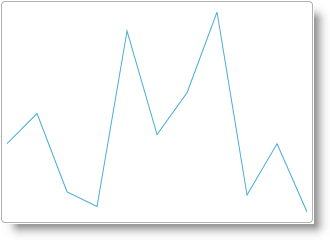

<!--
|metadata|
{
    "fileName": "igsparkline-adding-igsparkline-to-an-aspnet-mvc-view",
    "controlName": "igSparkline",
    "tags": ["Charting","Data Binding","Data Presentation","MVC"]
}
|metadata|
-->

# Adding igSparkline to an ASP.NET MVC View

## Topic Overview
### Purpose

This topic walks through instantiating an [`igSparkline`](%%jQueryApiUrl%%/ui.igSparkline.html)™ in an ASP.NET MVC view and bind to a .NET collection of objects.

### Required background

The following table lists the concepts and topics required as a prerequisite to understanding this topic.

-   jQuery
-   jQuery UI
-   ASP.NET MVC
-   ASP.NET MVC HTML Helpers

Topics

- [Adding Controls to an MVC Project](Adding-NetAdvantage-Controls-to-an-MVC-Project.html): This topic explains how to get started with Ignite UI® components in an ASP.NET MVC application.

 
#### In this topic

This topic contains the following sections:

-   [**Adding igSparkline to an ASP.NET MVC View**](#adding-sparkline-mvc)
    -   [Introduction](#introduction)
    -   [Preview](#preview)
    -   [Prerequisites](#prerequisites)
    -   [Overview](#overview)
    -   [Steps](#steps)


## <a id="adding-sparkline-mvc"></a>Adding igSparkline to an ASP.NET MVC View – Conceptual Overview

The `igSparkline` can be added to an ASP.NET MVC view using the ASP.NET MVC helper. Because the `igSparkline` is a data-bound control, data is generated on the server to pass to the view within the controller `ActionMethod`.

The Invoice model object contains an `ExtendedPrice` field containing the amount of the order and an `OrderDate` field containing the date of the order purchase. The `ValueMemberPath` of the `igSparkline` is set to the `ExtendedPrice`, and the `LabelMemberPath` is set to the `OrderDate`.

### Requirements

An ASP.NET MVC application configured with the required JavaScript files, CSS files, and ASP.NET MVC assembly as outlined in the [Adding Controls to an MVC Project](Adding-NetAdvantage-Controls-to-an-MVC-Project.html) topic.


## Adding igSparkline to an ASP.NET MVC View
### <a id="introduction"></a>Introduction

This procedure walks through instantiating an `igSparkline` in an ASP.NET MVC view and bind to a .NET collection of objects.

### <a id="preview"></a>Preview

The following screenshot is a preview of the result.



### <a id="prerequisites"></a>Prerequisites

To complete the procedure, you need the following:

-   An ASP. NET MVC Application containing the JavaScript and CSS resources and ASP.NET MVC assemblies
-   An ASP.NET MVC HomeController with an Index Action Method that returns an ASP.NET MVC View ‘Index’

### <a id="overview"></a>Overview

Following is a conceptual overview of the process:

1. Add a reference to `Infragistics.Web.Mvc.dll`

2. Configure the view dependencies

3. Define the data collection

4. Instantiate the Sparkline

Full ASPX View Code Listing

### <a id="steps"></a>Steps

The following steps demonstrate adding an `igSparkline` to an ASP.NET MVC ASPX view using the ASP.NET MVC helper.


1. Adding a reference to `Infragistics.Web.Mvc.dll`

	Add a reference to the `Infragistics.Web.Mvc.dll` in your ASP.NET application if you have not done so already. The details for adding this assembly are available in the [Adding Controls to an MVC Project](Adding-NetAdvantage-Controls-to-an-MVC-Project.html) topic.

2. Configuring the view dependencies

	1. Import the Infragistics.Web.Mvc namespace
	
		In order to use the ASP.NET MVC helper, you must import the Infragistics.Web.Mvc namespace onto your view.
		
		**In ASPX:**
		
		```csharp
		<%@ Import Namespace="Infragistics.Web.Mvc" %>
		```

	2. Adding references to all of the required JavaScript and CSS files

		Add the following file references to the HEAD tag of the ASP.NET MVC View:
		
		**In ASPX:**
		
		```csharp
		<link href="<%= Url.Content("~/infragistics/css/themes/infragistics/infragistics.theme.css") %>" rel="stylesheet" />
		<link href="<%= Url.Content("~/infragistics/css/structure/infragistics.css") %>" rel="stylesheet" />
		<script src="<%= Url.Content("~/js/jquery.js") %>"></script>
		<script src="<%= Url.Content("~/js/jquery-ui.js") %>"></script>
		<script src="<%= Url.Content("~/js/modernizr.js") %>"></script>
		<script src="<%= Url.Content("~/infragistics/js/infragistics.core.js") %>"></script>
		<script src="<%= Url.Content("~/infragistics/js/infragistics.dv.js") %>"></script>
		```

3. Defining the data collection

	1. Define the model object Invoice

		Define a basic Invoice object in your application to use for the data collection.
		
		**In C#:**
		
		```csharp
		using System;
		public class Invoice
		{
		    public Nullable<System.DateTime> OrderDate { get; set; }
		    public Nullable<decimal> ExtendedPrice { get; set; }
		}
		```

		>**Note:** This definition does not specify a namespace for the class. If you do use a namespace for the class, you must add an Import statement in your ASP.NET ASPX view to compile the rest of the example.

	2. Create a generic list of Invoice objects in your controller’s action method and return with your view.

 		**In C#:**
		
		```csharp
		using System;
		using System.Collections.Generic;
		using System.Web.Mvc;
		public class HomeController : Controller
		{
		    //
		    // GET: /Home/
		    public ActionResult Index()
		    {
		        List<Invoice> invoices = new List<Invoice>
		            {
		                new Invoice{OrderDate = new DateTime(2012,8,23), ExtendedPrice = 356.89m },
		                new Invoice{OrderDate = new DateTime(2012,8,23), ExtendedPrice = 500.98m },
		                new Invoice{OrderDate = new DateTime(2012,8,23), ExtendedPrice = 125.98m },
		                new Invoice{OrderDate = new DateTime(2012,8,24), ExtendedPrice = 56.23m },
		                new Invoice{OrderDate = new DateTime(2012,8,24), ExtendedPrice = 895.60m },
		                new Invoice{OrderDate = new DateTime(2012,8,24), ExtendedPrice = 400.56m },
		                new Invoice{OrderDate = new DateTime(2012,8,25), ExtendedPrice = 600.25m },
		                new Invoice{OrderDate = new DateTime(2012,8,25), ExtendedPrice = 986.30m },
		                new Invoice{OrderDate = new DateTime(2012,8,26), ExtendedPrice = 111.26m },
		                new Invoice{OrderDate = new DateTime(2012,8,26), ExtendedPrice = 356.25m },
		                new Invoice{OrderDate = new DateTime(2012,8,26), ExtendedPrice = 29.65m },
		            };
		        return View(invoices);
		    }
		}
		```

4. Instantiating the `igSparkline`

Instantiate the `igSparkline` using the ASP.NET MVC helper and set basic options

Within the body of your ASP.NET view, use the ASP.NET MVC helper to instantiate the `igSparkline`.

By providing the type in the Sparkline method, Sparkline<Invoice>, you gain the benefit of being able to use lambda expressions to define the `LabelMemberPath` and `ValueMemberPath` based off the underlying model object.

When instantiating the `igSparkline`, there are several helper methods that should be set for basic rendering including the following:

Helper Method | Purpose
---|---
DataSource()|Accepts the data collection for the `igSparkline` - in this case, the List of Invoices that we set as the model for the view
Height()| Sets the string height of the `igSparkline`
Width()| Sets the string width of the `igSparkline`
ValueMemberPath()|Set this helper method to the Invoice member that signifies the value the `igSparkline` renders on the vertical axis for each item.
LabelMemberPath()|Set this helper method to the Invoice member that represents the horizontal axis value.

Finally, as with all of the Ignite UI ASP.NET MVC helpers, you must call the Render method to render the HTML and JavaScript to the view.

**In ASPX:**

```csharp
<body>
    <%= Html.Infragistics().Sparkline<Invoice>(Model)
        .DataSource(Model)
        .Height("200px")
        .Width("300px")
        .LabelMemberPath(m => m.OrderDate)
        .ValueMemberPath(m => m.ExtendedPrice)
        .Render()%>
</body>
```

Full ASPX View Code Listing

**In ASPX:**

```csharp
<%@ Page Language="C#" Inherits="System.Web.Mvc.ViewPage<IEnumerable<Invoice>>" %>
<%@ Import Namespace="Infragistics.Web.Mvc" %>
<!DOCTYPE html>
<html>
<head>
    <title></title>
    <link href="<%= Url.Content("~/infragistics/css/themes/infragistics/infragistics.theme.css") %>" rel="stylesheet" />
    <link href="<%= Url.Content("~/infragistics/css/structure/infragistics.css") %>" rel="stylesheet" />
    <script src="<%= Url.Content("~/js/jquery.js") %>"></script>
    <script src="<%= Url.Content("~/js/jquery-ui.js") %>"></script>
    <script src="<%= Url.Content("~/js/modernizr.js") %>"></script>
    <script src="<%= Url.Content("~/infragistics/js/infragistics.core.js") %>"></script>
    <script src="<%= Url.Content("~/infragistics/js/infragistics.dv.js") %>"></script>
</head>
<body>
    <%= Html.Infragistics().Sparkline<Invoice>(Model)
        .DataSource(Model)
        .Height("200px")
        .Width("300px")
        .LabelMemberPath(m => m.OrderDate)
        .ValueMemberPath(m => m.ExtendedPrice)
        .Render()%>
</body>
</html>
```


## Related Content
### Topics

The following topics provide additional information related to this topic.

- [jQuery and ASP.NET MVC Helper API Links (igSparkline)](igSparkline-jQuery-and-ASPNET-MVC-API.html): This topic provides links to the API documentation for jQuery and ASP.NET MVC helper class for the `igSparkline` control.

- [Adding igSparkline to an HTML Document](igSparkline-Adding-igSparkline-to-an-HTML-Document.html): This topic explains how to add the `igSparkline` to an HTML page and bind to a JavaScript array.

### Samples

The following sample provides additional information related to this topic.

- [Bind Collection](%%SamplesUrl%%/sparkline/bind-collection): This sample shows binding with the ASP.NET MVC helper.


 

 


