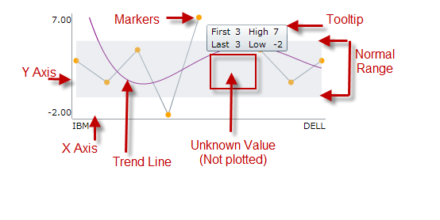

<!--
|metadata|
{
    "fileName": "igsparkline-visual-elements",
    "controlName": "igSparkline",
    "tags": ["Charting","Data Binding","Styling"]
}
|metadata|
-->

# igSparkline Visual Elements

## Topic Overview
### Purpose

This topic provides an overview and image explaining the visual elements of the [`igSparkline`](%%jQueryApiUrl%%/ui.igSparkline.html)™.

### Required background

The following topic is a prerequisite to understanding this topic:

- [igSparkline Overview](igSparkline-Overview.html): This topic provides an overview of the `igSparkline` control, its benefits, and the supported chart types.

## Introduction
### Introduction to the igSparkline visual elements and features

The `igSparkline` control has several visual elements and corresponding features through which these elements can be configured and customized. The primary benefit of Sparkline compared to other charting controls is that it can render in a limited space such as a grid cell with all its visual elements shown. With that in mind, the Sparkline cannot display every label of the data points. It only allows showing high and low values on the Y-axis, and first and last values on the X-axis.

The Sparkline has the ability to mark the data points with elliptical icons to indicate the highest, lowest, first, last and negative values. Customize the markers with the desired shape, color or images, etc. Additionally, the Sparkline decreases the size of the chart in order to accommodate the space required for rendering the X and Y axis along with their associated labels.

## Configurable Visual Elements of igSparkline and Related Properties
### Configurable visual elements summary

The following screenshot depicts the visual elements of the `igSparkline` control. Listed below are the elements that are configurable through properties. None of these visual elements display by default.

**Configurable Visual Elements:**

- Markers

- Trend Line

- Normal Range

- Unknown Values

- Axis

- Tooltip

### Configurable visual elements and related options

The following table maps the visual elements of the `igSparkline` control and the options that configure them.

Visual Element| Option
---|--- 
Markers| `markerVisibility`
Trend Line| `trendLineType`
Normal Range| `normalRangeVisibility`
Plotted or Unplotted Unknown Value|`unknownValuePlotting`
Axis| `horizontalAxisVisibility` `verticalAxisVisibility`
Tooltip|`tooltipTemplate`

## Related Content
### Topics

The following topic provides additional information related to this topic.

- [jQuery and ASP.NET MVC Helper API Links (igSparkline)](igSparkline-jQuery-and-ASPNET-MVC-API.html): The `igSparkline` is built as a jQuery UI widget with an accompanying ASP.NET MVC Helper. For more information about each API, follow the links given below to the API documentation.

### Samples

The following samples provide additional information related to this topic.

- [Normal Range and Trend Lines](%%SamplesUrl%%/sparkline/normal-range-and-trend-lines): This sample shows the normal range and trend line functionality. To set a normal range, provide a `normalRangeMinimum` and `normalRangeMaximum` values and set the `normalRangeVisibility`. For trend lines, there are many styles to choose from. To enable the trend line, choose the trend line type that is best for your application and set the `trendLineType` option.

- [Tooltips and Markers](%%SamplesUrl%%/sparkline/tooltips-and-markers): To enable tooltips and markers, set the `tooltipTemplate` and `markerVisibility` option to 'visible’.

 

 

