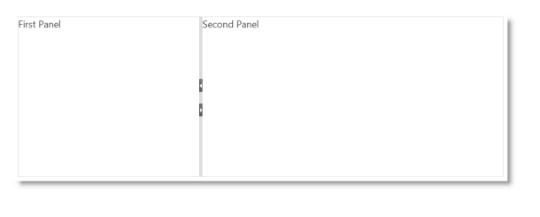
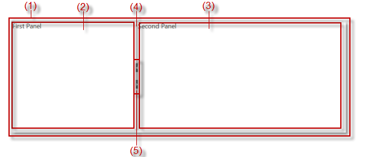
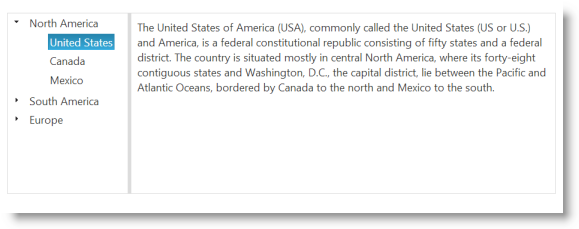
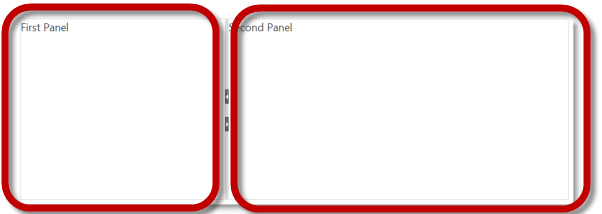
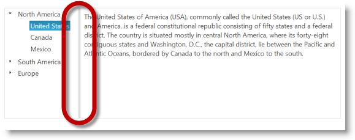
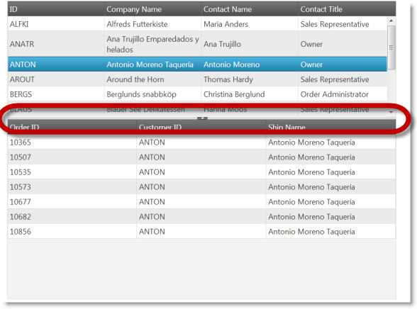
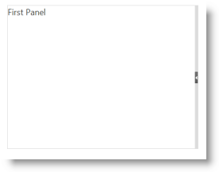
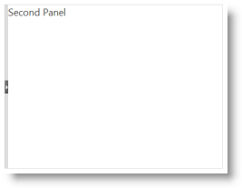
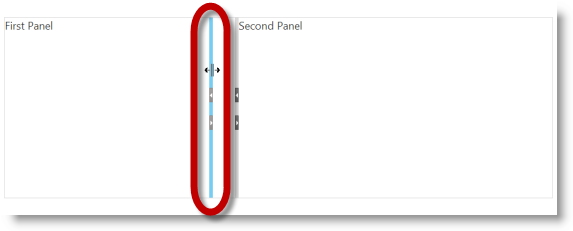

<!--
|metadata|
{
    "fileName": "igsplitter-overview",
    "controlName": "igSplitter",
    "tags": ["Getting Started","How Do I","Layouts"]
}
|metadata|
-->

# igSplitter Overview

## Topic Overview
### Purpose

This topic provides conceptual information about the `igSplitter`™ control including its features and user functionality.

### In this topic

This topic contains the following sections:

-   [Introduction](#introduction)
-   [Main Features](#main-features)
    -   [Two-panel layout](#two-panel-layout)
    -   [Splitter orientations (vertical/horizontal)](#splitter-orientation)
    -   [Panels’ states (expanded/collapsed)](#panels-states)
    -   [Resizable panels](#resizable-panels)
    -   [Drag support for panel resizing](#panel-resizing)
-   [Touch Support](#touch-suport)
-   [User Interactions and Usability](#user-interaction)
-   [Requirements](#requirements)
-   [igSplitter Configuration Overview](#config-overview)
-   [Related Content](#related-content)
    -   [Topics](#topics)
    -   [Samples](#samples)

## Introduction
### igSplitter summary

The `igSplitter` is a container control for managing layouts in HTML5 Web applications and sites by dividing the layout into two separate panels.

Any %%ProductName%%® control can be placed inside those panels thus enabling you create dynamic layouts with resizable and collapsible panels.

The igSplitter visual layout consists of two panels (2) and (3) placed in a container (1) (The numbers refer to the illustration below.). The panels are divided by a splitter bar (4). By default, the splitter bar has buttons (5) for expanding and collapsing panels. The following picture demonstrates a blank (without any other controls placed it) `igSplitter` control:

The picture below demonstrates an `igSplitter` with an igTree %%ProductName%% control in the `igSplitter`’s left panel. After a node is selected for the tree, the corresponding text to that node is placed in the right panel.

Users can resize the panels by moving the splitter bar and/or collapse/expand the panels. (For details, refer to [User Interactions and Usability](#user-interaction).)

## Main Features

The following table summarizes the main features of the `igSplitter` control. Additional details about most of the features are available after this summary table.

Feature| Description
---|---
[Two-panel layout](#two-panel-layout)|The igSplitter control divides the layout into two separate panels.
[Splitter orientations (vertical/horizontal)](#splitter-orientation)|Supported splitter orientations are vertical and horizontal.
[Panels’ states (expanded/collapsed)](#panels-states) |Panels have Expanded and Collapsed states which are inversely related: when one panel is expanded, the other panel is collapsed and the other way around.
[Resizable panels](#resizable-panels)| The panels are resizible relative to each other by moving the splitter bar within the splitter control.
[Drag support for panel resizing](#panel-resizing)|By default, the `igSplitter` control supports mouse dragging for resizing panels.
Keyboard navigation|Users can move the splitter or collapse/expand a panel from the keyboard. For details, refer to [User Interactions and Usability](#user-interaction).

### Two-panel layout

The `igSplitter` control divides the layout into two separate panels.

### Splitter orientations (vertical/ horizontal)

Supported splitter orientations are vertical and horizontal. With vertical orientation, the splitter is positioned vertically, thus dividing the area in two panels placed next to each other. With horizontal orientation, the splitter is positioned horizontally, thus dividing the area in two panels placed one above the other.

### Vertical splitter orientation 

 #### Horizontal splitter orientation

 

The default orientation of the splitter is vertical.

### Panels’ states (expanded/ collapsed)

Panels have Expanded and Collapsed states which are inversely related: when one panel is expanded, the other panel is collapsed and the other way around. The expanded panel occupies the entire container and the collapsed panel is out of sight. Only one panel can be collapsed or expanded at a time.

The pictures below compare the expanded and collapsed states of the left panel.

#### Expanded left panel 

#### Collapsed right panel

Panels can be collapsed or expanded either by the user or programmatically through API methods. If expanding/collapsing is not enabled, the expand/collapse buttons are not displayed in the splitter bar. By default, the panels are not expandable/collapsible.

When a panel is expanded, the splitter bar is placed to its side in the direction of the other (now collapsed) panel. When the splitter bar is any other position then both panels are visible, but this condition of the panels is not associated with a panel state.

### Resizable panels

The panels are resizible relative to each other by moving the splitter bar within the splitter control. When the splitter bar is shifted in the direction of one of the panels, this sizes the panel down accordingly and the other panel sizes up accordingly. By default, the panels are resizable.

### Drag support for panel resizing

By default, the `igSplitter` control supports mouse dragging for resizing panels. Users can resize the areas by dragging the splitter bar. Releasing the mouse button after the drag movement resizes the panels according to the new position of the splitter bar.

## Touch Support

For touch-enabled devices, special classes are added to the splitter and touch events are handled. On touch-enabled devices, the splitter bar a bit wider (16 pixels of width) than it is on standard devices (6 pixels) to allow for easier user interaction with the splitter bar in the touch environment. For details, refer to [Touch Support for %%ProductName%%](Touch-Support-for-NetAdvantage-for-jQuery-Controls.html).

## User Interactions and Usability

The following table summarizes the user interaction capabilities of the `igSplitter` control.

<table class="table table-bordered">
	<thead>
		<tr>
            <th>
The user can
			</th>

            <th>
Using
			</th>

            <th>
Details
			</th>

            <th>
Configurable?
			</th>
        </tr>
	</thead>
	<tbody>
        

        <tr>
            <td>
Resize panels by moving the splitter bar
			</td>

            <td>
                <ul>
                    <li>
Mouse drag
					</li>

                    <li>
(Touch devices only) Drag
					</li>

                    <li>
Keyboard
					</li>
                </ul>
            </td>

            <td>
                <ul>
                    <li>
**Mouse**
					</li>
                </ul>

                Dragging the splitter bar (horizontally for a vertical bar and vertically for a horizontal bar) bar moves it in the desired direction. When the mouse button is released, the panels are resized according to the new position of splitter
                    the bar.

                <ul>
                    <li>
**Touch devices**
					</li>
                </ul>

                Dragging the splitter bar moves the splitter bar. Upon lifting the finger, the panels are resized according to the new position of splitter the bar.

                <ul>
                    <li>
**Keyboard**
					</li>
                </ul>Pressing an arrow key (Left/Right for a vertical bar and Up/Down for a horizontal bar) moves it with a pre-set step of 10 pixels. (The size of the step is hard-coded and non-configurable.) When the desired position of the bar has been
                reached, the user needs to press Enter/Tab/Space to resize the panels according the current position of the splitter bar. The ESC key cancels the splitter bar moving action and returns the bar to its original position (the position in
                which the splitter was before the arrow key was first pressed.
            </td>

            <td>

                

                For details, refer to the [Configuring topic](Configuring-igSplitter.html).
			</td>
        </tr>

        <tr>
            <td>
Expand/collapse panels
			</td>

            <td>
                <ul>
                    <li>
The splitter bar buttons
					</li>

                    <li>
Keyboard
					</li>
                </ul>
            </td>

            <td>
                <ul>
                    <li>
**Keyboard**
					</li>
                </ul>

                Pressing CTRL+arrow key collapses/expands the panels in the respective direction:

                <ul>
                    <li>
**Ctrl+Left/Right** arrow keys collapse/expand panels with a vertical splitter bar
					</li>

                    <li>
**Ctrl+Up/Down** arrow keys collapse/expand panels with a horizontal splitter bar
					</li>
                </ul>
            </td>

            <td>

                

                Expanding/collapsing of panels needs to be explicitly enabled.

                For details, refer to the [Configuring topic](Configuring-igSplitter.html).
			</td>
        </tr>
    </tbody>
</table>

## Requirements

The `igSplitter` control is a jQuery UI widget and, therefore, depends on the jQuery and jQuery UI libraries. The Modernzr library is also used internally for detecting browser and device capabilities. References to these resources are needed nevertheless, in spite of the use of pure jQuery or ASP.NET MVC helpers. The Infragistics.Web.Mvc assembly is required when the control is used in the context of ASP.NET MVC.

For the full requirements listing, refer to the [Adding topic](Adding-igSplitter.html).

## igSplitter Configuration Overview

The following table explains briefly the configurable aspects of the `igSplitter` control and maps them to the properties that configure them. For details, refer to the [Configuration](Configuring-igSplitter.html).

<table class="table">
	<thead>
		<tr>
            <th>
Configurable aspect
			</th>

            <th>
Details
			</th>

            <th>
Properties
			</th>
        </tr>
	</thead>
	<tbody>
        

        <tr>
            <td>
Size
			</td>

            <td>
The size of container is configurable. Each of the two dimensions (width and height) is configured independently. By default, the size of the container is not set. In this case, igSplitter occupies the entire
                    browser window so, unless this is exactly what you want, you should set container width and height to configure igSplitter to the desired size.
			</td>

            <td>
                <ul>
                    <li>
[height](%%jQueryApiUrl%%/ui.igsplitter#options:height)
					</li>

                    <li>
[width](%%jQueryApiUrl%%/ui.igsplitter#options:width)
					</li>
                </ul>
            </td>
        </tr>

        <tr>
            <td>
[Panels’ initial states](Configuring-igSplitter.html#config-initial-states)
			</td>

            <td>
The initial state of the panels is configurable.
			</td>

            <td>
                <ul>
                    <li>
[collapsed](%%jQueryApiUrl%%/ui.igsplitter#options:collapsed)
					</li>
                </ul>
            </td>
        </tr>

        <tr>
            <td>
[Panels’ initial sizes](Configuring-igSplitter.html#initial-size)
			</td>

            <td>
The panels’ initial size is configurable.
			</td>

            <td>
                <ul>
                    <li>
[size](%%jQueryApiUrl%%/ui.igsplitter#options:size)
					</li>
                </ul>
            </td>
        </tr>

        <tr>
            <td>
[Panels’ resizing limits](Configuring-igSplitter.html#resizing-limits)
			</td>

            <td>
The limits within which the splitter bar can be moved by the user are configurable.
			</td>

            <td>
                <ul>
                    <li>
[min](%%jQueryApiUrl%%/ui.igsplitter#options:min)
					</li>

                    <li>
[max](%%jQueryApiUrl%%/ui.igsplitter#options:max)
					</li>
                </ul>
            </td>
        </tr>

        <tr>
            <td>
[Splitter bar orientation](Configuring-igSplitter.html#splitter-orientation)
			</td>

            <td>
The splitter bar orientation is managed through a dedicated property.
			</td>

            <td>
                <ul>
                    <li>
[orientation](%%jQueryApiUrl%%/ui.igsplitter#options:orientation)
					</li>
                </ul>
            </td>
        </tr>

        <tr>
            <td>
[User interaction capabilities](Configuring-igSplitter.html#user-interaction-capabilities)
			</td>

            <td>
Users’ interaction capabilities are configurable, meaning that you can allow or prevent users from resizing and/or expanding/collapsing the panels.
			</td>

            <td>
                <ul>
                    <li>
[collapsible](%%jQueryApiUrl%%/ui.igsplitter#options:collapsible)
					</li>

                    <li>
[resizable](%%jQueryApiUrl%%/ui.igsplitter#options:resizable)
					</li>
                </ul>
            </td>
        </tr>

        <tr>
            <td>
Drag delta
			</td>

            <td>
In order for the dragging movement of the splitter bar to begin, the mouse pointer has to be moved at a certain distance from its position. This distance limit, after which the actual dragging begins, is called “drag delta”. The drag delta
                    helps avoiding incidental dragging of the splitter bar. The default drag delta is 3 pixels. The drag delta is configurable through a dedicated property.
			</td>

            <td>
                <ul>
                    <li>
[dragDelta](%%jQueryApiUrl%%/ui.igsplitter#options:dragDelta)
					</li>
                </ul>
            </td>
        </tr>
    </tbody>
</table>

## Related Content
### Topics

The following topics provide additional information related to this topic.

- [Adding igSplitter](Adding-igSplitter.html): This topic demonstrates, with code examples, how to add the `igSplitter` control to an HTML page in either JavaScript and ASP.NET MVC.

- [Configuring igSplitter](Configuring-igSplitter.html): This topic explains, with code examples, how to configure the `igSplitter` control.

- [Handling Events (igSplitter)](igSplitter-Handling-Events.html): This topic explains, with code examples, how to attach event handlers to the `igSplitter` control.

- [Accessibility Compliance (igSplitter)](igSplitter-Accessibility-Compliance.html): This topic explains the accessibility features of the `igSplitter` control and provides advice on how to achieve accessibility compliance for pages containing this control.

- [Known Issues and Limitations (igSplitter)](igSplitter-Known-Issues-and-Limitations.html): This topic provides information about the known issues and limitations of the `igSplitter` control.

- [jQuery and ASP.NET MVC Helper API Links (igSplitter)](igSplitter-jQuery-and-ASP.NET-MVC-Helper-API-Links.html): This topic provides links to the API documentation for the jQuery and its ASP.NET MVC helper class for the `igSplitter` control.

### Samples

The following samples provide additional information related to this topic.

- [Basic Vertical Splitter](%%SamplesUrl%%/splitter/basic-vertical-splitter): This sample demonstrates how to use the Splitter control to manage a page's vertical layout. The first container contains a Tree control with continents and countries. The left vertical panel has maximum and minimum ranges that a user can resize the panel. When a node is clicked, the description for the selected item is in the right panel.

- [Basic Horizontal Splitter](%%SamplesUrl%%/splitter/basic-horizontal-splitter): This sample demonstrates how to use the Splitter control to manage master/detail grid with horizontal layout. The first container contains a master grid with customers. After a row is clicked in master grid, in the second container is shown grid with orders that are made by this customer.

- [Nested Spitters](%%SamplesUrl%%/splitter/nested-splitters): This sample demonstrates how to manage layout with nested splitters. The panel contains a Tree with continents, countries and cities. When you click on a node the map in the second splitter is centered according node's coordinates. If a country is selected, then a grid is displayed under the map with cities in that country. Panels are not resizable by default.

- [ASP.NET MVC Basic Usage](%%SamplesUrl%%/splitter/aspnet-mvc-helper-splitter): This example demonstrates how you can utilize the ASP.NET MVC helper for the `igSplitter`.

- [Splitter API and Events](%%SamplesUrl%%/splitter/api-events-splitter): This sample demonstrates how to handle events in the `igSplitter` control and API usage.

 

 

