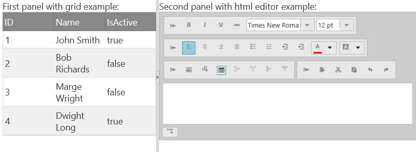
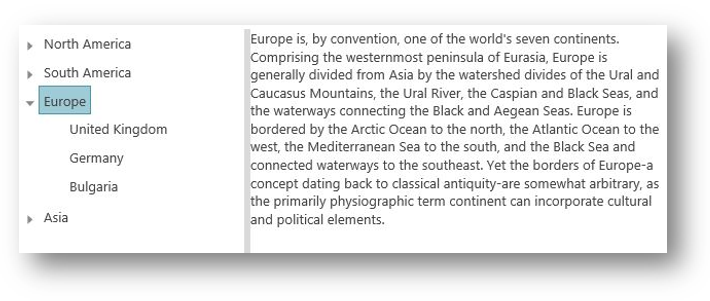

<!--
|metadata|
{
    "fileName": "adding-igsplitter",
    "controlName": "igSplitter",
    "tags": ["Getting Started","How Do I","Layouts","Tips and Tricks"]
}
|metadata|
-->

# Adding igSplitter

## Topic Overview
### Purpose

This topic demonstrates, with code examples, how to add the `igSplitter`™ control to an HTML page in either JavaScript or ASP.NET MVC.

### Required background

The following table lists the concepts and topics required as a prerequisite to understanding this topic.

**Topics**

- [Using JavaScript Resouces in Ignite UI](Deployment-Guide-JavaScript-Resources.html): This topic explains how to manage the required resources to work with Ignite UI® within a Web application.

- [igSplitter Overview](igSplitter-Overview.html): This topic provides conceptual information about the `igSplitter` control including its main features, minimum requirements, and user functionality.


### In this topic

This topic contains the following sections:

-   [Adding igSplitter – Conceptual Overview](#overview)
    -   [Adding igSplitter summary](#summary)
    -   [Requirements](#requirements)
    -   [Steps](#steps)
-   [Adding igSplitter in JavaScript – Procedure](#procedure-js)
    -   [Introduction](#js-introduction)
    -   [Preview](#js-preview)
    -   [Steps](#js-steps)
-   [Adding igSplitter in ASP.NET MVC – Procedure ](#mvc-procedure)
    -   [Introduction](#mvc-introduction)
    -   [Preview](#mvc-preview)
    -   [Steps](#mvc-steps)
-   [Adding igSplitter using TypeScript ](#ts-procedure)
    -   [Introduction](#ts-introduction)
    -   [Preview](#ts-preview)
    -   [Steps](#ts-steps)
-   [Related Content](#related-content)
    -   [Topics](#topics)
    -   [Samples](#samples)


## <a id="overview"></a>Adding igSplitter – Conceptual Overview
### <a id="summary"></a>Adding igSplitter summary

The `igSplitter` is control that initialize on DIV element with two child DIV elements with some content. You can set up the control without configuring any options. In this case, however, `igSplitter` will occupy the entire browser window so, unless this is exactly what you want, you should set container width and height to configure `igSplitter` to the desired size.


The width and height calls specify the size of the splitter on the page and their values can be specified in any unit of measure available in CSS.

### <a id="requirements"></a>Requirements

The following table summarizes the requirements for `igSplitter` control.

<table class="table">
	<thead>
		<tr>
            <th style="text-align:center;width:15%;"> Requirement / Required Resource </th>
            <th style="text-align:center;width:55%;"> Description </th>
            <th style="text-align:center;width:30%;"> What you need to do </th>
        </tr>
	</thead>
	<tbody>
        <tr>
            <td> jQuery and jQuery UI JavaScript resources </td>
            <td> Ignite UI is built on top of these frameworks:
                <ul>
                    <li> jQuery </li>
                    <li> jQuery UI </li>
                </ul>
            </td>
            <td> Add script references to both libraries in the `head` section of your page. </td>
        </tr>
        <tr>
            <td> Modernizr library (Optional) </td>
            <td>
                The Modernizr library is used by the igSplitter to detect browser and device capabilities. It is not mandatory and if not included the control will behave as if it works in a normal desktop environment with
                    HTML5 compatible browser.
                <ul>
                    <li> Modernizr </li>
                </ul>
            </td>
            <td> Add a script reference to the library in the `head` section of your page. </td>
        </tr>
        <tr>
            <td>
igSplitter JavaScript resources
			</td>
            <td>
                The igSplitter functionality of the Ignite UI library is distributed across several files. You can load the required resources in one of the following ways:
                <ul>
                    <li>
(Recommended)  [Use the Infragistics® Loader](Using-Infragistics-Loader.html) (igLoader™). You only need to include a script reference to
                        igLoader on your page.
					</li>
                    <li>
Load the required resources manually. You need to use the dependencies listed in the table below.
					</li>
                </ul>
                The following table lists the Ignite UI library dependences related to the igSplitter control. These resources need to be referred to explicitly if you chose to load resources manually (i.e. not to use
                    igLoader).
                <table class="table">
					<thead>
						<tr>
                            <th> JS Resource </th>
                            <th> Description </th>
                        </tr>
					</thead>
					<tbody>
										<tr>
											<td>
				infragistics.ui.splitter-en.js
							</td>
											<td>
				The igSplitter control’s language file
							</td>
										</tr>
										<tr>
											<td>
				infragistics.util.js
							</td>
											<td>
				Ignite UI utilities
							</td>
										</tr>
										<tr>
											<td>
				infragistics.ui.splitter.js
							</td>
											<td>
				The igSplitter control
							</td>
										</tr>
									</tbody>
				</table>
            </td>
            <td>
                Add one of the following:
                <ul>
                    <li>
A reference to igLoader
					</li>
                    <li>
A reference to all the required JavaScript files (listed in the table on the left).
					</li>
                </ul>
            </td>
        </tr>
        <tr>
            <td>
IG theme (Optional)
			</td>
            <td>
This theme contains the visual styles for the Ignite UI library. The theme file is:
                {IG CSS root}/themes/Infragistics/infragistics.theme.css
			</td>
            <td>
			</td>
        </tr>
        <tr>
            <td>
igSplitter structure
			</td>
            <td>
The styles from the following CSS file are used for rendering various elements of the control:
                {IG CSS root}/structure/modules/infragistics.ui.splitter.css
			</td>
            <td>
Add `style` reference to the file in your page.
			</td>
        </tr>
    </tbody>
</table>

>**Note:** It is recommended to use the igLoader component to load JavaScript and CSS resources. For information on how to do this, refer to the [Using Infragistics Loader](Using-Infragistics-Loader.html) topic. In addition to that, in the online [Ignite UI Samples Browser](%%SamplesUrl%%), you can find some specific examples on how to use the igLoader with the igSplitter component.

### <a id="steps"></a>Steps

Following are the general conceptual steps for adding `igSplitter` to an HTML page.

1. Adding references to required resources

2. Adding the `igSplitter` control

## <a id="procedure-js"></a>Adding igSplitter in JavaScript – Procedure
### <a id="js-introduction"></a>Introduction

This procedure guides you through the steps of adding an `igSplitter` control with basic functionality to an HTML page using a pure HTML/JavaScript implementation. It uses the Infragistics Loader component to load all Ignite UI resources needed by the `igSplitter` control.

### <a id="js-preview"></a>Preview

The following screenshot is a preview of the final result.


### <a id="js-steps"></a>Steps

The following steps demonstrate how to add a basic `igSplitter` control to a web page.

1. Add references to required resources.

	1. Organize the required files.

		A. Add the jQuery, jQueryUI, and Modernizr JavaScript resources to a folder named Scripts in the directory where your web page resides.

		B. Add the Ignite UI CSS files to a folder named Content/ig (For details, see the [Styling and Theming Ignite UI](Deployment-Guide-Styling-and-Theming.html) topic).

		C. Add the Ignite UI JavaScript files to a folder named Scripts/ig
		in your web site or application (For details, see the [Using JavaScript Resources in Ignite UI](Deployment-Guide-JavaScript-Resources.html) topics).

	2. Add the references to the required JavaScript libraries.

		Add references to the jQuery, jQuery UI and Modernizr libraries to the `head` section of your page:

		**In HTML:**

		```html
		<script  type="text/javascript" src="Scripts/jquery.js"></script>
		<script  type="text/javascript" src="Scripts/jquery-ui.js"></script>
		<script  type="text/javascript" src="Scripts/modernizr.js"></script>
		```

	3. Add a reference to `igLoader`.Include the `igLoader` script in the page:

		**In HTML:**

		```html
		<script  type="text/javascript" src="Scripts/ig/infragistics.loader.js"></script>
		```

	4. Load the required resources.

		Instantiate `igLoader`:

		**In HTML:**

		```html
		<script type="text/javascript">
		    $.ig.loader({
		        scriptPath: "Scripts/ig/",
		        cssPath: "Content/ig/",
		        resources: "igSplitter"
		    });
		<script>
		```

2. Add the `igSplitter` control.

	1. Add an HTML element to host `igSplitter`.

		Add an HTML div element to host `igSplitter` on the HTML page.

		**In HTML:**

		```html
		<div id="splitter">
			<div>
				First panel with grid example: <br />
				<div id="grid"></div>
			</div>
			<div>
				Second panel with html editor example: <br />
				<div id="htmlEditor"></div>
			</div>
		</div>
		```

	2. Instantiate `igSplitter`.

		Add the initialization code to a script element in the HTML page. The initialization code creates `igSplitter` instance in the div element added earlier.

		The following code creates an instance of the `igSplitter` control without specifying its container’s size.

		**In JavaScript:**

		```js
		$.ig.loader(function () {
			// Create a basic igSplitter control
			$("#splitter").igSplitter({
			});
		});
		```

		In most cases, you might want to specify the size of the instance. The following code configures the `igSplitter` container to be 400 x 600 pixels (width x height).

		```js
		$.ig.loader(function () {
		 // Create a basic igSplitter control
		 $("#splitter").igSplitter({
		     width: 400,
		     height: 600 });
		 });
		```


## <a id="mvc-procedure"></a>Adding igSplitter in ASP.NET MVC – Procedure

### <a id="mvc-introduction"></a>Introduction

This procedure guides you through the steps of adding an `igSplitter` with basic functionality to an ASP.NET MVC view. The example uses the ASP.NET MVC syntax together with the required Loader configuration.

### <a id="mvc-preview"></a>Preview

The following screenshot is a preview of the final result.



### <a id="mvc-steps"></a>Steps

The following steps demonstrate how to add a basic `igSplitter` control to an ASP.NET MVC application.

1. Add references to required resources.

	1. Organize the required files.

		 A. Add the jQuery, jQueryUI, and Modernizr JavaScript resources to a folder named Scripts in the directory where   your web page resides.

		 B. Add the Ignite UI CSS files to a folder named Content/ig (For details, see the [Styling and Theming Ignite UI](Deployment-Guide-Styling-and-Theming.html) topic).

		 C. Add the Ignite UI JavaScript files to a folder named Scripts/ig in your web site or application (For details, see the [Using JavaScript Resources in Ignite UI](Deployment-Guide-JavaScript-Resources.html)
		topics).

	2. Add the references to the required JavaScript libraries.Add references to the jQuery, jQuery UI and Modernizr libraries to the `head` section of your page:

		**In HTML:**

		```html
		<script  type="text/javascript" src="Scripts/jquery.js"></script>
		<script  type="text/javascript" src="Scripts/jquery-ui.js"></script>
		<script  type="text/javascript" src="Scripts/modernizr.js"></script>
		```

	3. Add a reference to `igLoader`.Include the `igLoader` script in the page:

		**In HTML:**

		```html
		<script  type="text/javascript" src="Scripts/ig/infragistics.loader.js"></script>
		```

	4. Adding the Loader MVC helper configuration for `igSplitter`.

		Add the following code to your ASP.NET MVC view.

		**In ASPX:**

		```csharp
		@(Html.Infragistics()
		    .Loader()
		    .ScriptPath("http://localhost/ig_ui/js/")
		    .CssPath("http://localhost/ig_ui/css/")
		    .Render()
		)
		```

2. Add the `igSplitter` control.

	1. Add an HTML element to host `igSplitter`.

		Add an HTML div element to host `igSplitter` on the HTML page.

		**In HTML:**

		```html
		<div id="splitter">
			<div>
				First panel with grid example: <br />
				<div id="grid"></div>
			</div>
			<div>
				Second panel with html editor example: <br />
				<div id="htmlEditor"></div>
			</div>
		</div>
		```

	2. Instantiate `igSplitter`. The following code creates an instance of the `igSplitter` control without specifying its container’s size.

		```csharp
		@(Html.Infragistics()
			.Splitter()
			.ID("splitter")
			.Height("300px")
			.Width("900px")
			.SplitterPanelSettings(p =>
			{
				p.AddPanel().Size("300px").Min("30px").Max("300px");
				p.AddPanel().Size("500px").Collapsible(true);
			})
			.Render()
		)
		```

		In most cases, you might want to specify the size of the instance. The following code configures the `igSplitter` container to be 400 x 600 pixels (width x height).

		```
		@(Html.Infragistics()
		    .ID("splitter")
		    .Height("400")
		    .Width("600")
		    .Render()
		)
		```


## <a id="ts-procedure"></a>Adding igSplitter using TypeScript – Procedure

### <a id="ts-introduction"></a>Introduction

The sample will demonstrate how to use the vertical `igSplitter` control to manage page's layout in TypeScript.
The first container contains a `igTree` control with countries and continents defined as TypeScript classes.
When a node is clicked, the description for the selected item is shown in the right panel.

### <a id="ts-preview"></a>Preview

The following screenshot is a preview of the final result.



### <a id="ts-steps"></a>Steps

The following steps demonstrate how to add a basic `igSplitter` control using TypeScript.

1. Add references to required resources.

	1. Include the Ignite UI theme and structural files:

		**In HTML:**
		```html
		<!-- Ignite UI Required Combined CSS Files -->
		<link href="http://cdn-na.infragistics.com/igniteui/%%ProductVersion%%/latest/css/themes/infragistics/infragistics.theme.css" rel="stylesheet" />
		<link href="http://cdn-na.infragistics.com/igniteui/%%ProductVersion%%/latest/css/structure/infragistics.css" rel="stylesheet" />
		```
	2. Add the JavaScript libraries ([modernizr](http://modernizr.com/) is optional):

		**In HTML:**
		```html
		<!-- JavaScript Library Dependencies -->
		<script src="http://modernizr.com/downloads/modernizr-latest.js"></script>
		<script src="http://code.jquery.com/jquery-1.9.1.min.js"></script>
		<script src="http://code.jquery.com/ui/1.10.3/jquery-ui.min.js"></script>
		```

	3. Include Ignite UI scripts. Preferably use a custom download, but you can also check ["Using JavaScript Resources in Ignite UI"](Deployment-Guide-JavaScript-Resources.html) topic for other methods.

		**In HTML:**
		```html
		<!-- Ignite UI Required Combined JavaScript Files -->
		<script src="http://cdn-na.infragistics.com/igniteui/%%ProductVersion%%/latest/js/infragistics.core.js"></script>
		<script src="http://cdn-na.infragistics.com/igniteui/%%ProductVersion%%/latest/js/infragistics.lob.js"></script>
		```
	4. Add reference path to where the TypeScript file for your application is located or external resources:

		**In HTML:**
		```html
		<script src="./TypeScript/sampleApp.js"></script>
		```
		**In HTML:**
		```html
		<script src="http://www.igniteui.com/data-files/continents-with-countries-and-cities.js"></script>
    	<script src="http://www.igniteui.com/TypeScriptSamples/splitter/typescript.js"></script>
		```

2. Add the `igSplitter` control.

	1. Add an HTML element to host `igSplitter`.

		Add an HTML div element to host `igSplitter` on the HTML page.

		**In HTML:**

		```html
		<div id="splitter">
			<div style="overflow: auto">
				<ul id="tree"></ul>
			</div>
			<div><p>Select a destination from tree.</p></div>
		</div>
		```

	2. Add data source
		```javascript
		var continentsWithCountries = [{
			"Text": "Europe",
			"Description": "Europe is..",
			"Countries": [{ "Text": "Bulgaria", "Description": "Bulgaria, officially .." }]
		}, {
			"Text": "Asia",
			"Description": "Asia is the world's largest..",
			"Countries": [{ "Text": "Japan", "Description": "Japan is an island.." }, { .. }]
		}, {
			"Text": "North America",
			"Description": "North America..",
			"Countries": [{ "Text": "United States", "Description": "The United States.." }]
		}];
		```
	3. Add ts implementation code and include the reference paths to the Ignite UI and jQuery type definitions for TypeScript:

		**In TypeScript:**
		```typescript
		/// <reference path="http://www.igniteui.com/js/typings/jquery.d.ts" />
		/// <reference path="http://www.igniteui.com/js/typings/jqueryui.d.ts" />
		/// <reference path="http://www.igniteui.com/js/typings/igniteui.d.ts" />
		declare var continentsWithCountries;

		$(function () {
			$("#splitter").igSplitter({
				height: "300px",
				panels: [{ size: 160, min: 100, max: 250 }]
			});
			$("#tree").igTree({
				dataSource: continentsWithCountries,
				bindings: {
					textKey: "Text",
					valueKey: "Text",
					childDataProperty: "Countries"
				}
			});
			$("#tree").on("igtreeselectionchanged", function (sender, eventArgs) {
				var node = eventArgs.selectedNodes[0];
				if (node.data.Description) {
					(<JQuery>$("#splitter").igSplitter("secondPanel")).html(node.data.Description);
				} else {
					(<JQuery>$("#splitter").igSplitter("secondPanel")).html("No information found.");
				}
			});
		});
		```


## <a id="related-content"></a>Related Content
### <a id="topics"></a>Topics

The following topics provide additional information related to this topic.

- [Configuring igSplitter](Configuring-igSplitter.html): This topic explains, with code examples, how to configure the `igSplitter` control.

- [Handling Events (igSplitter)](igSplitter-Handling-Events.html): This topic explains, with code examples, how to attach event handlers to the `igSplitter` control.

- [Accessibility Compliance (igSplitter)](igSplitter-Accessibility-Compliance.html): This topic explains the accessibility features of the `igSplitter` control and provides advice on how to achieve accessibility compliance for pages containing this control.

- [Known Issues and Limitations (igSplitter)](igSplitter-Known-Issues-and-Limitations.html): This topic provides information about the known issues and limitations of the `igSplitter` control.

- [jQuery and ASP.NET MVC Helper API Links (igSplitter)](igSplitter-jQuery-and-ASP.NET-MVC-Helper-API-Links.html): This topic provides links to the API documentation for the jQuery and its ASP.NET MVC helper class for the `igSplitter` control.

### <a id="samples"></a>Samples

The following samples provide additional information related to this topic.

- [Basic Vertical Splitter](%%SamplesUrl%%/splitter/basic-vertical-splitter): This sample demonstrates how to use the Splitter control to manage a page's vertical layout. The first container contains a Tree control with continents and countries. The left vertical panel has maximum and minimum ranges that a user can resize the panel. When a node is clicked, the description for the selected item is in the right panel.

- [Basic Horizontal Splitter](%%SamplesUrl%%/splitter/basic-horizontal-splitter): This sample demonstrates how to use the Splitter control to manage master/detail grid with horizontal layout. The first container contains a master grid with customers. After a row is clicked in master grid, in the second container is shown grid with orders that are made by this customer.

- [Nested Spitters](%%SamplesUrl%%/splitter/nested-splitters): This sample demonstrates how to manage layout with nested splitters. The panel contains a Tree with continents, countries and cities. When you click on a node the map in the second splitter is centered according node's coordinates. If a country is selected, then a grid is displayed under the map with cities in that country. Panels are not resizable by default.

- [ASP.NET MVC Basic Usage](%%SamplesUrl%%/splitter/aspnet-mvc-helper-splitter): This example demonstrates how you can utilize the ASP.NET MVC helper for the `igSplitter`.

- [Splitter API and Events](%%SamplesUrl%%/splitter/api-events-splitter): This sample demonstrates how to handle events in the `igSplitter` control and API usage.


