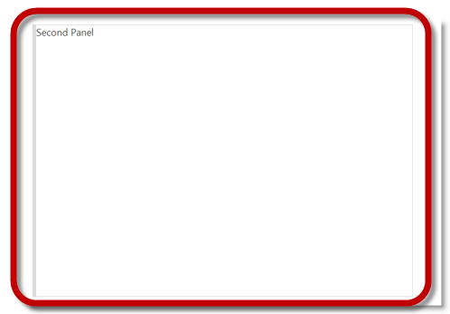
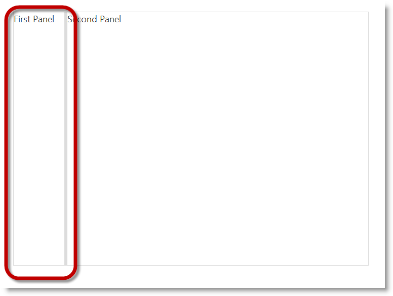
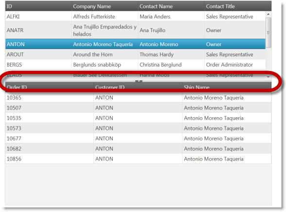

<!--
|metadata|
{
    "fileName": "configuring-igsplitter",
    "controlName": "igSplitter",
    "tags": ["Getting Started","How Do I","Layouts"]
}
|metadata|
-->

# Configuring igSplitter


## Topic Overview
### Purpose

This topic explains how to configure different features and behavior of the `igSplitter`™ control.

### Required background

The following topics are prerequisites to understanding this topic:

- [igSplitter Overview](igSplitter-Overview.html): This topic provides conceptual information about the `igSplitter` control including its features and user functionality.

- [Adding igSplitter](Adding-igSplitter.html): This topic demonstrates, with code examples, how to add the `igSplitter` control to an HTML page in either JavaScript and ASP.NET MVC.

### In this topic

This topic contains the following sections:

-   [igSplitter Configuration Overview](#overview)
    -   [igSplitter configuration summary](#summary)
    -   [igSplitter configuration summary chart](#config-summary-chart)
-   [Configuring the Initial States of the Panels (Collapsed/Expanded)](#config-initial-states)
    -   [Overview](#initial-state-overview)
    -   [Property settings](#initial-state-settings)
    -   [Example](#initial-state-example)
-   [Configuring the Initial Size of the Panels](#initial-size)
    -   [Overview](#initial-size-overview)
    -   [Property settings](#initial-size-settings)
    -   [Example](#initial-size-example)
-   [Configuring the Panels’ Resizing Limits](#resizing-limits)
    -   [Overview](#resizing-limits-overview)
    -   [Property settings](#resizing-limits-settings)
    -   [Example](#resizing-limits-example)
-   [Configuring the Orientation of the Splitter Bar](#splitter-orientation)
    -   [Overview](#orientation-overview)
    -   [Property settings](#orientation-settings)
    -   [Example](#orientation-example)
-   [Configuring the User Interaction Capabilities](#user-interaction-capabilities)
    -   [Overview](#user-interaction-overview)
    -   [Property settings](#user-interaction-settings)
    -   [Example](#user-interaction-example)
-   [Related Content](#related-content)
    -   [Topics](#topics)
    -   [Samples](#samples)


## <a id="overview"></a>igSplitter Configuration Overview
### <a id="summary"></a>igSplitter configuration summary

Configuring the `igSplitter` control includes specifying the splitter orientation, setting the sizes of its container and panels, configuring some default settings, and controlling the user’s ability to interact with the control (allowing/disallowing the user to expand/collapse or resize the panels). For details, refer to [igSplitter configuration summary chart](#config-summary-chart).

### <a id="config-summary-chart"></a>igSplitter configuration summary chart

The following table explains briefly the configurable aspects of the `igSplitter` control and maps them to the properties that configure them. Further details are available after the table.

<table class="table">
	<thead>
		<tr>
            <th>
Configurable aspect
			</th>

            <th>
Details
			</th>

            <th>
Properties
			</th>
        </tr>
	</thead>
	<tbody>
        

        <tr>
            <td>
Size
			</td>

            <td>
The size of container is configurable. Each of the two dimensions (width and height) is configured independently. By default, the size of the container is not set. In this case, igSplitter occupies the entire
                    browser window so, unless this is exactly what you want, you should set container width and height to configure igSplitter to the desired size.
			</td>

            <td>
                <ul>
                    <li>
[height](%%jQueryApiUrl%%/ui.igsplitter#options:height)
					</li>

                    <li>
[width](%%jQueryApiUrl%%/ui.igsplitter#options:width)
					</li>
                </ul>
            </td>
        </tr>

        <tr>
            <td>
[Panels’ initial states](#config-initial-states)
			</td>

            <td>
The initial state of the panels is configurable.
			</td>

            <td>
                <ul>
                    <li>
[collapsed](%%jQueryApiUrl%%/ui.igsplitter#options:collapsed)
					</li>
                </ul>
            </td>
        </tr>

        <tr>
            <td>
[Panels’ initial sizes](#initial-size)
			</td>

            <td>
The panels’ initial size is configurable.
			</td>

            <td>
                <ul>
                    <li>
[size](%%jQueryApiUrl%%/ui.igsplitter#options:size)
					</li>
                </ul>
            </td>
        </tr>

        <tr>
            <td>
[Panels’ resizing limits](#resizing-limits)
			</td>

            <td>
The limits within which the splitter bar can be moved by the user are configurable.
			</td>

            <td>
                <ul>
                    <li>
[min](%%jQueryApiUrl%%/ui.igsplitter#options:min)
					</li>

                    <li>
[max](%%jQueryApiUrl%%/ui.igsplitter#options:max)
					</li>
                </ul>
            </td>
        </tr>

        <tr>
            <td>
[Splitter bar orientation](#splitter-orientation)
			</td>

            <td>
The splitter bar orientation is managed through a dedicated property.
			</td>

            <td>
                <ul>
                    <li>
[orientation](%%jQueryApiUrl%%/ui.igsplitter#options:orientation)
					</li>
                </ul>
            </td>
        </tr>

        <tr>
            <td>
[User interaction capabilities](#user-interaction-capabilities)
			</td>

            <td>
Users’ interaction capabilities are configurable, meaning that you can allow or prevent users from resizing and/or expanding/collapsing the panels.
			</td>

            <td>
                <ul>
                    <li>
[collapsible](%%jQueryApiUrl%%/ui.igsplitter#options:collapsible)
					</li>

                    <li>
[resizable](%%jQueryApiUrl%%/ui.igsplitter#options:resizable)
					</li>
                </ul>
            </td>
        </tr>

        <tr>
            <td>
Drag delta
			</td>

            <td>
In order for the dragging movement of the splitter bar to begin, the mouse pointer has to be moved at a certain distance from its position. This distance limit, after which the actual dragging begins, is called “drag delta”. The drag delta
                    helps avoiding incidental dragging of the splitter bar. The default drag delta is 3 pixels. The drag delta is configurable through a dedicated property.
			</td>

            <td>
                <ul>
                    <li>
[dragDelta](%%jQueryApiUrl%%/ui.igsplitter#options:dragDelta)
					</li>
                </ul>
            </td>
        </tr>
    </tbody>
</table>


## <a id="config-initial-states"></a>Configuring the Initial States of the Panels (Collapsed/Expanded)
### <a id="initial-state-overview"></a>Overview

The initial state (collapsed/expanded) of the panels is configurable through the **collapsed** property of either of the panels. Setting this property configures the respective panel to the desired state and the other panel – to the opposite state. You need to set the property for only one of the panels. If the properties for both panels are set, the setting for the left/top panel override the setting for the right/bottom panel. (So, if, for example, both panels are set as collapsed, then the left/top panel will be collapsed and the right/bottom panel will be expanded.

Default value is false.

### <a id="initial-state-settings"></a>Property settings

The following table maps the desired configuration to its respective property settings. Note that you can achieve the same result by setting the **collapsed** property of any of the panels.

<table class="table">
	<thead>
		<tr>
            <th>
In order to:
			</th>

            <th>
Use this property:
			</th>

            <th>
Of this panel:
			</th>

            <th>
And set it to:
			</th>
        </tr>
	</thead>
	<tbody>
        

        <tr>
            <td rowspan="3">
Set the left/top panel as collapsed and the right/bottom panel as expanded. (The property has to be set for only one of the panels.)
			</td>

            <td>
**collapsed**
			</td>

            <td>
left/top panel
			</td>

            <td>
true
			</td>
        </tr>

        <tr>

            <th colspan="3">
or
			</th>
        </tr>

        <tr>

            <td>
**collapsed**
			</td>

            <td>
right/bottom panel
			</td>

            <td>
false
			</td>
        </tr>

        <tr>
            <td rowspan="3">
Set the right/bottom panel as collapsed and the left/top panel as expanded. (The property has to be set for only one of the panels.)
			</td>

            <td>
**collapsed **
			</td>

            <td>
right/bottom panel
			</td>

            <td>
true
			</td>
        </tr>

        <tr>

            <th colspan="3">
or
			</th>
        </tr>

        <tr>

            <td>
**collapsed**
			</td>

            <td>
left/top panel
			</td>

            <td>
false
			</td>
        </tr>
    </tbody>
</table>


### <a id="initial-state-example"></a>Example

The screenshot below demonstrates collapsed left panel and expanded right panel as a result of the following settings:

Property| Of this panel:| Value
---|---|---
collapsed|left/top panel| true




Following is the code that implements this example.

**In JavaScript:**

```js
$("#splitter").igSplitter({
	 width: 700,
	 panels: [{ collapsed: true }] 
});
```


## <a id="initial-size"></a>Configuring the Initial Size of the Panels
### <a id="initial-size-overview"></a>Overview

The panels’ initial size is configurable through the **size** property of each panel. Setting this property configures the respective panel to the desired width (when the splitter bar is vertical) or height (when the splitter bar is horizontal) in pixels and the other panel occupies the remaining space to the rim of the `igSplitter` container. You need to set the property for only one of the panels. If the properties for both panels are set, the setting for the left/top panel override the setting for the right/bottom panel. (So, if, for example, both panels are set to be 100 pixels wide/high in an `igSplitter` instance, then the left/top panel will be sized to 100 pixels and the right/bottom panel will occupy the remaining space between the splitter bar and the rim of the container. The panel size settings should not exceed the size the related dimension of the container (width with vertical splitter bar and height with horizontal splitter bar). The valid format of the values is integer number (indicating either pixels or percentages)..

By default, the panels have no set size are equal in size with the splitter bar positioned in the middle if the `igSplitter` container.

### <a id="initial-size-settings"></a>Property settings

The following table maps the desired configuration to its respective
property settings.

<table class="table">
	<thead>
		<tr>
            <th>
In order to:
			</th>

            <th>
Use this property:
			</th>

            <th>
Of this panel:
			</th>

            <th>
And set it to:
			</th>
        </tr>
	</thead>
	<tbody>
        

        <tr>
            <td rowspan="3">
Set the size panels.
			</td>

            <td>
**size **
			</td>

            <td>
left/top panel
			</td>

            <td>
The desired size of panels in pixels.
			</td>
        </tr>

        <tr>

            <th colspan="3">
or
			</th>
        </tr>

        <tr>

            <td>
**size**
			</td>

            <td>
right/bottom panel
			</td>

            <td>
The desired size of panels in pixels.
			</td>
        </tr>
    </tbody>
</table>


### <a id="initial-size-example"></a>Example

The screenshot below demonstrates an `igSplitter` control with its left panel set to be 100 pixels wide and Its right panel – 600 pixels wide as a result of the following settings:

Property | Of the: |Value
---|---|---
**size**|left panel|100
**width**|container|700




Following is the code that implements this example.

**In JavaScript:**

```js
$("#splitter").igSplitter({    width: 700,    panels: [{ size: 100 }]                 });
```


## <a id="resizing-limits"></a>Configuring the Panels’ Resizing Limits
### <a id="resizing-limits-overview"></a>Overview

The limits within which the splitter bar can be moved by the user are configurable. Resize limits are needed to ensure that the splitter bar could not be moved over desired position in the container. For example, you may want to set resizing limits to ensure that the content in a panel in that way it will not be hidden entirely from view.

Resizing limits are defined in pixels relative to the momentary position of the splitter bar. (The momentary position is the position in which the splitter bar is at the moment the limits are enforced.) There are two resizing limits, one for each direction in which the splitter bar can move, and respectively, a couple of corresponding properties that implement it:

-   The left/top resizing limit is defined as an outset to the left/top relative to the momentary position of the splitter bar. This limit allows user to move the splitter bar only as far left/up as the outset is from the bar’s momentary position. The left/top resizing limit is implemented by setting the min property of any of the panels.
-   The right/bottom resizing limit is defined as an outset to the right/bottom relative to the momentary position of the splitter bar. This limit allows user to move the splitter bar only as far right/down as the outset is from the bar’s momentary position. The right/bottom resizing limit is implemented by setting the max property of the panel.

When configuring the resizing limits, you need to set the **min** and **max** properties of only one of the panels. If the properties for both panels are set, the setting for the left/top panel override the setting for the right/bottom panel.

By default, no resizing limits are set.

### <a id="resizing-limits-settings"></a>Property settings

The following table maps the desired configuration to its respective
property settings.

<table class="table">
	<thead>
		<tr>
            <th>
In order to:
			</th>

            <th>
Use this property:
			</th>

            <th>
And set it to:
			</th>
        </tr>
	</thead>
	<tbody>
        

        <tr>
            <td>
Set both resizing limits
			</td>

            <td>
                <ul>
                    <li>
min
					</li>

                    <li>
max
					</li>
                </ul>
            </td>

            <td>
The desired value in pixels
			</td>
        </tr>

        <tr>
            <td>
Set the left/top resizing limit only
			</td>

            <td>
                <ul>
                    <li>
min
					</li>
                </ul>
            </td>

            <td>
The desired value in pixels
			</td>
        </tr>

        <tr>
            <td>
Set the right/bottom resizing limit only
			</td>

            <td>
                <ul>
                    <li>
max
					</li>
                </ul>
            </td>

            <td>
The desired value in pixels
			</td>
        </tr>
    </tbody>
</table>


### <a id="resizing-limits-example"></a>Example

The code below demonstrates a configuration in which the user will be able to move the splitter bar in a 400-pixel range between (100 pixels to the left and 300 pixels ro the right relative to the default position of the splitter bar (which the in the middle of the container). This configuration is achieved with the following settings:

Property| Value
---|---
**min**| 100
**max**|300


Following is the code that implements this example.

**In JavaScript:**

```js
$("#splitter").igSplitter({     panels: [{ min: 100, max: 300 }]              });
```


## <a id="splitter-orientation"></a>Configuring the Orientation of the Splitter Bar
### <a id="orientation-overview"></a>Overview

The splitter bar orientation is managed through a dedicated property.

### <a id="orientation-settings"></a>Property settings

The following table maps the desired configurations to its respective property settings.

In order to:| Use this property:| And set it to:
---|---|---
Set horizontal orientation of the splitter bar| **orientation**| horizontal
Set vertical orientation of the splitter bar| **orientation**|vertical


### <a id="orientation-example"></a>Example

The screenshot below demonstrates how the igSplitter control looks as a result of the following settings:

Property| Value
---|---
**orientation**|horizontal




Following is the code that implements this example.

**In JavaScript:**

```js
$("#splitter").igSplitter({                     
	orientation: "horizontal"
});
```


## <a id="user-interaction-capabilities"></a>Configuring the User Interaction Capabilities
### <a id="user-interaction-overview"></a>Overview

Users’ interaction capabilities are configurable, meaning that you can allow or prevent users from resizing and/or expanding/collapsing of the panels. By default, expanding/collapsing is disabled and resizing is enabled.

When resizing is disabled, users cannot move the splitter bar within `igSplitter`’s container.

When expanding/collapsing is disabled, users cannot expand/collapse `igSplitter`’s panels and the collapse/expand buttons are not available on the splitter bar.

You enable/disable users to resize and/or expand/collapse panels, respectively, with the **resizable** and **collapsible** panel properties. You need to set the property for only one of the panels. If the properties for both panels are set, the setting for the left/top panel override the setting for the right/bottom panel.

### <a id="user-interaction-settings"></a>Property settings

The following table maps the desired configuration to property settings.
<table class="table">
	<thead>
		<tr>
            <th>
In order to:
			</th>

            <th>
Use this property:
			</th>

            <th>
Of this panel:
			</th>

            <th>
And set it to:
			</th>
        </tr>
	</thead>
	<tbody>
        

        <tr>
            <td rowspan="3">
Disable resizing of panels.
			</td>

            <td>
**resizable**
			</td>

            <td>
left/top panel
			</td>

            <td>
false
			</td>
        </tr>

        <tr>
            <th colspan="3">
or
			</th>
        </tr>

        <tr>

            <td>
**resizable**
			</td>

            <td>
right/bottom panel
			</td>

            <td>
false
			</td>
        </tr>

        <tr>
            <td rowspan="3">
Enable resizing of panels.
			</td>

            <td>
**resizable**
			</td>

            <td>
left/top panel
			</td>

            <td>
true
			</td>
        </tr>

        <tr>

            <th colspan="3">
or
			</th>
        </tr>

        <tr>
            <td>
**resizable**
			</td>

            <td>
right/bottom panel
			</td>

            <td>
true
			</td>
        </tr>

        <tr>
            <td rowspan="3">
Enable expanding/collapsing of panels.
			</td>

            <td>
**collapsible**
			</td>

            <td>
left/top panel
			</td>

            <td>
false
			</td>
        </tr>

        <tr>
            <th colspan="3">
or
			</th>
        </tr>

        <tr>

            <td>
**collapsible**
			</td>

            <td>
right/bottom panel
			</td>

            <td>
false
			</td>
        </tr>

        <tr>
            <td rowspan="3">
Disable expanding/collapsing of panels.
			</td>

            <td>
**collapsible**
			</td>

            <td>
left/top panel
			</td>

            <td>
true
			</td>
        </tr>

        <tr>
            <th colspan="3">
or
			</th>
        </tr>

        <tr>
            <td>
**collapsible**
			</td>

            <td>
right/bottom panel
			</td>

            <td>
true
			</td>
        </tr>
    </tbody>
</table>


### <a id="user-interaction-example"></a>Example

The code below demonstrates an `igSplitter` control with resizing disabled, as a result of the following settings:

Property| Of this panel: |Value
---|---|---
resizable|left panel|false


Following is the code that implements this example.

**In JavaScript:**

```js
$("#splitter").igSplitter({ 
     panels: [{          
		resizable: false     
 	}]
});
```


## <a id="related-content"></a>Related Content
### <a id="topics"></a>Topics

The following topics provide additional information related to this topic.

- [Handling Events (igSplitter)](igSplitter-Handling-Events.html): The topics provide information and examples about the handling events of the `igSplitter` control.

- [Accessibility Compliance (igSplitter)](igSplitter-Accessibility-Compliance.html): This topic explains the accessibility features of the `igSplitter` control and provides advice on how to achieve accessibility compliance for pages containing this control.

- [Known Issues and Limitations (igSplitter)](igSplitter-Known-Issues-and-Limitations.html): This topic provides information about the known issues and limitations of the `igSplitter` control.

- [jQuery and ASP.NET MVC Helper API Links (igSplitter)](igSplitter-jQuery-and-ASP.NET-MVC-Helper-API-Links.html): This topic provides links to the API documentation for the jQuery and its ASP.NET MVC helper class for the `igSplitter` control.


### <a id="samples"></a>Samples

The following samples provide additional information related to this topic.

- [Basic Vertical Splitter](%%SamplesUrl%%/splitter/basic-vertical-splitter): This sample demonstrates how to use the Splitter control to manage a page's vertical layout. The first container contains a Tree control with continents and countries. The left vertical panel has maximum and minimum ranges that a user can resize the panel. When a node is clicked, the description for the selected item is in the right panel.

- [Basic Horizontal Splitter](%%SamplesUrl%%/splitter/basic-horizontal-splitter): This sample demonstrates how to use the Splitter control to manage master/detail grid with horizontal layout. The first container contains a master grid with customers. After a row is clicked in master grid, in the second container is shown grid with orders that are made by this customer.

- [Nested Spitters](%%SamplesUrl%%/splitter/nested-splitters): This sample demonstrates how to manage layout with nested splitters. The panel contains a Tree with continents, countries and cities. When you click on a node the map in the second splitter is centered according node's coordinates. If a country is selected, then a grid is displayed under the map with cities in that country. Panels are not resizable by default.

- [ASP.NET MVC Basic Usage](%%SamplesUrl%%/splitter/aspnet-mvc-helper-splitter): This example demonstrates how you can utilize the ASP.NET MVC helper for the `igSplitter`.

- [Splitter API and Events](%%SamplesUrl%%/splitter/api-events-splitter): This sample demonstrates how to handle events in the `igSplitter` control and API usage.


 

 


