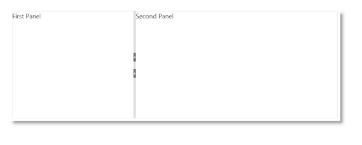

<!--
|metadata|
{
    "fileName": "igsplitter",
    "controlName": "igSplitter",
    "tags": ["Getting Started","Layouts"]
}
|metadata|
-->

# igSplitter

## In This Group of Topics
### Introduction

The topics in this group explain the `igSplitter`™ control and its use.

The `igSplitter` is a container control for managing layouts in HTML5 Web applications and sites by dividing the layout into two separate panels.

### Topics

- [igSplitter Overview](igSplitter-Overview.html): This topic provides conceptual information about the `igSplitter` control including its features and user functionality.

- [Adding igSplitter](Adding-igSplitter.html): This topic demonstrates, with code examples, how to add the `igSplitter` control to an HTML page in either JavaScript and ASP.NET MVC.

- [Configuring igSplitter](Configuring-igSplitter.html):This topic explains, with code examples, how to configure the `igSplitter` control.

- [Handling Events (igSplitter)](igSplitter-Handling-Events.html): This topic explains, with code examples, how to attach event handlers to the `igSplitter` control.

- [Accessibility Compliance (igSplitter)](igSplitter-Accessibility-Compliance.html): This topic explains the accessibility features of the `igSplitter` control and provides advice on how to achieve accessibility compliance for pages containing this control.

- [Known Issues and Limitations (igSplitter)](igSplitter-Known-Issues-and-Limitations.html): This topic provides information about the known issues and limitations of the `igSplitter` control.

- [jQuery and ASP.NET MVC Helper API Links (igSplitter)](igSplitter-jQuery-and-ASP.NET-MVC-Helper-API-Links.html): This topic provides links to the API documentation for the jQuery and its ASP.NET MVC helper class for the `igSplitter` control.

 

 

