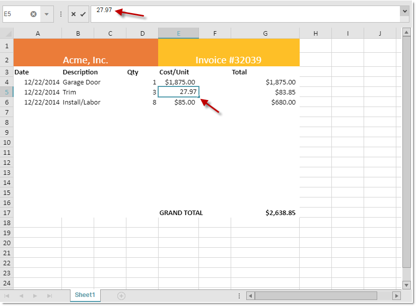
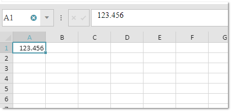

<!--
|metadata|
{
    "fileName": "igspreadsheet-editing",
    "controlName": "igSpreadsheet",
    "tags": []
}
|metadata|
-->

# Editing API (igSpreadsheet)

## Topic Overview
### Purpose
This topic provides an overview of the control API related to the spreadsheet editing.

### Required background
To understand this topic you need to be familiar with the concept and topics related to the [Infragistics JavaScript Excel Library](javascript-excel-library.html).

### In this topic

This topic contains the following sections:

-   [Introduction](#introduction)
-   [Events](#events)
-   [Methods](#methods)
-   [Options](#navigation)
- 	[Related Links](#related_link)


## <a id="introduction"></a>Introduction
You can edit spreadsheet content "in-place" using an editor positioned over cell which is being edited or in the formula editor. The control exposes API, which can be used to extract information about the cell, format data that is entered, cancel editing, etc. The following screenshot shows an excel workbook, while one of its cell is in edit mode.



## <a id="events"></a>Events
The following table presents the events related to the cell editing functionality. Below you can find some user scenarios that can take advantage of those events.

| Event			| Description     																	|
| ------------- 	|:-------------:																	|
| [`editModeEntering`](%%jQueryApiUrl%%/ui.igspreadsheet#events:editModeEntering)  | Invoked when the Spreadsheet is about to start in-place editing of the [`activeCell`](%%jQueryApiUrl%%/ui.igspreadsheet#options:activeCell).    |
| [`editModeEntered`](%%jQueryApiUrl%%/ui.igspreadsheet#events:editModeEntered)    | Invoked when the Spreadsheet has started in-place editing of the [`activeCell`](%%jQueryApiUrl%%/ui.igspreadsheet#options:activeCell). 	|
| [`editModeExiting`](%%jQueryApiUrl%%/ui.igspreadsheet#events:editModeExiting)    | Invoked when the Spreadsheet is about to end the in-place editing of the [`activeCell`](%%jQueryApiUrl%%/ui.igspreadsheet#options:activeCell). 	|
| [`editModeExited`](%%jQueryApiUrl%%/ui.igspreadsheet#events:editModeExited)      | Invoked when the Spreadsheet has ended the in-place editing of the [`activeCell`](%%jQueryApiUrl%%/ui.igspreadsheet#options:activeCell). 	|
| [`editModeValidationError`](%%jQueryApiUrl%%/ui.igspreadsheet#events:editModeValidationError)    |  Invoked when the Spreadsheet is exiting edit mode and the new value for the [`activeCell`](%%jQueryApiUrl%%/ui.igspreadsheet#options:activeCell) is not valid based on the criteria of that cell's [`ig.excel.DataValidationRule`](%%jQueryApiUrl%%/ig.excel.DataValidationRule).	|

If you want to cancel editing of all the cells, then you just need to cancel [`editModeEntering`](%%jQueryApiUrl%%/ui.igspreadsheet#events:editModeEntering) event:
```
$("#spreadsheet1").igSpreadsheet({
    height: "600",
    width: "100%",
    editModeEntering: function(evt, ui) {
        return false;
    }
});
```

If you want to show notification, when editing of a cell has finished and spreadsheet is updated, then you can use the [`editModeExited`](%%jQueryApiUrl%%/ui.igspreadsheet#events:editModeExited) event:
```
$("#spreadsheet1").igSpreadsheet({
    height: "600",
    width: "100%",
    editModeExited: function(evt, ui) {
        $("$notification").html("Cell " + ui.cell + " has been update");
    }
});
```

## <a id="methods"></a>Methods
The following table shows the methods that the spreadsheet exposes, in order to get the current editing status of the spreadsheet.

| Method			| Description     																	|
| ------------- 	|:-------------:																	|
| [`getIsInEditMode`](%%jQueryApiUrl%%/ui.igspreadsheet#methods:getIsInEditMode)  | Indicates if the control is currently editing the value of the [`activeCell`](%%jQueryApiUrl%%/ui.igspreadsheet#options:activeCell).    |
| [`getCellEditMode`](%%jQueryApiUrl%%/ui.igspreadsheet#methods:getCellEditMode)    | Returns an enumeration used to indicate the current edit mode state. 	|


## <a id="options"></a>Options
Entering a lot of numbers, with decimal places, in the spreadsheet, can happen in a faster manner, if the options from the table below are used. This will allow the control to automatically format the entered number, with the defined decimal places.

| Option			| Description     																	|
| ------------- 	|:-------------:																	|
| [`isFixedDecimalEnabled`](%%jQueryApiUrl%%/ui.igspreadsheet#options:isFixedDecimalEnabled)  | Indicates whether a fixed decimal place is automatically added when a whole number is entered while in edit mode.   |
| [`fixedDecimalPlaceCount`](%%jQueryApiUrl%%/ui.igspreadsheet#options:fixedDecimalPlaceCount)    | Number of decimal places by which a whole number typed in during edit mode should be adjusted. 	|

Enabling this feature, setting decimal places to 3 and entering the value of 123456 in a spreadshett cell, will result in 123.456, after the cell exits edit mode.

```
$("#spreadsheet1").igSpreadsheet({
    height: "600",
    width: "100%",
    isFixedDecimalEnabled: true,
    fixedDecimalPlaceCount: 3
});
```



## <a id="related_link"></a>Related Links

-	[igSpreadsheet Overview](igspreadsheet-overview.html)
-   [Configuring igSpreadsheet](configuring-igspreadsheet.html)
-   [igSpreadsheet API](%%jQueryApiUrl%%/ui.igspreadsheet)
