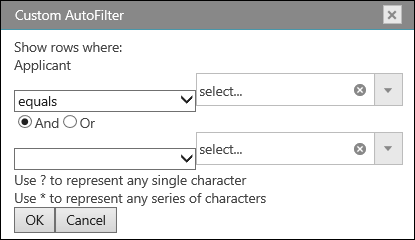

<!--
|metadata|
{
    "fileName": "images/igspreadsheet-filter-dialog",
    "controlName": "igSpreadsheet",
    "tags": []
}
|metadata|
-->

# igSpreadsheet Filter Dialog

## Topic Overview
### Purpose
This topic explains what operations can be performed by the user with the control’s filter dialog to create or modify complex filters in a column.

### Required background
To understand this topic you need to be familiar with the concept and topics related to the [Infragistics JavaScript Excel Library](javascript-excel-library.html) and [igSpreadsheet](igSpreadsheet_Feature_Overview.html).

### In this topic
This topic contains the following sections:

-   [Introduction](#introduction)
- 	[Filter Dialog for Worksheet](#worksheet_dialog)
- 	[Filter Dialog for Table](#table_dialog)
- 	[Related Links](#related_links)

## <a id="introduction"></a>Introduction



### Filter dialog summary

The {SpreadsheetName} control provides a filter dialog which is opened by clicking on the dropdown button in the header row of either a loaded worksheet or created table. The filter dialog will change based on the field that was interacted with.

## <a id="worksheet_dialog"></a>Filter Dialog for Worksheet

### Code Example
The following example code demonstrates how to show the filter dialog for the first relative column in a worksheet region's filter settings. A region can be assigned with the SetRegion method exposed from the Worksheet.FilterSettings. 

```js
var executed = $(".selector").igSpreadsheet("showFilterDialogForWorksheet", 0);
```
## <a id="table_dialog"></a>Filter Dialog for Table

### Code Example
The following example code demonstrates how to show the filter dialog for the first column in a worksheet table, specified by it's index.

```js
var executed = $(".selector").igSpreadsheet("showFilterDialogForTable", table.columns(0));

```

## <a id="related_links"></a>Related Links
-   [igSpreadsheet Overview](igSpreadsheet-Overview.html)
-   [igSpreadsheet Activation And Navigation Interaction](igspreadsheet-activation-and-navigation-interactions.html)
-   [igSpreadsheet Feature Overview](igSpreadsheet-Feature-Overview.html)
-   [igSpreadsheet API](%%jQueryApiUrl%%/ui.igspreadsheet)