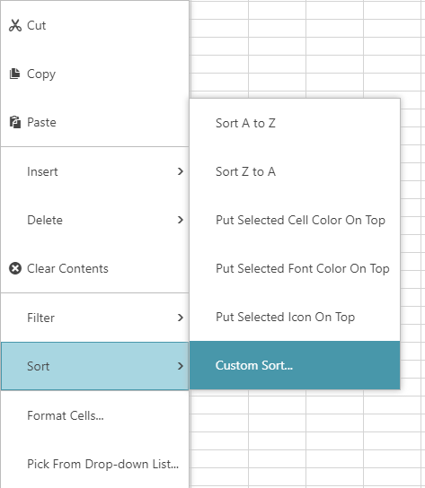

<!--
|metadata|
{
    "fileName": "images/igspreadsheet-sort-dialog",
    "controlName": "igSpreadsheet",
    "tags": []
}
|metadata|
-->

# igSpreadsheet Custom Sort Dialog

## Topic Overview
### Purpose
This topic explains what operations can be performed by the user with the control’s custom sort dialog to create multiple sort conditions for columns or rows present in a table, worksheet, or filter region.

### Required background
To understand this topic you need to be familiar with the concept and topics related to the following: 
-  [Infragistics JavaScript Excel Library](javascript-excel-library.html)  
- [igSpreadsheet Overview](igSpreadsheet_Feature_Overview.html).

### Sort Dialog summary
The igSpreadsheet control provides a custom sort dialog, aimed at sorting multiple columns in a defined order.

The dialog can be opened by first displaying up the igSpreadsheet's context menu. This can be achieved by either right-clicking or pressing (Alt + Shift + F10) on a cell that pertains to a worksheet, filter region or table. Next, select the Sort option followed by Custom Sort option (as shown in the image below) and the dialog will appear.

To start an initial sort condition, you must fullfill three categories. *Note, the dialog defaults to column sorting. You may change this to Row sorting, but not both, by using the Options button at the top of the dialog. 

* *Column or Row* - The minimum requirement for a sort condition to be applied. Defaults are provided for both Sort On and Order fields.
* *Sort On* - There are four distinct options for sorting, 'Font Color', 'Cell Color', 'Cell Value', and 'Conditional Formatting Icon'. See screenshot below for more details.
* *Order* - When 'Font Color' is selected from the Sort On field, the colors from the cell's foreground become the available as Order options. When 'Cell Color' is selected from the Sort On field, the unique colors from the cell's background become the available order options. When 'Cell Values' is selected from the Sort on field the Order can be sorted (A to Z) or (Z to A) for letters and symbols. When the values contain numeric values the Order can be sorted (Smallest to Largest) or (Largest to Smallest). When Conditional Formatting Icon is selected from the Sort On field, the order of rows will be based on the icons themselves. 

The following image is an example of all four *Sort On* options:

## Related Links
-   [igSpreadsheet Overview](igSpreadsheet-Overview.html)
-   [igSpreadsheet Activation And Navigation Interaction](igspreadsheet-activation-and-navigation-interactions.html)
-   [igSpreadsheet Feature Overview](igSpreadsheet-Feature-Overview.html)
-   [igSpreadsheet API](%%jQueryApiUrl%%/ui.igspreadsheet)