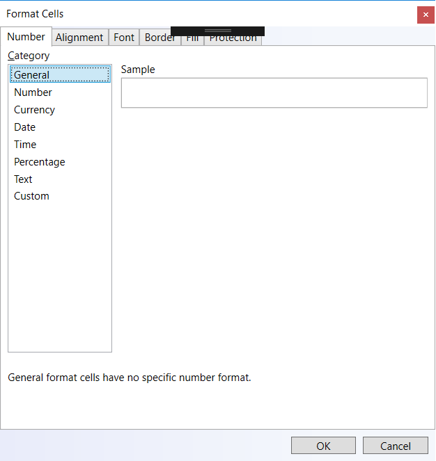

<!--
|metadata|
{
    "fileName": "igspreadsheet-FormatCell-Dialog",
    "controlName": "igSpreadsheet",
    "tags": ["FormatCell Dialog"]
}
|metadata|
-->

# igSpreadsheet FormatCell Dialog

### Purpose

The FormatCellsDialog lets you change many of the ways in which data is displayed in a Spreadsheet cell. For example, you can specify the number of digits to the right of a decimal point, or you can add a pattern and border to the cell. You can access and modify the majority of these settings in the Format Cells dialog box
This topic explains various settings of FormatCellsDialog and how they will affect the way cell data is presented.

### Required Background

To understand this topic you need to be familiar with the concept and topics related to the [Infragistics JavaScript Excel Library](javascript-excel-library.html) and [igSpreadsheet](igSpreadsheet-Feature-Overview.html). 

### In this Topic

This topic explain that Format Cells dialog has six individual tabs which provide different settings to modify the cell data:

-   [Number](#number)
- 	[Alignment](#alignment)
- 	[Font](#font)
- 	[Border](#border)
- 	[Fill](#fill)
- 	[Protection](#protection)

## Number Tab

Excel has a large array of built-in number formats from which you can choose. To use one of these formats, click any one of the categories below General and then select the option that you want for that format. When you select a format from the list, Excel automatically displays an example of the output in the Sample box on the Number tab. For example, if you type 1.23 in the cell and you select Number in the category list, with three decimal places, the number 1.230 is displayed in the cell.

### The following table lists all of the available built-in number formats:

Number format |Notes
---|---
Number| Options: the number of decimal places, whether or not the thousands separator is used, and the format to be used for negative numbers.
Currency| Options: the number of decimal places, the symbol used for the currency, and the format to be used for negative numbers. This format is used for general monetary values.
Date| Select the style of the date from the Type list box.
Time| Select the style of the time from the Type list box.
Percentage| Multiplies the existing cell value by 100 and displays the result with a percent symbol
Text| Cells formatted as text will treat anything typed into the cell as text, including numbers.

## Alignment Tab

You can position text and numbers by using the Alignment tab in the Format Cells dialog.

- Text Alignment : Using this setting you can control the horizontal, vertical alignment and indention of the text.
- Text Control : There are some additional miscellaneous text alignment controls in the Text Control section of the Alignment tab. These controls are Wrap Text, Shrink to Fit and Merge Cells.

## Font Tab
You can use the Font tab in the Format Cells dialog box to set a font and control its attributes like point size, font style, underlining, color, and effects.

## Border Tab
You can use this tab to customize the cells' borders from their default settings by changing the line style, line thickness or line color.

## Fill Tab

Use this tab to set the background color of the selected cells. You can also use the Pattern Color or Pattern Style to apply color patterns or different styles of patterns to the background of the cell.

## Protection Tab
The Protection tab offers you an option for protecting your worksheet data and formulas:

- Locked

However, this option takes effect only when you protect your worksheet.

## Related Links
-   [igSpreadsheet Overview](igSpreadsheet-Overview.html)
-   [igSpreadsheet Feature Overview](igSpreadsheet-Feature-Overview.html)
-   [igSpreadsheet API](%%jQueryApiUrl%%/ui.igspreadsheet)