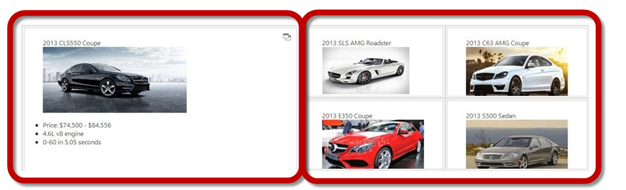
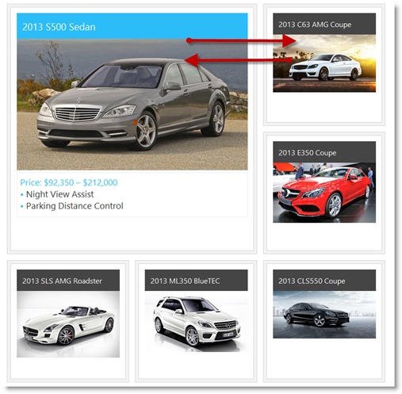

<!--
|metadata|
{
    "fileName": "igtilemanager-overview",
    "controlName": "igTileManager",
    "tags": ["Getting Started","Layouts"]
}
|metadata|
-->

# igTileManager Overview

## Topic Overview
### Purpose

This topic provides conceptual information about the `igTileManager`™ control including its main features, minimum requirements, and user functionality.

### Required background

The following topics are prerequisites to understanding this topic:

- [igLayoutManager Overview, Grid Layout section](igLayoutManager-Overview.html): This section provides a conceptual overview of the Grid layout of the the `igLayoutManager`™ control.

- [igSplitter Overview](igSplitter-Overview.html): This topic provides conceptual information about the `igSplitter`™ control including its features and user functionality.

### In this topic

This topic contains the following sections:

-   [**Introduction**](#introduction)
    -   [igTileManager summary](#summary)
    -   [igTileManager tile states](#tile-states)
    -   [igTileManager operational modes](#operational-modes)
-   [**User Interactions and Usability**](#user-interaction)
    -   [User interactions summary](#user-interaction-summary)
    -   [User interactions summary chart](#user-interaction-summary-chart)
-   [**Main Features**](#main-features)
    -   [Main features summary](#main-features-summary)
    -   [Features based on igLayoutManager’s Grid layout](#igLayourManager-grid-layout)
    -   [Features based on igSplitter](#based-on-igsplitter)
    -   [igTileManager specific features](#specific-features)
-   [**Touch Support**](#touch-support)
-   [**Default Configuration**](#default-configuration)
-   [**Requirements**](#requirements)
-   [**igTileManager Configuration Overview**](#config-overview)
    -   [igTileManager configuration summary](#config-summary)
    -   [igTileManager configuration summary chart](#config-summary-chart)
-   [**Related Content**](#related-content)
    -   [Topics](#topics)
    -   [Samples](#samples)

## Introduction
### igTileManager summary

The grid layout of the `igTileManager` is based on [igLayoutManager‘s Grid Layout](#igLayourManager-grid-layout) and the control provides corresponding layout configurations for each tile in terms to position (row and column spans) and dimensions (row and column position). Each tile can be configured to display content according to its state – minimized or maximized. The `igTileManager` is integrated with the `igSplitter` control; as a result, tiles are organized (by default) into two panels – Maximized Tile panel and Minimized Tiles panel. The Maximized Tile panel displays one tile at a time (the maximized one) and the Minimized Tiles panel displays the minimized tiles. The Minimized Tiles panel has a scrollbar enabled by default that allows scrolling the minimized tiles.

Users interact with the control by selecting the tile to maximize and scrolling the Minimized Tiles panel. They can also resize the panels relatively to each other with the splitter bar. (For details, refer to [User Interactions and Usability](#user-interaction).)

Any %%ProductName%%® control can be placed inside those tiles thus enabling moving and resizing of tiles, and changing the state of the tiles at run-time.

### igTileManager tile states

`igTileManager` tiles have two states – minimized and maximized. The tiles are fed with different content for each state.

-   Minimized – this is the “regular” state of the tile. In this state, the tile usually presents its information in summary form. From this state, the tile can go to its Maximized state.
-   Maximized – this is the state which puts the focus on the tile and delivers the entire content that the tile represents. From this state, the tile can back to its Minimized state.

### igTileManager operational modes

The mode specifies how maximized tiles are displayed. Initially, the `igTileManager` renders all tiles as minimized and placed in a single container. When the user selects a tile, it maximizes differently depending on the operational mode set for the control. The following operational modes are supported:

-   Dual Panel mode (default) – the container is split into two panels as described and illustrated in [igTileManager summary](#summary).
-   Single Panel mode – the container exposes a single panel. At a pre-defined index position in the internal grid, a tile is displayed in its maximized state while all other tiles are in minimized state. (The maximized tile may span over a several rows and columns to better accommodate the maximized content.) When the user selects a tile to maximize, it swaps its position with the previously maximized tile and displays its Maximized state content.

The operational mode is managed with the [maximizedTileIndex](%%jQueryApiUrl%%/ui.igtilemanager) property. The valid settings for this property are the existing position indexes of the tiles. When the `maximizedTileIndex` property is not set, `igTileManager` will maximize tiles in Dual Panel mode. When the `maximizedTileIndex` property is set, `igTileManager` will maximize tiles in Single Panel mode using the tile at the specified index position as the location for displaying the maximized tile.

## User Interactions and Usability
### User interactions summary

The user clicks/taps a minimized tile to maximize it and display its whole content. The maximized tile is sent to the Maximized Tile panel. The previously selected tile is minimized and sent to the Minimized Tiles panel. Users can resize the panels relatively to each other with the splitter bar to enlarge the maximized tile or to show more of the minimized tiles. They can also navigate through the minimized tiles using the scrollbar.

### User interactions summary chart

The following table summarizes the user interaction capabilities of the `igTileManager` control.

The user can… | Using… |Details |Configurable?
---|---|---|---
Maximize a tile |A mouse click on a minimized tile |Maximizing can be enabled (default) or disabled with the [preventMaximizingSelector](%%jQueryApiUrl%%/ui.igtilemanager#options:preventMaximizingSelector) property.|
Minimize a maximized tile |The Minimize button ()|The minimize button is rendered in the upper right corner of the maximized tile.|
Resize the panels|The splitter bar|The splitter can be disabled and hidden from view by setting the [showSplitter](%%jQueryApiUrl%%/ui.igtilemanager#options:showSplitter) option to false.|
Scroll the Minimized Tiles panel|The scroll bar|The scroll bar can be prevented from appearing by setting the [showRightPanelScroll](%%jQueryApiUrl%%/ui.igtilemanager#options:showRightPanelScroll) option to false.|

## Main Features
### Main features summary

The features of the `igTileManager` control are a sum of the features of the controls that comprise it: `igLayoutManager`‘s Grid Layout, and `igSplitter` specific features plus a few features that are specific to `igTileManager` only. So `igTileManager`’s main features can be grouped into the following categories (Follow the links for details.):

-   [Features based on igLayoutManager’s Grid layout](#igLayourManager-grid-layout)
-   [Features based on igSplitter](#based-on-igsplitter)
-   [igTileManager specific features](#specific-features)

### Features based on igLayoutManager’s Grid layout

`igTileManager` is built on top of `igLayoutManager` grid algorithm – complex absolutely positioned tiles – which allows for merging rows and columns. The picture below demonstrates `igTileManager` instantiated on the existing markup in a container.

When the `igTileManager` control in its Dual Panel operational mode, a certain number of columns must be explicitly reserved to accommodate the Maximized Tile panel. For details, see [Configurable number of rows and columns in the Minimized Tiles panel](igTileManager-Configuring.html#config-rows-columns).

### Features based on igSplitter

The two-panel layout exposed by `igTileManager` in its Dual Panel operational mode and the features related to that layout are based entirely on the `igSplitter` control. The following table summarizes the `igSplitter` features that are specific to the `igTileManager` control. Further details about the base control are available in the `igSplitter` group of topics.

Feature|Description
---|---
Two-panel layout|The `igSplitter` control provides two-panel layout for `igTileManager` – one for the maximized (selected) tile and one for the minimized ones. 
Resizable panels|The panels are resizable relative to each other by moving the splitter bar within the splitter control. When the splitter bar is shifted in the direction of one of the panels, this sizes the panel down accordingly and the other panel sizes up accordingly. By default, the panels are resizable. When the panels are resized, the minimized tiles in the Minimized Tiles panel are re-arranged to fill the panel. The maximized tile in the Maximized Tile panel is enlarged or shrunk, depending on the resizing. Panels resizing can be disabled by setting the [showSplitter](%%jQueryApiUrl%%/ui.igtilemanager) option to false. 
Drag support for panel resizing|By default, the `igSplitter` control supports mouse dragging for resizing panels. Users can resize the panels by dragging the splitter bar. Releasing the mouse button after the drag movement resizes the panels according to the new position of the splitter bar.

### igTileManager specific features

The following table summarizes the main features of the `igTileManager` control.

####Data binding

When connected to a data source, the `igTileManager` automatically displays it in a series of tiles.

####States

A tile displays different content depending on whether it is minimized and maximized. That is why each of these two states is configured individually using the [minimizedState](%%jQueryApiUrl%%/ui.igtilemanager#options:minimizedState) and `maximizedState` properties respectively. These properties take selectors as their value and the tile displays the content of the corresponding elements when in the respective state.

-   The Minimized state is the state of the tile when it is minimized and resides in the Minimized Tiles panel.
-   The Maximized state displays the full content of the selected tile and would show the entire content of the tile.

Minimized state viewport (All tiles are in minimized state.)

Maximized state viewport (One of the tiles is maximized and all the others are in minimized state.)

####Fluid design

The `igTileManager` control exposes fluid design when column width of the grid is defined in percentages. In this case, the tiles resize to fit the available space dictated by the user's screen resolution. Thus the tiles retain their positions no matter what the size of the container is.

####Responsive web design

The `igTileManager` control exposes fluid design when column width of the grid is defined in pixels. In this case, the tiles re-arrange when their container is resized to fit best in the space. Such rearranging occurs every time a tile is maximized or when the panels are resized with the splitter bar or the orientation of the device changes.

####Animated transitions

The transition of a tile from one state to another is animated with a swap effect: when a tile is maximized and the user clicks any of the minimized tiles, the clicked tile and the maximized one are seemingly swapping their places.

Animation can be disabled by setting the [animationDuration](%%jQueryApiUrl%%/ui.igtilemanager#options:animationDuration) option to 0. In this case, the clicked minimized tile will just appear in the Maximized Tile panel as maximized.

**Related topic:**

-   [Configuring igTileManager](igTileManager-Configuring.html)

Scrollable Minimized Tiles panel

The scroll bar of the Minimized Tiles panel allows users to navigate to the minimized tiles that are not visible. Such scrolling can be disabled by setting the [showRightPanelScroll](%%jQueryApiUrl%%/ui.igtilemanager#options:showRightPanelScroll) option to false. If the scrollbar is disabled, users will only see only as much minimized tiles as the current size of the Minimized Tiles panel can accommodate. The only way to show more minimized tiles in this case would be to enlarge the Minimized Tiles panel using the splitter.

####Configurable tile sizes and positions

The internal grid that contains the tiles can be configured to have a certain number of rows and columns using the [cols](%%jQueryApiUrl%%/ui.igtilemanager#options:cols) and [rows](%%jQueryApiUrl%%/ui.igtilemanager#options:rows) options. This way the size and the positions of the tiles will be automatically calculated for placement in the desired number of rows and columns.

**Related topic:**

-   [**Configuring *igTileManager***](igTileManager-Configuring.html)

Configurable initially maximized tile

It is possible to specify which tile to be initially maximized when the `igTileManager` control is rendered. This is done by providing the index number of the tile to be maximized as the value of the [maximizedTileIndex](%%jQueryApiUrl%%/ui.igtilemanager#options:maximizedTileIndex) option.

>**Note:** If you set an initially maximized tile, no Minimized Tiles panel will be rendered to host the minimized tiles and the control will operate in Single Panel mode.

####Configurable number of rows and columns in the Minimized Tiles panel

The rows and columns of the internal grid in the Minimized Tiles panel can be pre-defined using the [rightPanelCols](%%jQueryApiUrl%%/ui.igtilemanager#options:rightPanelCols) option. This option has effect only in Dual Panel mode.

**Related topic:**

-   [Configuring igTileManager](igTileManager-Configuring.html)

####Configurable tile margins

The margins of the minimized tiles define the space around each tile in the grid. The top and the left margin of the minimized tiles are configurable thus forming an outset between the tiles. Tiles’ margins are configured with the [marginTop](%%jQueryApiUrl%%/ui.igtilemanager#options:marginTop) and [marginLeft](%%jQueryApiUrl%%/ui.igtilemanager#options:marginLeft) options.

## Touch Support

For touch-enabled devices, special classes are added to the tile manager and touch events are handled. On touch-enabled devices, the splitter bar is a bit wider (16 pixels of width) than it is on standard devices (6 pixels) to allow for easier user interaction with the splitter bar in the touch environment. For details, refer to [Touch Support for %%ProductName%% Controls](Touch-Support-for-NetAdvantage-for-jQuery-Controls.html).

## Default Configuration

With its default settings, the `igTileManager` control renders tiles with items from markup and without left and top margin. All tiles fit in the container in equal number of columns and rows depending on the number of the tiles. The default configuration does not include any margins.

## Requirements

The `igTileManager` control is a jQuery UI widget and, therefore, depends on the jQuery and jQuery UI libraries. The Modernizr library is also needed because the `igSplitter` depends on it. References to these resources are needed nevertheless, in spite of the use of pure jQuery or ASP.NET MVC helpers. The Infragistics.Web.Mvc assembly is required when the control is used in the context of ASP.NET MVC.

The CSS files for the `igTileManager`, `igLayoutManager`, `igSplitter` and should be referenced in your page for the correct rendering of the control.

Width and height should be defined for the `
` element that will contain the control.

For the `igTileManager` to display data, you should provide some data to the control or bind it to a data source.

For the full requirements listing, refer to the [Adding igTileManager](igTileManager-Adding.html) topic.

## igTileManager Configuration Overview
### igTileManager configuration summary

The main configurable aspects of the `igTileManager` control are the:

-   Number of rows and columns
-   Individual columns
-   Item position and span
-   Tile states
-   Minimized Tiles panel
-   Animated transitions’ duration
-   User interaction

Each of these aspects is explained in [**Configuring igTileManager**](#config-overview).

### igTileManager configuration summary chart

The following table lists the configurable aspects of the `igTileManager` control. Further details about most of the aspects are available in the sections following this summary table.

<table class="table table-bordered">
	<thead>
		<tr>
            <th colspan="2">
Configurable aspect
			</th>

            <th>
Details
			</th>

            <th>
JavaScript properties
			</th>

            <th>
ASP.NET MVC properties
			</th>
        </tr>
	</thead>
	<tbody>
        

        <tr>
            <td rowspan="2">
[Number of rows and columns](igTileManager-Configuring.html#config-rows-columns)
			</td>

            <td>
Number of rows
			</td>

            <td>
The number of rows and columns to be rendered in the tile grid is configurable.
			</td>

            <td>
                <ul>
                    <li>
[rows](%%jQueryApiUrl%%/ui.igtilemanager#options:rows)
					</li>
                </ul>
            </td>

            <td>
                <ul>
                    <li>
[Row()](Infragistics.Web.Mvc~Infragistics.Web.Mvc.TileManagerModel~Rows.html)
					</li>
                </ul>
            </td>
        </tr>

        <tr>
            <td>
Number of columns
			</td>

            <td>

			</td>

            <td>
                <ul>
                    <li>
[cols](%%jQueryApiUrl%%/ui.igtilemanager#options:cols)
					</li>
                </ul>
            </td>

            <td>
                <ul>
                    <li>
[Coll()](Infragistics.Web.Mvc~Infragistics.Web.Mvc.TileManagerModel~Cols.html)
					</li>
                </ul>
            </td>
        </tr>

        <tr>
            <td rowspan="4">
[Individual columns](igTileManager-Configuring.html#column-dimentions)
			</td>

            <td>
Column height
			</td>

            <td>
The width and height of each individual column in the tile grid are configurable.
			</td>

            <td>
                <ul>
                    <li>
[columnHeight](%%jQueryApiUrl%%/ui.igtilemanager#options:columnHeight)
					</li>
                </ul>
            </td>

            <td>
                <ul>
                    <li>
[ColumnHeight()](Infragistics.Web.Mvc~Infragistics.Web.Mvc.TileManagerModel~ColumnHeight.html)
					</li>
                </ul>
            </td>
        </tr>

        <tr>
            <td>
Column width
			</td>

            <td>

			</td>

            <td>
                <ul>
                    <li>
[columnWidth](%%jQueryApiUrl%%/ui.igtilemanager#options:columnWidth)
					</li>
                </ul>
            </td>

            <td>
                <ul>
                    <li>
[ColumnWidth()](Infragistics.Web.Mvc~Infragistics.Web.Mvc.TileManagerModel~ColumnWidth.html)
					</li>
                </ul>
            </td>
        </tr>

        <tr>
            <td>
Tile left margin
			</td>

            <td>
The top and left margins for each tile in the tile grid are configurable.
			</td>

            <td>
                <ul>
                    <li>
[marginLeft](%%jQueryApiUrl%%/ui.igtilemanager#options:marginLeft)
					</li>
                </ul>
            </td>

            <td>
                <ul>
                    <li>
[MarginLeft()](Infragistics.Web.Mvc~Infragistics.Web.Mvc.TileManagerModel~MarginLeft.html)
					</li>
                </ul>
            </td>
        </tr>

        <tr>
            <td>
Tile top margin
			</td>

            <td>

			</td>

            <td>
                <ul>
                    <li>
[marginTop](%%jQueryApiUrl%%/ui.igtilemanager#options:marginTop)
					</li>
                </ul>
            </td>

            <td>
                <ul>
                    <li>
[MarginTop()](Infragistics.Web.Mvc~Infragistics.Web.Mvc.TileManagerModel~MarginTop.html)
					</li>
                </ul>
            </td>
        </tr>

        <tr>
            <td>
**Operational mode**
			</td>

            <td>
Number of panels and placement of the maximized tile
			</td>

            <td>
You can specify whether to display the maximized tile in a separate panel or in the same panel together with the minimized tiles. In the latter case, the position of the maximized tile inside the panel is configurable.
			</td>

            <td>
                <ul>
                    <li>
[maximizedTileIndex](%%jQueryApiUrl%%/ui.igtilemanager#options:maximizedTileIndex)
					</li>
                </ul>
            </td>

            <td>
                <ul>
                    <li>
[MaximizedTileIndex()](Infragistics.Web.Mvc~Infragistics.Web.Mvc.TileManagerModel~MaximizedTileIndex.html)
					</li>
                </ul>
            </td>
        </tr>

        <tr>
            <td rowspan="2">
[Item position and span](igTileManager-Configuring.html#config-positions-span)
			</td>

            <td>
Item position
			</td>

            <td>
The position of an item in the tile grid can be configured be specifying the row and indexes of the desired position.
			</td>

            <td>
                <ul>
                    <li>
[rowIndex](%%jQueryApiUrl%%/ui.igtilemanager#options:rowIndex)
					</li>

                    <li>
[colIndex](%%jQueryApiUrl%%/ui.igtilemanager#options:colIndex)
					</li>
                </ul>
            </td>

            <td>
                <ul>
                    <li>
[RowIndex()](Infragistics.Web.Mvc~Infragistics.Web.Mvc.TileManagerModel~Items.html)
					</li>

                    <li>
[ColIndex()](Infragistics.Web.Mvc~Infragistics.Web.Mvc.TileManagerModel~Items.html)
					</li>
                </ul>
            </td>
        </tr>

        <tr>
            <td>
Item size
			</td>

            <td>
Items can be configured to span over several rows and columns to accommodate larger items.
			</td>

            <td>
                <ul>
                    <li>
[rowSpan](%%jQueryApiUrl%%/ui.igtilemanager#options:rowSpan)
					</li>

                    <li>
[colSpan](%%jQueryApiUrl%%/ui.igtilemanager#options:colSpan)
					</li>
                </ul>
            </td>

            <td>
                <ul>
                    <li>
[RowSpan()](Infragistics.Web.Mvc~Infragistics.Web.Mvc.TileManagerModel~Items.html)
					</li>

                    <li>
[ColSpan()](Infragistics.Web.Mvc~Infragistics.Web.Mvc.TileManagerModel~Items.html)
					</li>
                </ul>
            </td>
        </tr>

        <tr>
            <td rowspan="2">
[Tile states](#tile-states)
			</td>

            <td>
Minimized state
			</td>

            <td>
Tile state is configured individually for each state.
			</td>

            <td>
                <ul>
                    <li>
[minimizedState](%%jQueryApiUrl%%/ui.igtilemanager#options:minimizedState)
					</li>
                </ul>
            </td>

            <td>
                <ul>
                    <li>
[MinimizedState()](Infragistics.Web.Mvc~Infragistics.Web.Mvc.TileManagerModel~MinimizedState.html)
					</li>
                </ul>
            </td>
        </tr>

        <tr>
            <td>
Maximized state
			</td>

            <td>

			</td>

            <td>
                <ul>
                    <li>
[maximizedState](%%jQueryApiUrl%%/ui.igtilemanager#options:maximizedState)
					</li>
                </ul>
            </td>

            <td>
                <ul>
                    <li>
[MaximizedState()](Infragistics.Web.Mvc~Infragistics.Web.Mvc.TileManagerModel~MaximizedState.html)
					</li>
                </ul>
            </td>
        </tr>

        <tr>
            <td rowspan="2">
[Tiles’ margins](igTileManager-Configuring.html#config-tiles-margin)
			</td>

            <td>
Top margin
			</td>

            <td>
The top and the left margin of the minimized tiles are configurable thus forming an outset between the tiles.
			</td>

            <td>
                <ul>
                    <li>
[marginTop](%%jQueryApiUrl%%/ui.igtilemanager#options:marginTop)
					</li>
                </ul>
            </td>

            <td>
                <ul>
                    <li>
[MarginTop()](Infragistics.Web.Mvc~Infragistics.Web.Mvc.TileManagerModel~MarginTop.html)
					</li>
                </ul>
            </td>
        </tr>

        <tr>
            <td>
Left margin
			</td>

            <td>

			</td>

            <td>
                <ul>
                    <li>
[marginLeft](%%jQueryApiUrl%%/ui.igtilemanager#options:marginLeft)
					</li>
                </ul>
            </td>

            <td>
                <ul>
                    <li>
[MarginLeft()](Infragistics.Web.Mvc~Infragistics.Web.Mvc.TileManagerModel~MarginLeft.html)
					</li>
                </ul>
            </td>
        </tr>

        <tr>
            <td rowspan="5">
[Minimized Tiles panel](igTileManager-Configuring.html#config-minimized-tile-panel)
			</td>

            <td>
Number of columns
			</td>

            <td>
The number of columns to be rendered in the Minimized Tiles panel is configurable.
			</td>

            <td>
                <ul>
                    <li>
[rightPanelCols](%%jQueryApiUrl%%/ui.igtilemanager#options:rightPanelCols)
					</li>
                </ul>
            </td>

            <td>
                <ul>
                    <li>
[RightPanelCols()](Infragistics.Web.Mvc~Infragistics.Web.Mvc.TileManagerModel~RightPanelCols.html)
					</li>
                </ul>
            </td>
        </tr>

        <tr>
            <td>
Minimized tiles’ width
			</td>

            <td>
The width of the tiles in the Minimized Tiles panel is configurable.
			</td>

            <td>
                <ul>
                    <li>
[rightPanelTilesWidth](%%jQueryApiUrl%%/ui.igtilemanager#options:rightPanelTilesWidth)
					</li>
                </ul>
            </td>

            <td>
                <ul>
                    <li>
[RightPanelTilesWidth()](Infragistics.Web.Mvc~Infragistics.Web.Mvc.TileManagerModel~RightPanelTilesWidth.html)
					</li>
                </ul>
            </td>
        </tr>

        <tr>
            <td>
Minimized tiles’ height
			</td>

            <td>
The height of the tiles in the Minimized Tiles panel is configurable.
			</td>

            <td>
                <ul>
                    <li>
[rightPanelTilesHeight](%%jQueryApiUrl%%/ui.igtilemanager#options:rightPanelTilesHeight)
					</li>
                </ul>
            </td>

            <td>
                <ul>
                    <li>
[RightPanelTilesHeight()](Infragistics.Web.Mvc~Infragistics.Web.Mvc.TileManagerModel~RightPanelTilesHeight.html)
					</li>
                </ul>
            </td>
        </tr>

        <tr>
            <td>
Scrollbar
			</td>

            <td>
You can specify whether the Minimized Tiles panel should expose a scrollbar if the tiles are overflowing. When the scrollbar is disabled, the user might need to move the splitter to display the tiles that are out of sight.
			</td>

            <td>
                <ul>
                    <li>
[showRightPanelScroll](%%jQueryApiUrl%%/ui.igtilemanager#options:showRightPanelScroll)
					</li>
                </ul>
            </td>

            <td>
                <ul>
                    <li>
[ShowRightPanelScroll()](Infragistics.Web.Mvc~Infragistics.Web.Mvc.TileManagerModel~ShowRightPanelScroll.html)
					</li>
                </ul>
            </td>
        </tr>

        <tr>
            <td>
Splitter bar visibility
			</td>

            <td>
You can specify whether the splitter to be shown or not. By default, the splitter bar is visible.
			</td>

            <td>
                <ul>
                    <li>
[showSplitter](%%jQueryApiUrl%%/ui.igtilemanager#options:showSplitter)
					</li>
                </ul>
            </td>

            <td>
                <ul>
                    <li>
[ShowSplitter()](Infragistics.Web.Mvc~Infragistics.Web.Mvc.TileManagerModel~ShowSplitter.html)
					</li>
                </ul>
            </td>
        </tr>

        <tr>
            <td rowspan="2">
[Animated transitions’ duration](igTileManager-Configuring.html#config-animation-duration)
			</td>

            <td>
Transition duration upon container re-size
			</td>

            <td>
The duration of the animated transitions, upon both container re-sizing and changing the tile state (minimizing/maximizing) is configured with the animationDuration option and, consequently, always have same durations.
			</td>

            <td>
                <ul>
                    <li>
[animationDuration](%%jQueryApiUrl%%/ui.igtilemanager#options:animationDuration)
					</li>
                </ul>
            </td>

            <td>
                <ul>
                    <li>
[AnimationDuration()](Infragistics.Web.Mvc~Infragistics.Web.Mvc.TileManagerModel~AnimationDuration.html)
					</li>
                </ul>
            </td>
        </tr>

        <tr>
            <td>
Transition duration upon tile minimizing/maximizing
			</td>

            <td>

			</td>

            <td>

			</td>

            <td>

			</td>
        </tr>

        <tr>
            <td>
**User interaction**
			</td>

            <td>
Maximization trigger
			</td>

            <td>
You can specify elements of a minimized tile that will not trigger maximizing. By default, clicking on `<a>` and `<input>` tags does not trigger maximizing.
			</td>

            <td>
                <ul>
                    <li>
[preventMaximizingSelector](%%jQueryApiUrl%%/ui.igtilemanager#options:preventMaximizingSelector)
					</li>
                </ul>
            </td>

            <td>
                <ul>
                    <li>
[PreventMaximizingSelector()](Infragistics.Web.Mvc~Infragistics.Web.Mvc.TileManagerModel~PreventMaximizingSelector.html)
					</li>
                </ul>
            </td>
        </tr>
    </tbody>
</table>

## Related Content
### Topics

The following topics provide additional information related to this topic.

- [Adding igTileManager](igTileManager-Adding.html): This topic demonstrates, with code examples, how to add the `igTileManager` control to an HTML page in either JavaScript or ASP.NET MVC. This topic covers initializing `igTileManager` on the HTML markup.

- [Binding igTileManager to Data](igTileManager-Binding.html): This topic explains how to bind the `igTileManager` control to a JavaScript array, XML data, strongly typed MVC View, and to a JSON response from a remote service.

- [Configuring igTileManager](igTileManager-Configuring.html): This topic explains how to configure the features and behavior of the `igTileManager` control.

- [Handling Events (igTileManager)](igTileManager-Handling-Events.html): This topic explains, with code examples, how to attach event handlers to the `igTileManager` control.

- [Accessibility Compliance (igTileManager)](igTileManager-Accessibility-Compliance.html): This topic explains the accessibility features of the `igTileManager` control and provides information on how to achieve accessibility compliance for pages containing this control.

- [Known Issues and Limitations (igTileManager)](igTileManager-Known-Issues-and-Limitations.html): This topic provides information about the known issues and limitations of the `igTileManager` control and the available workarounds for them.

-  [jQuery and ASP.NET MVC Helper API Links (igTileManager)](igTileManager-jQuery-and-ASP.NET-MVC-Helper-API-Links.html): This topic lists the links to the API reference documentation for jQuery and its ASP.NET MVC helper class for the `igTileManager` control.

### Samples

The following samples provide additional information related to this topic.

- [ASP.NET MVC Basic Usage](%%SamplesUrl%%/tile-manager/aspnet-mvc-helper): This sample demonstrates using the ASP.NET MVC helper for the `igTileManager` control.

- [Tile Manager Binding to JSON](%%SamplesUrl%%/tile-manager/bind-json): This sample demonstrates binding the `igTileManager` control to JSON data source.

- [Tile Manager Item Configurations](%%SamplesUrl%%/tile-manager/item-configurations): This sample demonstrates configuring the tiles inside the `igTileManager` in terms of position and size.

- [Tile Manager Leading Tile Configuration](%%SamplesUrl%%/tile-manager/leading-tile): This sample demonstrates instantiating the `igTileManager` on existing markup in a container with a configuration that defines a leading tile. The leading tile swaps with the rest of the tiles upon expanding.

 

 

