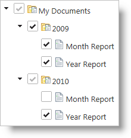
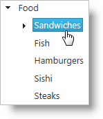
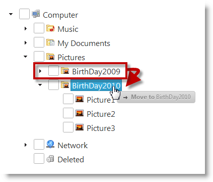

<!--
|metadata|
{
    "fileName": "igtree-overview",
    "controlName": "igTree",
    "tags": ["Getting Started"]
}
|metadata|
-->

# igTree Overview

## Topic Overview
### Purpose
This topic provides conceptual information for the `igTree`™ control including information regarding: features, binding to data sources, requirements, and templates.

### In this topic
This topic contains the following sections:

-   [Required background](#required-background)
-   [Main Features](#main-features)
    -   [Features overview](#features-overview)
    -   [Load on demand](#load-on-demand)
    -   [Checkboxes](#checkboxes)
    -   [Navigation & Selection](#navigation-and-selection)
    -   [Adding and Removing Nodes](#adding-and-removing-nodes)
    -   [Drag-and-Drop](#drag-and-drop)
    -   [ASP.NET MVC Helper](#asp-mvc-helper)
-   [Requirements](#requirements)
    -   [Introduction](#requirements-introduction)
    -   [Requirements chart](#requirements-chart)
-   [Binding to Data Sources](#binding-to-data-sources)
    -   [Requirements for binding](#requirements-for-binding)
    -   [Supported data sources](#supported-data-sources)
    -   [Binding to data sources overveiw](#binding-to-data-sources-overview)
    -   [Class diagram for binding to data sources](#class-diagram)
    -   [Template use chart](#template-use-chart)
    -   [Template selection chart](#template-selection-chart)
-   [User Interaction and Usability](#user-interaction-and-usability)
    -   [User interactions chart](#user-interactions-chart)
-   [Related Topics](#related-topics)

## Required background 
The table belows lists the required background you need to fully understand the information in this topic.

Background type | Content
---|---
Topics | You need to first read the following topics: [%%ProductName%% Overview](NetAdvantage-for-jQuery-Overview.html)   [Using JavaScript Resources in %%ProductName%%](Deployment-Guide-JavaScript-Resources.html)   [Styling and Theming %%ProductName%%](Deployment-Guide-Styling-and-Theming.html)   [igGrid/igDataSource Architectural Overview](igGrid-igDataSource-Architecture-Overview.html), The Data Source Control section
External Resources | You need to first read the following article: [Working with jQuery Widgets](http://wiki.jqueryui.com/w/page/12137708/How%20to%20use%20jQuery%20UI%20widgets)

## Main Features 
### Features overview 
The table below briefly explains the main features of the `igTree`.

Feature | Description
---|---
Load on demand | Load-on-demand is the primary way to optimize the `igTree` control’s performance by only creating HTML elements for data displayed to the user and requesting data only as needed.
Checkboxes | Checkboxes are available in either bi-state or tri-state modes to facilitate multiple selection. In tri-state mode, the selection cascades where checking a parent node will select all child nodes.
Navigation & Selection | The `igTree` control has a rich keyboard interaction model for navigating, selecting, expanding, and collapsing nodes.
Node Images | Nodes can have their own custom images to provide more detail about an item or to customize the look and feel.
Adding and Removing Nodes | The Adding and Removing Nodes feature of the `igTree` control enables users to add and remove tree nodes.
Drag-and-Drop | The Drag-and-Drop feature of the `igTree` control enables users to drag-and-drop tree nodes. Dragging and dropping can be performed within the same tree or between two different trees.
ASP.NET MVC Helper | You can use managed .NET code to configure the `igTree` control.

## Load on demand 
Load on demand is the primary way to optimize the `igTree` control’s performance by only creating HTML elements for data displayed to the user or requesting data only as needed. When enabled for local data, the `igTree` control only creates the necessary markup for nodes when they are expanded and brought into view. When binding to remote data, the `igTree` control makes an AJAX request for new data and creates HTML elements as needed from the server when a node is expanded.

### Related Topics

[Optimize the igTree’s Performance](igTree-Optimize-Performance.html)

## Checkboxes
Checkboxes are available in either bi-state or tri-state modes to facilitate multiple selection. In tri-state mode, the selection cascades where checking a parent node selects all child nodes. Similarly if a child checkbox is checked or unchecked, the checked state is represented in the parent checkbox with checked, partial, or unchecked states.

### Related Topics

[Configure Checkboxes and Selection](igTree-Configure-Checkboxes-And-Selection.html)

## Navigation & Selection 
The `igTree` control has a rich keyboard interaction model for navigating, selecting, expanding, and collapsing nodes. See the user interaction and usability section below for more details.

### Related Topics

[Configure Checkboxes and
Selection](igTree-Configure-Checkboxes-And-Selection.html)

## Node Images 
Custom node image support is available for the `igTree` control. Images can be configured through binding, CSS, or templates and separate images can be used for parent nodes and leaf nodes.

### Related Topics

[Configure Nodes for igTree](igTree-Configure-Nodes.html)

## Adding and Removing Nodes 
The Adding and Removing Nodes feature of the `igTree` control enables users to add and remove tree nodes.

### Related Topics

[Adding and Removing Nodes](igTree-Adding-Removing-Nodes.html)

## Drag-and-Drop 
The Drag-and-Drop feature of the `igTree` control enables users to
drag-and-drop tree nodes.

Dragging-and-drop can be performed within the same `igTree` control or between two `igTree` controls. The latter is configured in addition to the “normal” (within the same tree) drag-and-drop. You can specify the way in which you want the Drag-and-Drop feature to operate. This is managed by configuring one of the several supported [Drag-and-Drop modes](igTree-Drag-and-Drop-Configuring-Mode.html).

### Related Topics

[Drag-and-Drop](igTree-Drag-and-Drop.html)

[Configuring Drag-and-Drop Modes](igTree-Drag-and-Drop-Configuring-Mode.html)

## ASP.NET MVC Helper 
You can use the ASP.NET MVC Helper to use managed code languages to configure the `igTree` control. Using the MVC helpers allows you to take advantage of re-usable Views or ViewModels in your ASP.NET MVC applications. Further, you can bind to a collection of IQueryable collections in ASP.NET and the helper will generate the JSON data for the `igTree` control to use on the client.

### Related Topics

- [Getting Started with igTree](igTree-Getting-Started.html)

- [Configure Load on Demand](igTree-Optimize-Performance.html)

## Requirements
### Introduction 
The `igTree` control is a jQuery UI Widget and therefore is dependent on the jQuery and jQuery UI JavaScript libraries. In addition, there are several %%ProductName%%™ JavaScript resources that the `igTree` control uses for shared functionality and data binding. The JavaScript references are required whether the `igTree` control is used in a pure JavaScript context or in ASP.NET MVC. When using the `igTree` control in ASP.NET MVC, the Infragistics.Web.Mvc assembly is required to configure the `igTree` control with .NET languages.

### Requirements chart 
The table below lists the requirements for the `igTree` control.

Requirement | Description
---|---
jQuery and jQuery UI JavaScript resources | %%ProductName%% is built on top of these frameworks: [jQuery](http://jquery.com/) [jQuery UI](http://jqueryui.com/) [Templating Engine Overview](igTemplating-Overview.html) (for node templates)
Shared %%ProductName%% JavaScript resources | There are several shared JavaScript resources in %%ProductName%% that most widgets use: `infragistics.util.js` infragistics.ui.shared.js
`igDataSource` JavaScript Resources | The `igTree` control uses the `igDataSource` internally for data operations: `infragistics.dataSource.js`
`igTree` JavaScript resources | The JavaScript file for the `igTree` control: `infragistics.ui.tree.js`
IG Theme | This theme contains custom visual styles created especially for %%ProductName%%
Base Theme | The base theme contains styles that primarily define the form and function for each control.

## Binding to Data Sources 
## Requirements for binding 
The following table lists the requirements for binding the `igTree` control to data sources grouped by requirement category.

Requirement category | Requirements listing
---|---
Data structure | Can be any of the following:  Well-formed JSON or XML supplied locally or from a web server   Nested UL HTML elements  OData services  JSONP IQueryable in ASP.NET MVC
Data types | String  Number  Boolean  Image URL

## Supported data sources 
The following table lists the supported data sources and some basic specifics for their binding

Data Source | Binding
---|---
[igDataSource](igDataSource-igDataSource-Overview.html)|The `igDataSource` component is used internally by the `igTree` control to manage data operations for the control. The data source accepts many different types of local and remote data. 
Nested HTML UL elements | The `igTree` control can be instantiated with an existing unordered list (UL) or nested UL elements.
[`IQueryable<T>`](http://msdn.microsoft.com/en-us/library/bb351562.aspx) |In ASP.NET MVC, supply an IQueryable as the `igTree` control’s datasource and the collection is serialized to JSON and returned with the View for use in the browser.

## Binding to data sources overview 
In most cases, you will use the `dataSource` or `dataSourceUrl` options of the `igTree` control to bind to data. This approach provides data to the `igDataSource` component which can handle the various supported data formats. The one main exception to using this approach is when the `igTree` control is instantiated using UL elements. The `igTree` control inherits the data and options of its base UL elements. In ASP.NET MVC, supplying a collection of IQueryable objects to the ASP.NET MVC Helper serializes the data from the server and passes it to the View. Once the page is received by the browser, the `dataSource` option of the `igTree` control is set for client-side operation.

## Class diagram for binding to data sources 
The following class diagram demonstrates how data binding works.

## Template use chart 
The table below lists the `igTree` control templates and their possible uses.

Template | Use with igTree
---|---
Node |By setting the `nodeContentTemplate` option of the binding object, you can define custom HTML which will be shown for each node in the `igTree` control.

## Template selection chart 
The table below maps some of your possible needs to the appropriate templates.

If you need to… | Then use this template:
---|---
Display custom HTML for each node on a certain level of hierarchy|`nodeContentTemplate`

## User Interaction and Usability 
### User interactions chart 
The table below briefly explains the user interaction capabilities of the `igTree` control.

If you need to… | Then use this template:
---|---
Display custom HTML for each node on a certain level of hierarchy | `nodeContentTemplate`

## Related Topics 
Following are some other topics you may find useful.

-   [%%ProductName%% Overview](NetAdvantage-for-jQuery-Overview.html)
-   [Using JavaScript Resources in %%ProductName%%](Deployment-Guide-JavaScript-Resources.html)
-   [Styling and Theming %%ProductName%%](Deployment-Guide-Styling-and-Theming.html)
-   [igGrid/igDataSource Architectural Overview](igGrid-igDataSource-Architecture-Overview.html)
-   [Optimize the igTree’s Performance](igTree-Optimize-Performance.html)
-   [Configure Checkboxes and Selection for igTree](igTree-Configure-Checkboxes-And-Selection.html)
-   [Configure Nodes for igTree](igTree-Configure-Nodes.html)
-   [Adding and Removing Nodes](igTree-Adding-Removing-Nodes.html)
-   [Drag-and-Drop](igTree-Drag-and-Drop.html)
-   [igTree jQuery API documentation](%%jQueryApiUrl%%/ui.igtree#!overview)
-   [igTree ASP.NET MVC API documentation](Infragistics.Web.Mvc~Infragistics.Web.Mvc.TreeModel_members.html)

 

 

