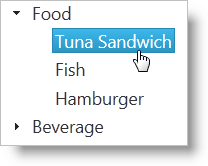

<!--
|metadata|
{
    "fileName": "igtree-getting-started",
    "controlName": "igTree",
    "tags": ["Data Binding","Getting Started"]
}
|metadata|
-->

# Getting Started with igTree


## Topic Overview
### Purpose

The `igTree`™ control can be configured to run using jQuery or using the ASP.NET MVC Helper. This topic demonstrates how to setup an `igTree` control in each of these environments binding to JSON data on the client and a collection of business object on the server.

### Required background
You need to first read the following topics:

-   [Using JavaScript Resources in %%ProductName%%](Deployment-Guide-JavaScript-Resources.html)
-   [Styling and Theming in %%ProductName%%](Deployment-Guide-Styling-and-Theming.html)

## Create a basic igTree implementation
### Introduction
The following steps will demonstrate how to configure basic options and bind to data using both jQuery and the ASP.NET MVC Helper.

### Preview
Following is a preview of the final result where the tree is bound to hierarchical data.



### Overview
Following is a conceptual overview of the process:

1.  [Instantiating the igTree](#instantiating-the-igtree)
2.  [Binding to Data](#binding-to-data)
3.  [Configuring Bindings](#configuring-bindings)
4.  [(Optional) Configuring the singleBranchExpand option](#configuring-singlebranchexpand)

### Steps
1.  <a id="instantiating-the-igtree"></a>Instantiate the `igTree`.
    1.  Set a target element.

        On your web page, define a target HTML element which serves as the base object for the igTree control and set its ID. This is an optional step for ASP.NET MVC

        **In HTML:**

        ```html
        <div id="JSONTree"></div>
        ```

    2.  Instantiate the `igTree`.

        In jQuery, you can use the document ready JavaScript event to instantiate the igTree control. In ASP.NET MVC, use the ASP.NET MVC helper to bind to an IQueryable datasource.

        **In HTML:**

        ```html
        <script type="text/javascript">
                $(function () {
                    $("#JSONTree").igTree({

                    });
                });
        </script>
        ```

        **In ASPX:**

        ```csharp
        <%= Html.
            Infragistics().
            Tree().
            Render()  
        %>
        ```

2.  <a id="binding-to-data"></a>Bind to data.
    1.  Define the data.

        This example binds to a JSON array which is constructed with nested object arrays. There are two different object schemas: one for the product category which has a Label and Products property and the other for the Product with a Name property. You can see the Products property contains the nested data. This structure forms the hierarchy for the igTree control. In ASP.NET MVC, a nested IQueryable object collection is accepted by the ASP.NET MVC helper. An Entity Data Model and LINQ make it straightforward to provide this structure to the igTree control. For the purpose of the sample, the sample data code appears below to illustrate the structure of data required by the ASP.NET MVC helper when binding to collections of objects. The ProductCategory class is defined with a Label property and Products property similar to the JSON array. The GetProductNodes method returns the data for the ASP.NET MVC helper. You can see that the data is passed as the Model for the view.

        **In HTML:**

        ```html
        var data = [
            { Label: 'Food', Products: [
                { Name: 'Tuna Sandwich' },  
                { Name: 'Fish' },
                { Name: 'Hamburger' }
            ]},
            { Label: 'Beverage', Products: [
                { Name: 'Coke' },
                { Name: 'Pepsi' }
            ]}];
        ```

        **In C#:**

        ```csharp
        public class SamplesController : Controller
        {
            //This class defines the object to which the nodes are bound
            public class ProductCategory
            {
                private string _label;
                private List<Product> _products;
         
                public string Label { get { return _label; } }
         
                public IQueryable<Product> Products
                {
                    get
                    {
                        return _products.AsQueryable();
                    }
                }
         
                public ProductCategory(string label, List<Product> products)
                {
                    if (products == null)
                        products = new List<Product>();
                    this._products = products;
                    this._label = label;
                }
         
                public ProductCategory() { }
            }
         
            public class Product
            {
                public string Name { get; set; }
         
                public Product(string name)
                {
                    this.Name = name;
                }
         
                public Product() { }
            }
         
            //This method creates the collection of data for binding
            public IQueryable<ProductCategory> GetProductCategories()
            {
                return new List<ProductCategory>()
                {
                    new ProductCategory("Food",
                        new List<Product>{
                            new Product("Tuna Sandwich"),                            
                            new Product("Fish"),
                            new Product("Hamburger")
                        }),
                    new ProductCategory("Beverage",
                        new List<Product>{
                            new Product("Coke"),
                            new Product("Pepsi")
                        })
                }.AsQueryable();
            }
        ```

    2.  Set the data source

        Use the dataSource option to supply the data to the tree. In ASP.NET MVC, use your Action Method to return the view and the data. Use the DataSource method of the helper to bind to the data passed in as the Model and then call the DataBind() method.

        **In HTML:**

        ```html
        dataSourceType: 'json',
        dataSource: data
        ```

        **In ASPX:**

        ```csharp
        DataSource(this.Model).
        DataBind()
        ```

        **In C#:**

        ```csharp
        //Send the data with the View
        public ActionResult Mvc()
        {
            return View("mvc", GetProductCategories());
        }
        ```

    3.  (ASP.NET MVC) Call Render().

        When instantiating the igTree with the ASP.NET MVC Helper, call the Render method last after all other options have been configured. This is the method that renders the HTML and JavaScript necessary to instantiate the igTree on the client

        **In ASPX:**

        ```csharp
        Render()
        ```

3.  <a id="configuring-bindings"></a>Configure bindings.

    In order for the igTree control to determine how each field of the bound data should function in the hierarchy, a binding object must be configured for each type of object that needs to be displayed in the igTree. In this sample, there are two binding objects defined which represent the ProductCategory and Product objects. The binding objects in this sample are configured for displaying text as well as noting which property exposes the child data.

    **In HTML:**

    ```html
    bindings: {
        textKey: 'Label',
        childDataProperty: 'Products',
        bindings: {
            textKey: 'Name'
        }
    }
    ```

    **In ASPX:**

    ```csharp
    Bindings( bindings => {
        bindings.
        TextKey("Label").      
        ChildDataProperty("Products").
        Bindings( bindings2 => {
            bindings2.
            TextKey("Name");
        });
    })
    ```

4.  <a id="configuring-singlebranchexpand"></a>(Optional) Configure the `singleBranchExpand` option.

    In order for the igTree control to operate on pages where the available height for the igTree control may be constrained, the singleBranchExpand option can be set. This option limits the amount of parent nodes that can be expanded to one at any given time. When a node is expanded it will collapse any other nodes on that level.

    **In HTML:**

    ```html
    singleBranchExpand: true,
    ```

    **In ASPX:**

    ```csharp
    SingleBranchExpand(true)
    ```      

## Code Examples
### Examples overview
The following table lists the code examples provided below.

Example| Description
---|---
Basic jQuery implementation | Shows how to bind to data and set basic options in jQuery
Basic ASP.NET MVC implementation | Shows how to bind to data and set basic options using the ASP.NET MVC Helper

## Code Example: Basic jQuery Implementation
### Example description

The code below demonstrates how to create and configure the `igTree` in jQuery.

>**Note:** The different text key values are set on different binding objects to represent the different levels of data.

**In HTML:**

```html
<script type="text/javascript">
    var data = [
    { Label: 'Food', Products: [
        { Name: 'Tuna Sandwich' },
        { Name: 'Fish' },
        { Name: 'Hamburger' }
    ]
    },
    { Label: 'Beverage', Products: [
        { Name: 'Coke' },
        { Name: 'Pepsi' }
    ]
    }];
 
    $(function () {
        $("#tree").igTree({
            dataSource: data,
            singleBranchExpand: true,
            bindings: {
                textKey: 'Label',
                childDataProperty: 'Products',
                bindings: {
                    textKey: 'Name'
                }
            }
        });
    });
</script>
```

## Code Example: Basic ASP.NET Implementation
### Example description

The code below demonstrates how to create and configure the `igTree` using the ASP.NET MVC Helper.

>**Note:** The different text key values are set on different binding
objects to represent the different levels of data.

**In ASPX:**

```csharp
<%= Html.
    Infragistics().
    Tree().
    ID("tree").
    DataSource(this.Model).
    SingleBranchExpand(true).
    Bindings( bindings => {
        bindings.
        TextKey("Label").      
        ChildDataProperty("Products").
        Bindings( bindings2 => {
            bindings2.
            TextKey("Name");
        });
    }).
    DataBind().
    Render()       
%>
```

**In C#:**

```csharp
public class SamplesController : Controller
{
    //This class defines the object to which the nodes are bound
    public class ProductCategory
    {
        private string _label;
        private List<Product> _products;
 
        public string Label { get { return _label; } }
 
        public IQueryable<Product> Products
        {
            get
            {
                return _products.AsQueryable();
            }
        }
 
        public ProductCategory(string label, List<Product> products)
        {
            if (products == null)
                products = new List<Product>();
            this._products = products;
            this._label = label;
        }
 
        public ProductCategory() { }
    }
 
    public class Product
    {
        public string Name { get; set; }
 
        public Product(string name)
        {
            this.Name = name;
        }
 
        public Product() { }
    }
 
    //This method creates the collection of data for binding
    public IQueryable<ProductCategory> GetProductCategories()
    {
        return new List<ProductCategory>()
    {
        new ProductCategory("Food",
            new List<Product>{
                new Product("Tuna Sandwich"),                            
                new Product("Fish"),
                new Product("Hamburger")
            }),
        new ProductCategory("Beverage",
            new List<Product>{
                new Product("Coke"),
                new Product("Pepsi")
            })
    }.AsQueryable();
    }
 
    //Send the data along with the View
    public ActionResult Mvc()
    {
        return View("mvc", GetProductCategories());
    }
}
```

## Related Topics
Following are some other topics you may find useful.

-   [Using JavaScript Resources in %%ProductName%%](Deployment-Guide-JavaScript-Resources.html)
-   [Styling and Theming in %%ProductName%%](Deployment-Guide-Styling-and-Theming.html)

 

 


