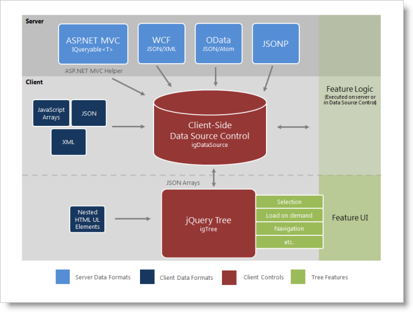
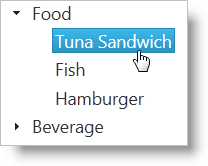

<!--
|metadata|
{
    "fileName": "igtree-data-binding",
    "controlName": "igTree",
    "tags": ["Data Binding","Sample Data Source"]
}
|metadata|
-->

# Data Binding igTree

## Topic Overview
### Purpose
This topic discusses the different ways to data bind the `igTree`™ control as well as other details related to data binding.

### In this topic
This topic contains the following sections:

-   [Binding to Data Sources](#binding-to-data-sources)
    -   [Requirements for binding](#requirements-for-binding)
    -   [Supported data sources](#supported-data-sources)
    -   [Binding to data sources overview](#binding-to-data-sources-overview)
    -   [Class diagram for binding to data sources](#class-diagram)
-   [Basic igTree Data Binding](#basic-data-binding)
    -   [Introduction](#basic-data-binding-introduction)
    -   [Preview](#basic-data-binding-preview)
    -   [Overview](#basic-data-binding-overview)
    -   [Steps](#basic-data-binding-steps)
-   [Related Topics](#related-topics)

### Required background
You need to first read the following topics:

-   [igTree Overview](igTree-Overview.html)
-   [Getting Started with igTree](igTree-Getting-Started.html)

## <a id="binding-to-data-sources"></a>Binding to Data Sources 
### <a id="requirements-for-binding"></a>Requirements for binding 
The following table lists the requirements for binding the `igTree` control to data sources grouped by requirement category.

Requirement category | Requirements listing
---|---
Data structure|Can be any of the following: <br> Well-formed JSON or XML supplied locally or from a web server <br> Nested UL HTML elements <br> OData services <br> JSONP <br> IQueryable in ASP.NET MVC
Data types|String <br> Number <br> Boolean <br> Image URL

## <a id="supported-data-sources"></a>Supported data sources 
The following table lists the supported data sources and some basic specifics for their binding

Data Source | Binding
---|---
[igDataSource](igDataSource-igDataSource-Overview.html)|The `igDataSource` is used internally by the `igTree` control to manage data operations for the control. The data source accepts many different types of local and remote data.
Nested HTML UL elements|The `igTree` can be instantiated with an existing unordered list (UL) or nested UL elements.
[IQueryable](http://msdn.microsoft.com/en-us/library/bb351562%28v=VS.90%29.aspx)|In ASP.NET MVC, supply an IQueryable as the `igTree`’s datasource and the collection will be serialized to JSON and returned with the View for use in the browser.

### <a id="binding-to-data-sources-overview"></a>Binding to data sources overview 
In most cases, you will use the `dataSource` or `dataSourceUrl` options of the `igTree` control to bind to data. This option provides your data to the `igDataSource` component which can handle the various supported data formats. The one main exception to using this option is when the tree is instantiated using UL elements; in this case the tree inherits the data and options of its base UL elements.

In ASP.NET MVC, you must supply a collection of IQueryable objects to the ASP.NET MVC Helper. The helper facilitates data serialization from the server and passes it to the View. Once the page is received by the browser, the `dataSource` option of the `igTree` is set for client-side operation.

### <a id="class-diagram"></a>Class diagram for binding to data sources 
The following class diagram depicts how data binding works in the `igTree` control.



## <a id="basic-data-binding"></a>Basic igTree data binding 
### <a id="basic-data-binding-introduction"></a>Introduction 
The following steps demonstrate how to configure basic options and bind to data using both jQuery and the ASP.NET MVC Helper.

### <a id="basic-data-binding-preview"></a>Preview 
Following is a preview of the final result where the `igTree` control is bound to hierarchical data.



### <a id="basic-data-binding-overview"></a>Overview 
Following is a conceptual overview of the process:

1.  Instantiating the `igTree`
2.  Binding to Data
3.  Configuring Bindings

### <a id="basic-data-binding-steps"></a>Steps 
1.  Instantiate the `igTree`.
    1.  Set a target element.

        On your page, define a target HTML element which will serve as the base object for the `igTree` control and set its ID. This is an optional step for ASP.NET MVC

        **In HTML:**

        ```html
        <div id="JSONTree"></div>
        ```

    2.  Instantiate the `igTree`

        In jQuery, you can use the document ready JavaScript event to instantiate the `igTree` control. In ASP.NET MVC, use the ASP.NET MVC helper to bind to an IQueryable datasource.

        **In HTML:**

        ```html
        <script type="text/javascript">
                $(function () {
                    $("#JSONTree").igTree({

                    });
                });
        </script>
        ```

        **In ASPX:**

        ```csharp
        <%= Html.
            Infragistics().
            Tree().
            Render()  
        %>
        ```

2.  Bind to data.
    1.  Define the data.

        This example binds to a JSON array which is constructed with nested object arrays. There are two different object schemas: one for the product category which has a Label and Products property and the other for the Product with a Name property. In the example code the Products property contains the nested data. This structure forms the hierarchy for the `igTree`. In ASP.NET MVC, nested collection of IQueryable objects is accepted by the ASP.NET MVC helper. An Entity Data Model and the appropriate  LINQ query make it straightforward to provide this structure to the `igTree` control. In the following example demonstrates the data structure required by the ASP.NET MVC helper when binding to object collections. The ProductCategory class is defined with a Label property and Products property similar to the JSON array. The GetProductNodes method will return the data for the ASP.NET MVC helper. You can see that the data is passed as the Model for the view.

        **In HTML:**

        ```html
        var data = [
            { Label: 'Food', Products: [
                { Name: 'Tuna Sandwich' },  
                { Name: 'Fish' },
                { Name: 'Hamburger' }
            ]},
            { Label: 'Beverage', Products: [
                { Name: 'Coke' },
                { Name: 'Pepsi' }
            ]}];
        ```

        **In C#:**

        ```csharp
        public class SamplesController : Controller
        {
            //This class defines the object to which the nodes are bound
            public class ProductCategory
            {
                private string _label;
                private List<Product> _products;
         
                public string Label { get { return _label; } }
         
                public IQueryable<Product> Products
                {
                    get
                    {
                        return _products.AsQueryable();
                    }
                }
         
                public ProductCategory(string label, List<Product> products)
                {
                    if (products == null)
                        products = new List<Product>();
                    this._products = products;
                    this._label = label;
                }
         
                public ProductCategory() { }
            }
         
            public class Product
            {
                public string Name { get; set; }
         
                public Product(string name)
                {
                    this.Name = name;
                }
         
                public Product() { }
            }
         
            //This method creates the collection of data for binding
            public IQueryable<ProductCategory> GetProductCategorys()
            {
                return new List<ProductCategory>()
                {
                    new ProductCategory("Food",
                        new List<Product>{
                            new Product("Tuna Sandwich"),                            
                            new Product("Fish"),
                            new Product("Hamburger")
                        }),
                    new ProductCategory("Beverage",
                        new List<Product>{
                            new Product("Coke"),
                            new Product("Pepsi")
                        })
                }.AsQueryable();
            }
        ```

    2.  Set the data source

        Use the dataSource option to supply the data to the tree. In ASP.NET MVC, use your Action Method to return the view and the data. Use the DataSource method of the helper to bind to the data passed in as the Model and then call the DataBind() method.

        **In HTML:**

        ```html
        dataSourceType: 'json',
        dataSource: data
        ```

        **In ASPX:**

        ```csharp
        DataSource(this.Model).
        DataBind()
        ```

        **In C#:**

        ```csharp
        //Send the data with the View
        public ActionResult Mvc()
        {
            return View("mvc", GetProductCategorys());
        }
        ```

    3.  (ASP.NET MVC) Call Render().

        When instantiating the `igTree` control with the ASP.NET MVC Helper, call the Render method last after all other options are configured. The Render method renders the HTML and JavaScript necessary to instantiate the `igTree` control on the client.

        **In ASPX:**

        ```csharp
        Render()
        ```

3.  Configure bindings.

    In order for the `igTree` control to determine how each field of the bound data should function in the hierarchy, a binding object must be configured for each type of object that needs to be displayed in the tree. In this sample, there are two binding objects defined which represent the ProductCategory and Product objects. The binding objects in this sample are configured for displaying text as well as noting which property exposes the child data.

    **In HTML:**

    ```html
    <script type="text/javascript">
            $(function () {
                $("#JSONTree").igTree({
                    dataSourceType: 'json',
                    dataSource: data,
                    bindings: {
                        textKey: 'Label',
                        childDataProperty: 'Products',
                        bindings: {
                            textKey: 'Name'
                        }
                    }
                });
            });
    </script> 
    ```

    **In ASPX:**

    ```csharp
    <%= Html.
        Infragistics().
        Tree().
        DataSource(this.Model).
        DataBind().
        Bindings( bindings => {
            bindings.
            TextKey("Label").      
            ChildDataProperty("Products").
            Bindings( bindings2 => {
                bindings2.
                TextKey("Name");
            });
        }).
        Render()  
    %>
    ```

## <a id="related-topics"></a>Related Topics 
Following are some other topics you may find useful.

-   [Configure Remote Load on Demand for igTree](igTree-Optimize-Performance.html)
-   [igTree Known Limitations](igTree-Known-Limitations.html)

 

 


