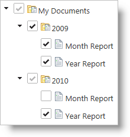
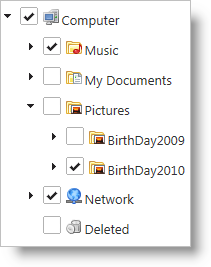

<!--
|metadata|
{
    "fileName": "igtree-configure-checkboxes-and-selection",
    "controlName": "igTree",
    "tags": ["Events","Selection"]
}
|metadata|
-->

# Configure Checkboxes and Selection with igTree

## Topic Overview
### Purpose
This topic discusses some common ways to configure selections in the `igTree`™ control.

### In this topic
This topic contains the following sections:

-   [igTree Configuration Overview](#configuration-overview)
    -   [Control configuration chart](#control-configuration-chart)
-   [Configuring checkboxes](#configuring-checkboxes)
    -   [Checkboxes configuration overview](#checkboxes-configuration-overview)
    -   [Checkboxes property settings](#checkboxes-property-settings)
    -   [Example: configure tri-state checkboxes](#configure-tri-state-checkboxes)
    -   [Example: configure bi-state checkboxes](#configure-bi-state-checkboxes)
    -   [Configuring checkboxes’ property reference](#configure-checkboxes-property-reference)
-   [Getting checked nodes](#getting-checked-nodes)
    -   [Checked nodes overview](#checked_nodes_overview)
    -   [Getting checked nodes property settings](#getting-checked-nodes-property-settings)
    -   [Get all checked nodes](#get-all-checked-nodes)
-   [Handling selection and checkbox events](#handling-selection)
    -   [Selection and checkbox events overview](#selection-and-checkbox-events-overview)
    -   [Selection and checkbox events property settings](#selection-and-checkbox-events-property-settings)
    -   [Example: configuring a selection event during instantiation](#configuring-selction-events-during-instantiation)
    -   [Example: configure selection and checkbox events with live and bind](#configure-selection-and-checkbox-events-with-live-and-bind)
    -   [Cancelling selection](#canceling-selection)
-   [Related Topics](#related-topics)

### Required background
The table below lists the required background you need for fully understanding the information in this topic.

Background type | Content
---|---
Topics | You need to first read the [Getting Started with igTree](igTree-Getting-Started.html) topic.
External Resources | You need to first read the following articles: [jQuery `bind()` API](http://api.jquery.com/bind/) <br> [jQuery `live()` API](http://api.jquery.com/live/)


## <a id="configuration-overview"></a>igTree Configuration Overview 
### <a id="control-configuration-chart"></a>Control configuration chart 
The table below lists the configurable behaviors of the `igTree` control.

<table class="table table-bordered">
	<thead>
		<tr>
            <th>
Configurable behavior
			</th>

            <th>
Configuration details
			</th>

            <th>
Configuration properties
			</th>
        </tr>
	</thead>
	<tbody>
        

        <tr>
            <td>
Configure checkboxes
			</td>

            <td>
The `igTree` control supports bi-state and tri-state checkboxes. When tri-state checkboxes are enabled, the parent nodes update dynamically to reflect whether their children are all selected, all unselected, or partially selected.
			</td>

            <td><ul>
                <li>
checkboxMode</li>
                </ul>
			</td>
        </tr>

        <tr>
            <td>
Get checked nodes
			</td>

            <td>
The `igTree` control has an API to get all checked nodes, all unchecked nodes, and all partially selected nodes.
			</td>

            <td><ul>
                <li>checkedNodes</li>

               <li> uncheckedNodes</li>

              <li>  partiallyCheckedNodes</li>
                </ul>
            </td>
        </tr>

        <tr>
            <td>
Handle selection and checkbox events
			</td>

            <td>
Capture selection events to perform logic in response to a selection operation occurring.
			</td>

            <td><ul>
                <li>selectionChanging</li>

                <li>selectionChanged</li>

                <li>nodeCheckstateChanging</li>

                <li>nodeCheckstateChanged</li>
                </ul>
            </td>
        </tr>

        <tr>
            <td>
Select/Deselect Nodes
			</td>

            <td>
Use these methods to select and deselect modes through code.
			</td>

            <td><ul>
                <li>select(node)</li>

                <li>deselect(node)</li>
                </ul>
            </td>
        </tr>
    </tbody>
</table>

## <a id="configuring-checkboxes"></a>Configuring checkboxes 
### <a id="checkboxes-configuration-overview"></a>Checkboxes configuration overview 
The `igTree` control supports bi-state and tri-state checkboxes. When tri-state checkboxes are enabled, the parent nodes reflect whether their children are all selected, all unselected, or partially selected.



## <a id="checkboxes-property-settings"></a>Checkboxes property settings 
The table below maps the desired behaviors to property settings. The properties are accessed through the `igTree`’s options.

In order to… | Use this property: | And set it to…
---|---|---
Enable bi-state checkboxes | checkboxMode | biState
Enable tri-state checkboxes | checkboxMode | triState

### <a id="configure-tri-state-checkboxes"></a>Example: configuring tri-state checkboxes 
The image below demonstrates tri-state checkboxes as a result of the following settings:

Property |  Setting | Preview
---|---|---
checkboxMode|triState|

### <a id="configure-bi-state-checkboxes"></a>Example: configuring bi-state checkboxes 
The image below demonstrates tri-state checkboxes as a result of the following settings:

Property | Setting | Preview
---|---|---
checkboxMode|biState|

### <a id="configure-checkboxes-property-reference"></a>Configuring checkoxes’ property reference 
For detailed information about these properties, refer to their listing in the property reference section:

-   [igTree Options ](%%jQueryApiUrl%%/ui.igtree#options)

## <a id="getting-checked-nodes"></a>Getting checked nodes 
### <a id="checked_nodes_overview"></a>Checked nodes overview 
The `igTree` has an API to get all checked nodes, all unchecked nodes, and all partially selected nodes.

### <a id="getting-checked-nodes-property-settings"></a>Getting checked nodes property settings 
The table below maps the desired behaviors to property settings. The properties are accessed through the `igTree` methods.

In order to… | Use this method: | Returns…
---|---|---
Get all checked nodes | checkedNodes | array of Nodes
Get all unchecked nodes | uncheckedNodes |array of Nodes
Get all partially checked nodes | partiallyCheckedNodes|array of Nodes

### <a id="get-all-checked-nodes"></a>Getting all checked nodes 
The code below demonstrates how to get all checked nodes as a result of the following:

Method | Returns…
---|---
checkedNodes|array of Nodes

**In JavaScript:**

```js
var nodes = $("#tree").igTree("checkedNodes");
```

## <a id="handling-selection"></a>Handling selection and checkbox events 
### <a id="selection-and-checkbox-events-overview"></a>Selection and checkbox event overview 
By handling the selection and checkbox events, you can perform custom logic in response to these operations. These events can be configured when a widget is initialized in jQuery or on the client using the bind or live jQuery functions.

### <a id="selection-and-checkbox-events-property-settings"></a>Selection and checkbox events property settings 
The table below maps the desired behaviors to property settings. The properties are accessed through the `igTree` events.

In order to… | Use this property: |And set it to…
---|---|---
Handle an event before a selection operation | selectionChanging | function()
Handle an event after a selection operation | selectionChanged | function()
Handle an event before a checkbox operation | nodeCheckstateChanging | function()
Handle an event before a checkbox operation | nodeCheckstateChanged | function()

### <a id="configuring-selction-events-during-instantiation"></a>Example: configuring a selection event during instantiation 
The code below demonstrates configuring a selection during instantiation of the `igTree` using the following:

Property | Setting
---|---
selectionChanged | function(evt, ui){ }
nodeCheckstateChanged | function(evt, ui){ }

**In HTML:**

```html
$("#tree").igTree({
    dataSource: data,
    checkboxMode: "triState",
    bindings: {
        textKey: 'Text',
        childDataProperty: 'Nodes'
    },
    selectionChanged: function (evt, ui) {
 
    },
    nodeCheckstateChanged: function (evt, ui) {
 
    }
});
```

### <a id="configure-selection-and-checkbox-events-with-live-and-bind"></a>Example: configuring selection and checkbox events with live and bind 
The code below demonstrates handling selection and checkbox events using jQuery bind and live functions. The type of the events are lower case strings constructed by appending `igTree` to the beginning of the event name.

**In HTML:**

```html
$("#tree").bind("igtreeselectionchanging", function (evt, ui) {
 
});
 
$("#tree").live("igtreenodecheckstatechanged", function (evt, ui) {
                
});
```

## <a id="canceling-selection"></a>Canceling selection 
The code below demonstrates how to cancel the selection operation by returning false from the event handler function. The same approach can be used for an –ing function for the `igTree`. In this code example, cancel represents the Boolean result of application logic that determines whether selection should occur or not.

**In HTML:**

```html
$("#tree").live("igtreenodecheckstatechanging", function (evt, ui) {
    if (cancel == true)
        return false;         
});
```

## <a id="related-topics"></a>Related Topics 
Following are some other topics you may find useful.

-   [igTree API documentation](%%jQueryApiUrl%%/ui.igtree#!overview)
-   [igTree ASP.NET MVC helper API documentation](Infragistics.Web.Mvc~Infragistics.Web.Mvc.TreeModel_members.html)

 

 


