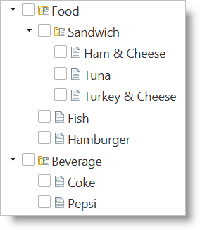
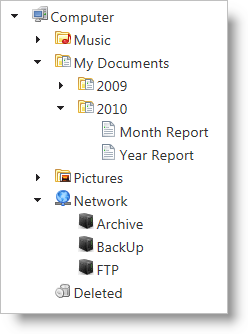

<!--
|metadata|
{
    "fileName": "igtree-configure-node-images",
    "controlName": "igTree",
    "tags": ["Styling"]
}
|metadata|
-->

# Configure Node Images in igTree

## Topic Overview
### Purpose
This topic discusses how to configure node images in the `IgTree`™ control.

### In this topic
This topic contains the following sections:

-   [**igTree Configuration Overview**](#config-overview)
    -   [igTree configuration chart](#config-chart)
-   [**Configuring node images**](#node-image)
    -   [Node images overview](#node-image-overview)
    -   [Node image settings](#node-image-settings)
-   [**Related Topics**](#related-topics)

### Required background
You need to first read the [Getting Started with igTree](igTree-Getting-Started.html) topic.

## <a id="config-overview"></a>IgTree Configuration Overview 
### <a id="config-chart"></a>igTree configuration chart 
The table below lists the configurable screen elements and behaviors of the `igTree` control.

<table class="table table-bordered">
	<thead>
		<tr>
            <th>
Configurable screen elements and behavior
			</th>

            <th>
Configuration details
			</th>

            <th>
Configuration options
			</th>
        </tr>
	</thead>
	<tbody>
        

        <tr>
            <td>
Configure node images
			</td>

            <td>
Images can be configured through binding, CSS, or URL to show next to each node in the `igTree` control.
			</td>

            <td>
                <ul>
                    <li>
[parentNodeImageUrl](%%jQueryApiUrl%%/ui.igTree#options:parentNodeImageUrl)
					</li>

                    <li>
[parentNodeImageClass](%%jQueryApiUrl%%/ui.igTree#options:parentNodeImageClass)
					</li>

                    <li>
[leafNodeImageUrl](%%jQueryApiUrl%%/ui.igTree#options:leafNodeImageUrl)
					</li>

                    <li>
[leafNodeImageClass](%%jQueryApiUrl%%/ui.igTree#options:leafNodeImageClass)
					</li>

                    <li>
[imageUrlKey](%%jQueryApiUrl%%/ui.igTree#options:bindings.imageUrlKey)
					</li>

                    <li>
[imageUrlXPath](%%jQueryApiUrl%%/ui.igTree#options:bindings.imageUrlXPath)
					</li>
                </ul>
            </td>
        </tr>
    </tbody>
</table>

## <a id="node-image"></a>Configuring node images 
### <a id="node-image-overview"></a>Node images overview 
Node images can be configured on the `igTree` control to display more information about the node. They can be configured through binding for each item or an image can be displayed for both parent nodes and child nodes by setting a CSS class or image URL to the `igTree` control options.

 


### <a id="node-image-settings"></a>Node image settings 
The table below maps the desired configurations to option settings. The options are accessed through the `igTree` options.

In order to… | Use this option: | And set it to…
---|---|---
[Configure parent and leaf node images using a URL](#example_configure_using_url) | [parentNodeImageUrl](%%jQueryApiUrl%%/ui.igTree#options:parentNodeImageUrl)  <br> [leafNodeImageUrl](%%jQueryApiUrl%%/ui.igTree#options:leafNodeImageUrl) | string URL <br> string URL
[Configure parent and leaf node images using CSS](#example_configure_using_css) | [parentNodeImageClass](%%jQueryApiUrl%%/ui.igTree#options:parentNodeImageClass)  <br> [leafNodeImageClass](%%jQueryApiUrl%%/ui.igTree#options:leafNodeImageClass) | string CSS class name <br> string CSS class name
[Configure node images for individual data items through binding](#example_configure_through_binding) | [imageUrlKey](%%jQueryApiUrl%%/ui.igTree#options:bindings.imageUrlKey) <br> (for XML) <br> [imageUrlXPath](%%jQueryApiUrl%%/ui.igTree#options:bindings.imageUrlXPath) | string data member with URL to images `<br>` string XPath to the image URL when bound to XML


### <a id="example_configure_using_url"></a>Example: configuring parent and leaf node images configured using a URL 

In order to configure the images for parent and leaf nodes, you can provide a URL to a location for existing images. The image below demonstrates configuring node images as a result of the following settings:

<table class="table tale-bordered">
	<thead>
		<tr>
            <th>
Option
			</th>

            <th>
Setting
			</th>

            <th>
Preview
			</th>
        </tr>
	</thead>
	<tbody>
        

        <tr>
            <td>
[parentNodeImageUrl](%%jQueryApiUrl%%/ui.igTree#options:parentNodeImageUrl)
			</td>

            <td>
"../../Content/images/DocumentsFolder.png"
			</td>

            <td rowspan="2">

			</td>
        </tr>

        <tr>
            <td>
[leafNodeImageUrl](%%jQueryApiUrl%%/ui.igTree#options:leafNodeImageUrl)
			</td>

            <td>
"../../Content/images/Documents.png"
			</td>
        </tr>
    </tbody>
</table>

### <a id="example_configure_using_css"></a>Example: configuring parent and leaf node images configured using CSS 

If you are using image sprites and configuring images through CSS, you can specify the CSS class that contains the tree node images. The code below demonstrates configuring node images as a result of the following settings:

Option | Setting
---|---
[parentNodeImageClass](%%jQueryApiUrl%%/ui.igTree#options:parentNodeImageClass) | "sprite-DocumentsFolder"
[leafNodeImageClass](%%jQueryApiUrl%%/ui.igTree#options:leafNodeImageClass) | "sprite-Documents"

>**Note:** You must define your CSS classes as “display:inline-block” in order to ensure proper rendering of the tree images.

**In HTML:**

```html
<style type="text/css">
    .sprite-DocumentsFolder
    {
        background: url("../../Content/images/leafimages.png") no-repeat top left;
        display: inline-block;
        background-position: 0 -52px;
        width: 16px;
        height: 16px;
    }        
    .sprite-Documents
    {
        background: url("../../Content/images/leafimages.png") no-repeat top left;
        display: inline-block;
        background-position: 0 -26px;
        width: 16px;        
        height: 16px;
    }
 
</style>

<script type="text/javascript">
    $(function () {
        $("#tree").igTree({
            dataSource: data,
            parentNodeImageClass: "sprite-DocumentsFolder",
            leafNodeImageClass: "sprite-Documents",
            bindings: {
                textKey: 'Text',
                childDataProperty: 'Nodes'
            },
        });
</script>
```

**In ASPX:**

```csharp
<style type="text/css">
    .sprite-DocumentsFolder
    {
        background: url("../../Content/images/leafimages.png") no-repeat top left;
        display: inline-block;
        background-position: 0 -52px;
        width: 16px;
        height: 16px;
    }        
    .sprite-Documents
    {
        background: url("../../Content/images/leafimages.png") no-repeat top left;
        display: inline-block;
        background-position: 0 -26px;
        width: 16px;        
        height: 16px;
    }
 
</style>

<%= Html.
    Infragistics().
    Tree().
    ID("tree").
    DataSource(this.Model).
    ParentNodeImageClass("sprite-DocumentsFolder").
    LeafNodeImageClass("sprite-Documents"). 
    Bindings( bindings => {
        bindings.
        TextKey("Text").      
        ChildDataProperty("Nodes");
    }).
    DataBind().
    Render()       
%>
```

### <a id="example_configure_through_binding"></a>Example: configuring parent and leaf node images configured through binding 

This example demonstrates binding to XML and includes the required setting for `imageUrlXPath`. This setting is not required when binding to JSON data. The example below demonstrates how to configure node images through bindings:

Option | Setting | Preview
---|---|---
[imageUrlKey](%%jQueryApiUrl%%/ui.igTree#options:bindings.imageUrlKey) | ImageUrl|
[imageUrlXPath](%%jQueryApiUrl%%/ui.igTree#options:bindings.imageUrlXPath)|@ImageUrl|-

**In HTML:**

```html
$("#tree").igTree({
    checkboxMode: 'triState',
    singleBranchExpand: true,
    dataSource: data,
    dataSourceType: 'xml',
    initialExpandDepth: 0,
    pathSeparator: '.',
    bindings: {
        textKey: 'Text',
        textXPath: '@Text',
        valueKey: 'Value',
        valueXPath: '@Value',
        imageUrlKey: 'ImageUrl',
        imageUrlXPath: '@ImageUrl',
        childDataProperty: 'Folder',
        childDataXPath: 'Folder',
        searchFieldXPath: 'Folder'
    }
});
```

**XML Data:**

```xml
<?xml version="1.0" encoding="utf-8" ?>

<Folder Text="Computer" ImageUrl="../content/images/igTree/Common/computer.png" Value="Folder">

    <Folder Text="Music" ImageUrl="../content/images/igTree/Common/book.png" Value="Folder">

        <!-- data omitted for example -->

    </Folder>


<Folder Text="My Documents" ImageUrl="../content/images/igTree/Common/DocumentsFolder.png" Value="Folder">

    <Folder Text="2009" ImageUrl="../content/images/igTree/Common/DocumentsFolder.png" Value="Folder">

        <!-- data omitted for example -->

    </Folder>

    <Folder Text="2010" ImageUrl="../content/images/igTree/Common/DocumentsFolder.png" Value="Folder">

        <Folder Text="Month Report" ImageUrl="../content/images/igTree/Common/Documents.png" Value="File"></Folder>

        <Folder Text="Year Report" ImageUrl="../content/images/igTree/Common/Documents.png" Value="File"></Folder>

    </Folder>

</Folder>

<Folder Text="Pictures" ImageUrl="../content/images/igTree/Common/coins.png" Value="Folder">

    <!-- data omitted for example -->

</Folder>

<Folder Text="Network" ImageUrl="../content/images/igTree/Common/door.png" Value="Folder">

    <Folder Text="Archive" ImageUrl="../content/images/igTree/Common/door_in.png" Value="Folder"></Folder>

    <Folder Text="BackUp" ImageUrl="../content/images/igTree/Common/door_in.png" Value="Folder"></Folder>

    <Folder Text="FTP" ImageUrl="../content/images/igTree/Common/door_in.png" Value="Folder"></Folder>

</Folder>

<Folder Text="Deleted" ImageUrl="../content/images/igTree/Common/bin_empty.png" Value="Folder"></Folder>
```

>**Note:** The `igTree` only supports binding to XML on the client. In ASP.NET MVC, the XML should be translated into an `IQueryable<T>`. The tree can then bind to the field that represents the `ImageUrl` and the `imageUrlXPath` is not required.

For detailed information about these properties, refer to their listing in the property reference section:

-   [igTree Options](%%jQueryApiUrl%%/ui.igTree#options)

## <a id="related-topics"></a>Related Topics 
Following are some other topics you may find useful.

-   [Configuring Nodes in igTree](igTree-Configure-Nodes.html)

 

 


