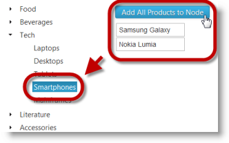

<!--
|metadata|
{
    "fileName": "igtree-adding-removing-nodes-overview-examples",
    "controlName": "igTree",
    "tags": ["API","How Do I"]
}
|metadata|
-->

# Adding and Removing Nodes Overview and Examples (igTree)

## Topic Overview
### Purpose

This topic explains, with code examples, how to add and remove nodes of `igTree`™ control programmatically.

### Required background

The following topics are prerequisites to understanding this topic:

- [igTree Overview](igTree-Overview.html): This topic provides conceptual information for the `igTree` control including information regarding: features, binding to data sources, requirements, and templates.


### In this topic

This topic contains the following sections:

-   [Introduction](#introduction)
-   [Code Examples](#code-example)
-   [Code Example: Adding a New Node to a Tree](#add-new-node)
   -   [Description](#new-node-description)
    -   [Code](#new-node-code)
-   [Code Example: Adding Multiple Nodes to a Tree](#add-multiple-nodes)
-   -   [Description](#multiple-nodes-description)
    -   [Code](#multiple-nodes-code)
-   [Code Example: Removing a Selected Node from a Tree](#remove-selected-node)
   -   [Description](#selected-node-description)
    -   [Code](#selected-node-code)
-   [Code Example: Removing a Node by Value from a Tree](#remove-node-by-value)
   -   [Description](#node-by-value-description)
    -   [Code](#node-by-value-code)
-   [Related Content](#related-content)


## <a id="introduction"></a>Introduction
### Adding and removing nodes summary

The `igTree`™ control supports adding and removing of tree nodes.

Adding Nodes

To a node, you can add the following:

-   A node object
-   An array of nodes
-   A hierarchical node

Adding a node is done by [addNode](igTree-Adding-Removing-Node-Method-API-Reference.html) method.

Removing Nodes

You can remove a a node by either of the following:

-   Path – removing a node is done by [removeAt](igTree-Adding-Removing-Node-Method-API-Reference.html)
-   Value – removing a node is done by [removeNodesByValue](igTree-Adding-Removing-Node-Method-API-Reference.html)


## <a id="code-example"></a>Examples

The following table lists the code examples included in this topic.

Example | Description
---|---
[Code Example: Creating a New Node in a Tree](#add-new-node)| This example demonstrates how to add a new node to the tree of the `igTree` control.
[Code Example: Adding Multiple Nodes to a Tree](#add-multiple-nodes)|This example demonstrates get-ting the selected node and adding an array of nodes to it.
[Code Example: Removing a selected node from a Tree](#remove-selected-node) | This example demonstrates get-ting selected node and removing it from an  `igTree`. 
[Code Example: Removing a node by value from a Tree](#remove-node-by-value) | This example demonstrates removing nodes from an `igTree` by value


## <a id="add-new-node"></a>Code Example: Adding a New Node to a Tree
### <a id="new-node-description"></a>Description

This example demonstrates how to add a new node to the tree of the `igTree` control. In the example, you have to take the node Pepsi and add from an HTML place under the selected node. To do this, you get the reference to selected node in the `igTree` and then add the HTML list item to the selected node from the HTML list.

### Preview


 
### <a id="new-node-code"></a>Code

**In JavaScript:**

```js
var selectedNode = $("#tree").igTree("selectedNode").element;
// This returns a JSON object with the following structure:
// var newNode = {
//                  Text: "Pepsi",
//                  Value: 5
//               };
var newNode = clickedElement();
if (selectedNode != null) {
    // Adding the node to the tree
    $("#tree").igTree("addNode", newNode, selectedNode);
}
```

## <a id="add-multiple-nodes"></a>Code Example: Adding Multiple Nodes to a Tree
### <a id="multiple-nodes-description"></a>Description

This example demonstrates how add multiple nodes to the tree of the `igTree` control. For instance, you have to take a whole set of nodes nodes from an HTML list and that set under the selected node. To do this,, you get the reference to selected node in the `igTree` and then add the set of nodes from the HTML list. In the example, a randomizer us used to generate values for the new nodes (representing, for instance, quantities).

### Preview




### <a id="multiple-nodes-code"></a>Code

**In JavaScript:**

```js
var selectedNode = $("#tree").igTree("selectedNode").element;
if (selectedNode != null) {
    // Creating an array of new nodes
    var newNodes = [];
    // Converting the HTML list to the array of nodes
        var list = $("ul#items li").each(function () {
            var item = $(this);
            // Pushing new items with random values representing quantities
            newNodes.push({
                Text: item.html(),
                Value: Math.floor(Math.random() * 1001)
            });
        });
    // Adding the array of nodes to the tree
    $("#tree").igTree("addNode", newNodes, selectedNode);
}
```


## <a id="remove-selected-node"></a>Code Example: Removing a Selected Node from a Tree
### <a id="selected-node-description"></a>Description

This example demonstrates how to remove a selected node from the tree of the `igTree` control. You first get the reference to selected node in `igTree` and then remove the node by referencing it by its path.

### Preview


 
### <a id="selected-node-code"></a>Code

**In JavaScript:**

```js
var selectedPath = $("#tree").igTree("selectedNode").path;
if (selectedPath != null) {
    // Removing the selected node by path
    $("#tree").igTree("removeAt", selectedPath);
} 
```


## <a id="remove-node-by-value"></a>Code Example: Removing a Node by Value from a Tree
### <a id="node-by-value-description"></a>Description

This example demonstrates how remove a node from an `igTree` by value. In the example, you need to remove all nodes whose value matches the value the user has entered through an HTML input field. You get the value first and then remove the node by referencing it by that value.

### Preview


 
### <a id="node-by-value-code"></a>Code

**In JavaScript:**

```js
var nodeValue = $("#nodeValue").val();
if (nodeValue) {
    // Removing all nodes with the provided value
    $("#tree").igTree("removeNodesByValue", nodeValue);                   
 }
```


## <a id="related-content"></a>Related Content
### Topics

The following topics provide additional information related to this topic.

- [API Links (igTree)](igTree-jQuery-And-ASP-NET-MVC-Helper-API-Links.html): This topic provides links to `igTree` jQuery and ASP.NET MVC Helper API.

- [Add and Remove Nodes Method Reference (igTree)](igTree-Adding-Removing-Node-Method-API-Reference.html): This topic provides a reference for the methods for adding and removing nodes in the `igTree` control.


### Samples

The following samples provide additional information related to this topic.

- [API and Events](igtree-event-reference.html#attaching-handlers-jquery): This sample demonstrates how to use `igTree` API.


 

 


