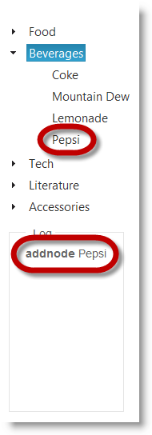

<!--
|metadata|
{
    "fileName": "igtree-retrieving-transaction-log",
    "controlName": "igTree",
    "tags": ["API","How Do I"]
}
|metadata|
-->

# Retrieving the Transaction Log of Added and Removed Nodes (igTree)

## Topic Overview
### Purpose

This topic explains, with code examples, how to retrieve the transaction log about adding and removing nodes in the `igTree`™ control.

### Required background

The following topics are prerequisites to understanding this topic:

- [Adding and Removing Nodes Overview and Examples (igTree)](igTree-Adding-Removing-Nodes-Overview-Examples.html): This topic explains, with code examples, how to add and remove nodes of `igTree` control programmatically.


### In this topic

This topic contains the following sections:

-   [Introduction](#introduction)
-   [Code Example: Retrieving the Transaction Log](#retrieving-transaction-log)
-   -   [Description](#description)
    -   [Prerequisites](#prerequisites)
    -   [Preview](#preview)
    -   [Code](#code)
-   [Related Content](#related-content)


## <a id="introduction"></a>Introduction
### Overview

Transaction log stores information about added or removed nodes from `igTree`. The information is stored in an array, which contains JSON objects. Each JSON object has a type of operation (a property with `addnode` and `removenode` string values) and node data such as node text. The `igTree` control supports retrieving that transaction log. Retrieving the transaction log is done with the [transactionLog](igTree-Adding-Removing-Node-Method-API-Reference.html) method. This method returns the JSON object containing the type of operation and the node data.


## <a id="retrieving-transaction-log"></a>Code Example: Retrieving the Transaction Log
### <a id="description"></a>Description

The code in this example demonstrates retrieving the transaction log and parsing it to HTML output. The HTML output contains the type of operation – whether the nodes have been added or removed and the node text.

### <a id="prerequisites"></a>Prerequisites

To complete the procedure, you need:

-   An HTML file with an instance of the `igTree` control bound to a data source
-   A placeholder defined in the HTML file for displaying the transaction log
-   At least one add/remove node operation performed in the `igTree`.

###<a id="preview"></a> Preview

This preview picture demonstrates the transaction log retrieved with the code in this example and then converted to HTML and displayed beneath the tree to which it pertains.



### <a id="code"></a>Code

Place this code in the placeholder for displaying the transaction log in the HTML page.

**In JavaScript:**

```js
// parsing transaction log arguments to a string
function parseData(data) {
                var string = "", i;
                if (data.length) {
                    for (i = 0; i < data.length; i++) {
                        string += data[i].Text + (i < data.length - 1 ? ", " : "");
                    }
                } else {
                    string += data.Text;
                }
                return string;
            }
var log = $("#tree").igTree("transactionLog");
var html = "";
for (i = 0; i < log.length; i++) {
    html += "<p>" + log[i].type +  " " + parseData(log[i].tdata.data)
 + "</p>";
}
```


## <a id="related-content"></a>Related Content
### Topics

The following topics provide additional information related to this topic.

- [API Links (igTree)](igTree-jQuery-And-ASP-NET-MVC-Helper-API-Links.html): This topic provides links to the jQuery and ASP.NET MVC Helper API of the igTree control.

- [Adding and Removing Nodes Overview and Examples (igTree)](igTree-Adding-Removing-Nodes-Overview-Examples.html): This topic explains, with code examples, how to add and remove nodes of `igTree` control programmatically.

### Samples

The following samples provide additional information related to this topic.

- [API and Events](igtree-event-reference.html#attaching-handlers-jquery): This sample demonstrates how to use `igTree` API.


 

 


