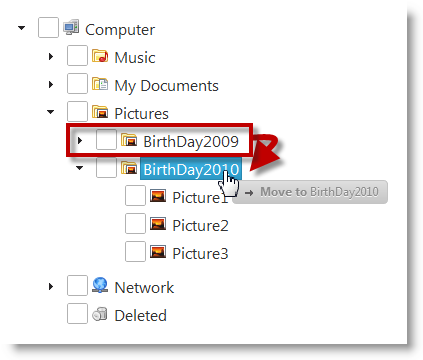

<!--
|metadata|
{
    "fileName": "igtree-drag-and-drop-overview",
    "controlName": "igTree",
    "tags": ["Getting Started"]
}
|metadata|
-->

# Drag-and-Drop Overview (igTree)

## Topic Overview
### Purpose 

This topic provides an overview the Drag-and-Drop feature of the `igTree`™  control.

### In this topic 
This topic contains the following sections:  
                                       
-   [Introduction to the Drag-and-Drop Feature](#introduction)
	-   [Drag-and-Drop feature summary](#drag-drop-features)
-   [Drag-and-Drop modes](#drag-drop-modes)
-   [Enabling the Drag-and-Drop Feature](#enable-drag-drop-feature)
-   [Configuring the Drag-and-Drop Feature](#config-drag-drop-features)
-   [Related Content](#related-topics)          

## Introduction to the Drag-and-Drop Feature
### Drag-and-Drop feature summary

The Drag-and-Drop feature of the `igTree` control enables users to drag-and-drop tree nodes.

Dragging and dropping can be performed within the same tree or between two different trees. The latter is configured in addition to the “normal” (within the same tree) drag-and-drop.

You can also specify the action to be performed upon the drag-and-drop move – copying or pasting – and whether the user should have the option to select between the two. This is managed by configuring the `igTree` control to one of the several supported [Drag-and-Drop modes](#drag-drop-modes).

Custom validation logic for the drag-and-drop move can be supplied, too. It is implemented upon the “drop” part of move. (See [Configuring the Drag-and-Drop Feature](#config-drag-drop-features) for details.)

### Drag-and-Drop modes

The Drag-and-Drop mode specifies whether the drag-and-drop action will copy or move the dragged node and whether the user will have the choice which action to perform. The following table explains the supported Drag-and-Drop modes.

Drag-and-Drop Mode | Description
---|---
Default (default)|By default, the drag-and-drop action moves the node. If the user performs the drag-and-drop with the Ctrl key down, then the node is copied instead.
Copy|The drag-and-drop action copies the node. The user cannot change the drag-and-drop action with the Ctrl key. (The Ctrl key has no effect.)
Move|The drag-and-drop action moves the node. The user cannot change the drag-and-drop action with the Ctrl key. (The Ctrl key has no effect.)

## Enabling the Drag-and-Drop Feature

By default, the Drag-and-Drop feature is disabled. You enable it by setting the `dragAndDrop` property to true. For details, refer to the [Enabling Drag-And-Drop](igTree-Drag-and-Drop-Enabling.html) (`igTree`) topic.

## Configuring the Drag-and-Drop Feature
### Configuring the Drag-and-Drop Feature summary chart

The following table summarizes the main aspects of the Drag-and-Drop feature in the `igTree` control. Additional details are available after following the summary table.

Configurable Aspect | Description
---|---
Support for drag-and-drop between trees | You can specify for the `igTree` control whether it will accept drag-and-drop from other `igTree` controls. For details, refer to [Enabling Drag-and-Drop (igTree)](igTree-Drag-and-Drop-Enabling.html).
Drag-and-drop mode | Specifies the [Drag-and-Drop mode](#drag-drop-modes). For details, refer to [Configuring Drag-and-Drop Mode (igTree)](igTree-Drag-and-Drop-Configuring-Mode.html).
Drop validation | You can specify custom validation function to validate the drop action for the node being dragged.
The look of the drag visual tokens | There is a token element shown while the user is dragging a node. This element indicates whether the node is about moved, copied, or invalided at the moment. You can customize the look of that token through the markup settings.
Delays | You can specify various delays for the drag-and-drop mouse action, for instance, a delay after the left mouse button is pressed down, to prevent unwanted drags when clicking on an element.
Revert animation | When a drop action is unsuccessful, an animation can be played showing the node returning to its original location. You can enable/disable this revert animation and specify its length.

## Related Content
### Topics

The following topics provide additional information related to this topic.

- [Enabling Drag-and-Drop (igTree)](igTree-Drag-and-Drop-Enabling.html): This topic explains, with code examples, how to enable the Drag-and-Drop feature in the `igTree` control.

- [Configuring Drag-and-Drop (igTree)](igTree-Drag-and-Drop-Configuring.html): This topic explains, with code examples, how to configure the Drag-and-Drop of the `igTree` control, in both JavaScript and MVC.

- [Drag-and-Drop API Reference (igTree)](igTree-Drag-and-Drop-API-Reference.html): The topics in this group explain how to configure some aspects of the Drag-and-Drop feature of the `igTree` control.

### Samples

The following samples provide additional information related to this topic.

- [Drag and Drop - Single Tree](%%SamplesUrl%%/tree/drag-and-drop-single-tree): This sample demonstrates how to initialize the `igTree` control with the Drag-and-Drop feature enabled.

- [Drag and Drop - Multiple Trees](%%SamplesUrl%%/tree/drag-and-drop-multiple-trees): This sample demonstrates how to drag-and-drop nodes between two `igTrees`.

- [API and Events](igtree-event-reference.html#attaching-handlers-jquery): This sample demonstrates how to use `igTree` API.

 

 

